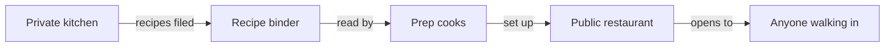
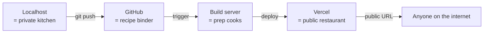

# How it goes live — diagrams

Mermaid source for the Module 1 bundle 4 lesson at `modules/01-mental-models/04-how-it-goes-live.md` — deployment only. Created as part of the bundle 3 to bundle 3 + bundle 4 split per 01-CONTEXT.md D-06 amendment 2026-05-09 and Plan 01-7's simple-first convention.

## Diagram 1: Opening night (deployment pipeline)

### Simple form (analogy only)

### Bridge to the real terms

