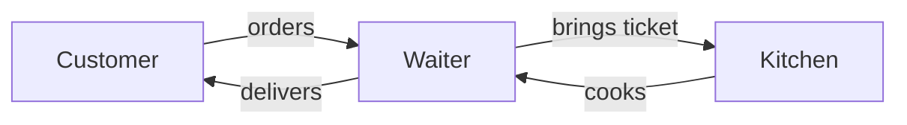
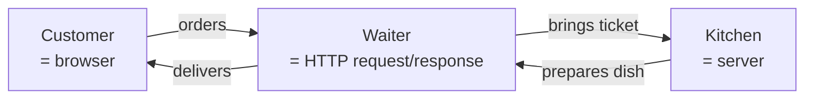
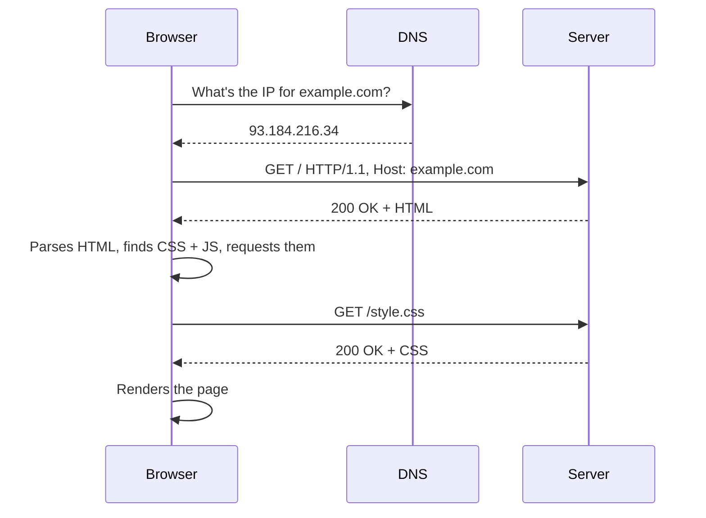
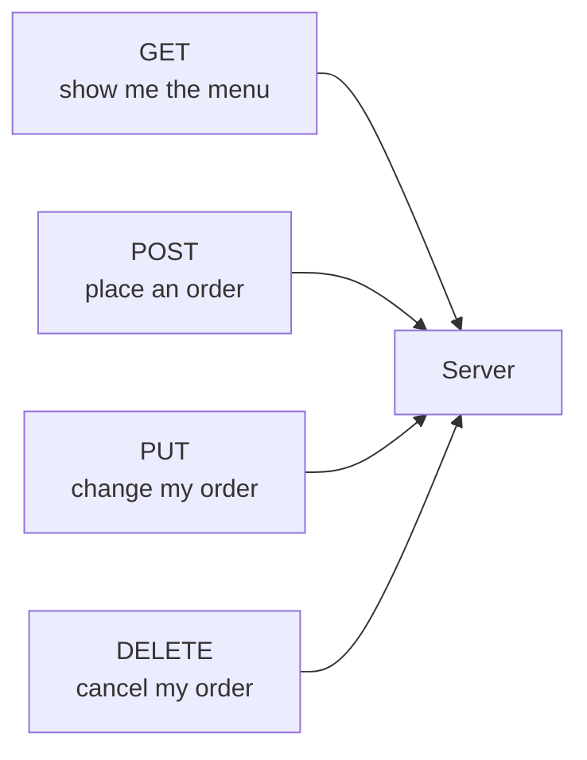

# How the web works — diagrams

Mermaid sources for the Module 1 bundle 1 lesson at `modules/01-mental-models/01-how-the-web-works.md`. Each technical diagram is preceded by its simple-form analogy-only sibling per the simple-first convention introduced in Plan 01-7.

## Diagram 1: The restaurant (client / server)

### Simple form (analogy only)



### Bridge to the real terms



## Diagram 2: What happens when you type a URL

### Simple form (analogy only)

```mermaid
sequenceDiagram
  participant Customer
  participant Waiter
  participant Kitchen
  Customer->>Waiter: orders the main dish
  Waiter->>Kitchen: brings the ticket
  Kitchen-->>Waiter: hands over the dish
  Waiter-->>Customer: delivers the dish
  Note over Customer: dish has parts; customer<br/>asks waiter for each
  Customer->>Waiter: orders the side dish
  Waiter->>Kitchen: brings the side ticket
  Kitchen-->>Waiter: hands over the side
  Waiter-->>Customer: delivers the side
```

### Bridge to the real terms



## Diagram 3: HTTP methods as ticket types

This diagram is technical-only — it names the four HTTP methods directly. The lesson's analogy framing ("a `GET` ticket says 'show me the menu'; a `POST` ticket says 'place an order'") provides the simple form in prose, so a separate Mermaid simple form is not added.


