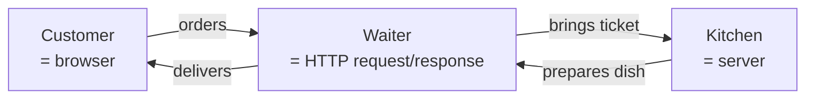
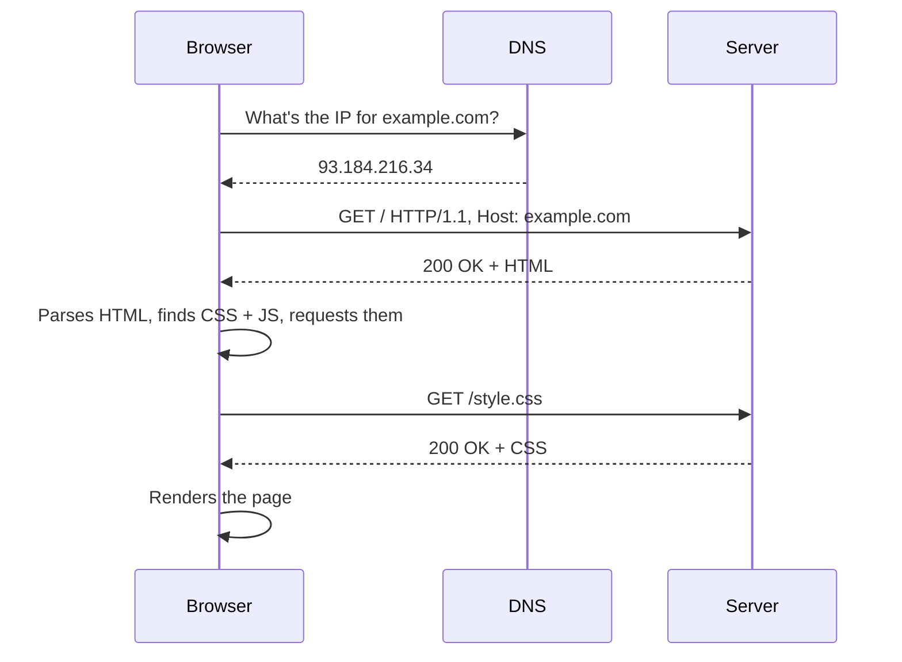
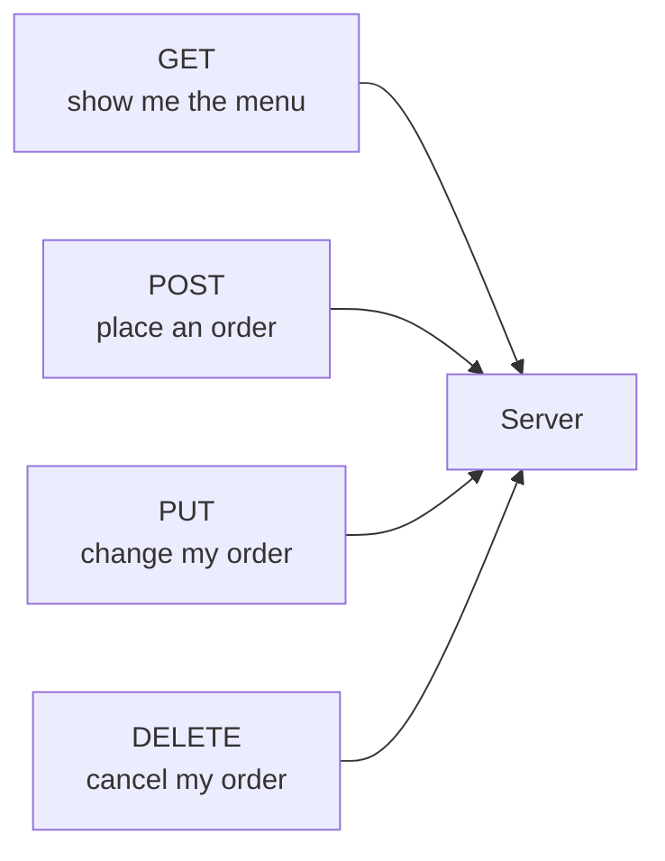

# How the web works — diagrams

## Diagram 1: The restaurant (client / server)

```mermaid
flowchart LR
  Customer[Customer<br/>= browser]
  Waiter[Waiter<br/>= HTTP request/response]
  Kitchen[Kitchen<br/>= server]
  Customer -->|orders| Waiter
  Waiter -->|delivers| Customer
  Waiter -->|brings ticket| Kitchen
  Kitchen -->|prepares dish| Waiter
```

## Diagram 2: What happens when you type a URL

```mermaid
sequenceDiagram
  participant Browser
  participant DNS
  participant Server
  Browser->>DNS: What's the IP for example.com?
  DNS-->>Browser: 93.184.216.34
  Browser->>Server: GET / HTTP/1.1, Host: example.com
  Server-->>Browser: 200 OK + HTML
  Browser->>Browser: Parses HTML, finds CSS + JS, requests them
  Browser->>Server: GET /style.css
  Server-->>Browser: 200 OK + CSS
  Browser->>Browser: Renders the page
```

## HTTP methods as ticket types

```mermaid
flowchart LR
  GET[GET<br/>show me the menu] --> Server
  POST[POST<br/>place an order] --> Server
  PUT[PUT<br/>change my order] --> Server
  DELETE[DELETE<br/>cancel my order] --> Server
```
