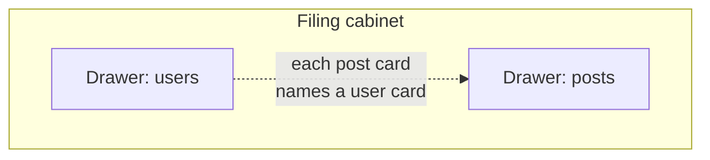
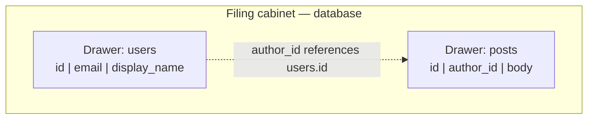
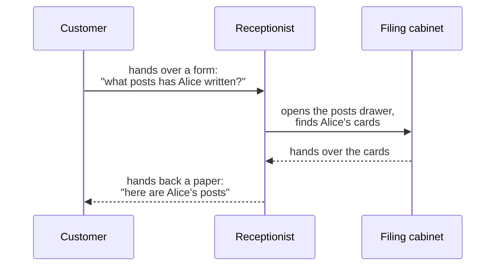
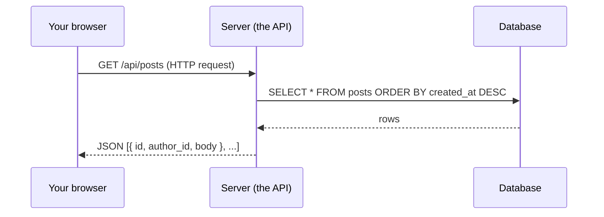

# Where data lives, how programs talk — diagrams

Mermaid sources for the Module 1 bundle 2 exemplar lesson at `modules/01-mental-models/02-where-data-lives.md`. Simple-first convention per Plan 01-7.

## Diagram 1: The filing cabinet (database)

A relational database modeled as filing cabinet drawers (tables) holding index cards (rows).

### Simple form (analogy only)

### Bridge to the real terms

## Diagram 2: Inter-office mail (HTTP request/response)

A program asks another program for index cards via HTTP. The "mail" is the request; the reply is the response.

### Simple form (analogy only)

### Bridge to the real terms

