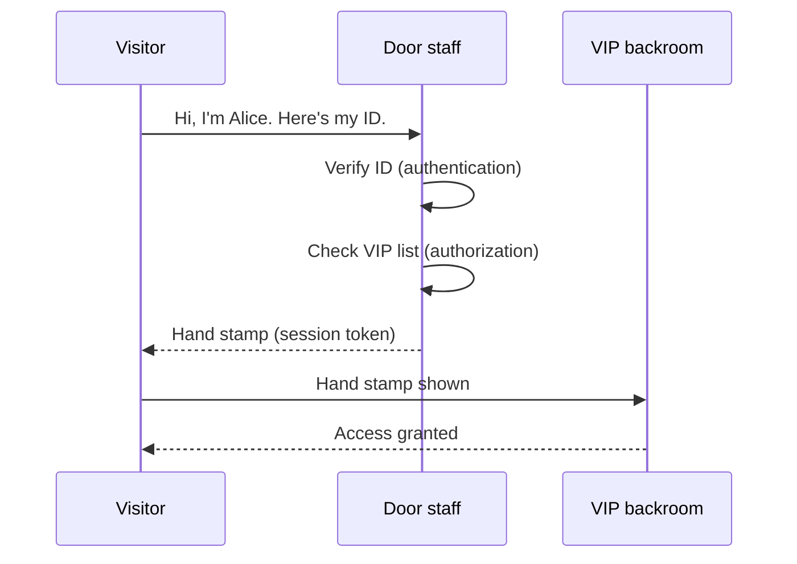
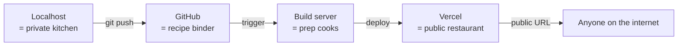

# Who can do what, how it goes live — diagrams

## Diagram 1: The door staff (auth flow)

```mermaid
sequenceDiagram
  participant Visitor
  participant Door as Door staff
  participant Backroom as VIP backroom
  Visitor->>Door: Hi, I'm Alice. Here's my ID.
  Door->>Door: Verify ID (authentication)
  Door->>Door: Check VIP list (authorization)
  Door-->>Visitor: Hand stamp (session token)
  Visitor->>Backroom: Hand stamp shown
  Backroom-->>Visitor: Access granted
```

## Diagram 2: Opening night (deployment pipeline)

```mermaid
flowchart LR
  Localhost[Localhost<br/>= private kitchen] -->|git push| GitHub[GitHub<br/>= recipe binder]
  GitHub -->|trigger| Build[Build server<br/>= prep cooks]
  Build -->|deploy| Vercel[Vercel<br/>= public restaurant]
  Vercel -->|public URL| Customers[Anyone on the internet]
```
