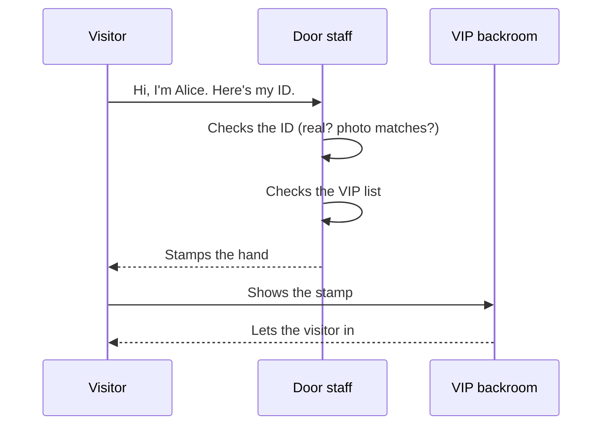
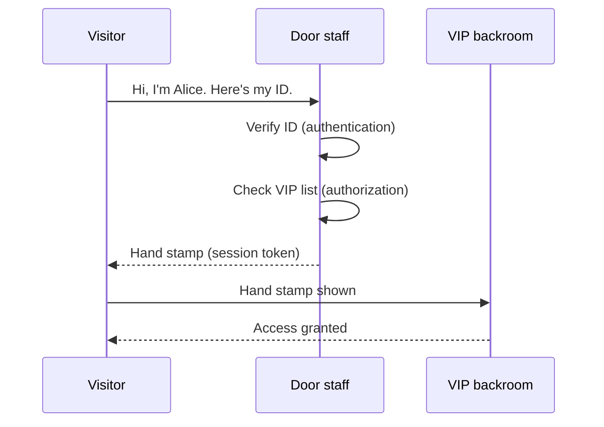

# Who can do what — diagrams

Mermaid source for the Module 1 bundle 3 lesson at `modules/01-mental-models/03-who-can-do-what.md` — auth only. The deployment diagram (formerly here) moved to `diagrams/how-it-goes-live.md` per the bundle 3 split decided in 01-CONTEXT.md D-06 amendment 2026-05-09.

## Diagram 1: The door staff (auth flow)

### Simple form (analogy only)

### Bridge to the real terms

