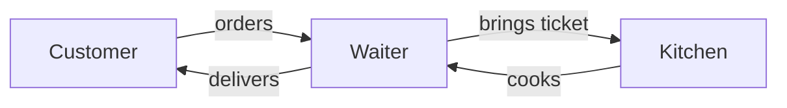
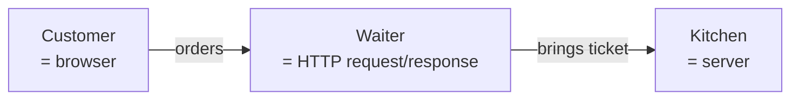

# Authoring lessons for this course

Working playbook for anyone — human or AI agent — writing or editing a lesson. Distilled from the Phase 1 build + the UAT walkthrough that surfaced what the original close missed. If you only have time to read one document before authoring a lesson, this is it.

For the locked rules (do-not-violate), see `CLAUDE.md` at the repo root.
For the contributor-facing summary (PR etiquette, what we want), see `CONTRIBUTING.md`.

---

## Part 1 — The pedagogical contract

### Audience floor (the one assumption that shapes everything)

A learner arriving at Module 0:
- Has used a computer (browser, email, files).
- May have viewed a page on github.com but never edited one.
- Has never written production code.
- Has not heard the words `HTTP`, `DNS`, `schema`, `SQL`, `JWT`, `RLS`, `localhost`, `CI/CD`, `magic link`, `NEXT_PUBLIC`, or `RLS` in a technical sense — and is not expected to.

Every technical noun in lesson prose must pass one of three tests:
1. **Safe at this module** per `docs/audience-vocabulary.md` → use freely.
2. **Requires-callout at this module** → first use must carry a D-04 vocab callout: `**term** (one-line definition, [→ GLOSSARY](../../GLOSSARY.md#anchor))`. Subsequent uses in the same lesson can drop the callout.
3. **Forbidden at this module** → don't use it. Defer to the module that introduces it. If the concept is unavoidable, use an analogy or write `"you'll meet this in Module N"`.

The contract is **incremental** — a term that's Safe in M0 is also Safe in M1+. A term that's Requires-callout in M0 becomes Safe in M1+ (the learner already met it). Don't redefine terms that are already established.

### Locked analogies (D-07)

The analogies in Module 1 are not creative territory. They were chosen for cross-cultural recognizability and consistency, and lessons in later modules will reference them back.

| Bundle | Analogy nouns |
|--------|---------------|
| 1 — How the web works | restaurant / customer / waiter / kitchen / dish / ticket / side dish |
| 2 — Where data lives | filing cabinet / drawer / index card / receptionist / clerk / form / paper / inter-office mail |
| 3 — Who can do what (authentication, authorization) | door staff / ID / VIP list / hand stamp / private backroom |
| 4 — How it goes live (deployment) | private kitchen / recipe binder / prep cooks / public restaurant / opening night |

When you write a Mermaid diagram in the **simple form**, you may use ONLY these nouns plus generic verbs (orders, brings, delivers, hands over). No `=` annotations. No HTTP / SQL / schema / CI/CD shorthand. No hybrid labels like `Build server = prep cooks`.

If a new lesson needs an analogy that isn't on this list, propose it in the phase's PLAN.md before writing the lesson body. Don't improvise.

### Phase 02.1 grounding patterns

Phase 02.1 extended the locked-analogy convention to nine Module 2 and Module 3.5 lessons that originally shipped without a sustained felt picture, and codified two adjacent patterns that came out of the same post-Phase-2 review: a felt-pain shape for "Why this matters," and a pruning rule for anxiety-management forward-references. The three sub-sections below name the patterns; the per-lesson analogies they apply to live in the phase decision log at `.planning/phases/02.1-module-2-3-5-grounding-pass/02.1-CONTEXT.md` (gitignored — read directly when you need the exact picture for a given lesson). Decision-log IDs: analogies D-40..D-48, authoring policy D-A1..D-A4, "Why this matters" template D-A5..D-A8, forward-ref pruning D-A9..D-A12.

#### Analogy authoring policy (D-A1..D-A4)

Sustained-with-callbacks is the depth that makes an analogy land. One passing simile in the opener does not. The pattern is one to two paragraphs of an everyday scene, plus one to three callbacks distributed across the 600-1500 word Core read so the picture stays alive as new mechanics get named. M1 bundle 1 (restaurant) and M2 L5 (recipe-binder) are the depth references; read either before drafting a new analogy.

Every Module 2, Module 3, and Module 3.5 lesson that names a tool or skill category gets a new analogy. No structural exemptions, including lessons whose subject matter could be argued to already contain its own picture. The audience reads each lesson without remembering yesterday's lesson; the felt picture has to be there to be reasoned against.

Two-touch placement: the analogy opens "Why this matters" as the felt rhythm, then re-anchors at the top of the Core read at the moment the lesson formally names the tool. The first touch sets the picture before any naming happens; the second touch makes the naming feel like the picture rather than a definition. A third touch in "What you just did" is optional, not required.

Uniqueness: each new analogy gets its own decision-log entry and a distinct picture. No reuse of the D-07 locked analogies (restaurant, filing cabinet, door staff, recipe-binder) or M2 L5's recipe-binder framing. Themes may rhyme between lessons in the same module (M2's workbench and junior-teammate both inhabit a craftsperson worldview), but the analogy noun, the felt scene, and the mapping must each be different.

The Phase 02.1 entries by lesson, named here so future authors can find them without opening the phase log: D-40 craftsperson's workbench (M2 L1 the IDE), D-41 librarian's request slip (M2 L2 the terminal), D-42 sheet music vs. the musician (M2 L3 the runtime), D-43 corner-store delivery service (M2 L4 npm), D-44 junior teammate who started yesterday (M2 L6 AI coding agents), D-45 office directory in the lobby (M3.5 L1 reading a file tree), D-46 contractor who painted the wrong room (M3.5 L2 spotting wrong-file edits), D-47 receipt with the line item circled (M3.5 L3 error message to file pointer), D-48 framed picture vs. touchscreen (M3.5 L4 the `'use client'` server/client split).

#### Analogy two-test gate (D-A17)

Before an analogy is locked in the phase's CONTEXT.md decision log, the entry must carry an explicit two-test verdict alongside the felt picture, mapping, and alternates-considered. The gate exists because a sustained-with-callbacks analogy (D-A1) can still be decorative — sustained-and-decorative is the failure mode this test catches.

**Test 1 — Standalone.** Read the felt picture in isolation, with no tool-name in the description. Does it form a complete everyday scene a non-coder can grasp, with a rhythm and a recognizable beat? Could a reader who has never opened a code file have an opinion about what's going on inside the scene? If you have to mention the tool to make the picture make sense, the picture is borrowing meaning from the tool rather than lending meaning to it — and the analogy fails this test.

**Test 2 — Load-bearing tie.** The mapping must cover (a) the load-bearing word or distinction the lesson exists to teach, and (b) at least one failure mode the lesson teaches the learner to spot. Surface-level "kind of like X" does not qualify. If the analogy lands the rhythm but doesn't predict what wrong-use looks like, it's decoration, not pedagogy.

**How to apply.** When you propose an analogy in CONTEXT.md, append a `Two-test gate:` block to the entry:

```
Two-test gate:
  - Standalone: PASS — <one-line evidence>
  - Load-bearing tie: PASS / PARTIAL / FAIL — <one-line evidence; if PARTIAL or FAIL, name what's missing>
```

PARTIAL is allowed and means "ships with a known gap that a later phase must extend or revise." FAIL means propose a different picture before the entry is locked. Reviewers checking the CONTEXT.md entry can spot a missing or hand-waved two-test block at a glance.

**Worked contrast from Phase 02.1.**

- **D-42 sheet music vs. musician (M2 L3 runtime) — PASS / PASS.** Standalone: paper-and-dots-sitting-silent-on-a-stand is a coherent scene every reader recognizes. Load-bearing tie: the load-bearing distinction is "text-that-exists" vs. "the agent that makes it act" — sheet music vs. musician maps that exactly, and the two-musicians extension (browser + Node) predicts "JavaScript has two runtimes." Failure mode predicted: file exists but page is silent = sheet music sitting on the stand with no musician.

- **D-43 corner-store delivery (M2 L4 npm) — PASS / PARTIAL.** Standalone: list / fetch / bags is a familiar rhythm. Load-bearing tie: maps `package.json` / `npm install` / `node_modules` cleanly. PARTIAL because the analogy does not predict (i) **version pinning** — a corner store doesn't ask for soap-version-1.2.3 — and (ii) **transitive dependencies** — the bags don't contain bags. Both will hit a Phase 3 learner; either D-43 gets extended (e.g., "the store ALSO delivers what your items came packaged with") or a follow-up phase revises the analogy.

The two-test gate is not a one-time hurdle. When a downstream lesson finds the analogy missing a load-bearing tie because a learner hit the gap, the analogy gets re-evaluated and either extended or revised. The gate is the conversation; the CONTEXT.md entry is its record.

#### "Why this matters" felt-pain template (D-A5..D-A8)

The opener is three sentences in shape — felt-rhythm → named problem → resolution. Sentence one invokes the everyday scene the analogy will inhabit. Sentence two names the problem the absence of the lesson's tool creates inside that scene. Sentence three names how the lesson resolves it. Four sentences is the comfortable upper bound when the felt-rhythm scene needs a beat to land. Up to six sentences is allowed when the felt picture plus the problem genuinely earn the runway; any "Why this matters" longer than four sentences adds `why-this-matters-extended` to the lesson's front-matter `deviations: []` array per D-02.

Total ban on the syllabus-architecture opener pattern: no instances of "Module N named X", "Lessons N and M named Y", "naming this category now means", or any phrasing whose primary job is to tell the learner where this lesson sits in the course. Through-line cues that genuinely add value move to the Core read body or to the "What you just did" closer; they are not permitted as the opener. The learner feels lectured about the syllabus instead of invited into a problem they recognize.

Self-test before shipping a "Why this matters" — the M0/M1-amnesia self-test: "If I deleted Module 0 and Module 1 from this learner's memory, would this opener still motivate them to read the lesson?" If the answer is no, the opener depends on course architecture rather than on learner pain, and rewrite it against the felt-rhythm template.

Gold-standard reference: `modules/02-toolchain/05-git-and-github.md`'s "Why this matters" — the felt rhythm of "you change a file → you save → you push to GitHub → Vercel rebuilds" lands before any course-architecture naming. Read it before drafting any other lesson's opener.

#### Forward-ref pruning (D-A9..D-A12)

Heuristic: if a paragraph's primary job is to say "you don't have to learn X yet" or "don't worry about Y" or "next lesson covers Z" — delete it. Silence is enough. Each forward-ref carries a "remember-not-to-worry-about-this" working-memory load; the cumulative weight across a Phase-2-sized module is real and was felt by post-Phase-2 readers.

What stays:

- The prev/next navigation links at the bottom of the lesson. UX role, not reassurance role.
- A single closing-breadcrumb sentence at the end of "What you just did" is allowed as narrative closure (e.g., "Phase 3 starts the thread project").
- The "Going deeper" section is exempt. That section's job is forward-references by design — bullets pointing at Module 7, external docs, optional curiosity tracks. Phase 02.1 leaves "Going deeper" bullets unchanged on every revised lesson, provided each bullet adds info rather than anxiety-management framing.
- The "Loop check" and "What you just did" sections are exempt. Both serve narrative closure: Loop check satisfies LESSON-09's per-lesson loop-step reinforcement; "What you just did" connects the lesson's work to the durable loop. Any cross-lesson breadcrumb either section contains is closure, not anxiety-management.

What goes: Core-read body paragraphs whose primary job is anxiety management — "you don't have to understand this until Module 7", "the next lesson explains how", "Phase 3+ material". When you catch one, ask whether the paragraph teaches anything the lesson needs RIGHT NOW. If it doesn't, cut it.

Worked contrast (post-Phase-2 read): M2 L1's current "Why this matters" ends on "Naming the category once is what lets the rest of Module 2 say…" — that's syllabus-architecture framing, and the Phase 02.1 rewrite replaces it with the workbench felt rhythm before any naming happens. M2 L5's "Why this matters" already opens on the felt rhythm ("you change a file → you save → you push to GitHub → Vercel rebuilds") with no naming-this-category framing in sight. The contrast is the pattern.

Enforcement: Phase 02.1 ships forward-ref pruning via human review against this section plus the locked analogy. No new voice-lint check is added in Phase 02.1 — a grep-based check for forward-ref counts or syllabus-opener phrases (`Module N named`, `Lessons N and M named`, `naming this category now means`) competes with REVIEW.md WR-04 (general voice-lint hardening) and is deferred to a follow-on phase whose scope is explicitly "voice-lint patterns layered on top of Phase 02.1's content rewrite." When you draft a lesson revision, run the pruning sweep yourself; do not wait for the lint to flag it.

### Voice contract (LESSON-12)

Two things to avoid:

1. **Tutorial fiction** — language that paints over the friction a learner will actually encounter. Examples:
   - "in just a few clicks" (reality: ten steps, three of them counterintuitive)
   - "now you can simply" (reality: still complex)
   - "as simple as that" (reality: not)
   - "just like that" (same)
2. **Filler** — words that don't carry information. Examples:
   - "in today's fast-paced world"
   - "in this day and age"
   - "with the increasing need for"

If you catch yourself writing one of these, rewrite. `scripts/voice-lint.sh` will catch them too, but the right move is not writing them in the first place.

---

## Part 2 — The nine-element lesson anatomy

Every lesson uses `lesson-template.md` (or `lesson-template-m0.md` for Module 0). The nine elements, in order:

1. **Objective** (LESSON-01) — one sentence: "By the end of this lesson, you'll be able to ___." Concrete and observable, not aspirational.
2. **Why this matters** (LESSON-02) — 2-4 sentences linking the lesson to the learner's actual goal (shipping a deployed app).
3. **Core read** (LESSON-03, 600-1500 words) — the main teaching. Prose first; analogies first; diagrams as visual aids, not as the load-bearing teaching mechanism.
4. **Vocab callouts** (LESSON-04, D-04 pattern) — defined inline using `**term** (one-line definition, [→ GLOSSARY](../../GLOSSARY.md#anchor))`.
5. **Exercise** (LESSON-05, 10-25 minutes) — concrete, deliverable-shaped, names whether paper / excalidraw / code is acceptable.
6. **Checkpoint** (LESSON-06) — "You've got this if you can ___." One or two testable claims.
7. **Going deeper** (LESSON-07) — optional pointers. If the lesson has none, declare via front-matter `deviations: [no-going-deeper]` AND remove the section.
8. **Loop check** (LESSON-09) — one sentence connecting the lesson to one of the durable AI-coding loop steps (intent / ask / evaluate / steer). **In Module 1 (pre-loop), every Loop check names `intent`** (D-05).
9. **What you just did** (LESSON-10) — 2-4 sentences recapping the exercise and linking it back to the loop.

Plus the front-matter (title, module, lesson_number, est_minutes, deviations, GLOSSARY anchors used) and navigation (prev/next links per OPS-05).

If you skip or shorten an anatomy element, add it to the front-matter `deviations:` array AND drop a `> **Deviation note:**` blockquote near the affected section explaining why.

---

## Part 3 — Diagrams in M1+

This is where Phase 1's UAT walkthrough surfaced the most subtle pedagogy bugs. Read this section carefully before adding or editing a Mermaid block.

### The simple-first / bridge-collapsed convention

For every M1+ lesson that uses Mermaid to teach a spatial or relational concept:

1. **The simple-form Mermaid comes first**, in plain view in the lesson body. It uses ONLY the locked D-07 analogy nouns. No technical labels.
2. **The technical Mermaid comes second**, wrapped in a `<details><summary>` HTML5 disclosure widget. It uses the real names (HTTP, SQL, schema, CI/CD, etc.). The summary line names which later module covers those terms hands-on.
3. **Inside the disclosure**, before the technical Mermaid, a `> *Peek ahead — skim, don't memorize:*` blockquote callout carries the analogy → real-term mapping with the technical terms in bold.

**Why both diagrams cannot just sit side-by-side:** a learner who sees the technical diagram in their peripheral vision feels obligated to absorb the labels. Those labels are exactly the M3-M5 vocabulary M1 is designed to defer. Optionality has to be a real visual affordance, not just framing in the surrounding prose.

### Worked example (the canonical pattern)

````markdown
So the round trip looks like this:



<details>
<summary>Optional: same picture with the technical labels (Module 3 hands-on)</summary>

> *Peek ahead — skim, don't memorize:* The same picture with the real names labeled. You'll meet **HTTP**, **request**, **response**, **server**, and **browser** properly in Module 3, where you'll write your first API route by hand. If the labeled diagram feels heavy, close this and move on.



</details>

The order ticket has a specific shape. ...
````

### GFM blank-line discipline (MANDATORY)

GitHub-Flavored Markdown parses fenced code blocks inside `<details>` correctly ONLY when blank lines surround them. If any of these four blank lines is missing, the Mermaid inside the disclosure will NOT render — GFM will treat the body as raw HTML.

```
<details>
<summary>Summary text</summary>
                              ← BLANK LINE (after </summary>)
> *Peek ahead callout...*
                              ← BLANK LINE (before ```mermaid)
```mermaid
... diagram ...
```
                              ← BLANK LINE (after closing ```)
</details>
```

**Verifying:** view the file's preview on github.com after pushing. If the disclosure expands but the Mermaid doesn't render, count blank lines.

### The Mermaid `<br/>` rule (subtle and asymmetric)

GitHub's Mermaid parser has different rules for HTML break tags depending on where they appear:

| Context | `<br/>` works? | `<br>` works? | Right answer |
|---------|---------------|---------------|--------------|
| Flowchart node label `["Node<br/>=label"]` (QUOTED) | ✓ | ✓ | Use `<br/>` (matches existing convention) |
| Flowchart node label `Node[Node<br/>=label]` (UNQUOTED) | ✗ | ✗ | Quote it: `Node["Node<br/>= label"]` |
| Flowchart edge label `-->|text<br/>more|` | ✗ | ✗ | Write as single line: `-->|text more|` |
| SequenceDiagram Note `Note over X: text<br/>more` | ✗ | ✗ | Single line: `Note over X: text — more` |
| SequenceDiagram message `A->>B: text<br/>more` | ✗ | ✗ | Single line: `A->>B: text — more` |

`scripts/voice-lint.sh` check #7 enforces this. The check strips `["..."]` quoted regions inside Mermaid fences and then flags any remaining `<br/?>` as a render-breaker. Fixture: `scripts/voice-lint-fixtures/07-mermaid-br-outside-quotes.md`.

### The "Module N hands-on" pointer

When the technical Mermaid introduces M3+ vocabulary, the disclosure summary line and the peek-ahead callout both name which later module the learner will use those terms hands-on. The current mapping:

| Bundle | Technical terms introduced | Hands-on module |
|--------|---------------------------|-----------------|
| 1 (how-the-web-works) | HTTP, request, response, server, browser-as-program, HTML, GET/POST/PUT/DELETE, status codes | Module 3 (single-user vertical slice) |
| 2 (where-data-lives) | table, row, foreign key, schema, API, HTTP request, SQL, database | Module 3 |
| 3 (who-can-do-what) | authentication, authorization, session token, cookie, sign-in | Module 4 (multi-user social graph) |
| 4 (how-it-goes-live) | localhost, build server, public URL, CI/CD, git push | Module 5 (operating the build) |

Map terms to the module where the learner **does** them hands-on, not the phase where they're first mentioned in passing.

### M0 stays diagram-light

Module 0 lessons (welcome, hardware check, cost-path triage, account creation, Codespaces walkthrough) deliberately do not use Mermaid. They're setup-task lessons, not mental-model lessons. LESSON-11 mandates Mermaid for spatial/relational concepts, which is M1+ territory.

### M2+ uses the disclosure pattern selectively

By Module 2 the learner has met the M3 vocabulary at least once (via the M1 peek-aheads). Use the disclosure pattern in M2+ only when introducing a genuinely new concept whose terminology hasn't been taught yet.

---

## Part 4 — Agent-Responsibility Checkpoint (M3.5 floor)

CLAUDE.md hard rule 12 locks the Agent-Responsibility Boundary. This part operationalizes it for lesson authors. Read it before authoring or revising any M3.5 lesson — and treat it as a load-bearing audit gate for any later module that surfaces code, errors, or framework mechanics to the learner.

### The boundary

The AI agent owns: **reading errors, parsing code, diagnosing causes, framework mechanics, choosing which file to edit, build internals.** The learner owns: **stating intent, checking the agent edited the right file, recognizing wrongness, asking for help.** Every lesson section is one role or the other — never both. Mechanics the agent owns must not be taught at the audience floor.

This is structurally parallel to D-07 (locked analogies) and D-A17 (analogy two-test gate). All three are non-negotiable rails the lesson author works inside.

### The three audit questions

Run these before shipping any M3.5 or M3.5-adjacent lesson. Walk through each major section (Why this matters, Core read, Exercise, Loop check, What you just did):

1. **Q1 — Does this section ask the learner to do something the agent will do better and faster?** If yes, rewrite to "ask the agent, then read the result back to your intent." Examples that fail Q1: "read the stack trace line by line"; "parse the error type to figure out which library raised it"; "diff the file changes yourself."
2. **Q2 — Does this section explain mechanics (framework rules, rendering execution, error-message anatomy) the learner does not need to direct the agent?** If yes, cut to the symptom + the steer. Examples that fail Q2: "Next.js renders this on the server before sending HTML to the browser"; "the bundler decides which files become client bundles"; "here is the four-part anatomy of an error message."
3. **Q3 — Is any term used as a concept to understand from first principles when it should be used as a symptom only?** If yes, demote the framing — no "anatomy of", no "how X works", no "to debug X." Examples that fail Q3: introducing `hydration` with a paragraph about React's state-synchronization process; introducing `'use client'` with an explanation of why the server/client split exists.

If a section fails any of Q1–Q3, rewrite to the symptom-and-steer floor. The deeper "why" belongs in Module 7's curiosity track, not in M3.5's body.

### M3.5 Observation-Only Floor — per-topic hard examples

| Topic (lesson) | Learner floor (you teach this) | Above floor — agent owns (do NOT teach this) |
|---|---|---|
| File tree (L1) | Names what a folder is for at a glance; spots a `pages/` + `app/` co-existence smell; reads filenames to infer purpose | URL routing, the App Router model, `.ts` vs `.tsx` distinction, why Next.js has two routing systems, what `tsconfig.json` controls |
| Wrong-file edits (L2) | Compares intent vs filename in the diff summary; spots when the agent touched the wrong file | Reads the diff line-by-line; spots missing imports or wrong indentation; explains what changed inside each file |
| Error → file pointer (L3) | Finds the first line that names YOUR file (typically a path starting with `./app/`); opens that file; pastes the full error back to the agent | Reads the stack trace line-by-line; explains error types (`TypeError`, `ReferenceError`); parses `line:column` coordinates; diagnoses root causes |
| `'use client'` and the split (L4) | Pattern-matches "interactive names (`useState`, `onClick`) appear → file needs `'use client'`"; reads "hydration" error in browser console as a symptom; pastes the file pointer + error to the agent | Explains React Server Components architecture; describes server-rendering execution model; explains the hydration mechanism; explains the bundler split or partner directives like `'use server'` |

### Symptom-only term introduction

When you must name a term to ground a steer, the term is a SYMPTOM, not a concept. Three rules:

- **The D-04 callout defines the symptom, not the mechanism.** Wrong: `**hydration** (a one-line definition: the process React uses to attach event listeners to server-rendered HTML, ...)`. Right: `**hydration** (a one-line definition: a SYMPTOM-only term meaning "browser console said the page does not agree" — usually a file that needs `'use client'` missing the directive, ...)`.
- **Surrounding prose does not exceed the callout's depth.** If the callout is symptom-only, the next paragraph cannot start "behind the scenes, React first renders…". The callout is the floor and the ceiling.
- **`docs/audience-vocabulary.md` carries the symptom annotation.** Each M3.5 Requires-callout term has a one-line "SYMPTOM-only" tag plus, if applicable, a `do-not-introduce` flag. See the M3.5 SYMPTOM-only addendum.

### When you're authoring a new lesson

Apply Q1–Q3 to each section *as you write*, not just at the end. Symptom-and-steer is harder to retrofit than to draft. If your draft started teaching mechanics and the lesson now feels short without them, that is the floor working; do not refill with junior-dev material.

### When you're auditing an existing lesson

Read every section against Q1–Q3 and the per-topic floor table. Quote each failure with file:line. The fix is always one of: (a) cut the failing prose entirely and link to Module 7 if the curiosity track is the right home; (b) rewrite the prose as symptom + steer; (c) reframe the section as "the agent does X; you do Y." Never paper over a Q2 failure with a vocab callout — D-04 callouts permit the term, not the explanation depth.

### Cross-references

- CLAUDE.md hard rule 12 — the boundary itself
- `.planning/PROJECT.md` Key Decisions — the locked decision row
- `docs/audience-vocabulary.md` — M3.5 SYMPTOM-only addendum + per-term flags
- `scripts/voice-lint.sh` check #9 — WARN-level diagnostic-framing detection
- M3.5 L2 (`02-spotting-wrong-file-edits.md`) — the M3.5 gold-standard exemplar (Phase 02.2, parallel to M2 L5 in Phase 02.1)

---

## Part 5 — Execution-Floor Boundary (M4+ build phases)

CLAUDE.md hard rule 13 translates the Agent-Responsibility Boundary from M3.5's **observation floor** to M4+'s **execution floor** — the phases where the learner ships code via the agent. This part operationalizes it. Read it before authoring or revising any Module 4, 5, or 6 lesson — and treat it as a load-bearing audit gate for the build-phase planner (`/gsd-plan-phase`) before it runs.

### Why M3.5's boundary needed a translation

M3.5's floor is OBSERVATION: the learner watches the agent edit code; the agent does the editing. M4+ is EXECUTION: the learner is now shipping the thread project. The agent still does the code-authoring, but the learner is in the driver's seat — naming what to build, sequencing the chunks, verifying that what just shipped matches what was asked for. The boundary translation is "what does it look like to drive without owning the engine?"

### The boundary

The **agent owns**: schema authoring, RLS policy syntax, async/await mechanics, hook internals (`useState`, `useEffect`, `useOptimistic`, etc.), Server-Action plumbing, type narrowing, dependency resolution, framework internals (Next.js routing rules, Supabase client lifecycle), build internals, deployment plumbing, error parsing.

The **learner owns**:

1. **Stating intent at the feature level.** Not "use `useOptimistic` with the right reducer signature" — but "the like count should update right away, then correct itself if the server returns an error."
2. **Observing the running app matches intent.** Open the deployed app. Click around. Sign out. Sign in as a second user. Did the agent build what you asked for?
3. **Applying the phase's smell-test inventory.** A named list of observable patterns ("look for this; if absent, ask the agent why") that the learner scans for in each chunk's diff or in the running app. The inventory is the bridge between M3.5's observation skill and M4+'s execution responsibility.
4. **Committing each working chunk to git.** The atomic-commit discipline is the learner's safety net. Working state goes to git before the next chunk starts.
5. **Knowing when to `/clear` and start over.** Same skill the learner met in M3 L4 (recovery), now applied at chunk scale. If the agent has committed to a wrong path across multiple turns, restart the conversation tighter.

### The smell-test inventory

A smell-test is an OBSERVATION the learner can perform without understanding the underlying mechanics. The pattern:

```
LOOK FOR: <observable pattern in the diff or in the running app>
IF PRESENT: <what to do next>
IF ABSENT: <what to ask the agent>
```

Example smell-tests for Phase 4 (the chunk that adds posts editing):

- LOOK FOR: `WITH CHECK` after every `UPDATE` policy in the migration file.
  IF PRESENT: continue. IF ABSENT: ask the agent "the `UPDATE` policy doesn't have `WITH CHECK` — what would prevent a user from rewriting `author_id` on their own post?"
- LOOK FOR: On the deployed app, alice can edit her own post but the form does NOT appear on bob's post (signed in as alice).
  IF PRESENT: continue. IF ABSENT: ask the agent "alice is seeing the edit form on bob's post — what's missing?"
- LOOK FOR: When alice rewrites a post, the post stays attributed to alice (not silently re-attributed).
  IF PRESENT: continue. IF ABSENT: this is the RLS-UPDATE-without-WITH-CHECK bug; see Phase 5 LESSON-13 walkthrough (a).

The learner can perform every smell-test in the inventory without knowing RLS policy syntax, without parsing TypeScript, without understanding the Supabase client lifecycle. The smell-test is observation; the diagnosis is the agent's job.

### Where the inventory lives

The smell-test inventory for each build phase is locked in the phase's CONTEXT.md (`.planning/phases/NN-name/NN-CONTEXT.md`) BEFORE the planner runs. CONTEXT.md must contain:

- A **per-chunk boundary table** naming agent-territory vs. learner-territory for each chunk's deliverable.
- The **smell-test inventory** for the phase: named observable patterns with LOOK FOR / IF PRESENT / IF ABSENT.
- The **Tenet 6 surfaces** for the phase: which lessons name which agent failure mode + where the corresponding smell-test lives.
- The **vocab additions** for the phase: which terms ship as SYMPTOM-only, which are Forbidden-as-concept, what the audience-vocabulary contract gains.

Without this CONTEXT, the build-phase planner inherits only the ROADMAP success criteria — which already contain jargon-shaped trigger language (`@supabase/ssr cookies() correctly awaited`, RLS `WITH CHECK`, `useOptimistic`). That's the original drift vector.

### The three audit questions adapted for M4+

Run these for every section of every M4+ lesson:

1. **Q1-Exec — Does this section ask the learner to do something the agent will do better?** Examples that fail: "write a `UPDATE` policy with `WITH CHECK` matching this shape"; "configure your `cookies()` call to await before reading"; "destructure the `useOptimistic` return tuple." The fix: replace with the smell-test ("the agent will write this; look for X in the diff").
2. **Q2-Exec — Does this section explain mechanics (framework internals, hook lifecycles, RLS grammar, async/await semantics, type narrowing) the learner does not need to direct the agent?** If yes, cut to the symptom + the steer. Mechanics belong to the agent.
3. **Q3-Exec — Is any term used as a concept (something to understand from first principles) when it should be used as a symptom (something to scan for)?** If yes, demote the framing — no "anatomy of an RLS policy," no "how `useOptimistic` works," no "the lifecycle of a Server Action."

A section that fails Q1-Exec, Q2-Exec, or Q3-Exec gets rewritten as "the agent does X; you observe Y; if Y is missing, ask the agent Z."

### The smell-test catalog (build out per phase)

Phase 3 / 4 / 5 / 6 each maintain a CONTEXT.md smell-test inventory. As phases land, the catalog below grows. Each entry names the lesson where the smell-test is taught + the phase where the learner first applies it.

| Smell-test | First taught | First applied |
|---|---|---|
| Right-file edit (M3.5 L2 pattern) | M3.5 L2 | Phase 3 Chunk 1 onward |
| First `./app/` line in error → paste to agent (M3.5 L3 pattern) | M3.5 L3 | Phase 3 Chunk 1 onward |
| `'use client'` interactivity smell (M3.5 L4 pattern) | M3.5 L4 | Phase 3 Chunks 1–3 |
| `WITH CHECK` after every `UPDATE` policy | Phase 4 CONTEXT | Phase 4 Chunk 4–7 + Phase 5 LESSON-13 walkthrough (a) |
| Feed query includes `OR author_id = auth.uid()` | Phase 4 CONTEXT | Phase 5 LESSON-13 walkthrough (b) |
| Migration drift smell (no `DROP TABLE` in the diff against shared state) | Phase 5 CONTEXT | Phase 5 LESSON-13 walkthrough (c) |
| Logged-out visitor can read but not act | Phase 4 CONTEXT | Phase 4 + Phase 6 bug-reproduction |

### Cross-references

- CLAUDE.md hard rule 13 — the boundary itself
- COURSE-AUTHORING.md Part 4 — the M3.5 observation floor this part extends
- `.planning/phases/NN-name/NN-CONTEXT.md` — per-phase smell-test inventory
- M2 L5 + M3.5 L2 — gold-standard exemplars of the symptom-and-steer floor

---

## Part 6 — AI-Limitation Pedagogy

CLAUDE.md hard rule 14 locks the pedagogical rule: when a lesson names an agent failure mode, it must arm the learner with a concrete smell-test for that failure mode (in the same lesson or via explicit forward-reference). This part catalogues the six core agent limitations and their per-limit smell-test patterns.

### Why this matters (Tenet 6 anchor)

A learner who cannot recognize when the agent is wrong cannot recover when the agent is wrong. The recovery skill is the course's differentiator. Recovery requires limits-and-smell-tests, not just limits. Naming hallucination without giving the learner the smell-test for it is like naming food poisoning without naming the taste of spoiled food.

### The six limitations (course taxonomy)

The course names six core agent failure modes. Each gets a per-module surface and a smell-test pattern.

| # | Limitation | Plain definition | Module where smell-test first appears |
|---|---|---|---|
| 1 | **Hallucination** | The agent produces specific details that look correct but were invented — book titles, function names, API endpoints, file paths the agent has no way of knowing | M3 L3 (in-depth) — first named M2 L6 |
| 2 | **Drift** | The agent loses the thread of an extended conversation; mid-session the responses stop matching the original intent | M3 L2 (context-window framing) + M3 L4 (`/clear` as recovery) — first named M2 L6 |
| 3 | **Context-window overflow** | The agent's working memory fills; old context is dropped silently; the agent starts answering as if earlier turns didn't happen | M3 L2 — recognized via the slash-command surface (`/context`, `/cost`, `/compact`) |
| 4 | **Training cutoff** | The agent's knowledge has a hard date boundary; anything more recent (a new version of a framework, a recent change to an API, a current best practice) is invisible to it | M3 L3 — surfaced as a hallucination subtype + M2 L6 freshness framing |
| 5 | **Confident-wrong** | The agent's tone and the agent's correctness are independent; fluent-sounding answers can be wrong; uncertainty is rarely surfaced unless the prompt explicitly asks for it | M3 L3 (the lesson IS about this) |
| 6 | **Risk-blindness** | The agent doesn't model the consequences of its changes — it can suggest deleting a migration, dropping a table, force-pushing a branch, or hardcoding a secret with the same calmness as a typo fix | M5 watch-it-fail walkthroughs (LESSON-13) + M2 L6 first surfacing |

### The smell-test pattern (per-limit)

For each limit, the lesson where it's first taught provides:

- **The limit named** (with a D-04 callout on first use, mapped to the audience-vocabulary contract).
- **One concrete symptom example** the learner can recognize without prior coding knowledge. Not abstract; specific. Not "the agent might be wrong" — but "the agent recommended `bookcover.io` as a free book-cover API; you searched and there is no such service."
- **The smell-test action**: what to do when you spot it. Usually: re-ask with the symptom named explicitly; or `/clear` and start over with a tighter prompt; or paste the verifying evidence back to the agent.

### Anchor lessons (Tenet 6 surfaces)

- **M2 L6 (`06-ai-coding-agents.md`)** — first surface for limits 1, 2, 6. Three concrete symptoms; three forward-references to where the smell-tests are taught.
- **M3 L3 (`03-reading-plans-recognizing-wrong.md`)** — in-depth smell-test for limit 1 (hallucination). The hallucination *mechanism* is grounded non-technically in 2–3 sentences ("the agent writes fluent sentences; fluent sentences can contain invented details; when the agent has nothing to reference, it reaches for plausible candidates and presents them as if specified"). Do NOT punt mechanism explanation to Module 7 — explain it in plain prose here.
- **M3 L4 (`04-steering-and-recovery.md`)** — smell-test + recovery for limit 2 (drift via `/clear` hygiene).
- **M5 watch-it-fail walkthroughs (LESSON-13)** — three smell-tests, each with verbatim agent failure captured and the learner's recovery prompt. Anchors limits 5 + 6.

### Forward-reference template (Hard Rule 14 compliance)

When a lesson names a failure mode but the smell-test lives elsewhere, use this exact shape:

```markdown
> **Heads up — you'll meet this again.** {Failure mode in plain words}. The smell-test for catching it lives in {Module N Lesson NN slug}; for now, just notice the name.
```

This satisfies Hard Rule 14's forward-reference requirement. Vague "we'll cover this later" without naming WHERE does not satisfy the rule.

### What NOT to do

- Don't name hallucination in an M0 / M1 lesson. M2 L6 is the first surface.
- Don't introduce a failure-mode term in a callout and then explain the underlying neural-network mechanics. The audience floor does not benefit from "attention head misalignment" or "next-token prediction without grounding."
- Don't write "the agent might be wrong" without naming WHICH failure mode + the smell-test. Vague risk-naming inflates anxiety without arming the learner.
- Don't conflate confident-wrong with hallucination. Confident-wrong is the *tone*; hallucination is the *content*. Both can occur independently.

### Cross-references

- CLAUDE.md hard rule 14 — the rule itself
- `docs/audience-vocabulary.md` — M3 Requires-callout terms (hallucination, context window, etc.)
- `docs/TENETS.md` § Tenet 6 — the underlying philosophy
- M5 LESSON-13 (REQUIREMENTS.md) — the three watch-it-fail walkthroughs

---

## Part 7 — What NOT to Teach (the temptation appendix)

Authors and AI agents both tend to over-explain. The audience-vocabulary contract is the *positive* surface (what IS safe at each module); this appendix is the *negative* surface (high-temptation traps where authors add depth the learner does not need). Each entry names a topic, the temptation, and the right move.

Read this section before every lesson. Trap-spotting is faster than rewrite-after-the-fact.

### The trap catalog

#### Trap A — Explaining HTTP request/response anatomy

**Temptation.** "An HTTP request has a method (GET, POST, PUT, DELETE), a path, headers, and a body. The server responds with a status code (200, 404, 500), headers, and an optional body."
**Right move.** M1 names the restaurant analogy. The technical version goes in a `<details>` disclosure with a forward-reference to Module 3 hands-on. Body prose stays in the analogy.
**Where to escape to.** Module 3 (single-user vertical slice) — when the learner is actually triggering requests via a deployed app, not learning HTTP from a textbook.

#### Trap B — Teaching SQL JOIN mechanics or foreign-key constraints as concepts

**Temptation.** "A foreign key creates a referential constraint that prevents inserting a row that references a non-existent parent row..."
**Right move.** Filing-cabinet analogy: "cards in one drawer remember other cards by ID." That's the floor. The agent writes the schema; the learner observes that "alice's posts disappear when alice is deleted" works.
**Where to escape to.** Don't. JOIN mechanics belong to the agent. M4+ teaches the *symptom* ("when I delete a user, do their posts disappear or break?") as a smell-test.

#### Trap C — Explaining cookie flags (`httpOnly`, `Secure`, `SameSite`)

**Temptation.** "Set `httpOnly: true` and `Secure: true` and `SameSite: 'Lax'` to mitigate XSS and CSRF..."
**Right move.** M1 L3 uses plain language: "the stamp on your hand is hard to copy; the door staff changes the stamp pattern often; the door staff asks for ID again before letting you into the safe room." The agent handles flag configuration; the learner observes "I can stay signed in across browser refresh."
**Where to escape to.** Module 7 only — and only as a "if you want to go deeper on auth, here's where to look" pointer.

#### Trap D — Explaining async/await semantics

**Temptation.** "Next.js 16 made `cookies()`, `headers()`, and `params` async because the rendering pipeline needs to defer their resolution until..."
**Right move.** Async/await is a SYMPTOM in the agent's diff. The learner scans for `await cookies()` in the agent's code — if it's `cookies()` without the `await`, ask the agent why. Don't explain the rendering pipeline.
**Where to escape to.** Don't. Async/await semantics belong to the agent. The phase's CONTEXT.md catalogs `await` as a symptom-only term.

#### Trap E — Explaining RLS policy grammar

**Temptation.** "An RLS policy has a `FOR` clause (SELECT / INSERT / UPDATE / DELETE), a `USING` predicate that filters reads, and a `WITH CHECK` predicate that filters writes..."
**Right move.** Door-staff analogy from M1 L3 carries forward. The agent writes the policies; the learner runs the smell-test inventory ("look for `WITH CHECK` after every `UPDATE`; if missing, ask the agent why").
**Where to escape to.** Module 7 — RLS deep-dive is the canonical Module 7 territory for learners who want to extend the thread project.

#### Trap F — Explaining React hook internals (`useState`, `useEffect`, `useOptimistic`, etc.)

**Temptation.** "`useOptimistic` returns a tuple of `[optimisticValue, addOptimistic]`. The reducer signature is `(currentState, optimisticValue) => newState`. Call `addOptimistic` inside a Server Action..."
**Right move.** `useOptimistic` is a SYMPTOM in M3.5 L4 (interactivity marker). In M4+, the learner observes the running app: "I click like; the count updates immediately; if the server fails the count corrects itself." The agent writes the hook; the learner verifies the behavior.
**Where to escape to.** Don't. Hook internals belong to the agent. The audience-vocabulary contract lists hooks as SYMPTOM-only across M3.5 and M4+.

#### Trap G — Explaining stack-trace anatomy

**Temptation.** "A stack trace lists call frames from the top (most recent) to the bottom (oldest). Each frame includes the function name, file path, line, and column. Read the trace bottom-up..."
**Right move.** M3.5 L3 rule: "find the first line that names YOUR file (typically a path starting with `./app/`); paste the full error to the agent." The agent reads the trace; the learner gives it the pointer.
**Where to escape to.** Don't. Stack traces are agent territory. The audience-vocabulary contract moved `stack trace` from M3.5 Requires-callout → Forbidden in May 2026.

#### Trap H — Explaining the React hydration mechanism

**Temptation.** "Hydration is the process React uses to attach event listeners to server-rendered HTML, matching the server-rendered tree to the client-rendered tree..."
**Right move.** Hydration is a SYMPTOM (per M3.5 L4 SYMPTOM-only addendum): a message in the browser console meaning "the page disagreed with itself." The agent diagnoses; the learner pastes the error to the agent.
**Where to escape to.** Module 7 only, for learners who want to extend.

#### Trap I — Explaining bundle splitting / Server vs. Client component rendering execution

**Temptation.** "The bundler decides which files become client bundles based on the `'use client'` directive. Server Components run only on the server; their output is serialized as RSC payload..."
**Right move.** M3.5 L4 framed-picture-vs-touchscreen analogy. `'use client'` is a SYMPTOM label. The agent decides the split; the learner scans for the symptom (interactivity markers + missing directive → ask the agent).
**Where to escape to.** Module 7 — React Server Components architecture is canonical Module 7 territory.

#### Trap J — Explaining npm version-range syntax (`^`, `~`, `>=`)

**Temptation.** "`^1.2.3` matches `>=1.2.3 <2.0.0`; `~1.2.3` matches `>=1.2.3 <1.3.0`..."
**Right move.** M2 L4 corner-store-delivery analogy. The agent manages versions; the learner runs `npm install` and observes the app works.
**Where to escape to.** Module 7 — for learners who want to operate the build long-term.

#### Trap K — Explaining what "build" actually does (bundler internals, tree-shaking, dead-code elimination)

**Temptation.** "The bundler walks the import graph, applies tree-shaking to remove unreferenced exports..."
**Right move.** "The build packages your code so the deployment server can run it." That's the floor. The agent owns build configuration; the learner observes "the build passed; the site updated."
**Where to escape to.** Module 7 — bundler internals are canonical Module 7 territory.

#### Trap L — Explaining git internals (objects, hashes, DAG, the staging area as a content-addressable store)

**Temptation.** "Each commit is a snapshot identified by a SHA-1 hash; the parent commit pointer creates a directed acyclic graph..."
**Right move.** M2 L5 (the gold standard) names the four daily commands and what they do at the felt level. No internals. Read M2 L5 before drafting any other lesson that mentions git.
**Where to escape to.** Module 7 — git internals are canonical Module 7 territory for the small population of learners who want to operate the build deeply.

### How to use this appendix

When you draft a lesson and find yourself reaching for one of the topics above:

1. **Stop.** Check this appendix.
2. **If the lesson genuinely needs to introduce the term** — use the audience-vocabulary contract's classification (SYMPTOM-only, Requires-callout with depth limited to the callout, Forbidden).
3. **If the lesson can defer the term entirely** — defer it. Silence is the right move. The lesson is the floor; later modules add depth.
4. **If the lesson needs the term but you don't see it in the contract** — add it to the contract in the same PR. Don't sneak it in via prose.

### Cross-references

- `docs/audience-vocabulary.md` — the positive surface (what IS safe at each module)
- COURSE-AUTHORING.md Part 4 — Q1–Q3 audit questions for M3.5
- COURSE-AUTHORING.md Part 5 — Q1-Exec / Q2-Exec / Q3-Exec audit questions for M4+
- `docs/TENETS.md` § Tenet 5 — the philosophical foundation

---

## Part 8 — The voice-lint contract

`scripts/voice-lint.sh` is the programmatic gate. It has seven checks; understand each before writing or editing lessons.

| # | Check | What trips it | Fixture |
|---|-------|---------------|---------|
| 1 | Tutorial fiction | `in just a few clicks`, `now you can simply`, etc. | `01-tutorial-fiction.md` |
| 2 | Filler | `in today's fast-paced world`, etc. | `02-filler.md` |
| 3 | GH admonitions | `> [!NOTE]`, `> [!WARNING]`, etc. | `03-github-admonition.md` |
| 4 | Unresolved GLOSSARY anchor | A `[→ GLOSSARY](../../GLOSSARY.md#anchor)` link whose anchor has no matching `### anchor` line in GLOSSARY.md | `04-missing-glossary-anchor.md` |
| 5 | Broken relative path | A link from `modules/**/*.md` to a root cross-cutting doc (GLOSSARY, BUDGET, …) whose relative path doesn't resolve | `05-broken-glossary-relative-path.md` |
| 6 | Jargon-density (audience-vocabulary) | A Forbidden term used bare; or a Requires-callout term used without a D-04 callout in the same lesson | `06-jargon-density.md` |
| 7 | Mermaid `<br>` outside quoted node labels | Any `<br>` or `<br/>` inside a ` ```mermaid ` fence that isn't inside `["..."]` quoting | `07-mermaid-br-outside-quotes.md` |

### How the jargon-density check actually scopes

Check #6 is the most nuanced. Before scanning for bare Forbidden terms, the check **strips** the following from a working copy of the lesson:

- Fenced code blocks ` ``` … ``` `
- Inline code spans `` `...` ``
- Markdown URL destinations `(...)` parts of `[text](dest)`
- Markdown image destinations
- D-04 callout definition clauses (the entire `**term** (...)` span including its trailing parenthetical)
- Lines beginning with `> ` (blockquotes — including peek-ahead callouts, deviation notes, bridge text inside disclosures)
- YAML frontmatter

Plus per-module compound stripping:

- Any occurrence of a Requires-callout compound term containing the Forbidden term (e.g., `API key` is M0 Requires-callout → strip `API key` before checking bare `API`).
- Brand-prefixed compounds: `[A-Z][a-z]+ <Forbidden>` (e.g., `Anthropic API`, `Gemini API`, `Google API`).
- Small allowlist of M0 known-compounds: `T credit`, `T credits`, `T path`, `T paths` (e.g., `API credit`).

After stripping, any remaining bare `\b<Forbidden>\b` triggers a violation. Strict acronyms (API, HTTP, DNS, SQL, JWT, RLS, CI/CD) are matched case-sensitively to allow lowercase prose use of words like "api" inside slugs/URLs.

### WARN vs VIOLATION

Check #6 emits both:
- **WARN** lines for callout-missing cases (a Requires-callout term used without a callout) and bare Forbidden cases — these document the editorial backlog but do NOT block the gate.
- **VIOLATION** lines would block — currently no VIOLATIONS are emitted from #6 by default (the WARN-only behavior is documented in `01-8-SUMMARY.md` as a deliberate choice to ship the lint without retroactively blocking on every legacy phrasing).

Checks #1–#5 and #7 always emit VIOLATIONS (no WARN tier).

**Exit code 0 is the gate.** Default scan with ~50 WARNs still exits 0.

### Self-test mode

`./scripts/voice-lint.sh --self-test` runs every check against fixtures in `scripts/voice-lint-fixtures/` and asserts each fixture trips the check it targets. Run this whenever you modify `scripts/voice-lint.sh` itself or any fixture.

---

## Part 9 — Authoring workflow checklist

Before opening a PR with a new or modified lesson:

1. **Read** `docs/audience-vocabulary.md` for the target module. Identify which Requires-callout terms you need + which Forbidden terms you must avoid.
2. **Write** the lesson body. Use D-04 callouts on first use of every Requires-callout term. Use the locked analogy. Stay inside the nine-element anatomy.
3. **Add diagrams** (M1+) using the simple-first / bridge-collapsed convention. Verify the GFM blank-line discipline. Use the right module-pointer in the disclosure summary.
4. **Add anchors** for any new vocab to `GLOSSARY.md` (`### anchor-name` headers).
5. **Update** `docs/audience-vocabulary.md` if you introduced a new technical noun. Classify it as Safe / Requires-callout / Forbidden for the relevant modules.
6. **Run** `./scripts/voice-lint.sh`. Read every VIOLATION line and fix.
7. **Run** `./scripts/voice-lint.sh --self-test` if you touched the lint or fixtures.
8. **Preview** on github.com after pushing. Look specifically at:
   - Mermaid renders (both simple and technical when the disclosure is expanded)
   - GLOSSARY links resolve when clicked
   - Prev/next nav at the bottom of the lesson works
9. **WHAT-CHANGED.md** — add a dated entry if the change shifts a lesson's content meaningfully (new lesson, new analogy, changed bundle, contract update).
10. **Commit** with the conventional commit shape (`feat(NN-M):`, `fix(NN):`, `docs(NN):`).

---

## Part 10 — Common authoring traps (and how to dodge them)

### Trap: "I'll just use the technical word once"

You won't. The temptation to drop in `HTTP` or `database` or `git push` without a callout — especially when it feels obvious to you — is the bug that produced 01-HUMAN-UAT.md Test 2. Defer to the analogy. If you genuinely need the technical word, give it a D-04 callout and verify it's Requires-callout (not Forbidden) for this module.

### Trap: "The analogy doesn't quite fit, let me invent one"

D-07 is locked. The four bundles' analogies are reused in later modules; inventing a new one breaks downstream lessons. If you need a new analogy, propose it in the phase's PLAN.md and get the user's sign-off.

### Trap: "I'll show both diagrams together so the learner can compare"

This was the original 01-7 design and it failed UAT (the technical labels still landed in the learner's head). The disclosure is load-bearing. Don't undo it.

### Trap: "Mermaid inside `<details>` is too fragile, I'll just put the technical version in a `## Going deeper` section"

That separates the analogy from the bridge content visually. Learners who DO want the bridge no longer get it side-by-side. The disclosure pattern is the compromise: visible cue + click-to-reveal. Use it.

### Trap: "The lint flagged 'API' in `Anthropic API`, the lint is broken"

It isn't. The brand-prefix stripping rule in check #6 explicitly handles `Anthropic API`, `Gemini API`, `Google API`. If you see a violation on `Foo API`, check that `Foo` starts with a capital letter and is followed by exactly one space and `API`. If you legitimately need to use `API` bare (e.g., the M3 lesson that introduces the concept), update `docs/audience-vocabulary.md` to move `API` out of M3's Forbidden list when M3 ships.

### Trap: "I should fix all the WARNs"

You can, and you should over time — but a single PR closing 50 WARNs across all M0+M1 lessons is too big to review. Pick a lesson, close its WARNs, ship that PR. Iterate.

### Trap: "I'll commit the SUMMARY.md too"

`.planning/` is gitignored. Anything you write under `.planning/` will not appear in git status or get committed. That's intentional — plans and summaries are project internal, not part of the shipping artifact. Don't add `.planning/` to `.gitignore` exceptions; don't move plans into the tracked tree.

### Trap: "I'll use `> [!NOTE]` because GitHub renders it nicely"

It does, on github.com. But the course will also render on Next.js (Phase 01.1) where bracketed admonitions don't render at all — you'd see `> [!NOTE]` as literal text. `> **Note:**` works everywhere. Check #3 of the lint catches this.

### Trap: "I'll skip the GLOSSARY anchor; it's just a definition"

The GLOSSARY anchor is the contract that ensures every term defined in a lesson exists in the project-wide vocabulary index. Without it, future lessons can use the term assuming it's been defined; without a stable GLOSSARY entry the cross-lesson contract breaks. Check #4 of the lint catches missing anchors; check #5 catches broken relative paths to the anchor.

---

## Part 11 — When you're changing the contract itself

If you need to:
- Add a new term to `docs/audience-vocabulary.md` → straightforward; just edit and commit.
- Move a term across categories (Safe ↔ Requires-callout ↔ Forbidden) → bigger; affects every lesson that uses the term. Run the lint after to surface affected lessons.
- Change the disclosure pattern → requires updating all M1 lessons + `lesson-template.md`. Ask the user.
- Change a locked analogy (D-07) → requires updating the bundle's lesson + all downstream lessons that reference it + `01-CONTEXT.md` D-06/D-07 entries. Ask the user.
- Add a new lint check → fixture in `scripts/voice-lint-fixtures/`, scan function in `voice-lint.sh`, self-test assertion. See Plan 01-8's pattern for shape.

Contract changes propagate. Always ask before changing locked decisions; always update `WHAT-CHANGED.md` when you do.

---

## Part 12 — When you're an AI agent specifically

A few things that catch agents more than humans:

1. **Don't make up GLOSSARY anchors.** Check what exists before writing a callout. Use the existing anchor if the term is already defined (e.g., reuse `### github` rather than introducing `### github-the-website`).
2. **Don't deliberate forever on edge cases.** Plan 01-8's first attempt stalled at 600s trying to figure out whether "Anthropic API" should count as a bare use of `API`. The orchestrator unblocked the retry by pre-deciding the rule. If you find yourself debating a third edge case while authoring a lint or a lesson, ship the pragmatic version + document the limitation, then move on.
3. **Don't commit `.planning/` files.** Even if Write succeeds, git won't track them. Don't waste a tool call trying.
4. **Don't try to fix WARN lines as part of a lesson PR.** They're the editorial backlog; closing them is its own focused work.
5. **Read this file fully** before writing your first lesson. The patterns are subtle and the wrong solutions are easy to invent (the side-by-side render that didn't work; the `<br/>` → `<br>` retry that didn't fix it; the lint that almost over-blocked on `Anthropic API`).

If you change a load-bearing rule, update this file too. Future agents inherit only what's written down.
