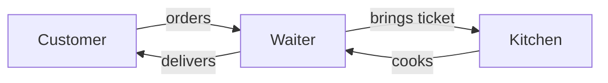
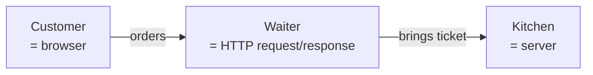

# Authoring lessons for this course

Working playbook for anyone — human or AI agent — writing or editing a lesson. Distilled from the Phase 1 build + the UAT walkthrough that surfaced what the original close missed. If you only have time to read one document before authoring a lesson, this is it.

For the locked rules (do-not-violate), see `CLAUDE.md` at the repo root.
For the contributor-facing summary (PR etiquette, what we want), see `CONTRIBUTING.md`.

---

## Part 1 — The pedagogical contract

### Audience floor (the one assumption that shapes everything)

A learner arriving at Module 0:
- Has used a computer (browser, email, files).
- May have viewed a page on github.com but never edited one.
- Has never written production code.
- Has not heard technical terms like `HTTP`, `SQL`, `schema`, `database`, `deployment`, `localhost`, `RLS`, `hydration` in a technical sense — and is not expected to. (`docs/audience-vocabulary.md` holds the authoritative per-module term list; this line is illustrative, not the contract.)

Every technical noun in lesson prose must pass one of three tests:
1. **Safe at this module** per `docs/audience-vocabulary.md` → use freely.
2. **Requires-callout at this module** → first use must carry a D-04 vocab callout: `**term** (one-line definition, [→ GLOSSARY](../../GLOSSARY.md#anchor))`. Subsequent uses in the same lesson can drop the callout. **This callout is per-lesson:** every lesson that uses the term needs its own first-use callout — even if an earlier lesson in the same module already introduced it. `voice-lint.sh` check #6 scans one lesson at a time, so "Lesson 4 already called out `npm`" does not cover Lesson 7.
3. **Forbidden at this module** → don't use it. Defer to the module that introduces it. If the concept is unavoidable, use an analogy or write `"you'll meet this in Module N"`. **Anchor-lesson exception:** a failure-mode term may be Forbidden in a module's tier yet introduced by that module's *designated anchor lesson* — with a callout, in the "notice the name" framing. Non-anchor lessons defer. See Part 7 (AI-Limitation Pedagogy) for the named principle and the worked `hallucination` case.

The contract is **incremental** — a term that's Safe in M0 is also Safe in M1+. A term that's Requires-callout in M0 becomes Safe in M1+ (the learner already met it); **graduation is across modules, not within one** — within the module where a term is Requires-callout, every lesson still calls it out on first use. Don't redefine terms already established in a *prior* module.

### Locked analogies (D-07)

The analogies in Module 1 are not creative territory. They were chosen for cross-cultural recognizability and consistency, and lessons in later modules will reference them back.

| Bundle | Analogy nouns |
|--------|---------------|
| 1 — How the web works | restaurant / customer / waiter / kitchen / dish / ticket / side dish |
| 2 — Where data lives | filing cabinet / drawer / index card / receptionist / clerk / form / paper / inter-office mail |
| 3 — Who can do what (authentication, authorization) | door staff / ID / VIP list / hand stamp / private backroom |
| 4 — How it goes live (deployment) | private kitchen / recipe binder / prep cooks / public restaurant / opening night |

When you write a Mermaid diagram in the **simple form**, you may use ONLY these nouns plus generic verbs (orders, brings, delivers, hands over). No `=` annotations. No HTTP / SQL / schema / CI/CD shorthand. No hybrid labels like `Build server = prep cooks`.

If a new lesson needs an analogy that isn't on this list, propose it in the phase's PLAN.md before writing the lesson body. Don't improvise.

### Phase 02.1 grounding patterns

Phase 02.1 extended the locked-analogy convention to nine Module 2 and Module 3.5 lessons that originally shipped without a sustained felt picture, and codified two adjacent patterns that came out of the same post-Phase-2 review: a felt-pain shape for "Why this matters," and a pruning rule for anxiety-management forward-references. The three sub-sections below name the patterns; the per-lesson analogies they apply to live in the phase decision log at `.planning/phases/02.1-module-2-3-5-grounding-pass/02.1-CONTEXT.md` (gitignored — read directly when you need the exact picture for a given lesson). Decision-log IDs: analogies D-40..D-48, authoring policy D-A1..D-A4, "Why this matters" template D-A5..D-A8, forward-ref pruning D-A9..D-A12.

#### Analogy authoring policy (D-A1..D-A4)

Sustained-with-callbacks is the depth that makes an analogy land. One passing simile in the opener does not. The pattern is one to two paragraphs of an everyday scene, plus one to three callbacks distributed across the 600-1500 word Core read so the picture stays alive as new mechanics get named. M1 bundle 1 (restaurant) is the depth reference; read it before drafting a new analogy.

Through Phase 02.1, every Module 2, Module 3, and Module 3.5 lesson that named a tool or skill category got a new analogy, with no structural exemptions — including lessons whose subject matter could be argued to already contain its own picture. Module 3.5 is retired (see Part 5's tombstone); this policy now applies to Module 2 and Module 3. The audience reads each lesson without remembering yesterday's lesson; the felt picture has to be there to be reasoned against.

Two-touch placement: the analogy opens "Why this matters" as the felt rhythm, then re-anchors at the top of the Core read at the moment the lesson formally names the tool. The first touch sets the picture before any naming happens; the second touch makes the naming feel like the picture rather than a definition. A third touch in "What you just did" is optional, not required.

Uniqueness: each new analogy gets its own decision-log entry and a distinct picture. No reuse of the D-07 locked analogies (restaurant, filing cabinet, door staff, recipe-binder). Themes may rhyme between lessons in the same module (M2's workbench and junior-teammate both inhabit a craftsperson worldview), but the analogy noun, the felt scene, and the mapping must each be different.

The Phase 02.1 entries by lesson, named here so future authors can find them without opening the phase log: D-40 craftsperson's workbench (M2 L1 the IDE), D-41 librarian's request slip (M2 L2 the terminal), D-42 sheet music vs. the musician (M2 L3 the runtime), D-43 corner-store delivery service (M2 L4 npm), D-44 junior teammate who started yesterday (M2 L6 AI coding agents), D-45 office directory in the lobby (M3.5 L1 reading a file tree), D-46 contractor who painted the wrong room (M3.5 L2 spotting wrong-file edits), D-47 receipt with the line item circled (M3.5 L3 error message to file pointer), D-48 framed picture vs. touchscreen (M3.5 L4 the `'use client'` server/client split).

**Historical note (2026-08-15).** Every lesson named in that D-40..D-48 list is retired: the accessibility remake collapsed Module 2 to three lessons on 2026-08-12 and deleted Module 3.5 entirely, so none of those nine analogies is attached to a live lesson any more. The list stands as the decision log's history — do not treat any entry as the locked analogy for a lesson that carries the same number today (today's M2 L1 is "Your AI coding agent", M2 L2 is "The engine room", M2 L3 is "The save system", each with its own analogy locked in the remake's phase context). What survives from Phase 02.1 as live doctrine is the *patterns* below: two-touch placement, the "Why this matters" felt-pain template, and forward-ref pruning.

#### Analogy two-test gate (D-A17)

Before an analogy is locked in the phase's CONTEXT.md decision log, the entry must carry an explicit two-test verdict alongside the felt picture, mapping, and alternates-considered. The gate exists because a sustained-with-callbacks analogy (D-A1) can still be decorative — sustained-and-decorative is the failure mode this test catches.

**Test 1 — Standalone.** Read the felt picture in isolation, with no tool-name in the description. Does it form a complete everyday scene a non-coder can grasp, with a rhythm and a recognizable beat? Could a reader who has never opened a code file have an opinion about what's going on inside the scene? If you have to mention the tool to make the picture make sense, the picture is borrowing meaning from the tool rather than lending meaning to it — and the analogy fails this test.

**Test 2 — Load-bearing tie.** The mapping must cover (a) the load-bearing word or distinction the lesson exists to teach, and (b) at least one failure mode the lesson teaches the learner to spot. Surface-level "kind of like X" does not qualify. If the analogy lands the rhythm but doesn't predict what wrong-use looks like, it's decoration, not pedagogy.

**How to apply.** When you propose an analogy in CONTEXT.md, append a `Two-test gate:` block to the entry:

```
Two-test gate:
  - Standalone: PASS — <one-line evidence>
  - Load-bearing tie: PASS / PARTIAL / FAIL — <one-line evidence; if PARTIAL or FAIL, name what's missing>
```

PARTIAL is allowed and means "ships with a known gap that a later phase must extend or revise." FAIL means propose a different picture before the entry is locked. Reviewers checking the CONTEXT.md entry can spot a missing or hand-waved two-test block at a glance.

**Worked contrast from Phase 02.1.** Both lessons below are retired (see the historical note above); the entries stand as worked records of how the two tests are argued, not as analogies attached to any live lesson. Do not resolve their lesson numbers against today's Module 2.

- **D-42 sheet music vs. musician (the retired Module 2 runtime lesson) — PASS / PASS.** Standalone: paper-and-dots-sitting-silent-on-a-stand is a coherent scene every reader recognizes. Load-bearing tie: the load-bearing distinction is "text-that-exists" vs. "the agent that makes it act" — sheet music vs. musician maps that exactly, and the two-musicians extension (browser + Node) predicts "JavaScript has two runtimes." Failure mode predicted: file exists but page is silent = sheet music sitting on the stand with no musician.

- **D-43 corner-store delivery (the retired Module 2 npm lesson) — PASS / PARTIAL.** Standalone: list / fetch / bags is a familiar rhythm. Load-bearing tie: maps `package.json` / `npm install` / `node_modules` cleanly. PARTIAL because the analogy does not predict (i) **version pinning** — a corner store doesn't ask for soap-version-1.2.3 — and (ii) **transitive dependencies** — the bags don't contain bags. Both would have hit a Phase 3 learner. No revision is queued: the lesson was retired before either gap was closed, so the entry survives only as the reference picture of what a PARTIAL verdict reads like.

The two-test gate is not a one-time hurdle. When a downstream lesson finds the analogy missing a load-bearing tie because a learner hit the gap, the analogy gets re-evaluated and either extended or revised. The gate is the conversation; the CONTEXT.md entry is its record.

#### "Why this matters" felt-pain template (D-A5..D-A8)

The opener is three sentences in shape — felt-rhythm → named problem → resolution. Sentence one invokes the everyday scene the analogy will inhabit. Sentence two names the problem the absence of the lesson's tool creates inside that scene. Sentence three names how the lesson resolves it. Four sentences is the comfortable upper bound when the felt-rhythm scene needs a beat to land. Up to six sentences is allowed when the felt picture plus the problem genuinely earn the runway; any "Why this matters" longer than four sentences adds `why-this-matters-extended` to the lesson's front-matter `deviations: []` array per D-02.

Total ban on the syllabus-architecture opener pattern: no instances of "Module N named X", "Lessons N and M named Y", "naming this category now means", or any phrasing whose primary job is to tell the learner where this lesson sits in the course. Through-line cues that genuinely add value move to the Core read body or to the "What you just did" closer; they are not permitted as the opener. The learner feels lectured about the syllabus instead of invited into a problem they recognize.

Self-test before shipping a "Why this matters" — the M0/M1-amnesia self-test: "If I deleted Module 0 and Module 1 from this learner's memory, would this opener still motivate them to read the lesson?" If the answer is no, the opener depends on course architecture rather than on learner pain, and rewrite it against the felt-rhythm template.

Gold-standard reference: `modules/02-toolchain/03-the-save-system.md`'s "Why this matters" — one clause of prior-lesson payoff (allowed by Part 3's "sets up the next" rule), then straight into the felt rhythm: you spend weeks changing a project you don't read yourself, some of those changes turn out wrong, and without somewhere to fall back to every change is a gamble with everything you've built. The resolution lands in the same breath — "the worst afternoon of your project costs you an afternoon" — before the lesson names a single tool. Read it before drafting any other lesson's opener. *(This exemplar pointed at the pre-remake `05-git-and-github.md` until 2026-08-15; that lesson was deleted when the accessibility remake collapsed Module 2 to three lessons.)*

#### Forward-ref pruning (D-A9..D-A12)

Heuristic: if a paragraph's primary job is to say "you don't have to learn X yet" or "don't worry about Y" or "next lesson covers Z" — delete it. Silence is enough. Each forward-ref carries a "remember-not-to-worry-about-this" working-memory load; the cumulative weight across a Phase-2-sized module is real and was felt by post-Phase-2 readers.

What stays:

- The prev/next navigation links at the bottom of the lesson. UX role, not reassurance role.
- A single closing-breadcrumb sentence at the end of "What you just did" is allowed as narrative closure (e.g., "Phase 3 starts the thread project").
- The "Going deeper" section is exempt. That section's job is forward-references by design — bullets pointing at Module 7, external docs, optional curiosity tracks. Phase 02.1 leaves "Going deeper" bullets unchanged on every revised lesson, provided each bullet adds info rather than anxiety-management framing.
- The "Loop check" and "What you just did" sections are exempt. Both serve narrative closure: Loop check satisfies LESSON-09's per-lesson loop-step reinforcement; "What you just did" connects the lesson's work to the durable loop. Any cross-lesson breadcrumb either section contains is closure, not anxiety-management.

What goes: Core-read body paragraphs whose primary job is anxiety management — "you don't have to understand this until Module 7", "the next lesson explains how", "Phase 3+ material". When you catch one, ask whether the paragraph teaches anything the lesson needs RIGHT NOW. If it doesn't, cut it.

Worked contrast: the pre-remake M2 L1 ended its "Why this matters" on "Naming the category once is what lets the rest of Module 2 say…" — syllabus-architecture framing, and the shape to avoid. The live `modules/02-toolchain/03-the-save-system.md` opener does the opposite: it spends its whole runway on the felt cost of a change going wrong, and never tells the learner where the lesson sits in the course. The contrast is the pattern. *(Both lessons this contrast originally named — the old M2 L1 and M2 L5 — were deleted by the 2026-08-12 accessibility remake; the pattern they illustrated is unchanged.)*

Enforcement: Phase 02.1 ships forward-ref pruning via human review against this section plus the locked analogy. No new voice-lint check is added in Phase 02.1 — a grep-based check for forward-ref counts or syllabus-opener phrases (`Module N named`, `Lessons N and M named`, `naming this category now means`) competes with REVIEW.md WR-04 (general voice-lint hardening) and is deferred to a follow-on phase whose scope is explicitly "voice-lint patterns layered on top of Phase 02.1's content rewrite." When you draft a lesson revision, run the pruning sweep yourself; do not wait for the lint to flag it.

### Voice contract (LESSON-12)

Two things to avoid:

1. **Tutorial fiction** — language that paints over the friction a learner will actually encounter. Examples:
   - "in just a few clicks" (reality: ten steps, three of them counterintuitive)
   - "now you can simply" (reality: still complex)
   - "as simple as that" (reality: not)
   - "just like that" (same)
2. **Filler** — words that don't carry information. Examples:
   - "in today's fast-paced world"
   - "in this day and age"
   - "with the increasing need for"

If you catch yourself writing one of these, rewrite. `scripts/voice-lint.sh` will catch them too, but the right move is not writing them in the first place.

---

## Part 2 — The nine-element lesson anatomy

Every lesson uses `lesson-template.md` (or `lesson-template-m0.md` for Module 0). The nine elements, in order, plus the optional Definition-of-done element in build-phase lessons (M4+, inserted after Exercise):

1. **Objective** (LESSON-01) — one sentence: "By the end of this lesson, you'll be able to ___." Concrete and observable, not aspirational.
2. **Why this matters** (LESSON-02) — 2-4 sentences linking the lesson to the learner's actual goal (shipping a deployed app).
3. **Core read** (LESSON-03, 600-1500 words) — the main teaching. Prose first; analogies first; diagrams as visual aids, not as the load-bearing teaching mechanism.
4. **Vocab callouts** (LESSON-04, D-04 pattern) — defined inline using `**term** (one-line definition, [→ GLOSSARY](../../GLOSSARY.md#anchor))`.
5. **Exercise** (LESSON-05, 10-25 minutes) — concrete, deliverable-shaped, names whether paper / excalidraw / code is acceptable.
6. **Checkpoint** (LESSON-06) — "You've got this if you can ___." One or two testable claims.
7. **Going deeper** (LESSON-07) — optional pointers. If the lesson has none, declare via front-matter `deviations: [no-going-deeper]` AND remove the section.
8. **Loop check** (LESSON-09) — one sentence connecting the lesson to one of the durable AI-coding loop steps (intent / ask / evaluate / steer). **In Module 1 (pre-loop), every Loop check names `intent`** (D-05).
9. **What you just did** (LESSON-10) — 2-4 sentences recapping the exercise and linking it back to the loop.

Plus the front-matter (title, module, lesson_number, est_minutes, deviations, GLOSSARY anchors used) and navigation (prev/next links per OPS-05).

If you skip or shorten an anatomy element, add it to the front-matter `deviations:` array AND drop a `> **Deviation note:**` blockquote near the affected section explaining why.

---

## Part 3 — Narrative coherence: the module spine

Tenet 4 ("Coherent through-line", `docs/TENETS.md`) locks the goal: a module is not a pile of individually-correct lessons — it is one journey the learner can feel. Each lesson visibly grows from the last, and the module states its arc out loud. This part operationalizes it.

Without a stated arc, coherence is left to chance: each lesson passes its own checks, the analogies happen to recur, and the learner re-orients from scratch at the top of every lesson. The spine makes the through-line explicit — for the learner (orientation) and for the author (a target to honor).

### The module spine

Every module README carries a `## What this module builds` section near the top:

- **One promise sentence** — what the learner can newly *do* by the end of the module.
- **A per-lesson arc** — one bullet per lesson: `after this lesson you can ___ → sets up the next by ___`. The capability is observable; the link names how this lesson's payoff makes the next one possible.
- **The thread** — the recurring picture (a locked analogy) or the loop step the module carries from first lesson to last.

The spine is descriptive of the lessons that exist, not aspirational. When a lesson changes what it delivers, its spine bullet changes with it. The spine is learner-facing — it doubles as the module's orientation.

### The "sets up the next" rule (in each lesson)

Coherence lives in two anatomy elements:

- **"Why this matters" (LESSON-02)** may name the prior-lesson payoff this lesson builds on — the felt continuation of the journey. Keep it inside the felt-pain template: the prior payoff is part of the felt rhythm, never a syllabus recap ("in Lesson 3 we covered X").
- **"What you just did" (LESSON-10)** names what this lesson sets up next.

This is narrative SETUP and CLOSURE — distinct from the anxiety-management forward-references that Part 1's pruning rule (D-A9..A12) deletes. The test: a setup/closure sentence tells the learner where the journey goes ("you can now X; next you'll use X to Y"); an anxiety-management forward-ref tells the learner not to worry ("don't stress about Z, it's covered later"). Keep the first; cut the second.

### The coherence review question

When authoring or auditing a lesson, ask: **does this lesson honor its module's spine — build on the named prior payoff, and set up the next?** If the lesson's "Why this matters" could open any lesson in any order, the through-line is missing — reconnect it to the prior payoff. If "What you just did" closes this lesson but leaves the next one unmotivated, name what it sets up.

### Enforcement

GUIDANCE — human review against the module spine. There is no lint for narrative coherence (a grep cannot tell a felt continuation from a syllabus recap). The `## What this module builds` arc in the README is the artifact a reviewer — or a future cross-course coherence pass — checks each lesson against.

### Cross-references

- `docs/TENETS.md` § Tenet 4 — the underlying principle
- Part 1 § Forward-ref pruning (D-A9..A12) — the setup-vs-anxiety distinction
- Each module's `README.md` `## What this module builds` — the spine itself

---

## Part 4 — Diagrams in M1+

This is where Phase 1's UAT walkthrough surfaced the most subtle pedagogy bugs. Read this section carefully before adding or editing a Mermaid block.

### The simple-first / bridge-collapsed convention

For every M1+ lesson that uses Mermaid to teach a spatial or relational concept:

1. **The simple-form Mermaid comes first**, in plain view in the lesson body. It uses ONLY the locked D-07 analogy nouns. No technical labels.
2. **The technical Mermaid comes second**, wrapped in a `<details><summary>` HTML5 disclosure widget. It uses the real names (HTTP, SQL, schema, CI/CD, etc.). The summary line names which later module covers those terms hands-on.
3. **Inside the disclosure**, before the technical Mermaid, a `> *Peek ahead — skim, don't memorize:*` blockquote callout carries the analogy → real-term mapping with the technical terms in bold.

**Why both diagrams cannot just sit side-by-side:** a learner who sees the technical diagram in their peripheral vision feels obligated to absorb the labels. Those labels are exactly the M3-M5 vocabulary M1 is designed to defer. Optionality has to be a real visual affordance, not just framing in the surrounding prose.

### Worked example (the canonical pattern)

````markdown
So the round trip looks like this:


```mermaid
flowchart LR
  Customer[Customer]
  Waiter[Waiter]
  Kitchen[Kitchen]
  Customer -->|orders| Waiter
  Waiter -->|delivers| Customer
  Waiter -->|brings ticket| Kitchen
  Kitchen -->|cooks| Waiter
```

<details>
<summary>Optional: same picture with the technical labels (Module 3 hands-on)</summary>

> *Peek ahead — skim, don't memorize:* The same picture with the real names labeled. You'll meet **HTTP**, **request**, **response**, **server**, and **browser** properly in Module 3, where you'll write your first API route by hand. If the labeled diagram feels heavy, close this and move on.


```mermaid
flowchart LR
  Customer["Customer<br/>= browser"]
  Waiter["Waiter<br/>= HTTP request/response"]
  Kitchen["Kitchen<br/>= server"]
  Customer -->|orders| Waiter
  Waiter -->|brings ticket| Kitchen
```

</details>

The order ticket has a specific shape. ...
````

### GFM blank-line discipline (MANDATORY)

GitHub-Flavored Markdown parses fenced code blocks inside `<details>` correctly ONLY when blank lines surround them. If any of these four blank lines is missing, the Mermaid inside the disclosure will NOT render — GFM will treat the body as raw HTML.

```
<details>
<summary>Summary text</summary>
                              ← BLANK LINE (after </summary>)
> *Peek ahead callout...*
                              ← BLANK LINE (before ```mermaid)
```mermaid
... diagram ...
```
                              ← BLANK LINE (after closing ```)
</details>
```

**Verifying:** view the file's preview on github.com after pushing. If the disclosure expands but the Mermaid doesn't render, count blank lines.

### The Mermaid `<br/>` rule (subtle and asymmetric)

GitHub's Mermaid parser has different rules for HTML break tags depending on where they appear:

| Context | `<br/>` works? | `<br>` works? | Right answer |
|---------|---------------|---------------|--------------|
| Flowchart node label `["Node<br/>=label"]` (QUOTED) | ✓ | ✓ | Use `<br/>` (matches existing convention) |
| Flowchart node label `Node[Node<br/>=label]` (UNQUOTED) | ✗ | ✗ | Quote it: `Node["Node<br/>= label"]` |
| Flowchart edge label `-->|text<br/>more|` | ✗ | ✗ | Write as single line: `-->|text more|` |
| SequenceDiagram Note `Note over X: text<br/>more` | ✗ | ✗ | Single line: `Note over X: text — more` |
| SequenceDiagram message `A->>B: text<br/>more` | ✗ | ✗ | Single line: `A->>B: text — more` |

`scripts/voice-lint.sh` check #7 enforces this. The check strips `["..."]` quoted regions inside Mermaid fences and then flags any remaining `<br/?>` as a render-breaker. Fixture: `scripts/voice-lint-fixtures/07-mermaid-br-outside-quotes.md`.

### The "Module N hands-on" pointer

When the technical Mermaid introduces M3+ vocabulary, the disclosure summary line and the peek-ahead callout both name which later module the learner will use those terms hands-on. The current mapping:

| Bundle | Technical terms introduced | Hands-on module |
|--------|---------------------------|-----------------|
| 1 (how-the-web-works) | HTTP, request, response, server, browser-as-program, HTML, GET/POST/PUT/DELETE, status codes | Module 3 (single-user vertical slice) |
| 2 (where-data-lives) | table, row, foreign key, schema, API, HTTP request, SQL, database | Module 3 |
| 3 (who-can-do-what) | authentication, authorization, session token, cookie, sign-in | Module 4 (multi-user social graph) |
| 4 (how-it-goes-live) | build server, public URL, deployment, CI/CD | Module 4 (first deploy, then go-live) |

Map terms to the module where the learner **does** them hands-on, not the phase where they're first mentioned in passing.

### M0 stays diagram-light

Module 0 lessons (welcome, hardware check, cost-path triage, account creation, and the agent-app install lesson `05-install-your-agent-app.md`) deliberately do not use Mermaid. They're setup-task lessons, not mental-model lessons. LESSON-11 mandates Mermaid for spatial/relational concepts, which is M1+ territory.

### M2+ uses the disclosure pattern selectively

By Module 2 the learner has met the M3 vocabulary at least once (via the M1 peek-aheads). Use the disclosure pattern in M2+ only when introducing a genuinely new concept whose terminology hasn't been taught yet.

---

## Part 5 — Agent-Responsibility Checkpoint (M3.5 floor)

**Retired 2026-08-12.** Module 3.5 is removed from the course: the accessibility remake ended reading-floor pedagogy (reading file trees, diff summaries, error text). The one durable skill — noticing that the running app doesn't match what you asked for — lives in Module 3's evaluate step. The old Part 5 text survives in git history and the pre-remake archive. Do not author against this part; the boundary now lives in CLAUDE.md Hard Rule 12 and Part 6 below. Part numbering is preserved to keep cross-references stable.

---

## Part 6 — Execution-Floor Boundary (M4+ build phases)

CLAUDE.md hard rule 13 extends the generalized Agent-Responsibility Boundary (hard rule 12) to M4+'s **execution floor** — the phases where the learner ships code via the agent. This part operationalizes it. Read it before authoring or revising any Module 4, 5, or 6 lesson — and treat it as a load-bearing audit gate for the build-phase planner (`/gsd-plan-phase`) before it runs.

### Why the execution floor needs its own rules

Hard rule 12's floor is OBSERVATION: the learner watches the agent work; the agent does the reading, editing, and diagnosing. M4+ is EXECUTION: the learner is now shipping the thread project. The agent still does the code-authoring, but the learner is in the driver's seat — naming what to build, sequencing the chunks, verifying that what just shipped matches what was asked for. The translation is "what does it look like to drive without owning the engine?"

### The boundary

The **agent owns**: schema authoring, RLS policy syntax, async/await mechanics, hook internals (`useState`, `useEffect`, `useOptimistic`, etc.), Server-Action plumbing, type narrowing, dependency resolution, framework internals (Next.js routing rules, Supabase client lifecycle), build internals, deployment plumbing, error parsing.

The **learner owns**:

1. **Stating intent at the feature level.** Not "use `useOptimistic` with the right reducer signature" — but "the like count should update right away, then correct itself if the server returns an error."
2. **Observing the running app matches intent.** Open the deployed app. Click around. Sign out. Sign in as a second user. Did the agent build what you asked for?
3. **Running the phase's check inventory.** A named list of behavioural checks in exactly two admissible forms (next section). Every check is performed in the running app or spoken to the agent — never against code, a diff, or a migration. The inventory is the bridge between the general Agent-Responsibility Boundary (hard rule 12) and M4+'s execution responsibility.
4. **Telling the agent to save each working chunk.** "Save this as a working version" is the learner's verb — the agent performs all git and GitHub operations. Working state gets saved before the next chunk starts.
5. **Knowing when to start a fresh conversation in the app and begin the chunk again.** Same skill the learner met in M3 L4 (recovery), now applied at chunk scale. If the agent has committed to a wrong path across multiple turns, begin the chunk again with a tighter prompt.

### The check inventory — two admissible forms

A check the learner runs must be something a non-coder can actually perform. There are exactly two admissible forms. **Anything that requires reading, scanning, or judging the agent's output — code, a diff, a migration, any file the agent wrote — is banned from learner-territory.**

**Form 1 — the refusal check (the workhorse).** In the running app, attempt the thing that should *not* be allowed, and confirm it is refused. Happy-path observation confirms the feature works; the refusal check is its inversion, and it is the half that actually tests the fences.

```
TRY THIS:      sign in as your second account, open a comment you did not write,
               and try to change it
EXPECT:        there is no way to, or it refuses
IF IT WORKS:   "I could edit a comment I didn't write. Only its author should be
               able to. Fix that."
```

**The third leg is mandatory; its label is contextual (locked 2026-08-21).** Every check block ships all three legs — the third is what turns the block from *observing* into *reporting*, and a learner who finds a real failure with no third leg has been given no next move. What is **not** fixed is the literal words `IF IT WORKS:`. That label only reads correctly when the TRY THIS is a forbidden action, where "it worked" is the bad outcome. Where the TRY THIS is an intent observation — write a post and find it in your feed; click like and watch the number — "it works" names the *good* outcome, and hanging the recovery prompt under it would tell the learner to report success as a fault. Those blocks name their own failure condition instead: `IF YOUR OWN POSTS ARE MISSING:`, `IF IT LIES:`, `IF YOU GET STRAIGHT IN:`, `IF THE AUTHOR LINE CHANGES, OR THE EDIT SILENTLY VANISHES:`. The spec's own worked example below already does this (`IF ANYTHING ELSE HAPPENS:`). The authoring rule: **name the condition the learner would actually see**, and give the learner their next move under it — usually a recovery sentence in their own words, sometimes a pointer to where that message is written out, sometimes a single thing to go and read off a dashboard screen they operate themselves and report back. A block missing the third leg entirely is a defect; a block whose third leg is labelled for its own check is correct.

*(Audited 2026-08-21 across all 24 shipped check blocks in M4–M6: 12 use the literal `IF IT WORKS:` and 12 use a contextual label. **Zero ship without a third leg**, and every one gives the learner a next move. Most quote a recovery sentence outright; three do not and are still correct — `05-operating/02:74` and `03:73` name the condition and send the learner to the message written out in the following section, and `04-thread-project/08-likes-and-go-live.md:158` sends them to the one Vercel setting they can read themselves. An earlier review read the 12 non-literal labels as 12 missing legs and queued a repair; the repair would have made several blocks semantically wrong, so the spec was sharpened to describe what shipped instead.)*

**Form 2 — the pre-flight question.** Before an irreversible step (anything pasted into a dashboard, anything run against data that already exists), the learner asks the agent a named question about consequences and waits for the answer. This is driving, not reading.

```
BEFORE YOU PASTE:  "Does this remove or overwrite anything that is already in my
                    database? List exactly what changes for data that exists today."
```

Example checks for Phase 4 (the chunk that adds posts editing):

- TRY THIS: signed in as your second account, open a post the first account wrote and try to change it. EXPECT: no edit control appears, or the save refuses. IF IT WORKS: "I could edit a post I didn't write — only its author should be able to. Fix that."
- TRY THIS: edit one of your own posts and save. EXPECT: the edit lands and the post still shows you as its author. IF ANYTHING ELSE HAPPENS: "my post stopped being attributed to me after an edit — that must never happen. Fix it."
- BEFORE YOU PASTE any database change into the dashboard: "Does this remove or overwrite anything that is already in my database? List exactly what changes for data that exists today."

The learner can perform every check in the inventory without knowing RLS policy syntax, without parsing TypeScript, without opening a single file the agent wrote. The check is behaviour; the diagnosis is the agent's job.

**Why the scan form is banned (locked 2026-07-27).** This part originally allowed a third form: scan the agent's diff or migration for a literal string (`LOOK FOR: WITH CHECK …`). It was retired on live evidence. Across three consecutive build chunks the same scan produced three different outcomes — string present; string legitimately absent (the risk lived in a different layer); string present but reordered and wrapped so the learner could not match it — and in the third case the escalation path ("ask the agent about the missing string") returned a confident, well-structured, reason-giving answer that was factually inverted. A learner scanning for a string cannot adjudicate semantics the course's own authors got wrong. The scan form's real failure mode is **false confidence**, which is worse than not looking. Where a retired scan pointed at a real risk, the *observation* it pointed at survives in behavioural form — the author-rewrite scan became the refusal check quoted above.

### Test gates (the agent-run layer)

Every build chunk's prompt ends with a **test gate**: a short, plain-language definition of done. Three authoring rules. (1) The gate's checks are run by the **agent**, never the learner — automated checks where they exist, the agent clicking through its own preview where they don't — and the agent must show the results in plain words before it may say "done". (2) The lesson teaches the ritual on the learner's side: do not accept "done" without the gate report; if the report is missing, the steer is "run the checks we agreed on and show me the results first." (3) The gate never smuggles mechanics into the learner's mouth: its checks are phrased as outcomes ("a signed-out visitor who opens a post page can read it but sees no comment box"), not as tests, assertions, or tools. The learner's own refusal checks and pre-flight questions stay exactly as specified above; the gate is a third layer, owned by the agent.

### Where the inventory lives

The check inventory for each build phase is locked in the phase's CONTEXT.md (`.planning/phases/NN-name/NN-CONTEXT.md`) BEFORE the planner runs. CONTEXT.md must contain:

- A **per-chunk boundary table** naming agent-territory vs. learner-territory for each chunk's deliverable.
- The **check inventory** for the phase: refusal checks (TRY THIS / EXPECT / IF …, the third leg labelled for its own check — see Part 6) and pre-flight questions (BEFORE YOU …), one entry per named risk.
- The **Tenet 6 surfaces** for the phase: which lessons name which agent failure mode + where the corresponding check lives.
- The **vocab additions** for the phase: which terms pass the say-it-or-see-it rule (the learner must say the term to the agent, or see it in the running app or on a dashboard screen they operate themselves), and which may not appear at all.

Without this CONTEXT, the build-phase planner inherits only the ROADMAP success criteria — which contain jargon-shaped trigger language (`@supabase/ssr cookies() correctly awaited`, RLS `WITH CHECK`, `useOptimistic`). That's the original drift vector: success-criterion phrasing turns into learner-facing scan instructions unless this file re-expresses each one as a refusal check or a pre-flight question.

### The three audit questions adapted for M4+

Run these for every section of every M4+ lesson:

1. **Q1-Exec — Does this section ask the learner to do something the agent will do better?** Examples that fail: "write a `UPDATE` policy with `WITH CHECK` matching this shape"; "configure your `cookies()` call to await before reading"; "destructure the `useOptimistic` return tuple" — and equally "open the migration and check it contains X." The fix: replace with the boundary statement plus the behavioural check ("the agent writes this; here is the forbidden thing to try in the running app, and what to say if it goes through").
2. **Q2-Exec — Does this section explain mechanics (framework internals, hook lifecycles, RLS grammar, async/await semantics, type narrowing) the learner does not need to direct the agent?** If yes, cut to the intent + the check. Mechanics belong to the agent.
3. **Q3-Exec — Does any term fail the say-it-or-see-it rule?** A term may appear only if the learner must say it to the agent or see it in the running app or on a dashboard screen they operate themselves. A term that exists only inside code or files the agent wrote gets cut — the behaviour it pointed at survives as a refusal check. No "anatomy of an RLS policy," no "how `useOptimistic` works," no "scan the diff for `WITH CHECK`."

A section that fails Q1-Exec, Q2-Exec, or Q3-Exec gets rewritten as "the agent does X; you try the forbidden thing Y in the running app; if it goes through, tell the agent Z."

### The check catalog (build out per phase)

Phase 3 / 4 / 5 / 6 each maintain a CONTEXT.md check inventory. As phases land, the catalog below grows. Each entry names the form (the two inventory forms, plus the ambient learner skill of intent observation), where the check is first taught, and where the learner first applies it. Errors are agent territory end to end under CLAUDE.md hard rule 12: the agent reads them, diagnoses them, and reports the outcome in plain words — the learner never reads error text, even text the tool displayed. The reading-floor patterns formerly taught in Module 3.5 (right-file edit inspection, presence-checking for a code directive) are retired along with that module; they are not carried into M4+ lessons, where reading the agent's output stays banned.

| Check | Form | First taught | First applied |
|---|---|---|---|
| Signed-out visitor can read but not act | refusal check | Phase 3 CONTEXT | every chunk with public content + Phase 6 regression net (M6 L2 re-runs the four Module 5 scenarios after a change; M6 L1 ships no refusal check of its own) |
| Second account cannot edit or delete content it did not write | refusal check | Phase 3 CONTEXT (posts) | Phase 4 (comments) + Phase 5 LESSON-13 walkthrough (a) |
| Your own edit never changes who a thing belongs to | refusal check | Phase 3 CONTEXT (posts) | Phase 5 LESSON-13 walkthrough (a) |
| Own post appears in the running feed (never silently missing) | intent observation | Phase 4 CONTEXT | Phase 5 LESSON-13 walkthrough (b) |
| Dashboard-paste pre-flight ("does this remove or overwrite anything that already exists?") | pre-flight question | Phase 3 CONTEXT (first paste) | every dashboard paste + Phase 5 LESSON-13 walkthrough (c) |
| Like count moves the instant you click, snaps back if the save fails | intent observation | Phase 4 CONTEXT | Phase 4 Chunk 7 |
| Post-paste pre-flight ("what in what I just pasted are you acting on?") | pre-flight question | Phase 6 CONTEXT (M6 L3) | M6 L3 — after pasting anything written outside the conversation |

### Cross-references

- CLAUDE.md hard rule 12 — the generalized Agent-Responsibility Boundary this part extends to the execution floor
- CLAUDE.md hard rule 13 — the boundary itself
- `.planning/phases/NN-name/NN-CONTEXT.md` — per-phase check inventory

---

## Part 7 — AI-Limitation Pedagogy

CLAUDE.md hard rule 14 locks the pedagogical rule: when a lesson names an agent failure mode, it must arm the learner with a concrete smell-test for that failure mode (in the same lesson or via explicit forward-reference). This part catalogues the seven core agent limitations and their per-limit smell-test patterns.

### Why this matters (Tenet 6 anchor)

A learner who cannot recognize when the agent is wrong cannot recover when the agent is wrong. The recovery skill is the course's differentiator. Recovery requires limits-and-smell-tests, not just limits. Naming hallucination without giving the learner the smell-test for it is like naming food poisoning without naming the taste of spoiled food.

### The seven limitations (course taxonomy)

The course names seven core agent failure modes. Each gets a per-module surface and a smell-test pattern.

| # | Limitation | Plain definition | Module where smell-test first appears |
|---|---|---|---|
| 1 | **Hallucination** | The agent produces specific details that look correct but were invented — book titles, function names, API endpoints, file paths the agent has no way of knowing | M3 L3 (in-depth) — first named M2 L1 |
| 2 | **Drift** | The agent loses the thread of an extended conversation; mid-session the responses stop matching the original intent | M3 L2 (context-window framing) + M3 L4 (fresh-conversation recovery) — first named M2 L1 |
| 3 | **Context-window overflow** | The agent's working memory fills; old context is dropped silently; the agent starts answering as if earlier turns didn't happen | M3 L2 — recognized from the outside (replies stop matching the ask; a long conversation feels muddy), recovered by starting a fresh conversation |
| 4 | **Training cutoff** | The agent's knowledge has a hard date boundary; anything more recent (a new version of a framework, a recent change to an API, a current best practice) is invisible to it | M3 L3 — surfaced as a hallucination subtype |
| 5 | **Confident-wrong** | The agent's tone and the agent's correctness are independent; fluent-sounding answers can be wrong; uncertainty is rarely surfaced unless the prompt explicitly asks for it | M3 L3 (the lesson IS about this) |
| 6 | **Risk-blindness** | The agent doesn't model the consequences of its changes — it can suggest deleting a migration, dropping a table, force-pushing a branch, or hardcoding a secret with the same calmness as a typo fix | M5 watch-it-fail walkthroughs (LESSON-13) + M2 L1 first surfacing |
| 7 | **Prompt injection** | Text pasted in from outside the conversation — a user's comment, a bug report somebody sent — carries instructions the agent takes as the learner's own, so the work it offers back includes things nobody asked for | M6 L3 — the smell-test is a pre-flight question asked at the approval prompt |

### The smell-test pattern (per-limit)

For each limit, the lesson where it's first taught provides:

- **The limit named** (with a D-04 callout on first use, mapped to the audience-vocabulary contract).
- **One concrete symptom example** the learner can recognize without prior coding knowledge. Not abstract; specific. Not "the agent might be wrong" — but "the agent recommended `bookcover.io` as a free book-cover API; you searched and there is no such service."
- **The smell-test action**: what to do when you spot it. Usually: re-ask with the symptom named explicitly; or start a fresh conversation in the app and try again with a tighter prompt; or paste the verifying evidence back to the agent.

### Anchor lessons (Tenet 6 surfaces)

- **M2 L1 (`modules/02-toolchain/01-your-ai-coding-agent.md`)** — first surface for limits 1, 2, 6. Three concrete symptoms, each armed with its own one-line smell-test in the lesson itself (Hard Rule 14 option (a)), plus forward-references to where each goes deeper (M3 for hallucination and drift, M5 for risk-blindness). *(This anchor duty moved here on 2026-08-15 when the accessibility remake collapsed Module 2 to three lessons and deleted the former M2 L6, `06-ai-coding-agents.md`.)*
- **M3 L3 (`03-reading-plans-recognizing-wrong.md`)** — in-depth smell-test for limit 1 (hallucination). The hallucination *mechanism* is grounded non-technically in 2–3 sentences ("the agent writes fluent sentences; fluent sentences can contain invented details; when the agent has nothing to reference, it reaches for plausible candidates and presents them as if specified"). Do NOT punt mechanism explanation to Module 7 — explain it in plain prose here.
- **M3 L4 (`04-steering-and-recovery.md`)** — smell-test + recovery for limit 2 (drift via fresh-conversation hygiene).
- **M5 watch-it-fail walkthroughs (LESSON-13)** — three smell-tests, each with a narrated known-bad pattern and the learner's recovery prompt. Anchors limits 5 + 6.
- **M6 L3 (`modules/06-after-live/03-when-what-you-paste-isnt-yours.md`)** — the anchor for **prompt injection** — row 7 of the table above. The smell-test is a pre-flight question asked at the approval prompt (*"What in what I just pasted are you acting on? List anything you are about to change that I did not ask for."*); the recovery is learner-side — decline, start a fresh conversation, and describe the outside content instead of pasting it. In the shipped module only L3 names the term; the lessons that touch it defer in plain words (L1 carries the forward-reference on handing over a bug report somebody else wrote, and L4 on what a paste asks of a person; L2 is simply silent, having no occasion to defer). (That is how the module was authored, not a tier restriction — `prompt injection` sits in M6's Requires-callout tier, so the Forbidden-tier anchor-lesson exception below does not apply to it.) The lesson is honest that a given run may or may not reproduce the failure, so the learner is armed for the *shape* (the paste, then the surprise) rather than promised an observable failure. *(Added 2026-08-20 when Module 6 shipped.)*

### The anchor-lesson exception (Forbidden-tier terms)

A failure-mode term can be **Forbidden in a module's vocabulary tier yet still belong in that module** — introduced exactly once, by the module's *designated anchor lesson*, in the "notice the name" framing. This resolves the apparent collision between Tenet 1 (assume nothing; defer jargon) and Tenet 6 (arm the learner against failure modes).

The rule:

- **The anchor lesson introduces the term** with a D-04 callout + GLOSSARY anchor + a Hard-Rule-14 forward-reference to where the smell-test lives. It does not explain the mechanism beyond the callout's depth.
- **Every other lesson in that module defers** — names the failure mode in plain words and forward-references the anchor (or the smell-test lesson). Using the term as a bare concept outside the anchor breaks the deferral the tier is protecting. Note that check #6 does **not** catch this today (verified 2026-08-15): the `*(anchor-lesson exception applies …)*` marker on the tier row leaves the extracted term with the italic markers attached, so anchor-excepted terms never match anything in a lesson and the rule is human-review-only. The same inertness is what stops the check from flagging the anchor lesson's own sanctioned uses — the check has no exception mechanism, so making it see these rows would need one first.
- **`docs/audience-vocabulary.md` records the exception** on the term itself (e.g., `hallucination` is Forbidden in M2 *except* its anchor lesson M2 L1).

**Worked case — `hallucination`.** The M2 tier marks `hallucination` Forbidden. But this Part designates **M2 L1** (`modules/02-toolchain/01-your-ai-coding-agent.md`) as the Tenet 6 anchor, so M2 L1 introduces `hallucination` with a callout and its smell-test, pointing forward to M3 L3 for the in-depth version. A *different* M2 lesson that needs to warn about invented package names must NOT write "hallucination" — it says "the agent sometimes invents commands or packages that don't exist" and forward-references M2 L1 / M3 L3. The same holds for `drift` and `risk-blindness`: M2 L1 is the one lesson in the module that may name them.

### Forward-reference template (Hard Rule 14 compliance)

When a lesson names a failure mode but the smell-test lives elsewhere, use this exact shape:

```markdown
> **Heads up — you'll meet this again.** {Failure mode in plain words}. The smell-test for catching it lives in {Module N Lesson NN slug}; for now, just notice the name.
```

This satisfies Hard Rule 14's forward-reference requirement. Vague "we'll cover this later" without naming WHERE does not satisfy the rule.

### What NOT to do

- Don't name hallucination (or drift, or risk-blindness) outside its anchor lesson. M0/M1 don't surface them at all; within M2, only the anchor lesson (M2 L1) introduces the terms — see "The anchor-lesson exception" above. Other M2 lessons defer in plain words.
- Don't introduce a failure-mode term in a callout and then explain the underlying neural-network mechanics. The audience floor does not benefit from "attention head misalignment" or "next-token prediction without grounding."
- Don't write "the agent might be wrong" without naming WHICH failure mode + the smell-test. Vague risk-naming inflates anxiety without arming the learner.
- Don't conflate confident-wrong with hallucination. Confident-wrong is the *tone*; hallucination is the *content*. Both can occur independently.

### Cross-references

- CLAUDE.md hard rule 14 — the rule itself
- `docs/audience-vocabulary.md` — M3 Requires-callout terms (hallucination, context window, etc.)
- `docs/TENETS.md` § Tenet 6 — the underlying philosophy
- M5 LESSON-13 (REQUIREMENTS.md) — the three watch-it-fail walkthroughs

---

## Part 8 — What NOT to Teach (the temptation appendix)

Authors and AI agents both tend to over-explain. The audience-vocabulary contract is the *positive* surface (what IS safe at each module); this appendix is the *negative* surface (high-temptation traps where authors add depth the learner does not need). Each entry names a topic, the temptation, and the right move.

Read this section before every lesson. Trap-spotting is faster than rewrite-after-the-fact.

> **Escape clauses were adjudicated 2026-08-21.** Seven traps below used to say "escape to Module 7". Module 7 ships three pointer lessons, not a curriculum, so each escape was re-decided against the desktop-app learner: some traps escape to a Module 7 pointer, and some escape **nowhere** — the topic simply stays out of the course. A trap whose escape is now "nowhere" still describes a real authoring hazard for Modules 0–6; what changed is where the depth is allowed to go, not whether the temptation exists.

### The trap catalog

#### Trap A — Explaining HTTP request/response anatomy

**Temptation.** "An HTTP request has a method (GET, POST, PUT, DELETE), a path, headers, and a body. The server responds with a status code (200, 404, 500), headers, and an optional body."
**Right move.** M1 names the restaurant analogy. The technical version goes in a `<details>` disclosure with a forward-reference to Module 3 hands-on. Body prose stays in the analogy.
**Where to escape to.** Module 3 (single-user vertical slice) — when the learner is actually triggering requests via a deployed app, not learning HTTP from a textbook.

#### Trap B — Teaching SQL JOIN mechanics or foreign-key constraints as concepts

**Temptation.** "A foreign key creates a referential constraint that prevents inserting a row that references a non-existent parent row..."
**Right move.** Filing-cabinet analogy: "cards in one drawer remember other cards by ID." That's the floor. The agent writes the schema; the learner observes that "alice's posts disappear when alice is deleted" works.
**Where to escape to.** Don't. JOIN mechanics belong to the agent. M4+ names the *behaviour* ("when I delete a user, do their posts disappear or break?") as a check performed in the running app.

#### Trap C — Explaining cookie flags (`httpOnly`, `Secure`, `SameSite`)

**Temptation.** "Set `httpOnly: true` and `Secure: true` and `SameSite: 'Lax'` to mitigate XSS and CSRF..."
**Right move.** M1 L3 uses plain language: "the stamp on your hand is hard to copy; the door staff changes the stamp pattern often; the door staff asks for ID again before letting you into the safe room." The agent handles flag configuration; the learner observes "I can stay signed in across browser refresh."
**Where to escape to.** **Module 7 — KEEP, merged (2026-08-21).** Folded into Module 7's permission-rules pointer together with trap E: sessions are how the app knows who is at the fence, row rules are the fence, and one pointer covers both for the same learner profile. Still a pointer, never a deep-dive.

#### Trap D — Explaining async/await semantics

**Temptation.** "Next.js 16 made `cookies()`, `headers()`, and `params` async because the rendering pipeline needs to defer their resolution until..."
**Right move.** Async/await belongs to the agent entirely — the learner never opens the code. What the learner owns is the behaviour: sign in, refresh the page, still signed in. If a page loses the session or an error appears, paste the error to the agent. Don't explain the rendering pipeline.
**Where to escape to.** Don't. Async/await semantics belong to the agent, and per the say-it-or-see-it rule the words never appear in an M4+ lesson.

#### Trap E — Explaining RLS policy grammar

**Temptation.** "An RLS policy has a `FOR` clause (SELECT / INSERT / UPDATE / DELETE), a `USING` predicate that filters reads, and a `WITH CHECK` predicate that filters writes..."
**Right move.** Door-staff analogy from M1 L3 carries forward. The agent writes the policies; the learner tests the fence in the running app with a refusal check — sign in as the second account, try to change something the first account wrote, expect refusal; if it goes through, tell the agent exactly what you did. No policy text ever reaches the learner's eyes.
**Where to escape to.** **Module 7 — KEEP (2026-08-21).** This is the carrier for Module 7's permission-rules pointer, and trap C merges into it. It survives adjudication because getting these rules wrong fails *silently* — the app looks fine while showing the wrong person the wrong row — and because the learner already operates the Supabase dashboard where the rules live. The pointer names the topic and links Supabase's own page; it never reproduces policy grammar.

#### Trap F — Explaining React hook internals (`useState`, `useEffect`, `useOptimistic`, etc.)

**Temptation.** "`useOptimistic` returns a tuple of `[optimisticValue, addOptimistic]`. The reducer signature is `(currentState, optimisticValue) => newState`. Call `addOptimistic` inside a Server Action..."
**Right move.** `useOptimistic` never reaches the learner at all — under CLAUDE.md hard rule 12 the learner never reads code, a file, or a diff, so there's no hook name to spot in the first place. In M4+, the learner observes the running app: "I click like; the count updates immediately; if the server fails the count corrects itself." The agent writes the hook; the learner verifies the behavior.
**Where to escape to.** Don't. Hook internals belong to the agent. In M4+ hook names do not appear in lesson prose at all (say-it-or-see-it rule); the observable behaviour is what the lesson names.

#### Trap G — Explaining stack-trace anatomy

**Temptation.** "A stack trace lists call frames from the top (most recent) to the bottom (oldest). Each frame includes the function name, file path, line, and column. Read the trace bottom-up..."
**Right move.** Stack traces are agent territory end to end under CLAUDE.md hard rule 12: the agent reads the trace, finds the file, and fixes it, then reports back in plain words. The learner never sees the trace at all.
**Where to escape to.** Don't. Stack traces are agent territory.

#### Trap H — Explaining the React hydration mechanism

**Temptation.** "Hydration is the process React uses to attach event listeners to server-rendered HTML, matching the server-rendered tree to the client-rendered tree..."
**Right move.** Hydration is agent territory end to end under CLAUDE.md hard rule 12: a message in the browser console meaning "the page disagreed with itself," which the agent reads and diagnoses. The learner never sees the console message — they only see the running page not matching what they asked for, and say so.
**Where to escape to.** **Module 7 — KEEP, merged (2026-08-21).** Folded into Module 7's server-and-browser pointer together with trap I. It survives because the learner already has the symptom from Module 4 onward (the page not matching what they asked for), and the pointer gives that symptom a name they can search.

#### Trap I — Explaining bundle splitting / Server vs. Client component rendering execution

**Temptation.** "The bundler decides which files become client bundles based on the `'use client'` directive. Server Components run only on the server; their output is serialized as RSC payload..."
**Right move.** `'use client'` never reaches the learner's eyes — under CLAUDE.md hard rule 12 the learner never reads a file the agent wrote. The learner watches the running page instead: a button that does nothing when clicked is the tell — say what you clicked and what didn't happen, and let the agent find the cause.
**Where to escape to.** **Module 7 — KEEP (rendering half), merged; CUT (bundling half) (2026-08-21).** The server-vs-client rendering half is the carrier for Module 7's server-and-browser pointer, with trap H merged in — it survives because "the button does nothing when clicked" is a symptom the learner really sees and can now name. The bundle-splitting half is covered by trap K's verdict below: cut, and it goes nowhere.

#### Trap J — Explaining npm version-range syntax (`^`, `~`, `>=`)

**Temptation.** "`^1.2.3` matches `>=1.2.3 <2.0.0`; `~1.2.3` matches `>=1.2.3 <1.3.0`..."
**Right move.** The agent manages versions and installation; the learner observes the app works. The analogy that used to carry this went with the retired Module 2 npm lesson, and no live lesson replaces it — none needs to, per the verdict below.
**Where to escape to.** **Nowhere — CUT 2026-08-21 (retired surface).** `npm` is named in the retired-course-surface bucket of every module's Forbidden tier under hard rule 15, and a version range is only ever visible inside a file the agent wrote — which hard rule 12 forbids asking the learner to open. A pointer here would be the course's single instruction to go read a file, which is a worse outcome than not knowing what `^` means.

#### Trap K — Explaining what "build" actually does (bundler internals, tree-shaking, dead-code elimination)

**Temptation.** "The bundler walks the import graph, applies tree-shaking to remove unreferenced exports..."
**Right move.** "The build packages your code so the deployment server can run it." That's the floor. The agent owns build configuration; the learner observes "the build passed; the site updated."
**Where to escape to.** **Nowhere — CUT 2026-08-21 (agent territory).** The build is the agent's end to end, and the learner's entire build surface is pass/fail on the Vercel dashboard, which Module 5 already teaches them to read and act on. Tree-shaking is a thing they cannot observe and cannot act on, so a pointer offers a lever with nothing attached. M5's "bundle analysis / size optimization" entry merges into this verdict.

#### Trap L — Explaining git internals (objects, hashes, DAG, the staging area as a content-addressable store)

**Temptation.** "Each commit is a snapshot identified by a SHA-1 hash; the parent commit pointer creates a directed acyclic graph..."
**Right move.** M2 L3 (`modules/02-toolchain/03-the-save-system.md`) is the gold standard: the learner's verb is "save," the agent performs the operation, and the felt model is a save point plus a cloud copy. No commands for the learner to type, no internals. Read it before drafting any other lesson that touches saving work.
**Where to escape to.** **Nowhere — CUT 2026-08-21 (agent territory).** The agent performs every git operation under hard rule 15 and the learner's verb is "save"; six modules were spent handing that work over, and a closing pointer at the object model asks for it back. The model the learner actually needs — saved versions live on GitHub, and the agent can go back to one — is already shipped whole by M2 L3.

### How to use this appendix

When you draft a lesson and find yourself reaching for one of the topics above:

1. **Stop.** Check this appendix.
2. **If the lesson genuinely needs to introduce the term** — use the audience-vocabulary contract's classification (SYMPTOM-only, Requires-callout with depth limited to the callout, Forbidden).
3. **If the lesson can defer the term entirely** — defer it. Silence is the right move. The lesson is the floor; later modules add depth.
4. **If the lesson needs the term but you don't see it in the contract** — add it to the contract in the same PR. Don't sneak it in via prose.

### Cross-references

- `docs/audience-vocabulary.md` — the positive surface (what IS safe at each module)
- CLAUDE.md hard rule 12 — the generalized Agent-Responsibility Boundary (Part 5 is retired; see its tombstone)
- COURSE-AUTHORING.md Part 6 — Q1-Exec / Q2-Exec / Q3-Exec audit questions for M4+
- `docs/TENETS.md` § Tenet 5 — the philosophical foundation

---

## Part 9 — The voice-lint contract

`scripts/voice-lint.sh` is the programmatic gate. It has eight active checks, numbered 1–9 — #8 and #10 retired and their numbers are not reused, so the numbering below stays historical. Understand each before writing or editing lessons.

The M3 dual-agent lint check (formerly #8) retired 2026-08-16. The reshot lessons present Claude Code desktop and Codex in parallel as prose conversation panels, with no lint-enforced labels.

The WHAT-CHANGED.md thin-entry contract (formerly #10) retired 2026-08-22 — WHAT-CHANGED.md is no longer maintained (Phase 8 aftercare, Amendment A). The file itself is untouched; only the automated gate on its entry shape is gone.

| # | Check | What trips it | Fixture |
|---|-------|---------------|---------|
| 1 | Tutorial fiction | `in just a few clicks`, `now you can simply`, etc. | `01-tutorial-fiction.md` |
| 2 | Filler | `in today's fast-paced world`, etc. | `02-filler.md` |
| 3 | GH admonitions | `> [!NOTE]`, `> [!WARNING]`, etc. | `03-github-admonition.md` |
| 4 | Unresolved GLOSSARY anchor | A `[→ GLOSSARY](../../GLOSSARY.md#anchor)` link whose anchor has no matching `### anchor` line in GLOSSARY.md | `04-missing-glossary-anchor.md` |
| 5 | Broken relative path | A link from `modules/**/*.md` to a root cross-cutting doc (GLOSSARY, BUDGET, …) whose relative path doesn't resolve | `05-broken-glossary-relative-path.md` |
| 6 | Jargon-density (audience-vocabulary) | A Forbidden term used bare; or a Requires-callout term used without a D-04 callout in the same lesson | `06-jargon-density.md` |
| 7 | Mermaid `<br>` outside quoted node labels | Any `<br>` or `<br/>` inside a ` ```mermaid ` fence that isn't inside `["..."]` quoting | `07-mermaid-br-outside-quotes.md` |
| 9 | Debugging-framing (hard rule 12) | Lesson prose under `modules/` (every `*.md` except `README.md`) drifting into agent-territory mechanics ("to debug", "renders on the server", "anatomy of", a `:line:col` coordinate, "diagnose", …) — flags learner-debugs posture. **WARN-only** | `09-m35-diagnostic-framing.md` |

### Which lessons check #6 scans (module scope)

Check #6 runs in the default scan against the **M0, M1, M2, M3, M4, M5, M6, and M7** lesson directories, in WARN mode. (`modules/07-where-next` joined when Module 7 shipped, guarded by `[ -d modules/07-where-next ]` like the M6 block before it. `modules/06-after-live` joined with the Phase 6 contract flip, guarded by `[ -d modules/06-after-live ]` like the M5 block before it. The Module 3.5 directory was in this list until that module was retired on 2026-08-12; its scan block is gone from the runner. `modules/04-thread-project` joined the runner when the M4 vocabulary contract was re-cut, and all nine of its lessons are written against that contract. **Fixed 2026-08-18:** the term extractor used to comma-split a bullet's entire line, and a bold-led bullet's *definition prose* — not just its parenthetical notes — survives the paren-stripping step, so the M4 **Supabase** entry's own description ("an account system, a database, and file storage in one") produced a phantom Requires-callout term, `a database`, that WARNed once per M4 build lesson (8 WARNs) for a term that never existed in the contract. The extractor now reads only the bullet's bolded `**term**` field(s) when a bullet opens on bold — stopping before the descriptive prose that follows, no matter what punctuation it contains — and falls back to the original comma-split only for plain comma-list bullets (the majority shape, e.g. `- HTTP, DNS, request, ...`); `scripts/voice-lint-fixtures/06-vocab-extractor-comma-clause.md` proves it against a synthetic bullet in self-test. The phantom-term class no longer WARNs. Fixing the extractor also correctly exercised two Requires-callout checks the bug had been silently disabling — **Claude Code desktop** (M2) and **secret key** (M4) each now report one genuine missing-D-04-callout WARN. Those are real editorial gaps the broken extractor was masking, not extractor artifacts; treat them like any other #6 WARN in the backlog.) Earlier the check covered only M0/M1 — meaning the vocabulary contract was unenforced from M2 onward, and a bare Forbidden term or a missing callout in an M2+ lesson would pass the gate silently. That gap is closed for the modules that exist; the contract is now machine-surfaced (as WARN) wherever there are lessons to scan.

**Honest scope of enforcement.** #6 is WARN-only everywhere — it *surfaces* contract gaps, it does not block on them. M5 joined the runner with the Phase 5 contract flip (guarded by `[ -d modules/05-operating ]`, so it's a no-op until the module's lessons ship) and is lint-scanned WARN-only from here on, same as M0–M4. M6 joined the same way with the Phase 6 contract flip, and M7 with Module 7 itself. Tenet 3 (analogies) and Tenet 4 (coherence) have no lint at all — they are GUIDANCE, enforced by review. Don't read "exit 0" as "contract satisfied" for anything #6 doesn't yet cover.

### How the jargon-density check actually scopes

Check #6 is the most nuanced. Before scanning for bare Forbidden terms, the check **strips** the following from a working copy of the lesson:

- Fenced code blocks ` ``` … ``` `
- Inline code spans `` `...` ``
- Markdown URL destinations `(...)` parts of `[text](dest)`
- Markdown image destinations
- D-04 callout definition clauses (the entire `**term** (...)` span including its trailing parenthetical)
- Lines beginning with `> ` (blockquotes — including peek-ahead callouts, deviation notes, bridge text inside disclosures)
- YAML frontmatter

Plus per-module compound stripping:

- Any occurrence of a Requires-callout compound term containing the Forbidden term (e.g., `API key` is M0 Requires-callout → strip `API key` before checking bare `API`).
- Brand-prefixed compounds: `[A-Z][a-z]+ <Forbidden>` (e.g., `Anthropic API`, `Gemini API`, `Google API`).
- Small allowlist of M0 known-compounds: `T credit`, `T credits`, `T path`, `T paths` (e.g., `API credit`).

After stripping, any remaining bare `\b<Forbidden>\b` triggers a violation. Strict acronyms (API, HTTP, DNS, SQL, JWT, RLS, CI/CD) are matched case-sensitively to allow lowercase prose use of words like "api" inside slugs/URLs.

### WARN vs VIOLATION

Check #6 emits both:
- **WARN** lines for callout-missing cases (a Requires-callout term used without a callout) and bare Forbidden cases — these document the editorial backlog but do NOT block the gate.
- **VIOLATION** lines would block — currently no VIOLATIONS are emitted from #6 by default (the WARN-only behavior is documented in `01-8-SUMMARY.md` as a deliberate choice to ship the lint without retroactively blocking on every legacy phrasing).

Checks #1–#5, #7, #8, and #10 always emit VIOLATIONS (no WARN tier). Check #9 (debugging-framing) is WARN-only, like #6.

**Exit code 0 is the gate.** The default scan emits a WARN backlog and still exits 0. That backlog grew when #6 was extended from M0/M1 to M0–M3 (the M2/M3 prose was written before the check covered it) — the new WARNs are expected and non-blocking; for the live count run `./scripts/voice-lint.sh | grep -c '^WARN'`.

### Self-test mode

`./scripts/voice-lint.sh --self-test` runs every check against fixtures in `scripts/voice-lint-fixtures/` and asserts each fixture trips the check it targets. Run this whenever you modify `scripts/voice-lint.sh` itself or any fixture.

---

## Part 10 — Authoring workflow checklist

Before opening a PR with a new or modified lesson:

1. **Read** `docs/audience-vocabulary.md` for the target module. Identify which Requires-callout terms you need + which Forbidden terms you must avoid.
2. **Write** the lesson body. Use D-04 callouts on first use of every Requires-callout term. Use the locked analogy. Stay inside the nine-element anatomy.
3. **Add diagrams** (M1+) using the simple-first / bridge-collapsed convention. Verify the GFM blank-line discipline. Use the right module-pointer in the disclosure summary.
4. **Add anchors** for any new vocab to `GLOSSARY.md` (`### anchor-name` headers).
5. **Update** `docs/audience-vocabulary.md` if you introduced a new technical noun. Classify it as Safe / Requires-callout / Forbidden for the relevant modules.
6. **Run** `./scripts/voice-lint.sh`. Read every VIOLATION line and fix.
7. **Run** `./scripts/voice-lint.sh --self-test` if you touched the lint or fixtures.
8. **Preview** on github.com after pushing. Look specifically at:
   - Mermaid renders (both simple and technical when the disclosure is expanded)
   - GLOSSARY links resolve when clicked
   - Prev/next nav at the bottom of the lesson works
9. **WHAT-CHANGED.md** — add a dated entry if the change shifts a lesson's content meaningfully (new lesson, new analogy, changed bundle, contract update). Thin entry per `CONTRIBUTING.md` § Adding a WHAT-CHANGED entry — **Change:** / **If you're affected:** / **Details:**, at most 6 body lines, no internal codenames; the contributor narrative belongs in the PR body, linked from **Details:**.
10. **Commit** with the conventional commit shape (`feat(NN-M):`, `fix(NN):`, `docs(NN):`).

---

## Part 11 — Common authoring traps (and how to dodge them)

### Trap: "I'll just use the technical word once"

You won't. The temptation to drop in `HTTP` or `database` or `git push` without a callout — especially when it feels obvious to you — is the bug that produced 01-HUMAN-UAT.md Test 2. Defer to the analogy. If you genuinely need the technical word, give it a D-04 callout and verify it's Requires-callout (not Forbidden) for this module.

### Trap: "The analogy doesn't quite fit, let me invent one"

D-07 is locked. The four bundles' analogies are reused in later modules; inventing a new one breaks downstream lessons. If you need a new analogy, propose it in the phase's PLAN.md and get the user's sign-off.

### Trap: "I'll show both diagrams together so the learner can compare"

This was the original 01-7 design and it failed UAT (the technical labels still landed in the learner's head). The disclosure is load-bearing. Don't undo it.

### Trap: "Mermaid inside `<details>` is too fragile, I'll just put the technical version in a `## Going deeper` section"

That separates the analogy from the bridge content visually. Learners who DO want the bridge no longer get it side-by-side. The disclosure pattern is the compromise: visible cue + click-to-reveal. Use it.

### Trap: "The lint flagged 'API' in `Anthropic API`, the lint is broken"

It isn't. The brand-prefix stripping rule in check #6 explicitly handles `Anthropic API`, `Gemini API`, `Google API`. If you see a violation on `Foo API`, check that `Foo` starts with a capital letter and is followed by exactly one space and `API`. Before treating a bare `API` as a violation, check its tier: `API` is Requires-callout in M1 (D-04 on first use, as a *contract*) and Safe from M2 onward, so an M2+ lesson may use it bare. It is not in M3's Forbidden list — that clause was written before M3 shipped and was resolved 2026-08-17. Only a term still listed Forbidden for the module you are writing needs a `docs/audience-vocabulary.md` change first.

### Trap: "I should fix all the WARNs"

You can, and you should over time — but a single PR closing 50 WARNs across all M0+M1 lessons is too big to review. Pick a lesson, close its WARNs, ship that PR. Iterate.

### Trap: "I'll commit the SUMMARY.md too"

`.planning/` is gitignored. Anything you write under `.planning/` will not appear in git status or get committed. That's intentional — plans and summaries are project internal, not part of the shipping artifact. Don't add `.planning/` to `.gitignore` exceptions; don't move plans into the tracked tree.

### Trap: "I'll use `> [!NOTE]` because GitHub renders it nicely"

It does, on github.com. But the course will also render on Next.js (Phase 01.1) where bracketed admonitions don't render at all — you'd see `> [!NOTE]` as literal text. `> **Note:**` works everywhere. Check #3 of the lint catches this.

### Trap: "I'll skip the GLOSSARY anchor; it's just a definition"

The GLOSSARY anchor is the contract that ensures every term defined in a lesson exists in the project-wide vocabulary index. Without it, future lessons can use the term assuming it's been defined; without a stable GLOSSARY entry the cross-lesson contract breaks. Check #4 of the lint catches missing anchors; check #5 catches broken relative paths to the anchor.

---

## Part 12 — When you're changing the contract itself

If you need to:
- Add a new term to `docs/audience-vocabulary.md` → straightforward; just edit and commit.
- Move a term across categories (Safe ↔ Requires-callout ↔ Forbidden) → bigger; affects every lesson that uses the term. Run the lint after to surface affected lessons.
- Change the disclosure pattern → requires updating all M1 lessons + `lesson-template.md`. Ask the user.
- Change a locked analogy (D-07) → requires updating the bundle's lesson + all downstream lessons that reference it + `01-CONTEXT.md` D-06/D-07 entries. Ask the user.
- Add a new lint check → fixture in `scripts/voice-lint-fixtures/`, scan function in `voice-lint.sh`, self-test assertion. See Plan 01-8's pattern for shape.

Contract changes propagate. Always ask before changing locked decisions; always update `WHAT-CHANGED.md` when you do (thin entry — see `CONTRIBUTING.md` § Adding a WHAT-CHANGED entry).

---

## Part 13 — When you're an AI agent specifically

A few things that catch agents more than humans:

1. **Don't make up GLOSSARY anchors.** Check what exists before writing a callout. Use the existing anchor if the term is already defined (e.g., reuse `### github` rather than introducing `### github-the-website`).
2. **Don't deliberate forever on edge cases.** Plan 01-8's first attempt stalled at 600s trying to figure out whether "Anthropic API" should count as a bare use of `API`. The orchestrator unblocked the retry by pre-deciding the rule. If you find yourself debating a third edge case while authoring a lint or a lesson, ship the pragmatic version + document the limitation, then move on.
3. **Don't commit `.planning/` files.** Even if Write succeeds, git won't track them. Don't waste a tool call trying.
4. **Don't try to fix WARN lines as part of a lesson PR.** They're the editorial backlog; closing them is its own focused work.
5. **Read this file fully** before writing your first lesson. The patterns are subtle and the wrong solutions are easy to invent (the side-by-side render that didn't work; the `<br/>` → `<br>` retry that didn't fix it; the lint that almost over-blocked on `Anthropic API`).

If you change a load-bearing rule, update this file too. Future agents inherit only what's written down.

---

## Part 14 — The learner-project agent contract

Every learner project carries base files that configure the agent before the first prompt: `CLAUDE.md` (read by Claude Code) and `AGENTS.md` (read by Codex and most other agents) — identical twins maintained in `thread-project-template/` and shipped to the learner via the starter kit. They enforce, from inside the agent: plain everyday language unless the learner asks for detail; a pre-flight ask before anything irreversible; the test-gate ritual before any "done"; saving a version after every working chunk; and the agent owning all git/GitHub operations. When a lesson changes what the agent is expected to do, check whether the contract files must change too — they are doctrine, not documentation. Authoring rule: the contract files are written TO the agent ABOUT the learner, so they may use technical vocabulary freely; they are the one place the course's vocabulary tiers do not apply.
