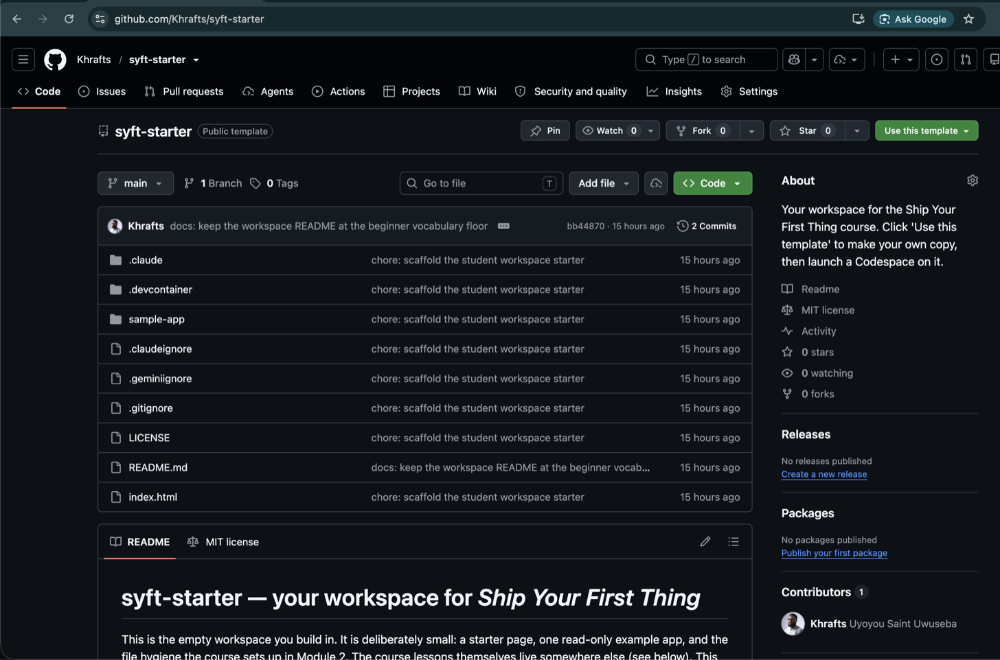
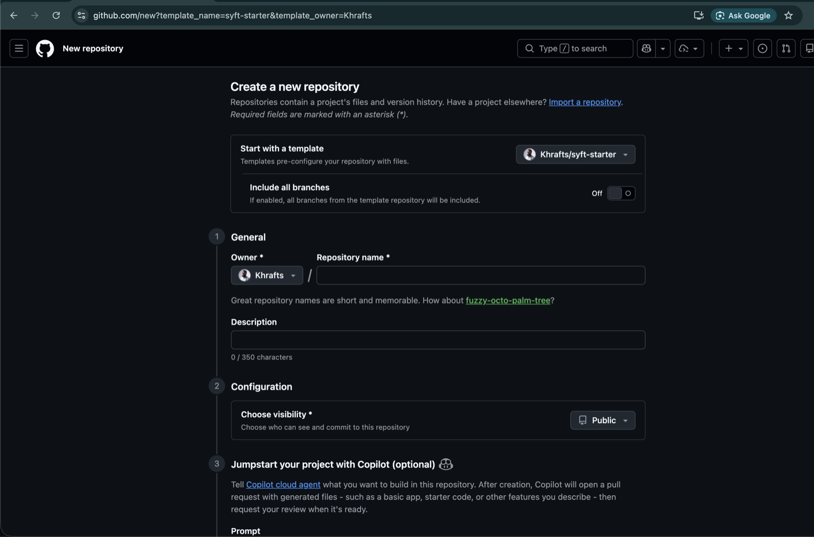
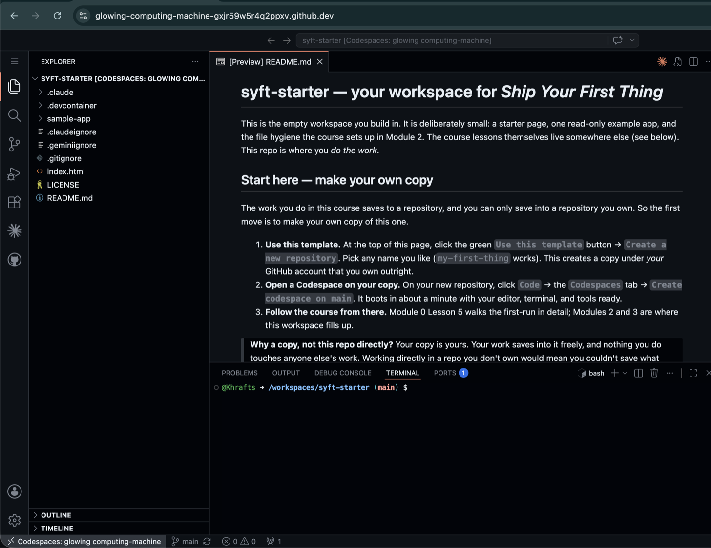

# Codespaces walkthrough

## Learning objective

By the end of this lesson, you will have made your own copy of the course workspace, opened a Codespace on it, and run a command inside it.

## Why this matters

The first time you open a Codespace, the experience is "wait, where am I?" — a code editor in a browser tab on a machine you can't see. This lesson makes that first encounter unsurprising, and it sets up the one habit everything later depends on: you work in a space that is *yours*. You'll be in and out in fifteen minutes. After that, the workspace is just a tab you reopen.

## Core read

There are two places in this course, and keeping them straight now saves confusion later.

- **The course** — the lessons you're reading right now. They live in your browser: on this page, or on the course site. You read them here; you don't edit them.
- **Your workspace** — a small, nearly-empty **repository** (a folder of files that GitHub stores for you and tracks the history of, [→ GLOSSARY](../../GLOSSARY.md#repository)) that is yours to build in. This is where you'll open a **Codespace** (a development environment GitHub runs for you on a remote machine, reached from your browser, [→ GLOSSARY](../../GLOSSARY.md#codespace)) starting in Module 2.

For Module 0 and Module 1 you don't strictly need the workspace — those modules are reading and diagramming. But setting it up now, while you have fifteen quiet minutes, means Module 2 starts with no friction.

The walkthrough below assumes you picked Codespaces in lesson 02. If you picked the local install path instead, follow [`SETUP.md` § "Local install"](../../SETUP.md) instead and skip the rest of this core read.

**Step 1 — Open the workspace starter.**
Go to **github.com/Khrafts/syft-starter** (the link is in the course README). This is the starter workspace the course provides. You won't work in it directly — you'll make your own copy in the next step.



**Step 2 — Make your own copy.**
Click the green `Use this template` button, then `Create a new repository`. Give it any name you like — `my-first-thing` is a fine choice. Leave the other options as they are and create it. GitHub makes a copy of the starter under your own account.



> **Note:** If the buttons or labels you see on GitHub don't match these exactly, open the lesson chat ("Ask about this lesson") on the course site and describe what you do see — it can help you map your screen to this step against this exact lesson.

> **Why your own copy?** The work you do in this course saves to a repository, and you can only save into a repository you own — so the copy has to be yours. Working in one you didn't own would mean you couldn't save what you make. Your copy is yours alone: nothing you do in it touches anyone else's work.

**Step 3 — Open a Codespace on your copy.**
You're now looking at your own repository (the web address shows your account name, not `Khrafts`). Click the green `Code` button. Click the `Codespaces` tab. Click `Create codespace on main`.

**Step 4 — Wait ~60–90 seconds.**
The Codespace boots. You'll see a progress indicator. The first boot is slowest; subsequent reopens are fast.

**Step 5 — The editor opens.**
You'll see a VS Code interface with your workspace's files in the left sidebar: a `README.md`, an `index.html`, a `sample-app` folder, and a few files whose names start with a dot. The editor area in the middle is empty until you open a file.



**Step 6 — Open the README.**
In the file explorer, click `README.md`. The file opens. It explains what each file in your workspace is for. You can right-click the tab and choose "Open Preview" to see the rendered version.

**Step 7 — Find the terminal (it's usually already open).**
When the Codespace finishes loading, the **terminal** (the text panel inside a code editor where you type commands and the computer types replies, [→ GLOSSARY](../../GLOSSARY.md#terminal)) is usually already open in a panel across the bottom of the editor — a dark strip with a blinking cursor. If you see it, you're set. If you don't, open one: press `` Ctrl+` `` (the backtick key, usually at the top-left of your keyboard), or use the top menu — `Terminal` → `New Terminal`. Then type:

```bash
ls
```

You should see your workspace's files listed — including `index.html` and `sample-app`.

**Step 8 — Stop the Codespace when you're done.**
Close the browser tab. The Codespace will auto-stop after 30 minutes idle. To delete the Codespace and free storage, go to [github.com/codespaces](https://github.com/codespaces) and click the trash icon. (It's safe to delete a Codespace once you've saved your work back to your repository — a habit Module 2 teaches. Until then, just close the tab.)

### Things that confuse beginners on first run

- **The course is not inside your workspace.** Your Codespace shows your own files — `index.html`, `sample-app`, the README — not the course lessons. That's expected: you read the course in your browser and build in your workspace. The two stay separate on purpose.
- **The URL you might expect from running a website on your laptop won't work directly from Codespaces.** When you run a website in Codespaces (you'll do this in Module 3), the Codespace forwards it to a Codespaces-issued URL. The terminal will tell you the right URL — click it from there. (Seeing a URL that doesn't behave the way this step describes? On the course site, open the lesson chat ("Ask about this lesson") and tell it what you see versus what this lesson says — it can help you reconcile the difference against this exact lesson. [`COMMON-ISSUES.md`](../../COMMON-ISSUES.md) is the full record if you're reading on GitHub.)
- **The Codespace may "feel slow" on first boot.** It's not your computer; it's the remote machine warming up. The first boot can take a couple of minutes. Subsequent boots are fast.
- **Saving works as expected.** `Ctrl+S` (or `Cmd+S` on Mac) saves files inside the Codespace. Saved files survive auto-stop. Files survive Codespace deletion only if you've also saved them back to your repository — that habit is taught in Module 2.

## Exercise

1. Make your own copy of the workspace per Steps 1–2, and open a Codespace on it per Step 3.
2. Open `README.md` and read what each file in your workspace is for. Then open `index.html` — it's the small page you'll build on in Module 3.
3. Open the terminal and run `ls`. Confirm you see `index.html` and `sample-app`.
4. Close the browser tab. Wait 30+ minutes. Reopen [github.com/codespaces](https://github.com/codespaces) and start the same Codespace again. Confirm your editor state is preserved.
5. In a separate browser tab, open `modules/01-mental-models/02-where-data-lives.md` in the course (on GitHub or the course site) and read the metadata at the top. That's the reading half of the course — separate from your workspace.

## Checkpoint

You've got this if you can:

- Make your own copy of the workspace and open a Codespace on it in under 2 minutes.
- Run `ls` in the integrated terminal and recognize `index.html` and `sample-app`.
- Say, in one sentence, why the workspace has to be your own copy.

## What you just did

You took your environment from "an idea that exists in a browser tab" to "a place you've actually been" — and, importantly, a place that is yours. The first time you do this is the highest-friction it'll ever be. Every subsequent time is clicking a tab and waiting about ten seconds. From here, Module 1 is pure reading and diagramming. No more setup until Module 2.

## Navigation

[← Previous: Account creation](./04-account-creation.md)
[Next: Module 1 — Mental models →](../01-mental-models/README.md)
