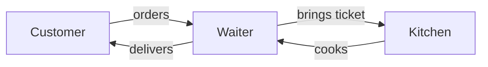
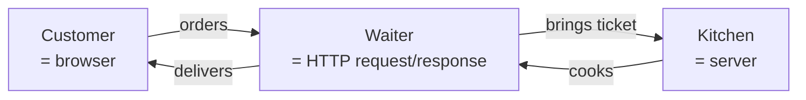
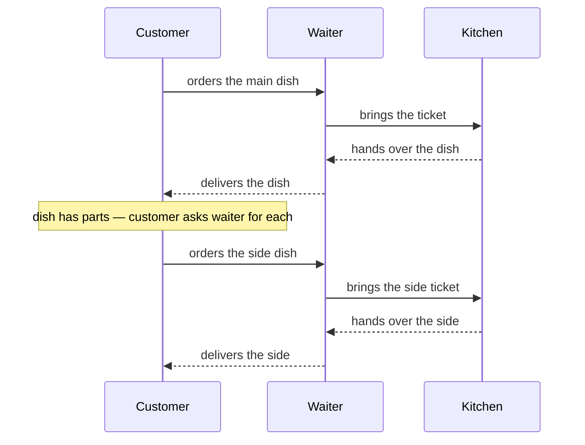
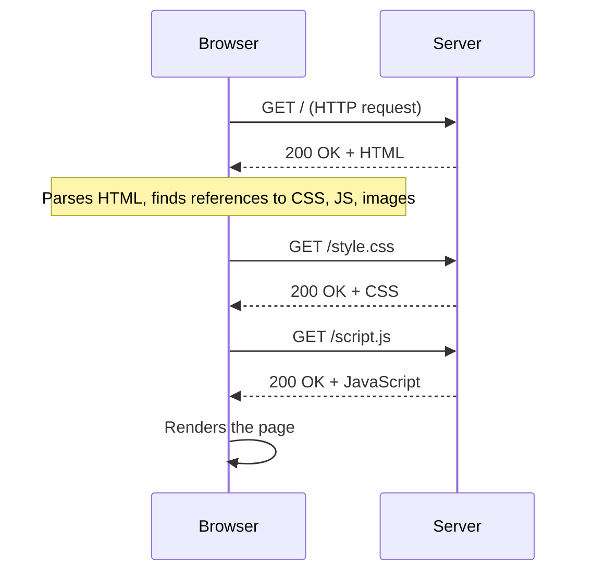

# How the web works

## Learning objective

By the end of this lesson, you will be able to describe — in plain language and on paper — what happens between the moment you type a URL into a browser and the moment a webpage appears on your screen.

## Why this matters

Every product you'll build in this course (and every web product you've ever used) is some elaboration of this single round trip: a browser asks a server for something; the server replies; the browser renders the reply. Understanding the round trip in plain language means you can reason about almost any feature, debug almost any "the page won't load" complaint, and recognize when an AI coding agent is suggesting code that breaks the round trip in a way the AI doesn't realize. This is the first of three Module 1 mental models.

## Core read

Picture a restaurant.

You're a customer. You walk in, sit down, and a waiter comes over (a person who carries orders and dishes between you and the kitchen). The waiter hands you a menu. You read it. You decide what you want. You give the waiter your order. The waiter takes a paper ticket back to the kitchen, hands it to a cook, and the cook prepares your dish. When the dish is ready, the waiter brings it to you. You eat. You never go into the kitchen.

That whole choreography — customer / waiter / kitchen — is the same shape as the web.

The customer in the analogy is your **browser** (one-line definition: a program on your computer that knows how to ask servers for webpages and render them, [→ GLOSSARY](../../GLOSSARY.md#browser)).

When you type `example.com` into the address bar and press Enter, the browser starts the round trip.

The kitchen is the **server** (one-line definition: a program running continuously on a remote computer, waiting for requests, [→ GLOSSARY](../../GLOSSARY.md#server)).

It doesn't know you. It just knows how to handle whatever ticket comes in.

The waiter is the protocol that carries messages between them: **HTTP** (one-line definition: the protocol the web uses to send requests and responses, [→ GLOSSARY](../../GLOSSARY.md#http)).

The waiter doesn't cook the food and doesn't eat the food — the waiter only carries paper between the dining room and the kitchen.

So the round trip looks like this:

Optional: same picture with the technical labels (you'll meet these properly in Module 3)

> *Peek ahead — skim, don't memorize:* The same picture with the real names labeled. You'll meet **HTTP**, **request**, **response**, **server**, and **browser** (as a *technical* role, not just "the program you use to read web pages") properly in Module 3, where you'll write your first API route by hand. If the labeled diagram feels heavy, close this and move on — the restaurant picture is the one that has to stick.

The order ticket has a specific shape. It says: "what kind of ticket is this?" and "what dish are you asking for?"

In HTTP language, "what kind" is the **HTTP method** (one-line definition: the verb on the request — `GET`, `POST`, `PUT`, `DELETE` — that says what you want to do, [→ GLOSSARY](../../GLOSSARY.md#http-method)).

And "what dish" is the **URL** (one-line definition: the address that names what you're asking for, [→ GLOSSARY](../../GLOSSARY.md#url)).

A `GET` ticket says "show me the menu" — give me what's at this address. A `POST` ticket says "place an order" — here's some new information; do something with it. A `PUT` says "change my order." A `DELETE` says "cancel it." The kitchen reads the ticket type and behaves accordingly.

When the kitchen finishes, it hands the waiter a dish along with a slip of paper. The slip says how it went: `200 OK` if everything's fine, `404 Not Found` if the dish wasn't on the menu, `500 Internal Server Error` if the kitchen caught fire.

These are **HTTP status codes** (one-line definition: a three-digit number summarizing how a request went, [→ GLOSSARY](../../GLOSSARY.md#http-status-code)).

When you load a page and see "404," you're seeing the slip from the kitchen saying "you ordered something we don't make."

What's actually on the dish? When you load `example.com`, the kitchen hands the waiter a slab of **HTML** (one-line definition: the markup language that describes the structure of a webpage, [→ GLOSSARY](../../GLOSSARY.md#html)).

HTML is just text — a tree of elements like `<h1>`, `
`, ``. Your browser reads the HTML and starts drawing the page. As it reads, it sees references to other resources — `<link rel="stylesheet" href="style.css">` says "I need this CSS file too." So the browser sends *another* request for `style.css`. And another for any images. And another for any JavaScript files. Loading one page often means a dozen round trips.

Optional: same round trip with the technical labels (Module 3 hands-on)

> *Peek ahead — skim, don't memorize:* In a real web round trip, the customer is your browser, the waiter speaks HTTP, and the kitchen is the server. The "side dishes" are the CSS, JavaScript, and image files the page references after the main HTML lands. The `GET /` shape and status codes (`200 OK`, `404 Not Found`) get hands-on coverage in Module 3 — for now, the round-trip picture is what matters.

A few things tend to confuse beginners and are worth noticing now.

**The browser is the customer.** It is *yours*. Anything the browser knows, you know. The browser cannot keep secrets *from you*; if a website ships JavaScript to your browser, you can read that JavaScript. This is the foundation of "the browser is the public internet" — a phrase you'll see often in Module 4 when env vars enter the picture.

**The server is not "the cloud."** It's a specific program running on a specific computer that some hosting company is renting to whoever paid for it. The phrase "in the cloud" mostly means "I'm renting the kitchen instead of owning it." Inside the wires, it's still a kitchen.

**The waiter speaks one language: HTTP.** Browsers do not talk database; they do not talk filesystem; they do not run server code. Every interaction between the browser and "the back end" is shaped like an HTTP request and an HTTP response. The next lesson — bundle 2 — looks at what's *inside* the kitchen, where the cooks open the filing cabinet (database) and look up cards. But the waiter never goes back there. The waiter only ever speaks HTTP.

You'll meet the term **DNS** (one-line definition: the system that translates a human-readable URL into the IP address of the actual server, [→ GLOSSARY](../../GLOSSARY.md#dns)) in passing.

When you type `example.com`, your browser doesn't know which computer to ask. DNS is the phone book it consults: "who is example.com? Tell me their IP address." Then it sends the request to that address. For everyday purposes, DNS is invisible; for "this domain isn't loading," DNS is one of the first places to look.

> **Note:** None of this lesson teaches you how to *build* a server or a webpage. Module 1 is about the shape of what the web is. Building starts in Module 2 (toolchain) and Module 3 (the AI-coding loop), and the first time you'll deploy your own page is Phase 3, Chunk 0 — "Hello-World deploy."

## Exercise

Sketch the path of one URL load. Open a piece of paper or [excalidraw.com](https://excalidraw.com). Pick a familiar URL (the home page of a news site, a tweet, anything). Draw four boxes labeled `your browser`, `DNS`, `server`, `your screen`. Then draw arrows showing what travels between them when you press Enter. Label every arrow: `URL`, `IP address`, `HTTP request`, `HTTP response`, `HTML`, `CSS`, `JS`, `rendered page`. Spend 15 minutes on it. Don't look anything up. The point is to commit your current model to paper so you can compare it to the next lesson's mental model and notice what shifted.

## Checkpoint

You've got this if you can:

1. Explain the difference between the browser and the server in one sentence each.
2. Give an example of a `GET` request and a `POST` request from any web app you've used.
3. Explain — in your own words — why a server can't "send something to your browser" without your browser asking first.

## Going deeper

Optional, only if you're curious:

- *High Performance Browser Networking* by Ilya Grigorik (free online) — chapter 1 is the gold-standard plain-English explanation of HTTP.
- The MDN docs' [overview of HTTP](https://developer.mozilla.org/en-US/docs/Web/HTTP/Overview) — concrete and short.

## Loop check

> **Loop check — intent.** Module 1 is pre-loop, but every mental model you build here changes the *intent* you'll bring to your next AI-coding session. Knowing that the browser only ever speaks HTTP changes what you'll ask the AI to build, because you now know "the front end" and "the back end" can only ever exchange HTTP-shaped messages. The loop step this lesson reinforces is **intent**: knowing what you want to happen on the wire before you ask the AI to wire it up.

## What you just did

You sketched a URL load — which is the smallest possible feature in any web app. You separated the browser from the network from the server in your head. The "intent" step of the loop, taught in Module 3, is exactly this: knowing the shape of what you want before you start asking. You've started practicing it.

## Navigation

[← Module 1 index](./README.md)
[Next: Where data lives, how programs talk →](./02-where-data-lives.md)
