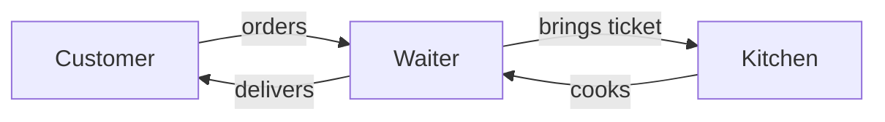
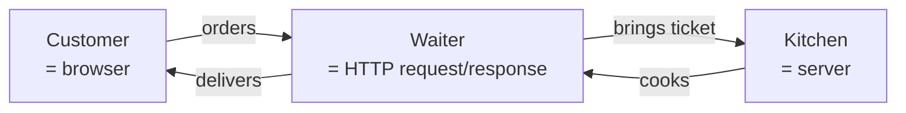
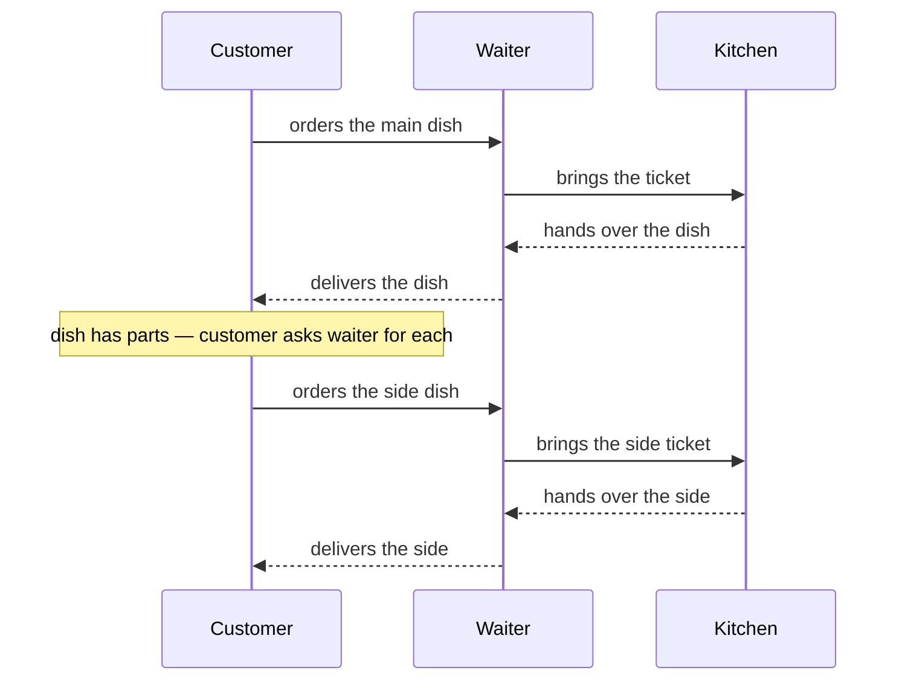
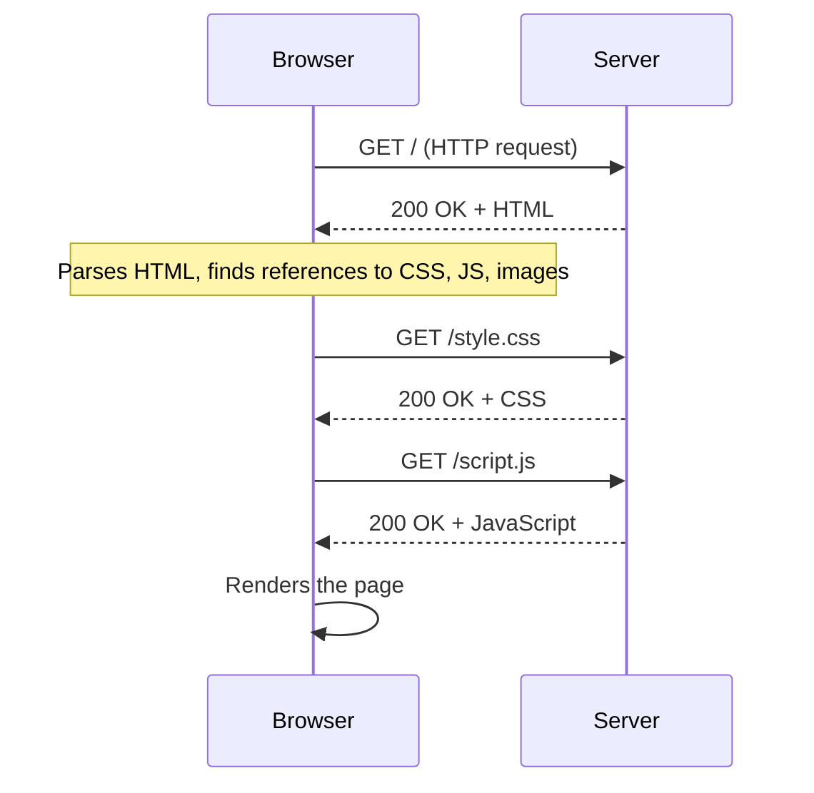

# How the web works

## Learning objective

By the end of this lesson, you will be able to describe — in plain language and on paper — what happens between typing a web address into a browser and a page appearing on your screen.

## Why this matters

Every product you'll build in this course is some elaboration of one round trip: a browser asks a server for something, the server replies, the browser shows the reply. Once you can picture that trip, you can say what you want a feature to do, and you can tell your agent "the page never loads" or "the page shows an error" with a sense of where the problem sits.

## Core read

Picture a restaurant.

You're a customer. You sit down, and a waiter hands you a menu. You decide what you want and give the waiter your order. The waiter takes a paper ticket to the kitchen, a cook prepares your dish, and the waiter brings it back. You never go into the kitchen.

That choreography — customer / waiter / kitchen — is the shape of the web.

The customer is your **browser** (a program on your computer that knows how to ask servers for pages and show them, [→ GLOSSARY](../../GLOSSARY.md#browser)). The kitchen is the **server** (a program on a remote computer, waiting for requests, [→ GLOSSARY](../../GLOSSARY.md#server)). The waiter is **HTTP** (the language the web uses to carry requests and responses between them, [→ GLOSSARY](../../GLOSSARY.md#http)). The waiter doesn't cook and doesn't eat — it only carries paper between the dining room and the kitchen.

```mermaid
flowchart LR
  Customer[Customer]
  Waiter[Waiter]
  Kitchen[Kitchen]
  Customer -->|orders| Waiter
  Waiter -->|delivers| Customer
  Waiter -->|brings ticket| Kitchen
  Kitchen -->|cooks| Waiter
```

Optional: same picture with the technical labels (names to recognize, not to learn today)

> *Peek ahead — skim, don't memorize:* The same picture with the real names: **HTTP**, **request**, **response**, **server**, **browser**. They are worth recognizing when your agent uses one in a reply — this course never asks you to write one. If the labeled diagram feels heavy, close this and move on — the restaurant picture is the one that has to stick.

```mermaid
flowchart LR
  Customer["Customer<br/>= browser"]
  Waiter["Waiter<br/>= HTTP request/response"]
  Kitchen["Kitchen<br/>= server"]
  Customer -->|orders| Waiter
  Waiter -->|delivers| Customer
  Waiter -->|brings ticket| Kitchen
  Kitchen -->|cooks| Waiter
```

The order ticket is a **request** ("give me the page at this address", [→ GLOSSARY](../../GLOSSARY.md#request)). What comes back is the **response** (the server's reply, [→ GLOSSARY](../../GLOSSARY.md#response)): the dish, plus a slip saying how it went. The slip is an **HTTP status code** (a three-digit number, [→ GLOSSARY](../../GLOSSARY.md#http-status-code)). When a page shows you "404", you're reading the slip: "you ordered something we don't make." A "500" means the kitchen caught fire.

What's on the dish is **HTML** (the text that describes the structure of a page, [→ GLOSSARY](../../GLOSSARY.md#html)). It usually points at other files the page needs — the styling, the pictures — and the browser fetches each of those with a fresh trip to the kitchen. Loading one page often means a dozen round trips.

```mermaid
sequenceDiagram
  participant Customer
  participant Waiter
  participant Kitchen
  Customer->>Waiter: orders the main dish
  Waiter->>Kitchen: brings the ticket
  Kitchen-->>Waiter: hands over the dish
  Waiter-->>Customer: delivers the dish
  Note over Customer: dish has parts — customer asks waiter for each
  Customer->>Waiter: orders the side dish
  Waiter->>Kitchen: brings the side ticket
  Kitchen-->>Waiter: hands over the side
  Waiter-->>Customer: delivers the side
```

Optional: same round trip with the technical labels (names to recognize, not to learn today)

> *Peek ahead — skim, don't memorize:* In a real round trip, the customer is your browser, the waiter speaks HTTP, and the kitchen is the server. The "side dishes" are the styling, script, and image files the page references after the main HTML lands. The `GET /` shape and status codes (`200 OK`, `404 Not Found`) are worth recognizing for the day a page shows you one or your agent mentions one.

```mermaid
sequenceDiagram
  participant Browser
  participant Server
  Browser->>Server: GET / (HTTP request)
  Server-->>Browser: 200 OK + HTML
  Note over Browser: Parses HTML, finds references to CSS, JS, images
  Browser->>Server: GET /style.css
  Server-->>Browser: 200 OK + CSS
  Browser->>Server: GET /script.js
  Server-->>Browser: 200 OK + JavaScript
  Browser->>Browser: Renders the page
```

Two things worth noticing now.

**The server is not "the cloud."** It's a specific program on a specific computer that a hosting company rents to whoever paid for it. "In the cloud" mostly means "I'm renting the kitchen instead of owning it."

**The waiter only carries tickets.** The browser never reaches into the kitchen.

## Exercise

Sketch one page load. On paper or at [excalidraw.com](https://excalidraw.com), pick a familiar web address and draw three boxes: `your browser`, `server`, `your screen`. Draw the arrows showing what travels between them when you press Enter, and label each arrow: `web address`, `request`, `response`, `page`. Spend 10 minutes. Don't look anything up — the point is to put your current picture on paper.

## Checkpoint

You've got this if you can:

1. Explain the difference between the browser and the server in one sentence each.
2. Say, in your own words, why a server can't send something to your browser without your browser asking first.

## Going deeper

Optional, only if you're curious:

- *High Performance Browser Networking* by Ilya Grigorik (free online) — chapter 1 is a plain-English explanation of HTTP.
- The MDN docs' [overview of HTTP](https://developer.mozilla.org/en-US/docs/Web/HTTP/Overview) — concrete and short.

## What you just did

You sketched a page load and separated the browser from the server in your head. One question is left open — once the kitchen gets the ticket, where does the answer come from? — and the next lesson answers it.

## Navigation

[← Module 1 index](./README.md)
[Next: Where data lives, how programs talk →](./02-where-data-lives.md)
