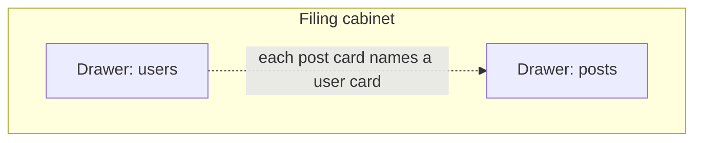
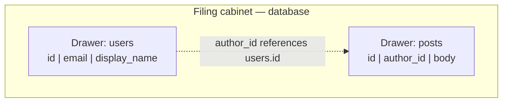
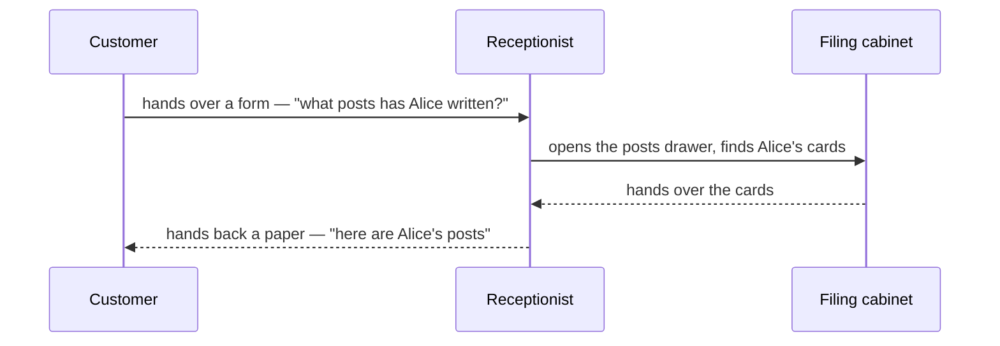
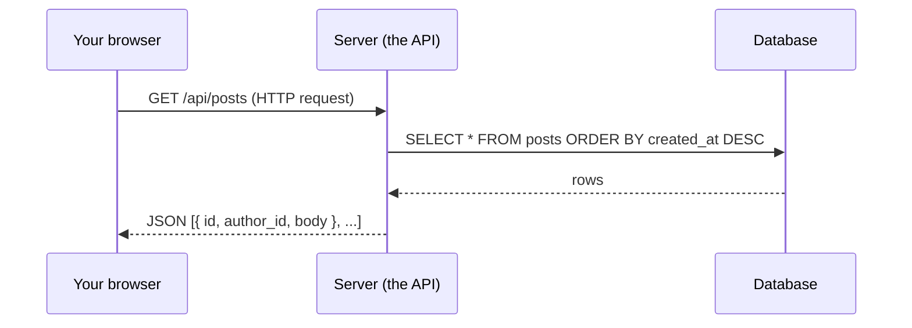

# Where data lives, how programs talk

## Learning objective

By the end of this lesson, you will be able to describe — in plain language and on paper — where the data in a web app actually lives, and how a program on one machine asks a program on another machine for a piece of that data.

## Why this matters

Every product you'll ever build moves data between three places: a person's screen, a server somewhere, and a database. If you can sketch which piece sits where and how the pieces ask each other for things, you can reason about almost any feature in almost any web app — including the bugs the AI will produce when it gets the answer wrong. This is the second of three mental models in Module 1; the first taught you what the *web* is, and the third will tell you how *who can do what* gets enforced.

## Core read

Imagine a small office.

In the back, there's a metal **filing cabinet** (a one-line definition: a database, [→ GLOSSARY](../../GLOSSARY.md#database)). It has labeled drawers. One drawer is `users`, another is `posts`, another is `comments`. Inside each drawer are **index cards** (a one-line definition: a row, [→ GLOSSARY](../../GLOSSARY.md#row)). Every card in the `users` drawer has the same fixed set of fields: `id`, `email`, `display_name`, `created_at`. Cards in the `posts` drawer have different fields: `id`, `author_id`, `body`, `created_at`.

The cabinet doesn't know who needs the cards. It just stores them. Anyone with a key can pull a drawer open, take a card out, write on it, file it back. Without rules about who can open which drawer, the cabinet is useless for an app where different people are supposed to see different things.

Now picture the rest of the office.

There are clerks at desks (**servers**, one-line definition: programs that run continuously waiting for requests, [→ GLOSSARY](../../GLOSSARY.md#server)). When someone outside the office wants information — say, a customer who walks up to the front desk and asks "what posts has Alice written?" — the receptionist takes the question, walks back to the clerk, and the clerk goes to the filing cabinet, opens the `posts` drawer, finds every card where `author_id` equals Alice's id, copies the relevant fields onto a piece of paper, and hands it back to the receptionist, who hands it to the customer.

The customer never touches the cabinet. The customer never even sees it. They just hand over a piece of paper with a question on it and get back a piece of paper with the answer.

The "piece of paper with a question" is a **request** (one-line definition: a structured message asking a server for something, [→ GLOSSARY](../../GLOSSARY.md#request)).

The "piece of paper with the answer" is a **response** (one-line definition: a structured message replying to a request, [→ GLOSSARY](../../GLOSSARY.md#response)).

Together, the question-and-answer pattern is **HTTP** (one-line definition: the protocol the web uses to send requests and responses, [→ GLOSSARY](../../GLOSSARY.md#http)).

The way one program inside the office talks to another program — the receptionist talking to the clerk, or the clerk talking to a different clerk in another office — is also done by passing pieces of paper around. When two programs agree on what kinds of paper they'll accept and what they'll write back, that agreement is called an **API** (one-line definition: the contract between two programs about which questions can be asked and how the answers will look, [→ GLOSSARY](../../GLOSSARY.md#api)).

So the office has three layers:

1. The **filing cabinet** — the database — stores the cards.
2. The **clerks** — the servers — open the cabinet on behalf of whoever asks.
3. The **paperwork** — the API — is the system of forms used to ask and answer.

Here's the filing cabinet up close:

Optional: same filing cabinet with the technical labels (Module 3 hands-on)

> *Peek ahead — skim, don't memorize:* Each drawer is a **table**; each card is a **row**; the dotted line is a **foreign key**. The labels on every card (`id`, `email`, `display_name`) are the **schema** — the printed template at the top of every card in a drawer. These names land hands-on in Module 3 when you write your first queries. The filing-cabinet picture is the load-bearing one — the labels are scaffolding you'll reuse later, not vocabulary to memorize today.

Notice the dotted line from `posts` back to `users`. That's a **foreign key** (one-line definition: a field in one row that points at the id of a row in another drawer, [→ GLOSSARY](../../GLOSSARY.md#foreign-key)). The `posts` drawer doesn't store the author's display name — it stores the author's `id`, and to find the display name, you walk over to the `users` drawer and look up the row with that id. This is what relational databases mean by "relational": rows in one drawer reference rows in another, and the database knows how to join them.

And here's the question-and-answer pattern up close, from your browser's perspective:

Optional: same question-and-answer with the technical labels (Module 3 hands-on)

> *Peek ahead — skim, don't memorize:* In a real web app, the customer is your browser, the receptionist is the server (the **API**), and the filing cabinet is the **database**. The form the customer hands over is an **HTTP request**; the language the receptionist uses to talk to the cabinet is **SQL**. All four — API, HTTP request, SQL, database — get hands-on coverage in Module 3. The receptionist-and-form picture is what carries the concept.

The browser never speaks SQL. The browser only ever speaks **HTTP** — it sends a request to a URL, and gets back a response. The server is the thing that knows how to translate the browser's HTTP request into a database query, and the database's response back into an HTTP response.

Two things tend to confuse beginners here, and both are worth noticing now:

**First, the database is not "in the cloud" in any meaningful way.** It runs on a specific machine — usually a server you're paying a hosting company to run for you. The phrase "cloud database" mostly means "a database I'm not babysitting myself." Inside the wires, it's still a program running on a computer somewhere, with drawers and cards.

**Second, the API is just a list of paper-form templates.** When someone says "the API supports `GET /api/posts` and `POST /api/posts`," they mean: there are two paper forms the receptionist accepts. One says "show me the posts." The other says "here's a new post; please file it." The list of forms is finite, written down, and (in a good app) documented. There's no magic.

You'll meet two more terms in Module 3 and beyond.

A **schema** (one-line definition: the fixed shape of fields in a table, [→ GLOSSARY](../../GLOSSARY.md#schema)) is the printed template at the top of every card in a drawer.

A **query** (one-line definition: a written question asking the database for specific cards, [→ GLOSSARY](../../GLOSSARY.md#query)) is what the clerk writes when talking to the cabinet.

The language the clerk uses for those queries is usually **SQL** (one-line definition: the standard query language for relational databases, [→ GLOSSARY](../../GLOSSARY.md#sql)). You don't need to write SQL yet; you'll see your AI agent write it, and Module 3.5 will teach you to read enough of it to know when it's wrong.

> **Note:** None of this lesson teaches you how to build any of these things. Module 1 is about the *shape* of a software product. Building starts in Module 2 (toolchain) and Module 3 (the AI-coding loop), and the first time you'll write code that opens a real database is Phase 3, Chunk 1.

## Exercise

Sketch the path of one click. Pick a familiar app — Twitter, Threads, a recipe site — and pick one specific moment, like "I clicked Save on a new post." On a piece of paper or at [excalidraw.com](https://excalidraw.com), draw three boxes labeled `browser`, `server`, `database`. Then draw the arrows showing what travels between them when the click happens. Label every arrow with what it carries: a request? a row? a response? Spend 15 minutes on it. Don't look anything up. The point is to commit your current model to paper so you can compare it to the next lesson's mental model and notice what shifted.

## Checkpoint

You've got this if you can do both:

1. Point at any feature in any app you've used and explain — in one sentence — which of the three layers (browser, server, database) is doing the work.
2. Explain the difference between a **request** and a **query** without reading this lesson again.

## Going deeper

Optional, only if you're curious:

- *Designing Data-Intensive Applications* by Martin Kleppmann — chapters 1 and 2 are the gold-standard plain-English explanation of why databases are shaped the way they are.
- The PostgreSQL docs' [tutorial chapter on tables](https://www.postgresql.org/docs/current/tutorial-table.html) — concrete and short.

## Loop check

> **Loop check — intent.** Module 1 is pre-loop, but every mental model you build here changes the *intent* you'll bring to your next AI-coding session. Knowing that data lives in a database — separate from the server and far separate from the browser — changes what you'll ask the AI to build, because you now know there are three places where the answer might live or where the bug might hide.

## What you just did

You sketched the data path of one click — which is a tiny version of what designers do at the start of every feature. You separated the browser from the server from the database in your head, and that separation is the same separation an AI coding agent will assume when you ask it to build something. The "intent" step of the loop, taught in Module 3, is exactly this: knowing the shape of what you want before you start asking. You've started practicing it.

## Navigation

[← Previous: How the web works](./01-how-the-web-works.md)
[Next: Who can do what →](./03-who-can-do-what.md)
