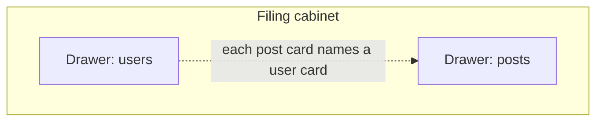
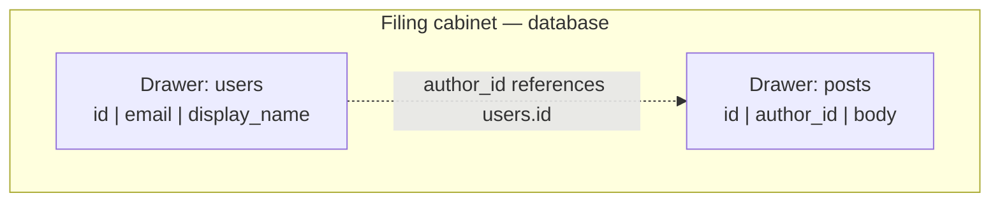
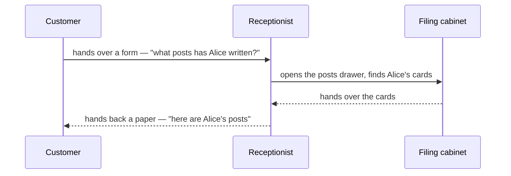
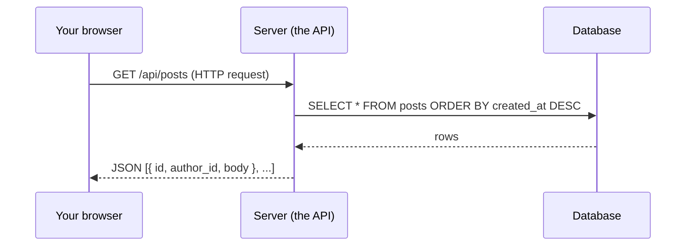

# Where data lives, how programs talk

## Learning objective

By the end of this lesson, you will be able to describe — in plain language and on paper — where the information in a web app is kept, and how the part you see asks for a piece of it.

## Why this matters

Every product you build moves information between three places: a person's screen, a server, and the place the information is filed. If you can say which of the three a feature lives in, you can describe what you want ("keep each person's posts", "show me only mine") and you can tell your agent where something looks wrong when the answer that comes back is off.

## Core read

Imagine a small office.

In the back, there's a metal **filing cabinet** — the **database** (where an app's information is stored, [→ GLOSSARY](../../GLOSSARY.md#database)). It has labeled drawers: one for `users`, one for `posts`, one for `comments`. Inside each drawer are index cards; each card is a **row** (one record — one user, one post, [→ GLOSSARY](../../GLOSSARY.md#row)). Every card in a drawer has the same printed fields — a user card has an id, an email, a display name.

The cabinet doesn't know who needs the cards. It just stores them.

Now the rest of the office. Clerks sit at desks — each clerk is a **server** (a program waiting for requests, [→ GLOSSARY](../../GLOSSARY.md#server)). A customer walks up to the front desk and asks, "what posts has Alice written?" The receptionist takes the question to a clerk; the clerk opens the `posts` drawer, finds every card that names Alice, copies the relevant fields onto a piece of paper, and hands it back. The customer never touches the cabinet.

The paper with the question is a **request** ([→ GLOSSARY](../../GLOSSARY.md#request)); the paper with the answer is a **response** ([→ GLOSSARY](../../GLOSSARY.md#response)); carrying them back and forth is **HTTP** ([→ GLOSSARY](../../GLOSSARY.md#http)) — the waiter from the last lesson.

The set of forms the receptionist accepts — "show me the posts", "here's a new post, please file it" — is the **API** (the agreed list of questions one program will answer for another, [→ GLOSSARY](../../GLOSSARY.md#api)). It's finite and written down.

So the office has three layers: the cabinet stores the cards, the clerks open it on behalf of whoever asks, and the forms are how you ask.

```mermaid
flowchart TB
  subgraph Cabinet[Filing cabinet]
    direction LR
    UsersDrawer["Drawer: users"]
    PostsDrawer["Drawer: posts"]
    UsersDrawer -.->|each post card names a user card| PostsDrawer
  end
```

Optional: same filing cabinet with the technical labels (Module 4 hands-on)

> *Peek ahead — skim, don't memorize:* Each drawer is a **table**; each card is a **row**. **Table** and **row** return in Module 4, where your agent builds the thread project on a real database and you check that it behaves. The filing-cabinet picture is the one to hold onto.

```mermaid
flowchart TB
  subgraph DB[Filing cabinet — database]
    direction LR
    Users["Drawer: users<br/>id | email | display_name"]
    Posts["Drawer: posts<br/>id | author_id | body"]
    Users -.->|author_id references users.id| Posts
  end
```

Notice the dotted line. A post card doesn't carry the author's name — it carries the author's id, and one drawer's cards remember other drawers' cards by their id. That's how "Alice's posts" can be found, and why deleting Alice's card can leave her posts pointing at nobody — something you'll check in the running app later, not fix by hand.

Here's the question-and-answer up close:

```mermaid
sequenceDiagram
  participant Customer as Customer
  participant Receptionist as Receptionist
  participant Cabinet as Filing cabinet
  Customer->>Receptionist: hands over a form — "what posts has Alice written?"
  Receptionist->>Cabinet: opens the posts drawer, finds Alice's cards
  Cabinet-->>Receptionist: hands over the cards
  Receptionist-->>Customer: hands back a paper — "here are Alice's posts"
```

Optional: same question-and-answer with the technical labels (Module 4 hands-on)

> *Peek ahead — skim, don't memorize:* In a real app, the customer is your browser, the receptionist is the server (the **API**), and the filing cabinet is the **database**. The form the customer hands over is an **HTTP request**; the language the receptionist uses to talk to the cabinet is **SQL**. Your agent writes both; you never do.

```mermaid
sequenceDiagram
  participant Browser as Your browser
  participant Server as Server (the API)
  participant DB as Database
  Browser->>Server: GET /api/posts (HTTP request)
  Server->>DB: SELECT * FROM posts ORDER BY created_at DESC
  DB-->>Server: rows
  Server-->>Browser: JSON [{ id, author_id, body }, ...]
```

The browser never opens the cabinet. It only hands forms to the receptionist. The server is the thing that turns a form into a question for the cabinet — written in **SQL** (the language servers use to ask a database for cards, [→ GLOSSARY](../../GLOSSARY.md#sql)) — and turns the cards into an answer. Your agent writes the SQL; you'll hear the word when it does.

One thing worth noticing now: **the database is not "in the cloud" in any meaningful way.** It runs on a specific computer that a hosting company runs for you. Inside the wires, it's still a cabinet with drawers and cards.

## Exercise

Sketch one click. Pick a familiar app and one moment in it — "I pressed Save on a new post." On paper or at [excalidraw.com](https://excalidraw.com), draw three boxes: `browser`, `server`, `database`. Draw the arrows showing what travels between them when the click happens, and label each arrow with what it carries: a request? a card? a response? Spend 10 minutes. Don't look anything up.

## Checkpoint

You've got this if you can:

1. Point at any feature in an app you use and say, in one sentence, which of the three layers (browser, server, database) does the work.
2. Say what the filing cabinet keeps that the screen doesn't.

## Going deeper

Optional, only if you're curious:

- *Designing Data-Intensive Applications* by Martin Kleppmann — chapters 1 and 2 explain, in plain English, why databases are shaped the way they are.
- The PostgreSQL docs' [tutorial chapter on tables](https://www.postgresql.org/docs/current/tutorial-table.html) — concrete and short.

## What you just did

You sketched the path of one click and separated the browser from the server from the database in your head. Anyone can walk up to the front desk and ask, though — who's actually allowed to is the next lesson.

## Navigation

[← Previous: How the web works](./01-how-the-web-works.md)
[Next: Who can do what →](./03-who-can-do-what.md)
