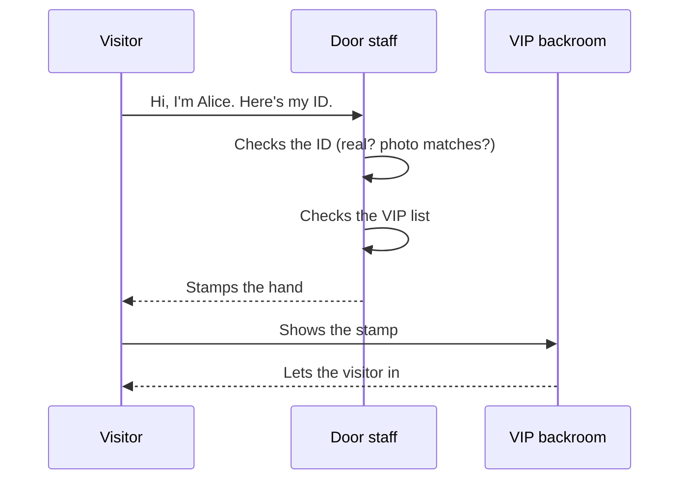
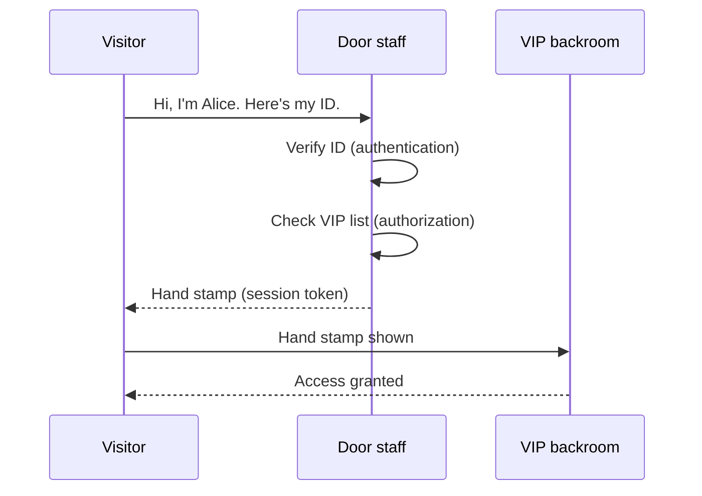

# Who can do what

## Learning objective

By the end of this lesson, you will be able to describe — in plain language and on paper — how a web app decides whether you're allowed to do something, and what mechanism keeps you signed in once it's decided you're you.

## Why this matters

The first two Module 1 lessons covered the *shape* of a web app: how a browser talks to a server (bundle 1), and how a server talks to a database (bundle 2). This third lesson covers the question every real product has to answer next: who's allowed to do what? It's a question that becomes easy to reason about once you have the right analogy. It's also where AI coding agents go subtly wrong — the difference between "I'm signed in" and "I'm allowed to do this thing" is the most common security bug in self-built software, and the watch-it-fail walkthroughs in Module 5 will live partly here.

## Core read

Picture the busy door of a private club.

There's a door. There's a person at the door — call them the door staff. There's a list at the door. Inside the club, there's a separate VIP room with a velvet rope. There's also a hand stamp at the entrance.

When you walk up, the door staff first asks: "are you who you say you are?" You hand over your ID. They look at it; they decide whether the ID is real and whether the photo matches.

That's **authentication** (one-line definition: confirming you are who you claim to be, [→ GLOSSARY](../../GLOSSARY.md#authentication)) — sometimes shortened to "authn." It's a question about *identity*.

The door staff then asks: "are you on the list?" They look at the VIP list (which is a different list from the door's general entry list). The list says who can go into the VIP room.

That's **authorization** (one-line definition: deciding what you're allowed to do once you're identified, [→ GLOSSARY](../../GLOSSARY.md#authorization)) — sometimes shortened to "authz." It's a question about *permissions*.

These are two different questions. The door staff might let you in the door (authn passes — your ID is real) but turn you away at the velvet rope (authz fails — you're not on the VIP list). Confusing the two is the most common security bug in real software: "I logged in" is not the same as "I'm allowed to do this thing I'm trying to do."

Then the door staff stamps your hand. The stamp lets you go to the bathroom and come back without re-checking your ID every time.

That's a **session** (one-line definition: a remembered "yes, you're you" so the app doesn't re-check on every request, [→ GLOSSARY](../../GLOSSARY.md#session)).

The thing physically representing the session is usually a **session token** (one-line definition: a string the browser sends with each request to prove "I'm the same person who just authenticated," [→ GLOSSARY](../../GLOSSARY.md#session-token)) — often delivered as a **cookie** (one-line definition: a small piece of data the browser stores and re-sends to the same site, [→ GLOSSARY](../../GLOSSARY.md#cookie)) the server set during sign-in.

Optional: same door staff with the technical labels (Module 4 hands-on)

> *Peek ahead — skim, don't memorize:* Checking the ID is **authentication**. Checking the VIP list is **authorization**. The hand stamp is a **session token** — usually carried by the browser as a **cookie** the server set during sign-in. These four names get hands-on treatment in Module 4, where you add sign-in and per-row access rules to your project. "Door staff at the entrance + VIP list at each table + hand stamp on your hand" is enough today.

In this course, the thread project (Phase 3) uses a sign-in flow that emails you a clickable link — no passwords. The mechanism is named and built in Phase 3; for now, just know that "sign-in" can mean "prove you can read mail at this address." From the analogy: instead of an ID card, the door staff has access to your mailbox; if you can prove you can read mail at `alice@example.com`, you're Alice. It's not perfect (mailbox compromise = identity compromise) but it's simple and learnable.

A few things confuse beginners here, and naming them now saves you debugging time later.

**Authentication doesn't replace authorization.** "I logged in" doesn't mean "I'm allowed to do this." Real apps check both, every time. The most common security bug in self-built apps is forgetting that authn ≠ authz — the app trusts that any signed-in user can do anything.

**Sessions can be stolen.** If someone gets your hand stamp (your session cookie), they can walk back into the club as you. The mitigation is `httpOnly` and `Secure` flags on cookies, short session lifetimes, and re-authentication on sensitive operations. Phase 3 covers the practical defaults; for now, just know that "logged in" is a state that needs guarding, not a property that's automatic.

**The "VIP list" lives in the database.** When the door staff checks the list, they're really asking the filing cabinet from bundle 2. Permission rules in real apps are enforced both at the server (the clerk) and at the database (the cabinet itself, via per-row rules). Phase 4 builds that double-check explicitly.

> **Note:** Module 1 keeps auth at the mental-model layer. The actual code — the sign-in mechanism, the per-request permission checks, the database policies that enforce who-owns-what — lands in Phase 3 Chunk 1 (Auth) and Phase 4. Per Phase 1 D-08, this lesson explicitly does **not** teach you how to write auth code.

## Exercise

Sketch the sign-in flow. Plan 15 minutes.

Pick an app you use that signs you in (Twitter, your email provider, anything). On paper or [excalidraw.com](https://excalidraw.com), draw the steps from "click sign in" to "I see my home feed." Label the steps that are about *identity* (authn) versus *permissions* (authz). Add a step where the session token gets minted and stored. Don't look anything up. The point is to commit your current model to paper.

## Checkpoint

You've got this if you can:

1. Explain the difference between authentication and authorization in two sentences without re-reading this lesson.
2. Name what a session token is, where it lives, and what happens if someone else gets it.

## Going deeper

Optional, only if you're curious:

- The OWASP [Authentication Cheat Sheet](https://cheatsheetseries.owasp.org/cheatsheets/Authentication_Cheat_Sheet.html) — short, dense, the canonical "what real auth defaults look like."

## Loop check

> **Loop check — intent.** Module 1 is pre-loop, but every mental model you build here changes the *intent* you'll bring to your next AI-coding session. Knowing that authentication and authorization are separate questions changes what you'll ask the AI to build — and changes which kind of answer you'll accept. The loop step this lesson reinforces is **intent**: knowing what you want the system to enforce before you ask the AI to enforce it.

## What you just did

You sketched a sign-in flow — the gate every real product has, no matter how big or small. You separated identity from permissions in your head, and that separation is the same separation an AI coding agent will assume when you ask it to build sign-in. The "intent" step of the loop, taught in Module 3, is exactly this: knowing the shape of what you want the system to enforce before you start asking. You've now practiced it three times.

## Navigation

[← Previous: Where data lives, how programs talk](./02-where-data-lives.md)
[Next: How it goes live →](./04-how-it-goes-live.md)
