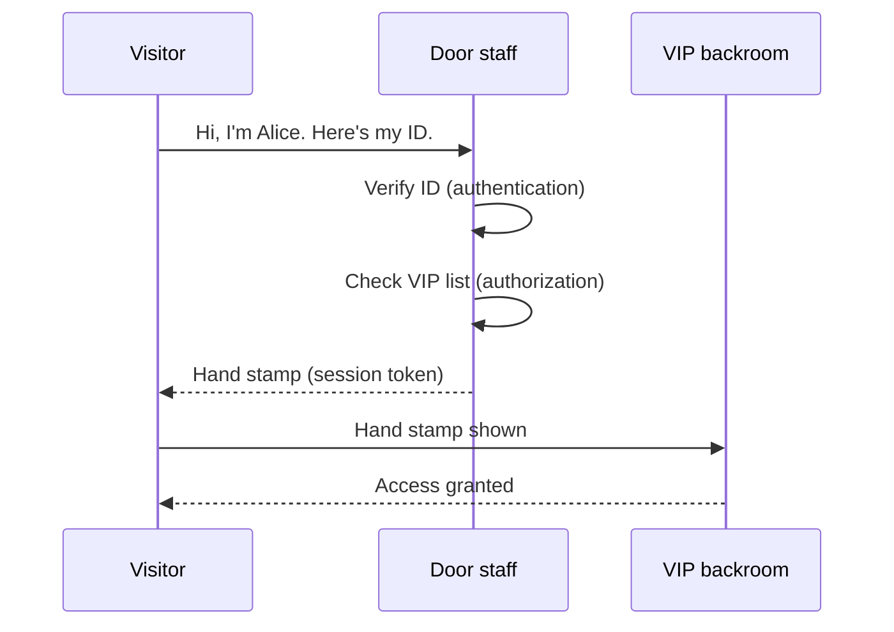
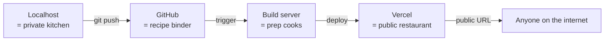

# Who can do what, how it goes live

## Learning objective

By the end of this lesson, you will be able to describe — in plain language and on paper — how a web app decides whether you're allowed to do something, and how the same app moves from running on a developer's laptop to being available at a public URL anyone on the internet can visit.

## Why this matters

The first two Module 1 lessons covered the *shape* of a web app: how a browser talks to a server (bundle 1), and how a server talks to a database (bundle 2). This third lesson covers two questions every real product has to answer: who's allowed to do what, and how does the app stop being a private thing on someone's laptop and become a public thing on the internet? Both questions get easy to reason about once you have the right analogies. Both questions are where AI coding agents go subtly wrong — and where the watch-it-fail walkthroughs in Module 5 will live.

## Core read

Picture a private club on opening night.

There's a door. There's a person at the door — call them the door staff. There's a list at the door. Inside the club, there's a separate VIP room with a velvet rope. There's also a hand stamp at the entrance.

When you walk up, the door staff first asks: "are you who you say you are?" You hand over your ID. They look at it; they decide whether the ID is real and whether the photo matches.

That's **authentication** (one-line definition: confirming you are who you claim to be, [→ GLOSSARY](GLOSSARY.md#authentication)) — sometimes shortened to "authn." It's a question about *identity*.

The door staff then asks: "are you on the list?" They look at the VIP list (which is a different list from the door's general entry list). The list says who can go into the VIP room.

That's **authorization** (one-line definition: deciding what you're allowed to do once you're identified, [→ GLOSSARY](GLOSSARY.md#authorization)) — sometimes shortened to "authz." It's a question about *permissions*.

These are two different questions. The door staff might let you in the door (authn passes — your ID is real) but turn you away at the velvet rope (authz fails — you're not on the VIP list). Confusing the two is the most common security bug in real software: "I logged in" is not the same as "I'm allowed to do this thing I'm trying to do."

Then the door staff stamps your hand. The stamp lets you go to the bathroom and come back without re-checking your ID every time.

That's a **session** (one-line definition: a remembered "yes, you're you" so the app doesn't re-check on every request, [→ GLOSSARY](GLOSSARY.md#session)).

The thing physically representing the session is usually a **session token** (one-line definition: a string the browser sends with each request to prove "I'm the same person who just authenticated," [→ GLOSSARY](GLOSSARY.md#session-token)) — often delivered as a **cookie** (one-line definition: a small piece of data the browser stores and re-sends to the same site, [→ GLOSSARY](GLOSSARY.md#cookie)) the server set during sign-in.

In this course, the thread project (Phase 3) uses email + magic link sign-in. You type your email, the server emails you a link, you click it, you're signed in. From the analogy: instead of an ID card, the door staff has access to your mailbox; if you can prove you can read mail at `alice@example.com`, you're Alice. It's not perfect (mailbox compromise = identity compromise) but it's simple and learnable.

> **Note:** Module 1 keeps auth at the mental-model layer. The actual code — magic links, JWTs, RLS policies — lands in Phase 3 Chunk 1 (Auth) and Phase 4. Per Phase 1 D-08, this lesson explicitly does **not** teach you how to write auth code.

Now: how does the club open in the first place?

Until now, your "club" is a private kitchen. The cook is testing recipes; the waiter is practicing carrying plates. Nobody from the public is inside. In web terms: the app is running on a developer's laptop, at `localhost`.

**Localhost** (one-line definition: a URL that means "this same computer," not the public internet, [→ GLOSSARY](GLOSSARY.md#localhost)) is the private kitchen.

Opening night is **deployment** (one-line definition: the act of moving an app from the developer's laptop to a public server so anyone on the internet can reach it, [→ GLOSSARY](GLOSSARY.md#deployment)).

The plumbing of opening night looks like this:

The recipes get committed to **git** (one-line definition: a tool that tracks every version of every file in a project, [→ GLOSSARY](GLOSSARY.md#git)) and pushed to **GitHub** (one-line definition: a website that hosts git repositories, [→ GLOSSARY](GLOSSARY.md#github)) — that's the recipe binder, kept somewhere safe.

Then **Vercel** (one-line definition: a service that runs your code on the public internet, [→ GLOSSARY](GLOSSARY.md#vercel)) watches the recipe binder. When new recipes land, Vercel's prep cooks (build servers) read the new version, get the kitchen ready, and flip the sign on the door from "Closed" to "Open."

That whole pipeline is **CI/CD** (one-line definition: continuous integration / continuous deployment — the automated path from "I committed code" to "it's live on the internet," [→ GLOSSARY](GLOSSARY.md#ci-cd)).

For your thread project in Phase 3, every `git push` to the main branch will go through this pipeline automatically.

A few things confuse beginners here, and naming them now saves you debugging time later.

**Localhost is invisible to the internet.** When you run `npm run dev` and open `localhost:3000`, only your laptop can see that page. Showing it to a friend means deploying it. This sounds obvious until you spend an hour wondering why your friend can't see your localhost URL.

**Authentication doesn't replace authorization.** "I logged in" doesn't mean "I'm allowed to do this." Real apps check both, every time. The most common security bug in self-built apps is forgetting that authn ≠ authz — the app trusts that any signed-in user can do anything.

**Sessions can be stolen.** If someone gets your hand stamp (your session cookie), they can walk back into the club as you. The mitigation is `httpOnly` and `Secure` flags on cookies, short session lifetimes, and re-authentication on sensitive operations. Phase 3 covers the practical defaults; for now, just know that "logged in" is a state that needs guarding, not a property that's automatic.

**Deployment is not magic.** Vercel deploys are fast (often under 60 seconds) but they are real builds happening in real machines. When something works locally and breaks on Vercel, it's almost always a missing environment variable, a different Node version, or a file that wasn't committed to git. Module 5 of this course covers the deploy-debugging mental model in depth; for now, just know that "it works on my machine" is a category of bug that doesn't go away with deployment, only changes shape.

## Exercise

Two short sketches. Plan 15–20 minutes total.

**Sketch 1 — sign-in flow.** Pick an app you use that signs you in (Twitter, your email provider, anything). On paper or [excalidraw.com](https://excalidraw.com), draw the steps from "click sign in" to "I see my home feed." Label the steps that are about *identity* (authn) versus *permissions* (authz). Add a step where the session token gets minted and stored.

**Sketch 2 — code's path from your laptop to the public internet.** Draw four boxes: `your laptop`, `git push`, `GitHub`, `Vercel`. Label the arrows: what travels between each pair? Then add the public URL on the far right.

Don't look anything up. The point is to commit your current model to paper.

## Checkpoint

You've got this if you can:

1. Explain the difference between authentication and authorization in two sentences without re-reading this lesson.
2. Name what a session token is, where it lives, and what happens if someone else gets it.
3. Describe in one sentence why "it works on my localhost" doesn't mean "it works in production."

## Going deeper

Optional, only if you're curious:

- The OWASP [Authentication Cheat Sheet](https://cheatsheetseries.owasp.org/cheatsheets/Authentication_Cheat_Sheet.html) — short, dense, the canonical "what real auth defaults look like."
- Vercel's [docs on deploying a Next.js app](https://vercel.com/docs/frameworks/nextjs) — concrete and current.

## Loop check

> **Loop check — intent.** Module 1 is pre-loop, but every mental model you build here changes the *intent* you'll bring to your next AI-coding session. Knowing that authentication and authorization are separate questions changes what you'll ask the AI to build — and changes which kind of answer you'll accept. The loop step this lesson reinforces is **intent**: knowing what you want the system to enforce before you ask the AI to enforce it.

## What you just did

You sketched a sign-in flow and a deployment flow — the two flows every real product has, no matter how big or small. You separated identity from permissions and laptop from public internet in your head. The "intent" step of the loop, taught in Module 3, is exactly this: knowing the shape of what you want the system to do (and prevent) before you start asking. You've now practiced it three times.

## Navigation

[← Previous: Where data lives, how programs talk](./02-where-data-lives.md)
[Next: Course README — Module 2 lands in Phase 2 →](../../README.md)
