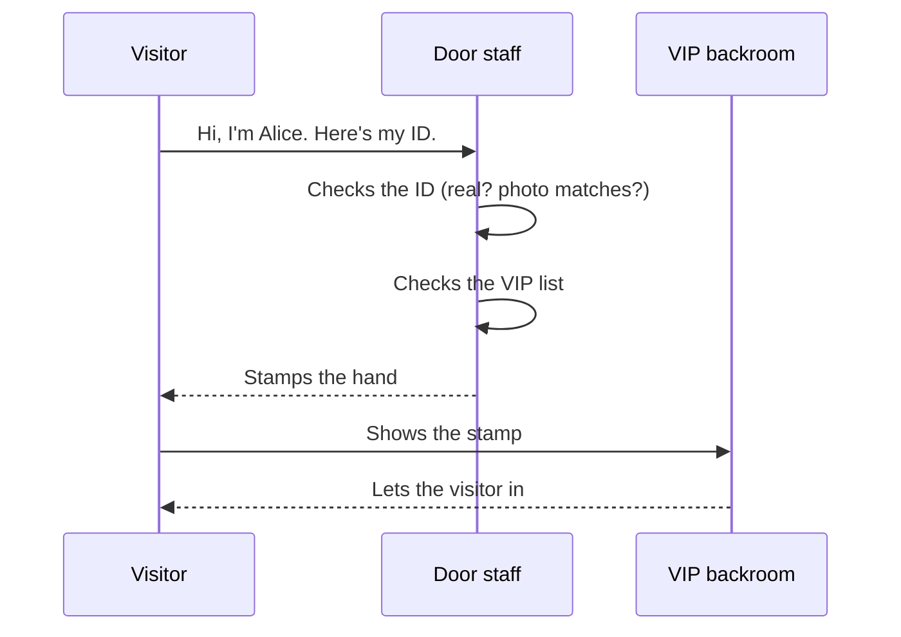
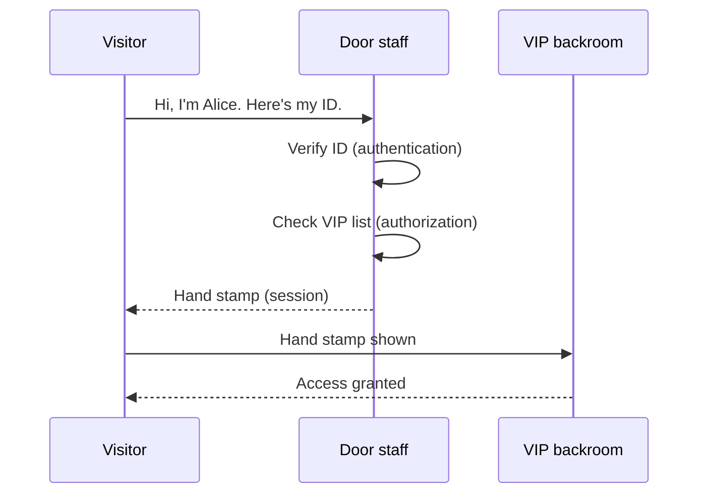

# Who can do what

## Learning objective

By the end of this lesson, you will be able to describe — in plain language and on paper — how a web app decides whether you're allowed to do something, and what keeps you signed in once it has decided you're you.

## Why this matters

Anyone can walk up to the front desk and ask for a card. A real product has to answer: who's allowed to? "I'm signed in" and "I'm allowed to do this" are two different questions, and mixing them up is the most common security mistake in self-built software — including software an agent builds for you. When you can tell the two apart, you can ask for the right thing and check that it holds.

## Core read

Picture the door of a private club.

There's a person at the door, a list, a hand stamp, and inside, a VIP room behind a velvet rope.

When you walk up, the door staff asks: "are you who you say you are?" You hand over your ID; they check it's real and the photo matches. That's **authentication** (confirming you are who you claim to be, [→ GLOSSARY](../../GLOSSARY.md#authentication)) — a question about *identity*.

Then they ask: "are you on the list?" The VIP list says who may go into the VIP room. That's **authorization** (deciding what you're allowed to do once you're identified, [→ GLOSSARY](../../GLOSSARY.md#authorization)) — a question about *permissions*.

Two different questions. The door staff might let you in (your ID is real) but turn you away at the rope (you're not on the list). "I logged in" is not the same as "I'm allowed to do this."

Then they stamp your hand. The stamp lets you step out and back in without showing ID again. That's a **session** (a remembered "yes, you're you", [→ GLOSSARY](../../GLOSSARY.md#session)). Your agent handles how the browser carries the stamp; what you'll notice is that you stay signed in when you refresh the page.

```mermaid
sequenceDiagram
  participant Visitor
  participant Door as Door staff
  participant Backroom as VIP backroom
  Visitor->>Door: Hi, I'm Alice. Here's my ID.
  Door->>Door: Checks the ID (real? photo matches?)
  Door->>Door: Checks the VIP list
  Door-->>Visitor: Stamps the hand
  Visitor->>Backroom: Shows the stamp
  Backroom-->>Visitor: Lets the visitor in
```

Optional: same door staff with the technical labels (Module 4 hands-on)

> *Peek ahead — skim, don't memorize:* Checking the ID is **authentication**. Checking the VIP list is **authorization**. The hand stamp is the **session**. Sign-in itself is built in Module 4, where your agent adds it and its access rules to your project and you check them in the running app. The names are for recognizing, not for writing.

```mermaid
sequenceDiagram
  participant Visitor
  participant Door as Door staff
  participant Backroom as VIP backroom
  Visitor->>Door: Hi, I'm Alice. Here's my ID.
  Door->>Door: Verify ID (authentication)
  Door->>Door: Check VIP list (authorization)
  Door-->>Visitor: Hand stamp (session)
  Visitor->>Backroom: Hand stamp shown
  Backroom-->>Visitor: Access granted
```

In this course, your project signs people in with an email address and a password — that's the ID. Your agent builds the mechanism.

Two things worth noticing now.

**Signing in doesn't replace the list.** A real app checks both, every time. The common mistake is an app that trusts any signed-in person to do anything — edit someone else's post, read someone else's messages. That's why, later, you'll sign in as a second person and *try* to change something the first person wrote, expecting to be refused.

**The list lives in the filing cabinet.** When the door staff checks the list, they're really asking the cabinet from the last lesson. Good apps enforce the rules at the desk *and* at the cabinet, so a card can't be pulled by the wrong person even if the desk slips. Your agent sets that up; you check it holds.

## Exercise

Sketch one sign-in. Plan 10 minutes.

Pick an app that signs you in. On paper or at [excalidraw.com](https://excalidraw.com), draw the steps from "click sign in" to "I see my home page." Mark which steps are about *identity* (is this really you?) and which are about *permissions* (may you do this?). Add the moment the hand stamp is given. Don't look anything up.

## Checkpoint

You've got this if you can:

1. Explain the difference between authentication and authorization in two sentences, without re-reading this lesson.
2. Say what the hand stamp does, and what you'd expect to happen if the app forgot to check the list.

## Going deeper

Optional, only if you're curious:

- The OWASP [Authentication Cheat Sheet](https://cheatsheetseries.owasp.org/cheatsheets/Authentication_Cheat_Sheet.html) — short, dense, the canonical "what real sign-in defaults look like."

## What you just did

You sketched a sign-in and separated identity from permissions in your head. The club still only exists inside one private building, though — how it opens to the public is the last lesson.

## Navigation

[← Previous: Where data lives, how programs talk](./02-where-data-lives.md)
[Next: How it goes live →](./04-how-it-goes-live.md)
