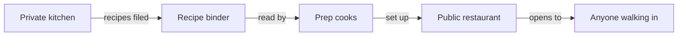
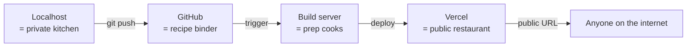

# How it goes live

## Learning objective

By the end of this lesson, you will be able to describe — in plain language and on paper — how an app moves from running on a developer's laptop to being available at a public URL anyone on the internet can visit.

## Why this matters

Until now, every Module 1 mental model has lived inside a single private machine: a browser talking to a server (bundle 1), a server reading from a database (bundle 2), a sign-in flow gating access (bundle 3). This fourth lesson covers the question every real product has to answer last: how does this stop being a private thing on someone's laptop and become a public thing on the internet? The opening-night analogy makes it click. Phase 3 Chunk 0 is the first time you'll run this pipeline yourself — but bringing the right mental model to that exercise saves you days of "why doesn't my deploy work?" debugging.

## Core read

Until now, your "club" is a private kitchen. The cook is testing recipes; the waiter is practicing carrying plates. Nobody from the public is inside. In web terms: the app is running on a developer's laptop.

**Localhost** (one-line definition: a URL that means "this same computer," not the public internet, [→ GLOSSARY](../../GLOSSARY.md#localhost)) is the private kitchen.

Opening night is **deployment** (one-line definition: the act of moving an app from the developer's laptop to a public server so anyone on the internet can reach it, [→ GLOSSARY](../../GLOSSARY.md#deployment)).

The plumbing of opening night looks like this:

Optional: same pipeline with the technical labels (Module 5 hands-on)

> *Peek ahead — skim, don't memorize:* The private kitchen is your laptop running **localhost**. The recipe binder is **GitHub**, where you push your code. The prep cooks are the **build server** (Vercel's). The public restaurant is the live site at a **public URL**. The whole pipeline — committed code, then build, then live URL — is called **CI/CD**. You'll run this pipeline yourself in Module 5; the kitchen-to-restaurant picture is the one to hold onto today.

You save changes to **git** (one-line definition: a tool that tracks every version of every file in a project, [→ GLOSSARY](../../GLOSSARY.md#git)) and upload them to **GitHub** (one-line definition: a website that hosts code repositories and runs developer tools on top of them, [→ GLOSSARY](../../GLOSSARY.md#github)) — that's the recipe binder, kept somewhere safe.

Then **Vercel** (one-line definition: a service that runs your code on the public internet, [→ GLOSSARY](../../GLOSSARY.md#vercel)) watches the recipe binder. When new recipes land, Vercel's prep cooks (build servers) read the new version, get the kitchen ready, and flip the sign on the door from "Closed" to "Open."

That whole pipeline is **CI/CD** (one-line definition: continuous integration / continuous deployment — the automated path from "I committed code" to "it's live on the internet," [→ GLOSSARY](../../GLOSSARY.md#ci-cd)).

For your thread project in Phase 3, every push to the main branch will go through this pipeline automatically.

A few things confuse beginners here, and naming them now saves you debugging time later.

**Localhost is invisible to the internet.** When you run the app on your laptop, only your laptop can see that page. Showing it to a friend means deploying it. This sounds obvious until you spend an hour wondering why your friend can't see your localhost URL.

**Deployment is not magic.** Vercel deploys are fast (often under 60 seconds) but they are real builds happening in real machines. When something works locally and breaks on Vercel, it's almost always because your laptop has something the deploy server doesn't. Module 5 of this course covers the deploy-debugging mental model in depth; for now, just know that "it works on my machine" is a category of bug that doesn't go away with deployment, only changes shape.

**The recipe binder is the source of truth.** Vercel doesn't deploy from your laptop — it deploys from GitHub. Anything you haven't saved to git and uploaded to GitHub may as well not exist when the build server starts cooking. Module 2 unpacks the daily rhythm of saving changes and keeping the recipe binder current.

## Exercise

Sketch the deploy pipeline. Plan 15 minutes.

On paper or [excalidraw.com](https://excalidraw.com), draw four boxes: `your laptop`, `git push`, `GitHub`, `Vercel`. Then draw arrows showing what travels between each pair: what does your laptop send to GitHub? What does GitHub trigger at Vercel? What does Vercel produce? Add the public URL on the far right with an arrow pointing into "anyone on the internet." Don't look anything up. The point is to commit your current model to paper.

## Checkpoint

You've got this if you can:

1. Describe in one sentence why "it works on my localhost" doesn't mean "it works in production."
2. Name one thing that has to be set up for a Vercel deploy to work that isn't in your code (for example: which GitHub repository Vercel watches, which configuration values the build needs, the deploy settings on the Vercel side).

## Going deeper

Optional, only if you're curious:

- Vercel's [docs on deploying a Next.js app](https://vercel.com/docs/frameworks/nextjs) — concrete and current.

## Loop check

> **Loop check — intent.** Module 1 is pre-loop, but every mental model you build here changes the *intent* you'll bring to your next AI-coding session. Knowing that going-live is a pipeline, not a flip of a switch, changes the *intent* you'll bring to debugging deployment failures: you'll know there are several places where something can go wrong (build server, configuration, the wires between GitHub and Vercel) before you start guessing. The loop step this lesson reinforces is **intent**: knowing the shape of the pipeline before you start asking why one of its steps failed.

## What you just did

You sketched the deploy pipeline — the path every real product takes from a private laptop to a public URL. You separated "the code lives in git" from "the build runs at Vercel" from "the public URL is what anyone on the internet sees." That separation is the same separation an AI coding agent will assume when you ask it to fix a broken deploy. The "intent" step of the loop, taught in Module 3, is exactly this: knowing the shape of what you want the system to do before you start asking. You've now practiced it four times — the full set of Module 1 mental models is in your head.

## Navigation

[← Previous: Who can do what](./03-who-can-do-what.md)
[Next: The IDE →](../02-toolchain/01-ide.md)
