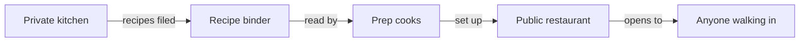
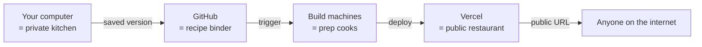

# How it goes live

## Learning objective

By the end of this lesson, you will be able to describe — in plain language and on paper — how an app moves from running on one computer to being available at a public web address anyone on the internet can visit.

## Why this matters

Everything so far has lived inside one private building. The checklist page from Module 0 is the same: it works, but only on your computer, and nobody else can reach it. Every real product has to answer one more question: how does it stop being private and become public? Holding the picture in your head saves you a lot of "why can't my friend see it?" later.

## Core read

Until opening night, your restaurant is a private kitchen. The cook is testing recipes; nobody from the public is inside. In web terms: the app runs on your computer, and only your computer can see it.

Opening night is **deployment** (moving an app from one computer to a public one so anyone on the internet can reach it, [→ GLOSSARY](../../GLOSSARY.md#deployment)).

```mermaid
flowchart LR
  Kitchen[Private kitchen] -->|recipes filed| Binder[Recipe binder]
  Binder -->|read by| PrepCooks[Prep cooks]
  PrepCooks -->|set up| Restaurant[Public restaurant]
  Restaurant -->|opens to| Public[Anyone walking in]
```

Optional: same pipeline with the technical labels (Module 4 hands-on)

> *Peek ahead — skim, don't memorize:* The private kitchen is your own computer. The recipe binder is **GitHub**, where your agent files each saved version of your project. The prep cooks are Vercel's build machines. The public restaurant is the live site at a **public URL**. You'll watch your agent run this pipeline in Module 4; the kitchen-to-restaurant picture is the one to hold onto today.

```mermaid
flowchart LR
  Laptop["Your computer<br/>= private kitchen"] -->|saved version| GitHub["GitHub<br/>= recipe binder"]
  GitHub -->|trigger| Build["Build machines<br/>= prep cooks"]
  Build -->|deploy| Vercel["Vercel<br/>= public restaurant"]
  Vercel -->|public URL| Customers[Anyone on the internet]
```

You tell your agent to save your work. It records the new version with **git** (the tool that keeps every saved version, [→ GLOSSARY](../../GLOSSARY.md#git)) and files a copy on **GitHub** (the website that keeps those versions online, [→ GLOSSARY](../../GLOSSARY.md#github)). That's the recipe binder, kept somewhere safe.

**Vercel** (a service that runs your app on the public internet, [→ GLOSSARY](../../GLOSSARY.md#vercel)) watches the binder. When a new version lands, its prep cooks read it, get the kitchen ready, and flip the sign on the door from "Closed" to "Open." For your project, every version your agent files on GitHub goes through this automatically.

Three things worth noticing now.

**Your computer is invisible to the internet.** Until the app is deployed, only you can see it. Showing it to a friend means deploying it.

**The binder is what gets served.** Vercel doesn't cook from your computer — it cooks from GitHub. A change your agent hasn't saved and filed there doesn't exist as far as opening night is concerned.

**Working here doesn't guarantee working there.** Deploys are real builds on real machines. When something works on your computer and breaks on the live site, it's usually because your computer has something the public kitchen doesn't. You don't diagnose that: you tell your agent what you see, on which address.

## Exercise

Sketch the path to public. Plan 10 minutes.

On paper or at [excalidraw.com](https://excalidraw.com), draw four boxes: `your computer`, `saving`, `GitHub`, `Vercel`. Draw arrows showing what travels between each pair, and add the public web address on the far right with an arrow into "anyone on the internet." Don't look anything up.

## Checkpoint

You've got this if you can:

1. Say, in one sentence, why "it works on my computer" doesn't mean "it works for everyone."
2. Name one thing that has to be set up for a deploy to work that isn't in your code (for example: which GitHub project Vercel watches, or the settings the build needs on the Vercel side).

## Going deeper

Optional, only if you're curious:

- Vercel's [docs on deploying](https://vercel.com/docs/frameworks/nextjs) — concrete and current.

## What you just did

You sketched the path from a private computer to a public web address, and separated "the saved version lives on GitHub" from "the live site runs at Vercel." That's the full set of Module 1 pictures; Module 2 is the saving habit that keeps the binder current.

## Navigation

[← Previous: Who can do what](./03-who-can-do-what.md)
[Next: Your AI coding agent →](../02-toolchain/01-your-ai-coding-agent.md)
