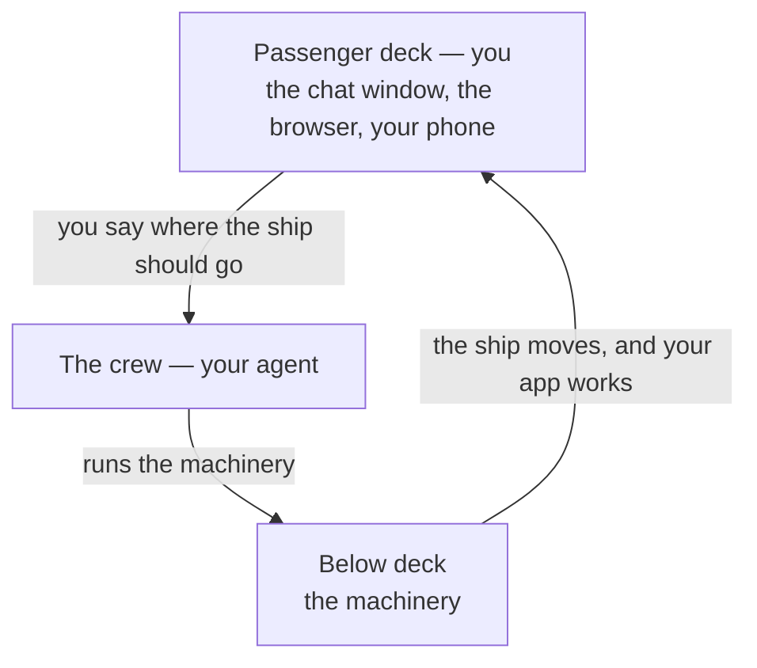

# The engine room

## Learning objective

By the end of this lesson, you will be able to say what kinds of machinery your agent runs for you without your involvement, and — shown an approval prompt — decide whether to approve it, ask for it in everyday words first, or refuse it and steer your agent back.

## Why this matters

Last lesson you met your agent and the moment where it stops and waits for you. What nobody has told you yet is what sits on the other side of that question. Something real happens on your computer when you click approve, and "I have no idea what I just agreed to" is an uncomfortable place to spend the rest of this course. This lesson gives you the picture — not so you can operate any of it, but so that click stops feeling like a coin flip.

## Core read

A cruise ship has an engine room. Passengers never go down there. There's no tour, no window in the corridor, no button in the cabin that reaches it. Several decks below the pool, a crew keeps enormous machinery running, and the entire experience of that machinery, for you, is that the ship moves. You feel it in the floor. You watch the coastline slide past. That's the whole of it — and it's a complete relationship. Nobody thinks a passenger who can't service a turbine is having a lesser cruise.

Your project has an engine room too.

You live on the passenger deck. Your deck has three rooms: the window where you talk to your agent, the browser where you watch your app actually work, and your phone, where you'll eventually check that same app the way anyone else would. Everything this course asks of you happens in those three places. Your agent is the crew. And below deck is the machinery — real, running, doing the actual work of turning what you asked for into something that exists, out of your sight.

### What's actually down there

Three kinds of machinery, described by what they're for. Not by name — you don't need the names, and this course will never teach them.

**Something that translates.** What gets written for your project isn't the form a computer can actually run. Something has to turn it into that form, and it has to do it again every single time anything changes. That translation runs constantly while you work, in the background, unprompted.

**Something that fetches parts.** Almost nothing in a modern app is built from scratch. Other people have already written the piece that handles dates, the piece that sends email, the piece that draws a calendar. There is machinery whose only job is going and getting those ready-made pieces and keeping track of which ones your project relies on.

**Something that assembles.** Having translated instructions and borrowed parts is not the same as having a working app. A third kind of machinery puts them together into the thing your browser can actually open.

You will never operate any of these. Not in this course, and not to ship the thing you're building. That isn't a simplification for beginners that you'll grow out of — it's the actual arrangement. Your agent operates them, the way a crew operates the engines, and the way you'll experience all three is exactly the way a passenger experiences a turbine: your app runs.

There's one more piece of machinery down there — the one that keeps a copy of every working version of your project, so that a bad afternoon can't erase a good week. That one gets a lesson of its own next, because unlike the other three, you'll be telling your agent when to use it.

### The approval prompt is your porthole

You met the approval prompt back in Module 0: your agent proposes, the app asks you — when it's set to ask — and you decide. Now you know what it's asking *about*. When the app is set to ask, each time your agent needs to send something below deck the app stops and shows you the request first, and that pause is your window into the engine room. When it's set to work inside your folder without asking, your window is the result instead: open your app and look, and whenever you want the request after the fact, ask *"what did you just change, in everyday words?"* Either way it's enough of a window.

A good request tells you three things:

1. **What it will do** — in the plain sense: add something, change something, remove something, send something.
2. **Why** — which thing you asked for this serves.
3. **What changes** — what's different on your computer or in your app afterwards.

Here's one that does all three: *"I'd like to bring in a ready-made piece for handling dates, so your posts can show '3 minutes ago' instead of a full date and time. It adds one borrowed part to your project. Nothing you already have working changes."* You can decide about that. You know what it does, why it's happening, and what's different when it's over.

Plenty of them won't look like that. Some are two lines of machine text and a pair of buttons. When that happens, you have one move, and it is always available to you:

> **"Explain what this does in everyday words before I say yes."**

That request is always legal. It is not a beginner's question, it does not slow your project down in any way that matters, and there is no number of times that counts as too many. An agent that can't explain what it's about to do in words you understand hasn't earned the click yet. Wait for the explanation, then decide.

### When someone hands you a wrench

Here's the one thing that should stop you cold.

Your agent proposes, and you approve. That's the shape, and it only runs in that direction. If it ever inverts — if your agent asks *you* to go operate the machinery — something has gone wrong. In practice it sounds like:

- "Open a terminal and run this."
- "Type this command and paste back what it prints."
- "Install this tool by hand first, then come back."

None of those are your job on this course. A passenger who's been handed a wrench and pointed at a hatch is not receiving good service. Your steer is one sentence, in your own words:

> **"That's your job — do it yourself and tell me what happened in plain words."**

Then let it. Your agent can operate its own machinery perfectly well; a request like that usually means it reached for the shortest path it knows rather than the one that fits how you're working. Saying the sentence puts it back on the right path, and it costs you nothing to say.

The same rule covers everything outside your app. A search result, a video, a forum answer, a page that opens with "first, open a terminal" — that's advice written for someone already standing in the engine room. You're not standing there. Close it, come back to your agent, and describe the problem to it instead.

### Why this is the arrangement, not the training wheels

A reasonable suspicion at this point: that the deck-and-engine-room split is scaffolding. That a real developer knows all of it, and you're being handed the simplified version until you graduate to the real thing.

That isn't what's happening. Professionals delegate this machinery too. Nobody assembles an app by hand when a machine will do it — that machinery exists precisely so that people can stop thinking about it. The line between "what a person does by hand" and "what a machine handles" has moved every decade of this field's existence, and it has just moved again, further than it ever has. What has never moved to the other side of that line is deciding what's worth building, noticing when what came back isn't it, and saying so clearly.

That's the job now. It's also the part of the job this course is actually training you for. Your leverage was never going to be in the engine room; it's in knowing where the ship should go.

## Exercise

Plan 10 to 15 minutes. Paper, a notes app, anything — nothing here goes into your project.

1. Write down the three-part test for a good request from your agent: what it will do, why, what changes.
2. Below are four made-up approval prompts. For each one, write which of three things you'd do — **approve**, **ask for it in everyday words first**, or **refuse and steer** — and one line saying why.
   - **A.** "I'd like to bring in a ready-made piece for handling dates, so your posts can show '3 minutes ago'. It adds one borrowed part to your project. Nothing you already have working changes."
   - **B.** "Run setup?" — followed by two lines of machine text you can't read, and two buttons.
   - **C.** "Open a terminal on your computer, run the setup command, and paste back what it prints."
   - **D.** "I'll clear out your existing entries so the new format applies cleanly." (Last lesson gave you the exact question to ask about this one.)
3. For the one you'd refuse, write out the sentence you'd send back, in your own words.

Your deliverable is four judgements with a reason each, plus one steer sentence. You don't need to keep it — the point is having decided once, in your own words, before it's real.

## Checkpoint

You've got this if you can:

1. Name the three kinds of machinery your agent runs below deck — in everyday words, no tool names — and say who operates them.
2. Take an approval prompt you didn't write and say which of the three you'd do with it: approve it, ask for it in everyday words first, or refuse it and steer — and say why.

## Going deeper

Optional, only if you're curious:

- **A practice, not an assignment.** Next time your agent proposes something and you're about to approve, ask it first to describe in everyday words what it's about to run. Do that occasionally and you'll build a rough picture of the engine room over a few weeks, without ever going down there.
- **If you catch yourself wanting the real names of the machinery:** that's a career's worth of material, and none of it sits between you and a shipped app. This course leaves it out deliberately, not by accident.

## Loop check

> **Loop check — intent.** Knowing where the boundary sits — what's yours to decide, what's your agent's to run — is part of the *intent* you carry into every session with it. Module 2 is still pre-loop; the loop step this lesson reinforces is **intent**: knowing what's yours to decide before you start asking for anything.

## What you just did

You drew the line between your deck and the engine room, and you practiced the one control that crosses it — reading an approval prompt and deciding what to do with it, including refusing the one that tried to hand you a wrench. Next comes the single piece of machinery down there that you *will* give orders about: the one that keeps a copy of every working version of your project, and the moment your agent decides your work is worth keeping.

## Navigation

[← Previous: Your AI coding agent](./01-your-ai-coding-agent.md)
[Module 2 — Your agent and the machinery it drives](./README.md)
[Next: The save system →](./03-the-save-system.md)
