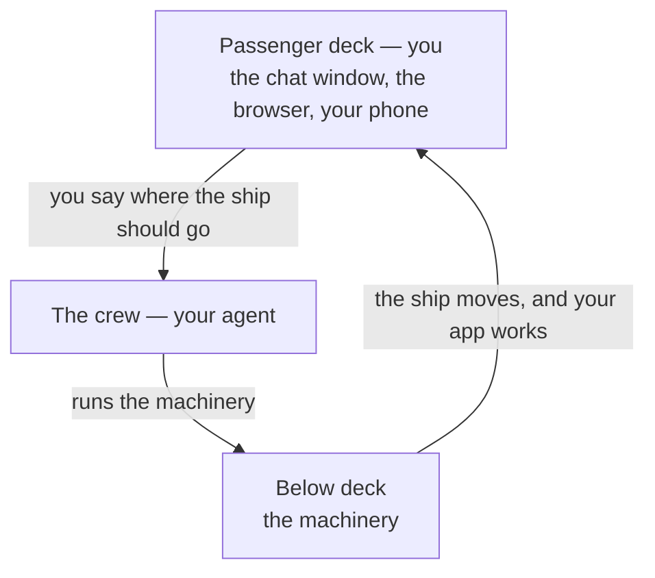

# The engine room

## Learning objective

By the end of this lesson, you will be able to say what kinds of machinery your agent runs for you without your involvement, tell apart the three names it will mention most, and — shown an approval prompt or a technical question — decide whether to approve, ask for it in everyday words first, hand the decision back, or refuse and steer.

## Why this matters

Last lesson you met your agent and the moment where it stops and waits for you. Something real happens on your computer when you click approve, and "I have no idea what I just agreed to" is an uncomfortable place to spend the rest of this course. This lesson gives you the picture — not so you can operate any of it, but so that click stops feeling like a coin flip.

## Core read

A cruise ship has an engine room. Passengers never go down there. Several decks below the pool, a crew keeps enormous machinery running, and the entire experience of that machinery, for you, is that the ship moves. Nobody thinks a passenger who can't service a turbine is having a lesser cruise.

Your project has an engine room too. You live on the passenger deck, which has three rooms: the window where you talk to your agent, the browser where you watch your app work, and your phone. Your agent is the crew. Below deck is the machinery — real, running, doing the work of turning what you asked for into something that exists, out of your sight.



### What's down there

Three kinds of machinery, described by what they're for:

- **Something that translates** what gets written for your project into the form a computer can run, again every time anything changes.
- **Something that fetches parts** — ready-made pieces other people wrote (handling dates, sending email, drawing a calendar) — and keeps track of which ones your project relies on.
- **Something that assembles** the translated instructions and borrowed parts into the thing your browser can open.

You will never operate any of these. The first time a step needs one, your agent tells you what's missing, explains why in plain words, and installs it — you approve. The way you experience all three is the way a passenger experiences a turbine: your app runs.

### Three names you will hear

Your agent will say three names often enough that you should be able to tell them apart. That's all you need — not how any of them works.

- [Git](../../GLOSSARY.md#git) — the save machinery on your computer. It keeps every working version of your project so you can go back to one. The next lesson is about the two sentences you say to it, through your agent.
- [GitHub](../../GLOSSARY.md#github) — a website. It keeps a copy of those saved versions online, so your project survives your computer. It's the only one of the three you'll ever open yourself, in your browser.
- [Node.js](../../GLOSSARY.md#nodejs) — the engine that runs your app's code on your computer while you build it. A plain page like your first one doesn't need it. Your agent installs it if a later project needs it.

Your computer may already have Git or Node.js. Your agent checks first and installs only what the next step needs. GitHub needs an account, not an installation. The one exception — an app that wants Git before it will open a folder — is covered in Module 0 Lesson 5, because the agent isn't running yet at that point.

### The approval prompt is your porthole

When the app is set to ask, each time your agent needs to send something below deck the app stops and shows you the request first. That pause is your window into the engine room. When it's set to work inside your folder without asking, your window is the result instead: open your app and look, and whenever you want the request after the fact, ask:

```prompt
What did you just change, in everyday words?
```

A good request tells you three things:

1. **What it will do** — add something, change something, remove something, send something.
2. **Why** — which thing you asked for this serves.
3. **What changes** — what's different on your computer or in your app afterwards.

Here's one that does all three: *"I'd like to bring in a ready-made piece for handling dates, so your posts can show '3 minutes ago' instead of a full date and time. It adds one borrowed part to your project. Nothing you already have working changes."* You can decide about that.

Plenty of them won't look like that. Some are two lines of machine text and a pair of buttons. When that happens, you have one move, and it is always available:

```prompt
Explain what this does in everyday words before I say yes.
```

There is no number of times that counts as too many. An agent that can't explain what it's about to do in words you understand hasn't earned the click yet. Wait for the explanation, then decide.

### When your agent asks you a technical question

Sometimes the crew comes up on deck with a question that belongs below: "Should I use version control for this?", "Which framework do you prefer?", "Which language should I write it in?" You don't have to know. Those are the agent's decisions, and there is one reply that hands them back:

```prompt
I don't have a preference. Choose the simplest option that's easy to change later, and tell me what you chose.
```

The questions you *do* answer are about your app, not about technology: how it should behave, what it may cost, who can see your information, and which accounts you're willing to sign in to. The house rule from Module 0 Lesson 6 says this to your agent up front.

### When someone hands you a wrench

Your agent proposes, and you approve. That only runs in one direction. If it ever inverts — if your agent asks *you* to go operate the machinery — something has gone wrong. In practice it sounds like:

- "Open a terminal and run this."
- "Type this command and paste back what it prints."
- "Install this tool by hand first, then come back."

None of those are your job on this course. Your steer is one sentence:

```prompt
That's your job — do it yourself and tell me what happened in plain words.
```

Then let it. (Clicking through an installer window your agent opened and explained is not a wrench. Typing commands is.)

The same rule covers everything outside your app. A search result, a video, a forum answer that opens with "first, open a terminal" is advice for someone already standing in the engine room. Close it, come back to your agent, and describe the problem to it instead.

## Exercise

Plan 10 minutes. Paper or a notes app — nothing here goes into your project.

1. Write the three names — Git, GitHub, Node.js — with one plain phrase each for what it's for.
2. Below are five made-up things your agent might say. For each, write which you'd do — **approve**, **ask for it in everyday words first**, **hand the decision back**, or **refuse and steer** — and one line saying why.
   - **A.** "I'd like to bring in a ready-made piece for handling dates, so your posts can show '3 minutes ago'. It adds one borrowed part to your project. Nothing you already have working changes."
   - **B.** "Run setup?" — followed by two lines of machine text you can't read, and two buttons.
   - **C.** "Open a terminal on your computer, run the setup command, and paste back what it prints."
   - **D.** "I'll clear out your existing entries so the new format applies cleanly." (Last lesson gave you the exact question to ask about this one.)
   - **E.** "Do you want me to set up version control for this project, and if so, which branching strategy?"
3. For the one you'd refuse, write out the sentence you'd send back, in your own words.

Your deliverable is five judgements with a reason each, plus one steer sentence.

## Checkpoint

You've got this if you can:

1. Name the three kinds of machinery your agent runs below deck — in everyday words — and say who operates them.
2. Tell Git, GitHub and Node.js apart in one phrase each, and say which one you ever open yourself.
3. Take an approval prompt or a technical question you didn't write and say which of the four moves you'd make with it, and why.

## Going deeper

Optional, only if you're curious:

- **A practice, not an assignment.** Next time your agent proposes something and you're about to approve, ask it first to describe in everyday words what it's about to run. Do that occasionally and you'll build a rough picture of the engine room over a few weeks, without ever going down there.

## What you just did

You drew the line between your deck and the engine room, learned the three names that cross it, and practiced the controls that cross it with them — reading an approval prompt, handing a technical decision back, and refusing the one that tried to hand you a wrench. Next comes the single piece of machinery down there that you *will* give orders about: the one that keeps a copy of every working version of your project.

## Navigation

[← Previous: Your AI coding agent](./01-your-ai-coding-agent.md)
[Module 2 — Your agent and the machinery it drives](./README.md)
[Next: The save system →](./03-the-save-system.md)
