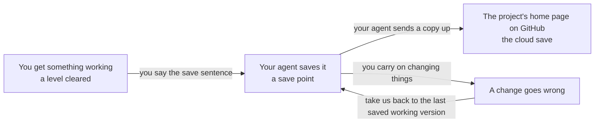

# The save system

## Learning objective

By the end of this lesson, you will be able to tell your agent — in one sentence, in your own words — to save a working version of your project, say where that version goes, and name the sentence that takes you back to it.

## Why this matters

Last lesson ended on the one piece of machinery below deck that you'll actually give orders about. Here's why it earns a lesson of its own: you're about to spend weeks changing a project you don't read yourself, one change at a time, and some of those changes will turn out wrong. Without somewhere to fall back to, every one of them is a gamble with everything you've built so far. With somewhere to fall back to, the worst afternoon of your project costs you an afternoon.

## Core read

Think about how a video game handles the fact that you're going to fail.

You play a level. You finish it. The game records where you are — your position, your inventory, everything you earned getting there — and then you carry on into the next level, which is harder, and which you will probably die in a few times. When you do, you don't start the whole game over. You start again from the save point at the end of the last level, still holding everything you'd earned by then. The distance between the last save point and the disaster is the entire cost of the disaster.

And if the game keeps a cloud save, that copy isn't only on the machine in front of you. Your console can die, get stolen, or be left at a friend's house, and the run is still there when you sign in somewhere else.

Two things fall out of that picture, and both of them are about fear. A game with save points is a game you can afford to be bold in, because the cost of being wrong is bounded and known before you take the risk. And a game with a cloud save is a game whose progress isn't hostage to one piece of hardware.

Your project works exactly this way. One difference: the save points aren't automatic. Someone has to decide that you've reached one — and that someone is you.

### The two names under it

Two names sit underneath the picture, and you'll hear both of them from your agent.

The save system itself is **git** (the machinery that records a complete working version of your project each time your agent saves one, so any of them can be returned to later, [→ GLOSSARY](../../GLOSSARY.md#git)). It's the fourth kind of machinery from the engine room — running below deck, operated entirely by your agent. If you're on Windows and picked Claude Code desktop, you installed it back in Module 0 and haven't opened it since. You never will.

The cloud save is **GitHub** (the site where your project gets its own home page on the internet, holding a copy of every version your agent saves, [→ GLOSSARY](../../GLOSSARY.md#github)) — the account you created in Module 0. Once your project exists, it gets a home page there, at a normal web address you can open in your browser like any other page. That page is where your project lives. If your laptop stopped working tonight, the project would still be there tomorrow, and so would every version of it your agent had saved.

Your agent operates both of those. Your verb is "save."

### The ritual

There is one sentence to say, and it doesn't change for the rest of this course:

> **"Save this as a working version, with a one-line note about what changed."**

You say it after every working chunk — every time a piece of what you're building actually works.

What counts as working is not the agent announcing that it finished. It's you opening your app in your browser and seeing the thing you wanted do the thing you wanted. Agent says done, you look, it does what you meant — *that's* a save point.

Everything after your sentence belongs to your agent. It records the version, writes the note, sends the copy up to your project's home page on GitHub, and tells you in plain words when it's done. You'll meet the same approval step from last lesson somewhere in the middle, because saving is machinery like everything else below deck. Approve it, and carry on.

The one-line note matters more than it looks. "Added the like button under each post" and "fixed the wrong date showing on old posts" are notes that mean something weeks later; "update" is a note that means nothing to anybody. You will never read that list of notes yourself — your agent reads it back to you in plain words when you need to pick a version to return to. A list full of "update" leaves neither of you anything to go on.

### The failure this predicts

The save-point picture predicts the mistake every new player makes, and it's the one to guard against here: playing for three hours without touching a save point.

Go a whole afternoon without saving and one bad change costs you the afternoon, not the last ten minutes. There's nothing dramatic about how this happens. You get something working, you don't stop, you change four more things, two of them break something you can't name, and the nearest solid ground is now hours behind you.

So: after every working chunk. Not at the end of the day. Not once it's "properly finished." The moment something works, that's a save point — even if it's small, even if you're about to change it again in five minutes. Small and frequent beats large and tidy, every time.

### The move that makes everything else safe

The second thing the picture predicts is about fear, and it's the more useful half.

When something has gone wrong — the app stopped working, the last hour made things worse, you've lost the thread of what changed — you have one sentence:

> **"Take us back to the last saved working version."**

That sentence is always available to you. It is not an admission of failure, it is not a thing to feel sheepish about, and there is no number of times that counts as too many. Your agent does the whole thing; you don't touch any of the machinery involved. What you get back is the project exactly as it was at your last save point, and the only thing you lose is whatever happened after it.

Which is precisely why the ritual is worth the twenty seconds. Every save point you lay down shortens the distance that sentence can cost you.

And because that sentence exists, experiments get cheap. "Try it and see" is a legitimate way to work when the failure case is one sentence away from undone. Module 3 teaches you when to reach for it — the signals that mean stop and go back rather than keep going. Module 4 is where you'll use it on something real.

### What you'll never be doing

Being plain about this, because a lot of writing on the internet assumes otherwise: no lesson in this course will ever hand you a save command to type, two disagreeing versions of your work to untangle by hand, or a list of past versions to read and interpret. Not in this module, not in the build modules, not once.

If you find yourself in front of instructions that do — a search result, a video, a well-meaning friend who learned this the old way — that isn't how this course works. It's a set of directions written for someone standing in the engine room, and you're on the passenger deck. Close it, come back to your agent, and describe what you actually want in your own words.

And if your agent is the one handing you the wrench, you already have the sentence for that from last lesson:

> **"That's your job — do it yourself and tell me what happened in plain words."**

## Exercise

Plan 10 to 15 minutes. Paper, a notes app, anything — you have no project yet, so nothing here touches one.

1. Write out the save sentence, word for word: *"Save this as a working version, with a one-line note about what changed."* Then write it again in your own words, the way you'd actually say it.
2. Write out the recovery sentence the same way — once as it appears above, once in your own words.
3. For each of these four moments, write **save now** or **not yet**, plus one line saying why:
   - You changed the wording on a button, opened your app in your browser, and it reads the way you wanted.
   - Your agent says it finished the sign-in feature. You haven't opened your app yet.
   - Sign-in works and you've just watched it work. You're about to try adding photo uploads, which you suspect will be messy.
   - It's six in the evening and three separate things are half-working.
4. Write one sentence answering both halves of this: where does your project live once it exists, and what would still be true about it if your laptop died tonight?

Your deliverable is two sentences written twice, four judgements with a reason each, and one sentence about where your work lives. You don't need to keep it — the point is having said the sentences once, in your own words, before there's anything at stake.

## Checkpoint

You've got this if you can:

1. Say the save sentence from memory, including the part about the one-line note, without looking it up.
2. Say where your project will live once it exists, and what happens to it if your computer stops working tonight.

## Going deeper

Optional, only if you're curious:

- **The home page is yours to look at.** Once your project exists, its page on GitHub is an ordinary web page in your browser: the project's name, its files, and a dated list of every version your agent saved with the one-line notes beside them. Nothing on that page is homework, and no part of this course depends on you reading it — but it's yours, and looking at a web page can't break anything.
- **The habit outlives the tool.** Deciding *this, right here, is worth being able to come back to* is the transferable skill. Whatever you end up building with in five years will have some version of a save point in it, and the people who use it well are the ones who stop and lay one down while things are still working.

## Loop check

> **Loop check — intent.** Deciding that a piece of work is worth coming back to happens before you say anything to your agent — it's part of what you carry into a session, not something you sort out afterwards. Module 2 is still pre-loop; the loop step this lesson reinforces is **intent**: planning to work in small savable pieces before you start.

## What you just did

You learned the one sentence that lays down a save point and the one sentence that returns you to it, and you decided — before it was real — which moments are worth saving. That's the whole of your relationship with the machinery that keeps your work safe: two sentences, said at the right moments, with your agent doing everything underneath. Module 3 is where the sentences start landing in a real conversation, as you work with your agent through a change from start to finish.

## Navigation

[← Previous: The engine room](./02-the-engine-room.md)
[Next: Module 3 — The loop in depth →](../03-the-loop/README.md)
