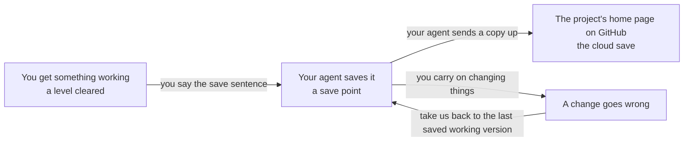

# The save system

## Learning objective

By the end of this lesson, you will be able to tell your agent — in one sentence, in your own words — to save a working version of your project, say where that version goes, and name the sentence that takes you back to it.

## Why this matters

Whether you came here straight from the checklist you built in Module 0 or through the two lessons before this one, you've already used the machinery this lesson is about — once, when you said "save this as a working version." Here's why it earns a lesson of its own: you're about to spend weeks changing a project you don't read yourself, one change at a time, and some of those changes will turn out wrong. Without somewhere to fall back to, every one of them is a gamble with everything you've built so far. With somewhere to fall back to, the worst afternoon of your project costs you an afternoon.

## Core read

Think about how a video game handles the fact that you're going to fail. You finish a level, the game records where you are, and when you die in the next level you start again from that save point, still holding everything you'd earned. The distance between the last save point and the disaster is the entire cost of the disaster. And if the game keeps a cloud save, your console can die and the run is still there when you sign in somewhere else.

Your project works exactly this way, with one difference: the save points aren't automatic. Someone has to decide you've reached one — and that someone is you.

### The two names under it

The save system itself is **git** (the machinery that records a complete working version of your project each time your agent saves one, so any of them can be returned to later, [→ GLOSSARY](../../GLOSSARY.md#git)). It runs in the background, operated entirely by your agent. A fresh computer may not have it: that's what the check-first sentence from Module 0 is for, and your agent installs it with your approval the first time a save needs it.

The cloud save is **GitHub** (the site where your project gets its own home page on the internet, holding a copy of every version your agent saves, [→ GLOSSARY](../../GLOSSARY.md#github)) — the account you created in Module 0. Once connected, your project has a home page there, at a normal web address you can open in your browser. If your laptop stopped working tonight, the project would still be there tomorrow, and so would every version your agent had saved.

Your agent operates both. Your verb is "save." And they're two separate things: the save point lives on your computer, and the copy on GitHub exists only once your agent has connected the project to it — which is why the Module 0 save was on this computer only.

### The save sentence

One sentence, and it doesn't change for the rest of this course:

> **"Save this as a working version, with a one-line note about what changed."**

Say it after every working chunk. What counts as working is not the agent announcing it finished — it's you opening your app in your browser and seeing the thing you wanted do the thing you wanted.

Everything after your sentence belongs to your agent. It records the version, writes the note, and — once the project is connected to GitHub — sends the copy up too. The first time you want the cloud copy, you say so (*"Put a copy of this project on GitHub"*); your agent walks you through signing in to your GitHub account in your browser, and from then on it sends each save up as well. Connecting may need something set up first — a helper program, or a name and email to label your saves. Say the check-first sentence before you ask, approve what's about saving and GitHub, type any administrator password into the installer's own window rather than the chat, give the same email you used for GitHub if it asks, and if an install fails twice, stop and say *"Tell me in plain words what happened and what you'd try next."*

A save is real when your agent confirms it. If it's quiet, ask: *"Confirm the working version is saved on this computer, and whether the copy on GitHub is up to date."* Two answers, because they are two different things: the save here can succeed while the copy up there doesn't go. If the copy didn't go up, the save on this computer is still real. Ask what it needs to send the copy; do it if the answer is signing in to GitHub in your browser, and ask *"What does this do?"* first if the answer is anything else.

The one-line note matters. "Added the like button under each post" means something weeks later; "update" means nothing. You never read that list yourself — your agent reads it back to you when you need to pick a version to return to, and a list full of "update" leaves neither of you anything to go on.

### Save small and often

The mistake every new player makes: playing for three hours without touching a save point. Go a whole afternoon without saving and one bad change costs you the afternoon, not the last ten minutes. So: after every working chunk, not at the end of the day, not once it's "properly finished." Small and frequent beats large and tidy.

### The sentence that takes you back

When something has gone wrong — the app stopped working, the last hour made things worse, you've lost the thread of what changed — you have one sentence:

> **"Take us back to the last saved working version."**

It is always available, it is not an admission of failure, and there is no number of times that counts as too many. Your agent does the whole thing. What you get back is the project's *files* exactly as they were at your last save point; you lose only what happened to them after it.

One boundary, stated plainly so it never surprises you: going back restores what your agent wrote — the pages, the settings, the plan. It doesn't undo things that happened *outside* those files. Once your app is live, what other people typed in lives somewhere else and stays as it is; an email that was sent stays sent; a change made on a dashboard stays made. (Your checklist's ticks live in your browser, not in the file, so a restore doesn't bring those back either.) After going back, open the app and check it, and ask: *"What outside the files might not match the version we went back to?"*

Because that sentence exists, experiments get cheap. Module 3 has you say it once, on purpose, on a practice page that doesn't matter, so you've seen what it does before it counts.

### What you'll never be doing

No lesson in this course will hand you a save command to type, two disagreeing versions to untangle by hand, or a list of past versions to read. If a search result or a video does, it's written for someone standing in the engine room. Close it, come back to your agent, and say what you want in your own words. And if your agent is the one handing you the wrench, you have the sentence from last lesson:

> **"That's your job — do it yourself and tell me what happened in plain words."**

## Exercise

Plan 15 to 20 minutes. Steps 1–3 are an optional warm-up on paper — skip them if you'd rather go straight to the real thing. Step 4 is the exercise, and it uses the checklist page from Module 0.

1. Write out the save sentence and the recovery sentence, each once as they appear above and once in your own words.
2. For each of these four moments, write **save now** or **not yet**, plus one line saying why:
   - You changed the wording on a button, opened your app in your browser, and it reads the way you wanted.
   - Your agent says it finished the sign-in feature. You haven't opened your app yet.
   - Sign-in works and you've just watched it work. You're about to try adding photo uploads, which you suspect will be messy.
   - It's six in the evening and three separate things are half-working.
3. Write one sentence: where does your project live once it's connected to GitHub, and what would still be true about it if your laptop died tonight?
4. **Now do it for real, on the checklist from Module 0.** Open your agent app, point it at the `my-first-thing` folder, and say first: *"Before we connect this project to GitHub, check whether this computer has everything you need to save working versions and to put a copy on GitHub. If something is missing, tell me in plain words what it is and why, help me install it, tell me before anything needs my approval, and tell me when it's ready."* Approve what's about saving and GitHub; click through any installer it opens for you (an administrator password goes into the installer's own window, never into the chat); give the same email you used for GitHub if it asks for a name and email. If an install fails twice, stop — your checklist is still in its folder — and come back in a fresh conversation. When it says it's ready, say: *"Put a copy of this project on GitHub, then save this as a working version with a one-line note about what changed."* Your agent will take you through signing in to the GitHub account you created in Module 0 — approve what's about your folder and that sign-in, and ask *"What does this do?"* about anything else. When it says it's done, ask: *"Confirm the working version is saved on this computer, confirm the copy on GitHub is up to date, and give me the web address of the project's home page."* Open that address in your browser: your checklist's name should be on it. That page is the cloud save. If your agent says the copy didn't go up, the save on this computer is still real — ask what it needs to send the copy, and do it if it's a GitHub sign-in in your browser. From now on, that same two-part question is how you know both halves of a save happened.

Your deliverable is a checklist that now has a home page on GitHub, with your agent confirming both the save on this computer and the copy up there.

## Checkpoint

You've got this if you can:

1. Say the save sentence in your own words, including the part about the one-line note.
2. Say where your project lives once it's connected to GitHub, and what happens to it if your computer stops working tonight.
3. Say the one thing going back to a saved version does *not* undo, once other people are using your app.

## Going deeper

Optional, only if you're curious:

- **The home page is yours to look at.** Your project's page on GitHub is an ordinary web page: the project's name, its files, and a dated list of every version your agent saved with the one-line notes beside them. No part of this course depends on you reading it, but looking at a web page can't break anything.

## What you just did

You learned the one sentence that lays down a save point and the one sentence that returns you to it, and you gave the checklist from Module 0 the half its first save was missing: a copy that survives this computer. That's the whole of your relationship with the machinery that keeps your work safe: two sentences, said at the right moments, with your agent doing everything underneath. Module 3 is where both sentences land in a real conversation, as you work with your agent through a change from start to finish.

## Navigation

[← Previous: The engine room](./02-the-engine-room.md)
[Next: Module 3 — The loop in depth →](../03-the-loop/README.md)
