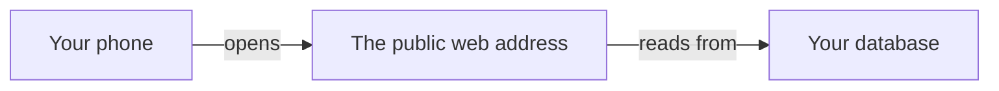

# Hello-world deploy: an empty app, truly online

## Learning objective

By the end of this lesson, you will be able to direct your agent to put an empty app onto a real public web address connected to your database, and check for yourself — from your phone — that the live link truly works, before a single feature exists.

## Why this matters

Module 3.5 taught you to look at code the agent wrote and notice when something is off. This is the first chunk where the agent writes code you keep and ship. Before you build anything anyone can use, you prove one thing: that an app can go from your machine to a public web address, connected to your database, and load for a stranger. Get that pipe working while it is empty and every later chunk — sign-in, profiles, posts — lands on ground you already know is solid. This module leans hardest on the **evaluate** step of the loop, and this lesson is where evaluate starts: you open the running thing and check it against what you asked for.

## Core read

You are not writing this app. Your agent is. Across this module the split never moves: the agent owns the code and the plumbing; you own saying what you want, watching the running app, running a short check, and saving each version that works. This chunk is the cleanest example of that split, because there is no feature to get lost in — only the pipe.

Here is the pipe you are proving:

Three things have to be true at once: the app is live at an address anyone can open, that address is wired to your **Supabase** (a one-line definition: a SYMPTOM-only name for the service that gives your app an account system, a database, and file storage in one — you will see it in the agent's changes, not learn its internals, [→ GLOSSARY](../../GLOSSARY.md#supabase)) database, and the wiring is set up in the live place, not only on your machine. When all three hold, you have your first **deploy** (a one-line definition: moving an app off your own machine to a public address anyone on the internet can reach, [→ GLOSSARY](../../GLOSSARY.md#deployment)).

The agent handles all of it: creating the empty app, connecting it to your database, and getting it live on **Vercel** (a one-line definition: the service that runs your code on the public internet and serves it at a web address, [→ GLOSSARY](../../GLOSSARY.md#vercel)). Two small pieces are yours. First, the agent may ask you to copy a value or two — a value from a dashboard now, or a secret when a later chunk needs one. It will say each time whether it needs anything from you, and some setups leave nothing for you to copy at all. Second, you run the checks below.

> **Note:** None of the deploy machinery is taught here. Which files the agent creates, how it connects to the database, how it pushes the app live — that is the agent's job, and you are never asked to write or repair it. Your job is to notice, to check, and to save.

### First, the two accounts

Before the agent can do any of that, two accounts have to exist, and only you can create them: a Supabase account, where your database lives, and a Vercel account, where the app goes live. Module 0 had you hold off on these until now, so the free-tier timers would not start counting before you needed them. Now is the moment. An agent cannot sign up for you, and it cannot click the confirmation link in your email — this part is yours. Ask your agent to walk you through both, one at a time: it can tell you which page to open, what to name the project, and which value to copy back to it, while you do the signing-up and the confirming. When you finish, you have a Supabase project with a dashboard you can open, and a Vercel account ready for the app — the two things the rest of this lesson assumes are in front of you. While you are in your Supabase dashboard, do one small thing for yourself: find the connection key it shows for your project and read its opening letters once — it begins `sb_publishable_`. That is your own reference for the first check below; you looked, so you know the current name.

### The check you run

A **smell-test** (a one-line definition: one thing to look for and one question to ask when it is not there, [→ GLOSSARY](../../GLOSSARY.md#smell-test)) is a look, not a decode. Each one is the same move: you ask the agent to show you something, then you look — at the value it shows, or at a screen it points you to — and check whether it matches. You do not need to understand what you are looking at, only whether it matches and what to say when it does not. This chunk has two.

**The connection key.**

- LOOK FOR: ask the agent, "Show me the connection key you set for the database," and read the value it shows back. It should begin `sb_publishable_` — the same opening letters you read on your Supabase dashboard during setup. You are matching those letters, not reading the name for meaning.
- IF PRESENT: good — that is the current name.
- IF ABSENT (the value reads `NEXT_PUBLIC_SUPABASE_ANON_KEY`, or the words "anon key" — treat that as a shape to compare letter-for-letter against `sb_publishable_`, nothing more): say to the agent — "The key on my Supabase dashboard starts with `sb_publishable`, not an 'anon key'. Are you reaching for an out-of-date name?"

That second case is worth naming out loud. The agent can be confidently wrong: it can reach for an older key name it has seen many times before and state it with the same certainty as everything else it says. Confidence is not correctness. The smell-test is the check that catches it — you compare the name the agent used against the name your dashboard actually shows, and you ask when they disagree.

**The connection values on Vercel.**

- LOOK FOR: ask the agent, "Show me where these connection values are set on Vercel," and open the settings screen it points you to. You are looking at a list of name-and-value pairs; the same values that are on your machine — a web address, and the `sb_publishable_` key — should appear in that list too.
- IF PRESENT: good — the live link can reach your database.
- IF ABSENT (that list is empty, or those values are missing from it): say — "Did you add these values on Vercel too? I want the live link to work, not only my computer."

This is the most common way a hello-world deploy looks fine and is not: the app runs on your machine, where the connection values live, but the live link was never told about them, so it fails for everyone else.

When this chunk was really built, both checks came back clean: the connection key in place began `sb_publishable_`, with no "anon" name in sight, and the same connection values were set on Vercel, not only on the machine where the app was first run. That is what "it went right" looks like.

### Checking it yourself

Do not check the live link on the same computer you built it on. Open it on your phone, on your own data connection. A stranger's phone is the real test, and your phone stands in for it. The page should load. It can be blank, or show the **Next.js** (a one-line definition: the framework the thread project is built with, [→ GLOSSARY](../../GLOSSARY.md#next-js)) starter page — the default page a brand-new app comes with, before anyone has designed anything. Either is fine; empty is the whole point of this chunk. What it must not do is show an error screen, or a page that spins forever and never finishes.

When this chunk was really built, the live page came up at a real public address with no sign-in wall in the way. It was a near-black page with one line of centered text reading "thread project — online", and a second line under it reading "Next.js + Supabase pipeline is live." Two lines of text on a dark background — and that is a success, because it proves the pipe carries all the way from a database to a stranger's screen.

### When it goes sideways

The steer to keep ready is the mismatch one: "On my computer the page loads, but the public link is blank or shows an error. I want both to behave the same. Find out why and fix it." You are not diagnosing the cause — you are naming what you saw and handing it back.

A different kind of sideways: the agent keeps circling — reworking the same thing, losing track of what you asked. When that happens, do not keep arguing with it. Type `/clear` to reset the conversation and start this chunk again from your last saved version — the same recovery you learned in Module 3.

Sometimes the blocker is not in the code at all. When this chunk was really built, the first attempt to go live failed — not because anything was wrong with the app or the agent's work, but because the hosting account had been suspended over a billing issue. The app was fine. Days later, once the account was sorted out (switched to the free plan), the fix was one message to the agent: "Earlier we set this app up and connected it to my database, but getting it live failed because my account was suspended. I've fixed it now — it's on the free plan. Pick up where we left off: get the app live at a public web address I can open from my phone, and give me the link." The agent rebuilt, deployed, and verified the link — and this time reported that no dashboard copying was needed, because it already had what it needed set up locally. The lesson underneath: when the live link fails, the cause is not always the code. Fix the outside thing, then tell the agent to resume.

### Saving it

The moment the live link loads on your phone, save the working version: "Save this as a working version." The agent does this in **git** (a one-line definition: the tool from Module 2 that keeps every version of your project so you can go back to one, [→ GLOSSARY](../../GLOSSARY.md#git)). That saved version is your way back if the next chunk goes sideways. From here on, every chunk ends with a save.

## Exercise

Ship an empty app to a public web address. The deliverable is a live link that loads on your phone, plus a saved version.

1. If you have not already, create your Supabase and Vercel accounts — Module 0 deferred these to now. Ask your agent to walk you through each one; you do the signing-up and click the confirmation link in your email. Stop when you have a Supabase project and a Vercel account.

2. Open a fresh conversation with your agent — if you are picking up in a session that is already open, `/clear` it first — and give it the plan ask, exactly as intent-first as you learned in Module 3:

   > "Start a brand-new app, connect it to my database, and get it live at a public web address I can open from my phone. No features yet, just an empty page that's really online. Tell me what you'll do, and what you need from me, before you write anything."

3. Read what it says back. You are checking that the plan matches what you asked for — an empty app, connected to your database, live at a public address — not judging how it will do it.

4. When the plan looks right, tell it to go:

   > "That matches what I want. Go ahead. Tell me each time you need me to copy something from a dashboard."

5. When the agent asks you to copy a value from a dashboard, copy it. That is the one hands-on part that is yours.

6. Run the two smell-tests from the Core read: ask the agent to show you the connection key (it should begin `sb_publishable_`), and ask where the connection values are set on Vercel (the same values should be in that list, not only on your machine). If either is off, ask the agent the matching question and let it fix things before you go on.

7. Open the live link on your phone. Confirm the page loads — blank or a bare "Next.js" is a pass; an error screen or a page that never finishes loading is not.

8. Save the working version: "Save this as a working version."

If the live link fails while the app runs fine on your machine, use the mismatch steer and let the agent find and fix the cause.

## Checkpoint

You've got this if you can do both:

1. Open your live link on your phone and see the page load — not an error, not an endless spinner — even though it has no features yet.
2. Say why setting the connection values only on your own machine is not enough for the live link to work, in one sentence.

## Going deeper

Optional, only if you're curious:

- Re-read [Module 1 — How it goes live](../01-mental-models/04-how-it-goes-live.md) for the mental model behind what the agent just did — the same picture, now that you have watched it happen for real.
- Module 5 is where you operate what you shipped here; nothing to do now, just know the empty app you put online is the thing the rest of the course builds on.

## Loop check

> **Loop check — evaluate.** This lesson reinforces **evaluate**: you stated intent and let the agent build, then you opened the running thing — on your phone — and checked it against what you asked for. The two smell-tests and the live-link check are all one move: comparing the result to the intent, and steering when they do not match.

## What you just did

You shipped an empty app to a real public web address, connected to your database, and proved it works from a phone before building anything on top of it. You did not write the code — you said what you wanted, checked the two things that had to be true, opened the live link yourself, and saved the version that worked. That saved, live, empty app is the ground the next chunk stands on: in Lesson 1 you put a front door on it, so people can sign in with an email address and a password.

## Navigation

[← Previous: 'use client' and the server/client split](../03.5-reading-code/04-use-client-and-server-split.md)
[Next: Sign in with an email and a password →](./01-sign-in.md)
