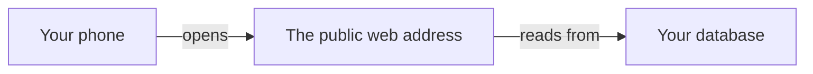

# Hello-world deploy: an empty app, truly online

## Learning objective

By the end of this lesson, you will be able to direct your agent to build the first feature on your plan — an empty app at a real public web address, connected to your database — and confirm from your own phone that the live link works before there is a single feature on it to look at.

## Why this matters

Your plan has eight features on it, and this lesson builds the first one. It is the only one of the eight that ends with nothing to look at: a page carrying your project's name, and no way to do anything on it. That is the point. Every later chunk lands on top of something already known to work in public, so when the sign-in chunk misbehaves you know the trouble is in sign-in and not in the ground underneath it. Prove the ground while it is empty and you never have to wonder about it again.

> **Following along:** Build this lesson's chunk in the app you picked in Module 0. The asks are written out for you; your agent's exact words and plan will differ from any this lesson describes, and that is normal.

> **Last verified:** 2026-08-17. Seeing your agent behave differently from what this lesson shows? On the course site, open the lesson chat ("Ask about this lesson") and tell it what you see versus what the lesson says — it can help you reconcile the difference against this exact lesson. For the full record of changes, see [`WHAT-CHANGED.md`](../../WHAT-CHANGED.md).

## Core read

> **Deviation note:** This read runs longer than most in the course. Two accounts get created in your browser rather than in the conversation with your agent, and the run that was really built is walked through step by step; the rest is the usual length.

You are not writing this app. Your agent is. Across this module the split never moves: your agent owns the code and the plumbing; you own saying what you want, watching the running app, running the chunk's checks, and saying when to save. This chunk is the cleanest example of that split, because there is no feature to get lost in — only the pipe.

Here is the pipe you are proving:

Three things have to be true at once: the app is live at an address anyone can open, that address is wired to your **Supabase** (a one-line definition: the service that gives your app an account system, a database, and file storage in one — you say its name to your agent and operate its dashboard, and never learn its internals, [→ GLOSSARY](../../GLOSSARY.md#supabase)) database, and the wiring is set up in the live place, not only on your machine. When all three hold, you have your first **deploy** (a one-line definition: moving an app off your own machine to a public address anyone on the internet can reach, [→ GLOSSARY](../../GLOSSARY.md#deployment)).

Your agent handles all of it: creating the empty app, connecting it to your database, every part of setting up and saving the project's history, and getting it live on **Vercel** (a one-line definition: the service that runs your code on the public internet and serves it at a web address, [→ GLOSSARY](../../GLOSSARY.md#vercel)). Two small pieces are yours. First, two accounts have to exist, and only you can create them. Second, when your agent asks you for one labelled value off a dashboard, you hand it over — after the question below.

> **Note:** None of the deploy machinery is taught here. Which files your agent creates, how it connects them to your database, how it gets the app onto the public internet — that is its job, and you are never asked to write or repair any of it. Your job is to notice, to check, and to say when to save.

### First, the two accounts

Nothing in this course has needed an account beyond your agent app and GitHub. This chunk needs two more: a Supabase account, where your database will live, and a Vercel account, where the app goes live. Both are created in your browser, by you, and both free plans cover everything this module builds.

This part is hands, not steering. Your agent cannot sign up on your behalf, and it cannot click the confirmation link that lands in your email. Ask it to walk you through them one at a time — it can tell you which page to open, what to call the project, and what to bring back to it, while you do the typing and the confirming. When you are finished you have a Supabase project with a dashboard you can open, and a Vercel account ready for the app.

While you are on the Supabase dashboard, do one small thing for yourself. Find the keys screen for your project. It lists more than one key, each sitting beside a label, and the one you want is the label reading "publishable" — its value begins `sb_publishable_`. Read those opening letters once. You are not memorising them and there is nothing in them to understand — you looked, so you know what your own dashboard actually calls the thing your agent is about to ask you for. That is the whole preparation for the one question this chunk asks you to hold.

### Pointing your agent at the first feature

Open your agent and point it at the first feature in your plan:

> Build the first feature on the plan, in this folder: start a brand-new app, connect it to my database, and get it live at a public web address I can open from my phone. No features yet, just an empty page that's really online. Tell me what you'll do, and what you need from me, before you write anything. Before you say "done", run these checks and show me the results in plain words — if you can't run one, say so instead of guessing: the app opens at a public web address anyone with the link can reach; the page carries my project's name; the live page and the page on my own computer show the same thing; nothing labelled secret is anywhere a visitor to the live page could reach.

"Tell me what you'll do before you write anything" is the same planning-before-building move you ran all through Module 3, and it earns its place here for a reason this chunk makes obvious: the work involves two accounts, two services, and a public address, and you would rather hear the shape of that before it starts than piece it together afterwards. The list at the end of the ask is this chunk's definition of done, handed over before the build so that the agreement exists before the work does — the plan lesson's ritual, now in the ask where it belongs; every chunk from here does the same.

Read what comes back and check one thing: does the plan it describes match what you asked for — an empty app, connected to your database, live at a public address that works from a phone? You are not judging how it intends to do any of it. If it has quietly added a sign-in page, or a first post, or anything else that is further down your plan's list, say so in one sentence and have it cut back to the one feature.

When the plan matches, give it the go-ahead:

> That matches what I want. Go ahead. Tell me each time you need me to copy something from a dashboard.

<!-- Grounded in the real thread-project build run, 2026-07 (archived evidence m4-c0); presented in the desktop app's framing. -->

**In Claude Code desktop:** the app proposes and waits, the same pause you have been approving since Module 2. It shows you what it wants to do next and offers Accept or Reject, and nothing on your machine changes until you accept. From there the chunk is a run of those pauses — building the empty app, wiring it to your database, setting up the project's saved history and its home page online, then putting it live — each one a proposal, a prompt from the app, and an approval from you. At the end it hands you a link.

<!-- CODEX VERIFICATION SLOT: verify wording and UI behavior against a real Codex run — user-assisted evidence pass -->

**In the ChatGPT app (Codex):** the same shape, with the app's own approval prompt wherever it is set to ask before your folder changes. The same run of steps, the same pauses, and the live link at the end.

When this chunk was really built, the run finished with the agent saying the app was live, giving the link, and listing what it had done in plain words: it built the app first to confirm it was healthy, created the hosting project and connected it to the project's home page online, put the database settings on the live site as well as on the machine, deployed, and then opened the live address itself to confirm it loaded, showed the page, and had no sign-in wall in front of it. It also said something worth expecting: that it had not needed anything copied from a dashboard that time, because it already had what it needed — and that it would flag it clearly the moment a step did need one.

### The one thing you copy

A **smell-test** (a one-line definition: a check you can run without reading a line of code — you try something and watch what the app does, [→ GLOSSARY](../../GLOSSARY.md#smell-test)) is a try, not a decode. It never asks you to look at anything your agent wrote, and it comes in exactly two shapes across this whole module. This chunk carries one of them, and it lives on a screen that is yours: your Supabase dashboard.

It is a **pre-flight question** (a one-line definition: before a step you cannot take back, you ask your agent a named question about what it changes, and wait for the answer, [→ GLOSSARY](../../GLOSSARY.md#pre-flight-question)), arriving here for the first time in the build.

> **BEFORE YOU COPY** anything off your Supabase dashboard: look at the label next to it. That screen shows more than one key. The only one you ever copy is the one labelled **publishable key** (a one-line definition: the one of Supabase's two keys that is safe to be seen — you copy it off the dashboard when your agent asks for it, and the other one, labelled secret, never leaves the dashboard, [→ GLOSSARY](../../GLOSSARY.md#publishable-key)), the one whose value begins `sb_publishable_`.
>
> **IF YOUR AGENT ASKS FOR THE SECRET ONE:** ask this before you touch anything — *"Why does this step need the secret key, and where exactly will it live?"* — and wait for the answer.

Copying is the whole of what you do with that value. You do not read it, and there is nothing in it to understand: you find the row with the right label, copy what sits next to it, and hand it over. The label is the part you look at.

The counter-question is there because of one specific way this goes wrong. Your agent can be wrong with exactly the same confidence it is right with. It has met an older name for that key thousands of times, and it can ask you for it in the same flat, certain voice it uses for everything else it tells you. Nothing in how it sounds will separate the two. What separates them is the label on your own screen not matching the words in the chat — and both of those are yours to see. So when it asks for a key by a name your dashboard does not show, say so:

> The key on my Supabase dashboard is labelled publishable and starts with `sb_publishable_`. Are you reaching for an out-of-date name?

And if anything at all asks you to put the key labelled secret somewhere a visitor could reach, stop and ask why before you move.

> **Heads up — you'll meet this again.** Your agent will walk into a step that cannot be taken back without mentioning that it cannot be taken back — not out of carelessness, but because weighing what a step costs when it goes wrong is not something it does unprompted. Module 5's watch-it-fail walkthroughs show that playing out on an app with real information in it. Here the stakes are close to zero, which is exactly why this is the right place to build the habit: the question comes before the click, every time.

### The check: the live link works away from your machine

The other thing you do with your own hands is not a smell-test at all. It is the plainest move there is — open the running app and look at it — with one condition on where you stand while you do it. It is also the check this whole chunk exists for.

> **TRY THIS:** open the live link on your phone, on your own data connection — not your home wifi, and not the computer that built it.
>
> **EXPECT:** the page loads. Something plain, carrying your project's name, with nothing on it to do.
>
> **IF IT DOESN'T:** *"The live link doesn't load on my phone — is a setting missing on the live site?"*

The phone is not a formality. This is the most common way a hello-world deploy looks finished and is not: the app runs beautifully on the machine that built it, where all the connection settings already live, and the live site was never told about any of them — so it works for you and fails for everyone else on earth. Your own computer cannot catch that, because your own computer is the one place the problem does not exist. Your phone can. A stranger's phone is what the app is actually for, and yours stands in for it.

What the page must not do is show an error screen, or spin forever without finishing. Plain and empty is a pass; that is the whole ambition of this chunk.

<!-- VERCEL VERIFICATION SLOT: verify the settings-screen claim against a real Vercel deploy — user-assisted evidence pass -->

Your Vercel dashboard does have a settings screen listing what the live site knows about, and you can open it whenever you like. The phone is still the check, though. That list stays scenery until the last lesson of this module, where you read one line of it yourself.

<!-- Grounded in the real thread-project build run, 2026-07 (archived evidence m4-c0); presented in the desktop app's framing. -->

When this chunk was really built, the live page came up at a real public address with no sign-in wall in the way: a near-black page with one line of centred text reading "thread project — online", and a second line under it saying the pipeline was live. Two lines of text on a dark background — and that is a success, because those two lines travelled from a database, through a hosting service, onto a screen that had nothing to do with the machine that made them.

### Two places your app runs from now on

Module 1's picture for going live had two rooms, and from this chunk on you are always standing in one of them. The private kitchen is the copy of your app that runs on your own computer: your agent starts it, it is alive only while it runs, and it is where every change lands first, before anything is saved. The public restaurant is the live link — the copy Vercel rebuilds and serves at the public address. They are two separate copies, and knowing which one you are looking at is half of every check in this module.

Nothing double-clicks the kitchen copy open, the way the pages in Module 0 and Module 3 did. Your agent starts it and hands you an address to open in your browser. So there are two sentences to keep, and they are yours for the rest of the module:

> Start the app on my computer and open it in my browser.

> Stop the app and start it again, then tell me what you see.

Say the first one whenever there is nothing to look at — after a fresh conversation, after you have closed the agent app between chunks, when a tab shows nothing or says it cannot connect. Say the second when a repair looks like it did nothing. A blank tab at home is not a broken app. It is usually an app that is not running, and the first sentence is the first thing to try before any steer.

Which room gets checked: every chunk's checks run in the kitchen, on your own computer. The restaurant is checked here, on your phone, and again in the last lesson, with two accounts. In between, the live copy keeps changing with every save that goes up, and the section on saving below says exactly how.

One thing the picture does not show, and this module would be dishonest to leave out. Your database is not in either room. Your Supabase project — the accounts, and soon the profiles, posts, follows and comments — is one place that both copies use. An account you make at home is an account on the live link, and the other way round; a switch you flip on the Supabase dashboard is flipped for both. Checking at home does not keep you away from the live copy's information, because they are the same information. Until the last lesson of this module, that is fine, for one reason: everything in this app is test accounts with made-up addresses and made-up posts, and nothing in it is anybody's real information. Keep it that way. Module 5 is where the same fact changes what you may do before you ask.

### When it goes sideways

The steer to keep ready is the mismatch one: *"On my computer the page loads, but the public link is blank or shows an error. I want both to behave the same. Find out why and fix it."* You are not working out the cause. You are naming what you saw, on which screen, and handing it back.

A different kind of sideways: your agent starts circling — reworking the same thing, losing the thread of what you asked for. Do not keep arguing with it. Start a fresh conversation and begin this chunk again from your last saved version, the same recovery you learned in Module 3.

And sometimes the blocker is not in the app at all.

<!-- Grounded in the real thread-project build run, 2026-07 (archived evidence m4-c0); presented in the desktop app's framing. -->

When this chunk was really built, the first attempt to go live failed — nothing wrong with the app, nothing wrong with the agent's work: the hosting account had been suspended over a billing problem. Days later, once the account was sorted out and moved to the free plan, the fix was one message:

> Earlier we set this app up and connected it to my database, but getting it live failed because my account was suspended. I've fixed it now — it's on the free plan. Pick up where we left off: get the app live at a public web address I can open from my phone, and give me the link.

It picked up, deployed, and confirmed the link. The lesson underneath is worth carrying for the rest of the module: when something will not go live, the cause is not always the code. Fix the outside thing, then tell your agent to resume — and say where you left off, because it will not remember.

### Before it is allowed to say done

Underneath both of your checks sits a layer that is your agent's job, not yours. Every chunk in this module carries a **definition of done** (a one-line definition: the checks your agent must run and show you, in plain words, before it is allowed to say a piece of work is finished, [→ GLOSSARY](../../GLOSSARY.md#definition-of-done)) — you wrote this chunk's list into your ask, before the build, and the reference copy is at the end of this lesson. Your agent runs those checks and reports what happened, and if it could not run one, it says so rather than guessing; a check reported as not run is honest, and it is yours to run or to ask about, never to count as passed. Your side is the sentence you agreed on in the plan lesson, for when "done" arrives with nothing behind it: *"Run the checks we agreed on and show me the results first."*

### Saving it

The moment the live link loads on your phone, say the sentence: *"Save this as a working version."* Your agent does every part of what that involves — **git** (a one-line definition: the tool from Module 2 that keeps every version of your project so you can go back to one, [→ GLOSSARY](../../GLOSSARY.md#git)), the project's home page online, all of it — and it never decides on its own that something is worth keeping. You decide; it saves. That saved version is your way back if the next chunk goes sideways, and from here every chunk ends with one.

From this save on, a save is four things in a row, and only the first two happen on your computer. The files change in the kitchen as your agent works. A save keeps a version of them on this computer, with a note. The copy then goes up to the project's home page online — when the sending works, as Module 2 said. And Vercel rebuilds the public copy from what went up — when the rebuild works. So the live link shows the last version whose rebuild succeeded, which is usually your last save and is not guaranteed to be. It is never the half-finished middle of a chunk, which is one more reason to save only what you have checked. The saved version on this computer is real the moment your agent confirms it, note and all — it is your way back whether or not the copy went up or the public copy rebuilt. What the other two answers tell you is different: whether a copy now exists somewhere other than this computer, and whether the live link is showing the version you just checked. So when it says "saved", ask: *"Confirm the save, whether the copy went up, and whether the live copy rebuilt successfully."* Three answers, because they are three different things, and any one of them can fail while the others hold. If the upload or the rebuild failed, you still have your saved version; say what you saw and let your agent find out why. Wait for the rebuild to succeed only when the thing you are about to check is the latest public copy.

## Exercise

Build the first feature on the plan you wrote in the last lesson, in your own agent app and your browser. The deliverable is a live link that loads on your phone, plus a saved version.

1. **Create the two accounts.** Supabase and Vercel, in your browser, one at a time. Ask your agent to walk you through each; you do the signing up and click the confirmation link in your email. Stop when you have a Supabase project with a dashboard and a Vercel account.
2. **Look at your keys screen once.** On the Supabase dashboard, find the key labelled publishable and read its opening letters — `sb_publishable_`. That is all; you are not copying anything yet.
3. **Start a fresh conversation and give it the ask.** With your project folder selected — if the app asks which folder, or your agent does not open by saying where you are in the plan, point it at the folder again and say: *"Read the plan and the house rules, and tell me where we are."* Then the ask from this lesson, word for word or in your own words with the same limits in it: no features, live at a public address, tell me what you'll do before you write anything — and the checks from the definition of done at the end of this lesson, written into the ask before you send it.
4. **Check the plan against your ask.** An empty app, connected to your database, live at a public address. If it has reached ahead into anything else on your plan's list, pull it back in one sentence.
5. **Give the go-ahead** and approve the steps as the app asks you to.
6. **If it asks you to copy a value, run the pre-flight first.** Check the label. Copy only the one labelled publishable. If it asks for the secret key, ask why this step needs it and where it will live, and wait for the answer. Some runs never ask you for anything — that is normal too.
7. **Open the live link on your phone**, on your own data connection. Confirm the page loads and carries your project's name. If there is no copy running at home to compare against, say: *"Start the app on my computer and open it in my browser."* If it fails on the phone while the app runs fine on your machine, use the mismatch steer and let your agent fix it before you go on.
8. **Save it.** *"Save this as a working version."* Then ask it to confirm all three: saved on this computer, the copy went up, and the live copy rebuilt successfully. The first answer is the one that gives you a version to go back to; the last answer is the one that says whether the public page is the one you just checked, so it is the one to wait for before you show anyone the live link.

Write down one sentence for yourself before you close the app: what you saw on your phone, and where you were standing when you saw it. It is the first time something you directed existed in public.

## Definition of done

You wrote these into the ask; this is the reference copy. Before you accept "done", your agent shows you the results of these checks, in plain words:

1. The app opens at a public web address that anyone with the link can reach.
2. The page carries your project's name.
3. The live page and the page running on your own machine show the same thing.
4. Nothing labelled secret is anywhere a visitor to your live page could reach.

If your agent says "done" without showing these, say: "Run the checks we agreed on and show me the results first."

## Checkpoint

You've got this if you can do both:

1. Open your live link on your phone and see the page load — not an error, not an endless spinner — even though there is nothing on it yet.
2. Say, in one sentence, why an app that works perfectly on your own computer can still be broken for everyone else.

## Going deeper

Optional, only if you're curious:

- Re-read [Module 1 — How it goes live](../01-mental-models/04-how-it-goes-live.md) for the picture behind what your agent just did — the same private kitchen going public, now that you have watched it happen with your own project.
- Module 5 is where you operate what you shipped here. Nothing to do now; just know that this empty app is the thing the rest of the course is built on top of.

## Loop check

> **Loop check — ask.** The plan lesson got your intent onto a page; this lesson turned the first line of that page into one ask narrow enough to hold your agent to — one feature, no extras, and the plan out loud before anything was written. That narrowness is what made everything after it possible: you could tell whether the plan came back matching, and you could tell whether the live page was the thing you asked for, because you had asked for exactly one thing. The loop step this lesson reinforces is **ask**.

## What you just did

You built the first feature on your plan: an empty app at a real public web address, connected to your database, proved from a phone before anything was on it. You did not write it — you pointed your agent at the plan, checked that its plan matched your ask, asked one question before the only step you took by hand, opened the live link yourself, and said when to save. That saved, live, empty app is the ground the next chunk stands on: next you put a front door on it, so people can sign in with an email address and a password.

## Navigation

[← Previous: The plan: what you're building, and who with](./00-the-plan.md)
[Next: Sign in with an email and a password →](./02-sign-in.md)
