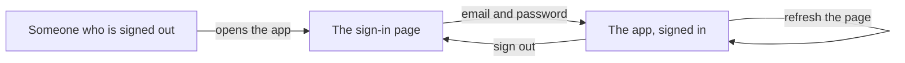

# Sign in with an email and a password

## Learning objective

By the end of this lesson, you will be able to direct your agent to put a working front door on the app you put online — someone signs in with an email address and a password, stays signed in when the page reloads, and can sign out — and check each of those things yourself in the running app.

## Why this matters

The app you put online in the last chunk is a room with no door: everyone who opens the link is the same anonymous nobody, and the app has no way to tell one person from another. That is fine for an empty page and useless for everything after it — a profile belongs to somebody, a post has an author, and neither means anything until the app knows who is standing in front of it. This chunk puts someone at the door.

## Core read

You are not writing this app. Your agent is. The split from the last chunk does not move: the agent owns the code and the plumbing; you own saying what you want, watching the running app, running a short check, and saving the version that works. What changes is that this chunk adds something people can use, so for the first time you have things to click — and clicking is most of your job.

**What this adds:** people can create an account and sign in with an email address and a password, stay signed in when they refresh the page, and sign out.

Module 1 already gave you the picture. There is a door, and someone at the door. You show who you are once, on the way in. After that they stamp your hand, so you can step out to the corridor and come back without being asked for ID all over again. At the end of the night the stamp comes off. Signing in is the ID check. Staying signed in when you refresh the page is the hand stamp. Signing out is the stamp coming off — and the failure this chunk teaches you to spot is the stamp that does not stick: you get in, you refresh, and the door staff asks for your ID again.

Here is what that looks like as screens:



> **Note:** None of the sign-in machinery is taught here. How the app remembers a signed-in person from one page to the next, which files hold it, what a sign-in error means — that is the agent's job, and you are never asked to write or repair it. Your job is to say what you want, to notice, to check, and to save.

### The one setup step that is yours

Your agent cannot click around your dashboard for you, so one thing is yours, and it is a switch, not code. Open your **Supabase** (a one-line definition: a SYMPTOM-only name for the service that gives your app an account system, a database, and file storage in one — you see it in the agent's changes, you do not learn its internals, [→ GLOSSARY](../../GLOSSARY.md#supabase)) dashboard, go to Authentication → Sign In / Providers, and turn **Confirm email** off.


That is so signing up does not wait on an email. With it off, the first time someone signs in with an address nobody has used before, their account is created and they are let straight in. Nothing else on that screen needs your attention today.

Your own dashboard may not look identical — Supabase moves things around — but the switch is named the same, and it is the only one on that page you are touching today.

### The checks you run

A **smell-test** (a one-line definition: one thing to look for and one question to ask when it is not there, [→ GLOSSARY](../../GLOSSARY.md#smell-test)) is a look, not a decode. You ask the agent to show you something, you look at what comes back, and you check whether it matches. This chunk has two.

**The awaited read.**

- LOOK FOR: ask the agent, "Show me every place you read cookies in what you just changed," and look at the lines it shows you. You want the exact text **`await cookies()`** (a one-line definition: a label to scan for, not to decode — the `await` should be sitting in front of `cookies()`, [→ GLOSSARY](../../GLOSSARY.md#async-cookies)), with the word `await` in front of it, and not a bare `cookies()` on its own.
- IF PRESENT: good — leave it as it is.
- IF ABSENT: say to the agent — "I see `cookies()` without `await` in front of it. Is that intentional?"

You are not reading those lines for meaning, and nothing in this course explains what they do. You are matching one word against one shape.

**The right file.**

- LOOK FOR: ask the agent which files it changed, and read the names. They should line up with what you asked for — sign-in things in sign-in-shaped places, and nothing from a feature you have not asked for yet.
- IF PRESENT: continue.
- IF ABSENT (a name you cannot connect to sign-in at all): ask — "why that file and not the one we named?"

When this chunk was really built, both checks came back clean. Asked to show its cookie reads, the agent came back with one line:

```
lib/supabase/server.ts:8:  const cookieStore = await cookies();
```

`await` in front, exactly the shape the check asks for. Nothing to steer. The files it had touched were `app/login/page.tsx`, `app/login/actions.ts`, `app/auth/actions.ts`, `app/page.tsx`, `lib/supabase/server.ts`, `lib/supabase/proxy.ts`, `next.config.ts`, and `proxy.ts` — two of them carrying `login` in the name, one carrying `auth`, and the rest the app's own page plus connection and setting files. Nothing about profiles or posts, because neither had been asked for.

Both checks are aimed at the same failure. Over a long back-and-forth an agent can drift: it loses the thread of what you asked, forgets a small thing it was doing correctly a few turns ago, or starts wandering into files that have nothing to do with the feature in front of it. Drift is quiet — the agent sounds exactly as confident either way — so you catch it by looking, not by listening. One missing `await`, or one file name you cannot connect to sign-in, is what it looks like from the outside.

### Checking it yourself

Open the running app and go through it in order. Each step is one thing to see.

- Open the app while signed out. You should land on a sign-in page, not on the app itself.
- Type an email address and a password and sign in. You should land in the app, signed in.
- Refresh the page. You should still be signed in.
- Sign out. You should be back at the sign-in page — and opening the app again should send you back to sign-in, not straight in.

When this chunk was really built, opening the app while signed out bounced to a sign-in page headed **Sign in**, with a line under it reading "New here? Signing in creates your account.", two boxes — one showing `you@example.com`, one showing "Password (6+ characters)" — and a **Sign in** button. Signing in as `alice@example.com` with a password landed on a page reading **thread project — online**, with "Signed in as alice@example.com" under it and a **Sign out** button. No email, no inbox, no waiting: the account was created and signed in in one step. Refreshing kept it signed in on the same page. Signing out went back to the sign-in page. Signing in again with the right address and the wrong password put one red line under the form: "That email is already registered, but the password is wrong."

Worth noticing about that address: `alice@example.com` is a throwaway that no inbox anywhere ever receives. Nothing was ever sent to it, and nobody had to open anything to get in. That is what makes it possible later to sign in as a second pretend person and watch how the two accounts see each other.

### When it goes sideways

Two steers to keep ready. Both are the same move — name what you saw on screen and hand it back:

> "I signed in fine, but the moment I refresh the page it signs me back out — that's not what I want. Find out why and fix it."

> "I get an error page when I press the sign-in button instead of being signed in. Find out why and fix it."

That second one is not hypothetical. When this chunk was really built, the first press of the sign-in button produced a red error page reading "Invalid Server Actions request." instead of signing anyone in, and pressing it again after a reload did the same thing. Nobody on the learner side worked out why. The move was to report the words on the screen and hand it back; the agent found the cause and fixed it. This is what a **Server Action** (a one-line definition: a SYMPTOM-only name for the agent's pattern for code that runs on the server when someone clicks something — you scan for it in the agent's changes, you do not learn how it works, [→ GLOSSARY](../../GLOSSARY.md#server-action)) is to you: a name that turns up in an error message and in the agent's changes, and nothing you are asked to understand.

One detail from that repair is worth keeping. After the agent changed a setting file, the same error kept appearing — and the fix was fine; the app had not picked it up. The agent said that file "is read once at startup and is not hot-reloaded." So when a fix looks like it did not work, stopping the app and starting it again is worth one try before you report the same thing a second time.

A different kind of sideways: the agent keeps circling, reworking the same thing, losing track of what you asked. Do not keep arguing with it. Type `/clear` to reset the conversation and start this chunk again from your last saved version — the same recovery you learned in Module 3.

### Saving it

Once you have signed in, refreshed, and signed out with your own hands, save the working version: "Save this as a working version." The agent does this in **git** (a one-line definition: the tool from Module 2 that keeps every version of your project so you can go back to one, [→ GLOSSARY](../../GLOSSARY.md#git)). That saved version is where `/clear` sends you back to if the next chunk goes sideways.

## Exercise

Put a working sign-in on the app you deployed in the last chunk. The deliverable is a running app you can sign in to, refresh, and sign out of — plus a saved version.

1. In your Supabase dashboard, go to Authentication → Sign In / Providers and turn **Confirm email** off. This is the one part nobody can do for you.

2. Open a fresh conversation with your agent — `/clear` first if you are picking up in a session that is already open — and ask for the plan:

   > "I want people to sign in with an email address and a password. If someone has never signed up before, signing in should create their account and let them straight in — no confirmation email. They stay signed in if they refresh the page, and there's a sign-out button. Plan this out before you write any code, and tell me what I need to set up."

3. Read what comes back. You are checking that the plan matches what you asked for — an email and a password, an account created on first sign-in, still signed in after a refresh, a way to sign out — not judging how it will do any of it.

4. When the plan matches, tell it to go:

   > "That matches what I want. Go ahead and build it."

5. Run the two smell-tests. Ask the agent to show you every place it reads cookies, and look for `await` in front of `cookies()`. Ask which files it changed, and check the names line up with sign-in. If either is off, ask the matching question and let the agent fix it before you go on.

6. Open the running app and go through all four steps: land on the sign-in page while signed out, sign in with a made-up address and a password, refresh and stay signed in, sign out and land back at sign-in.

7. If anything is off, use the matching steer — say what you saw on screen and hand it back. If a fix looks like it did nothing, stop the app and start it again once before reporting it a second time.

8. Save the working version: "Save this as a working version."

## Checkpoint

You've got this if you can do both:

1. Sign in to your running app with an address you invented, refresh the page and still be signed in, then sign out and land back at the sign-in page.
2. Say what you would look for in the agent's changes to check the awaited read, and what you would ask if it were not there — in one sentence each.

## Going deeper

Optional, only if you're curious:

- Re-read [Module 1 — Who can do what](../01-mental-models/03-who-can-do-what.md) now that the door staff and the hand stamp are a thing you have watched work.
- Sign in with a second made-up address and see the app treat it as a different person, with its own account. Nothing to build — it is the same door, opened by somebody else.

## Loop check

> **Loop check — steer.** This lesson reinforces **steer**: you stated what you wanted, then compared the running app against it and said what you saw when they did not match. The error page, the sign-out on refresh, the missing `await` — none of them ask you to work out a cause. Each one asks you to name the mismatch out loud and hand it back.

## What you just did

You put a front door on the app you shipped in the last chunk: people create an account with an email address and a password, stay signed in across a refresh, and sign out. You did not write it — you said what you wanted, ran two checks on what came back, clicked through the running app yourself, and saved the version that worked. That signed-in person is what the next chunk needs: in Lesson 2 you give them a profile, because right now the app knows who they are and nothing else about them.

## Navigation

[← Previous: Hello-world deploy: an empty app, truly online](./00-hello-world-deploy.md)
[Next: The profile page: name, bio, and photo →](./02-profile.md)
