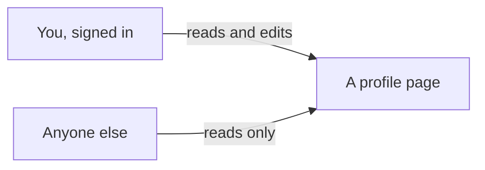

# The profile page: name, bio, and photo

## Learning objective

By the end of this lesson, you will be able to direct your agent to give every signed-in person a profile — a display name, a short bio, and a photo they upload — that anyone can read and only its owner can change, run the one database step nobody can do for you, and check both the running app and the agent's photo-upload rule yourself.

## Why this matters

Your app knows exactly one thing about the person who just signed in: the email address they typed. Not their name, not what they look like, nothing they would want anyone else to see. A profile is the first thing in this app that belongs to somebody — and the first place where two people's belongings sit side by side, which is where "anyone can look, only the owner can change" stops being obvious and turns into something you have to check.

## Core read

> **Deviation note:** This read runs longer than most in the course. One part of this chunk happens in your Supabase dashboard rather than in the conversation with your agent, so it is walked through here with screenshots; the rest is the usual length.

You are not writing this app. Your agent is. The split does not move: the agent owns the code and the rules; you own saying what you want, watching the running app, running a short check, and saving the versions that work. What changes in this chunk is that the app starts holding things people put into it — words they typed and a file they uploaded — so for the first time it matters who is allowed to touch what.

**What this adds:** every signed-in person gets a profile page with a display name, a short bio, and a photo they upload from their computer. Anyone can look at anyone's profile; only its owner can change it. The page also leaves an empty area where that person's posts will show up later.

Module 1 gave you both halves of this picture. A profile is an index card in the filing cabinet: one card per person, holding a name and a few lines about them, and anyone who walks up to the cabinet may read it. Who gets to *write* on a card is the other half — the door staff and the list they hold. Signing in got you through the door; the list is what says which card is yours to write on. The photo is the same rule in a different drawer: there is a drawer with your name on it, everything you upload goes into your drawer, and the clerk will not file your photo into somebody else's.

That last part is the failure this chunk teaches you to spot: a clerk who files anything anywhere. Your photo lands in a stranger's drawer, or a stranger's lands in yours, and nothing on the screen looks any different.

Here is what the two roles look like as screens:



> **Note:** None of the rule-writing is taught here. How the profile is stored, how the app decides who may change it, where the photo file goes — that is the agent's job, and you are never asked to write or repair it. Your job is to say what you want, to notice, to check, and to save.

### One question the agent may ask first

When this chunk was really built, the agent read the project before planning anything and then asked exactly one question: what should a profile's web address look like — the person's own account id, which it marked recommended because it needs nothing new and can never be taken, or a username people choose? The recommended one was picked, so every profile in the finished app sits at an address like `/profile/8f3a1c2e-4b7d-49a1-9e02-6c5d8b1f0a33`. A long run of letters and numbers in the address bar is what that choice looks like from the outside; it is expected, not a mistake.

That is the right shape for a question an agent asks you: about what you want, not about how anything gets built. Answer that kind. To the other kind, "you choose" is a fine answer.

### The one step that is yours

The agent will write a file of instructions for your database — the profile itself, and the rules about who may read it, change it, and upload a photo. It cannot run that file for you. Only you can, from your **Supabase** (a one-line definition: a SYMPTOM-only name for the service that gives your app an account system, a database, and file storage in one — you see it in the agent's changes, you do not learn its internals, [→ GLOSSARY](../../GLOSSARY.md#supabase)) dashboard. When this chunk was really built the agent said so plainly, before writing a line: "You'll paste this into the Supabase SQL editor yourself — I can write the file but I can't run it against your project." It also said what skipping it would look like: everything after it fails with "table not found".

So: open your Supabase dashboard, find the SQL Editor in the strip of icons down the left edge, start a new query, paste in the whole file the agent tells you to open, and press Run.


Pressing Run raises a dialog first.


The wording is alarming and the file is not. What trips that warning is the handful of lines that clear out an earlier copy of the file's *own* rules before writing them again — which is exactly what makes the file safe to run twice, and the file's opening note says so. Read that note before you dismiss the dialog. If it does not account for the warning, do not press Run query yet: ask the agent what in this file is destructive, and wait for an answer you are happy with. When it does, press Run query. The Results pane comes back with "Success. No rows returned" — nothing came back because nothing was asked for; things were made.

Your own dashboard may not look identical — Supabase moves things around — but the SQL Editor is named the same, and the file you paste is the one your agent points you at.

### The checks you run

A **smell-test** (a one-line definition: one thing to look for and one question to ask when it is not there, [→ GLOSSARY](../../GLOSSARY.md#smell-test)) is a look, not a decode. Two of them belong to this chunk, and both are about the photo — because the photo is the one thing here that arrives as a file from somebody's computer.

**Your own folder.**

- LOOK FOR: ask the agent, "Show me the rules for the photo upload," and read what comes back for a rule that fences each person into their own folder.
- IF PRESENT: good — one person cannot upload into another person's folder.
- IF ABSENT: say — "What stops one person from uploading files into another person's photo folder? Show me the rule that prevents it."

**Who can look, and who can upload.**

- LOOK FOR: photo storage set so that anyone can view a photo, but only the signed-in owner can upload one.
- IF PRESENT: viewing is open, uploading is locked to the owner — which is what you asked for.
- IF ABSENT: say — "Is the photo storage wide open for anyone to upload to? Walk me through who is allowed to upload and who isn't."

When this chunk was really built, the ask went out in the same message that told the agent to hold off on saving anything until the app had been checked:

> "show me the part of your changes with the photo upload rules - I want to see the rule that fences each person into their own folder, and who is allowed to view versus upload."

What came back was a small table — one row for adding a photo, one for replacing one, one for deleting one — and for each row, two plain-English columns: which files that person may touch, and what the result is allowed to look like afterwards. Every row was fenced the same way, to that person's own folder. The agent added why the replace row needs both halves: with only the first, somebody could take a file they legitimately own and move it into another person's folder.

Then it showed a second fence, in the app's own code — the one line that decides where a photo goes:

```
const newPath = `${user.id}/${Date.now()}.${extension}`;
```

You are not reading that for meaning. The shape you are matching is that the folder comes from *whoever is signed in*, not from anything the form sent. The agent called that "belt and braces on purpose": the app code makes the normal path work, and the database rules hold when somebody skips the app entirely.

Then it volunteered something nobody had asked about. The size cap on a photo, and the check that the uploaded file is really an image, both live only in the app's own code — so someone with a real login who went around the app could push a 50 MB file into their folder. Still their own folder, still fenced, but not checked for size or type. It said it had left that out to keep the first version readable, and offered to close it later.

That is the shape of what these two checks exist to catch. **risk-blindness** (a one-line definition: the agent proposing something with real consequences in the same calm tone it uses for fixing a typo, [→ GLOSSARY](../../GLOSSARY.md#risk-blindness)) is the failure mode Module 2 named. Here it did not bite — the agent raised the gap itself and said what it had traded away. It will not always. When it does not, the thing standing between an open door and a shipped app is you asking who is allowed to do what, and holding the answer against what you asked for.

One more, carried over from Module 3.5. The edit form is something you type into and press a button on, which makes it the kind of file that carries a label saying so.

**The interactive file.**

- LOOK FOR: ask the agent which file holds the edit form, and read the top of the file it points at. You want the literal `'use client'` sitting there on its own line.
- IF PRESENT: the interactive piece is marked — nothing to do.
- IF ABSENT: say — "does this file need `'use client'`?" You are not deciding that; you are asking it.

### Checking it yourself

Open the running app and go through it in order. Each step is one thing to see.

- Open your own profile — signed in, from the link on the home page. Before you have set anything, it should tell you the profile is not set up yet, offer a way to set it up, and already show a posts area with nothing in it.
- Set a display name and a bio, choose a photo file, and save. You should land back on your profile page with the photo, the name, and the bio on it. Refresh the page: all three still there.
- Sign out and open that same profile address directly. The name, bio, and photo are visible — and there is no edit link or edit form anywhere on the page.
- Sign in as a second person, with a second made-up address, and open the first person's profile. Same view-only page, no edit link.
- Edit again, changing only the bio, and leave the photo box empty. The photo should survive.

When this chunk was really built, all five held. The fresh profile read "You haven't set up your profile yet." with a "Set up your profile" link and a Posts section reading "Nothing here yet." After saving a name, a two-line bio, and a photo, the page came back carrying all three plus the Posts section, and a refresh kept them. Signed out, the same address showed everything and offered nothing to press — and a second account, created the way Lesson 1 left it by signing in with a new address, saw exactly the same page. The edit form pre-filled the current values and showed the current photo under the caption "Leave the file empty to keep this photo."

### When it goes sideways

Three steers to keep ready. The first two are the same move you already know — name what you saw and hand it back:

> "When I open someone else's profile I see an edit form on it — I should only be able to edit my own. Find out why and fix it."

> "I uploaded my photo and the app let me save it into a folder that wasn't mine. That's not safe, and it's not what I want. Find out why and fix it."

The third is not a steer at all. If the profile pages complain that something does not exist — "table not found", or wording close to it — the file never made it into your database. Go back to the dashboard step above, paste it, run it, reload. The agent flagged this one in advance when this chunk was built, and it is the likeliest reason a working build looks broken today.

And the familiar one: if the agent keeps circling — reworking the same thing, losing the thread of what you asked — do not keep arguing with it. Type `/clear` to reset the conversation and start this chunk again from your last saved version.

### Saving it

This chunk is bigger than the last one. When it was really built the agent had written seven files and deliberately saved none of them, then asked whether to make the saves it had planned or wait until each piece had been checked against a real database. They waited. Once the app had been clicked through, the work went into **git** (a one-line definition: the tool from Module 2 that keeps every version of your project so you can go back to one, [→ GLOSSARY](../../GLOSSARY.md#git)) as four saved versions in order: the file for the database, the profile page anyone can read, the edit form with the photo upload, and the link to it from the home page.

Look first, save second — the habit worth keeping on any chunk that changes the database or accepts a file. If something looks wrong, ask the agent to walk you through the upload rule before you save anything.

## Exercise

Give the app you signed into in the last chunk a profile page. The deliverable is a running app where you can set a name, a bio, and a photo, where a signed-out visitor can read them and cannot change them — plus a saved version.

1. Open a fresh conversation with your agent — `/clear` first if you are picking up in a session that is already open — and ask for the plan:

   > "I want signed-in people to create a profile with a display name, a short bio, and a photo they upload from their computer. Anyone can view any profile, but a person can only edit their own. The profile page should leave an empty area where that person's posts will appear later. Plan this out before you write any code, and tell me where the uploaded photos get stored."

2. Read what comes back. You are checking that the plan matches what you asked for — a name, a bio, an uploaded photo, anyone can view, only the owner can edit, an empty space left for posts — and that it answered the last part and told you where the photos will live. If it asks you a question first, answer the ones about what you want; "you choose" is a fine answer to the rest.

3. When the plan matches, tell it to go:

   > "That matches what I want. Go ahead and build it."

4. When the agent tells you it has written a file for your database, do the step that is yours: Supabase dashboard → SQL Editor → new query → paste the whole file → Run → Run query on the dialog. Wait for "Success. No rows returned" before you go on. Nothing on the profile pages works until this is done.

5. Run the two smell-tests. Ask to see the photo-upload rules, and look for a rule fencing each person into their own folder and for viewing being open while uploading is not. If either is off, use the matching question and let the agent fix it before you go on.

6. Open the running app and go through all five checks: the empty profile with its posts area; saving a name, a bio, and a photo and refreshing; a signed-out visit to the same address with no edit link; a second account seeing the same read-only page; and an edit that leaves the photo box empty without losing the photo.

7. If anything is off, use the matching steer — say what you saw and hand it back. If the pages complain that something does not exist, go back to step 4.

8. Save the working version: "Save this as a working version."

## Checkpoint

You've got this if you can do both:

1. Open your own profile address in a browser where you are signed out, see your name, bio, and photo, and find nothing on the page that would let you change them — then sign in and change them.
2. Say what you would ask the agent in order to see the photo-upload rule, and what you would look for in the answer — in one sentence each.

## Going deeper

Optional, only if you're curious:

- Re-read [Module 1 — Who can do what](../01-mental-models/03-who-can-do-what.md), now that "anyone may read it, only the owner may change it" is a thing you have watched work in your own app.
- Ask your agent to close the gap it named — the size and file-type limits that live only in the app's own code — once everything else is working and saved. It offered; taking it up is a small, separate ask, and the app works without it.

## Loop check

> **Loop check — evaluate.** This lesson reinforces **evaluate**: you said what you wanted and let the agent build it, then went looking. Every check in it is the same shape — open the running app or ask to see a rule, hold what comes back against what you asked for, and say so when they do not match.

## What you just did

You gave everyone who signs in a profile: a name, a bio, and a photo they upload, readable by anyone and changeable only by them. You did not write it — you said what you wanted, ran the one database step nobody can do for you, asked to see the rule that keeps each person's uploads in their own folder, clicked through the running app as two different people, and saved the versions that worked. The empty area sitting on that profile page is the point: in Lesson 3 you fill it, by giving people posts to write.

## Navigation

> **Deviation note:** Lesson 3 (`03-posts.md`) is not published yet, so "Next" points at the Module 4 overview instead of the next lesson. It will point to Lesson 3 once that lesson ships.

[← Previous: Sign in with an email and a password](./01-sign-in.md)
[Next: Module 4 overview — Lesson 3 (Posts) is next →](./README.md)
