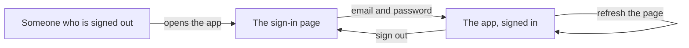

# Sign in with an email and a password

## Learning objective

By the end of this lesson, you will be able to direct your agent to build the second feature on your plan — a working front door on the app you put online, where someone signs in with an email address and a password, stays signed in when the page reloads, and can sign out — and check each of those things yourself in the running app.

## Why this matters

The app you put online in the last chunk is a room with no door: everyone who opens the link is the same anonymous nobody, and the app has no way to tell one person from another. That is fine for an empty page and useless for every feature after it — a profile belongs to somebody, a post has an author, and neither means anything until the app knows who is standing in front of it. This chunk puts someone at the door.

> **Following along:** Build this lesson's chunk in the app you picked in Module 0. The asks are written out for you; your agent's exact words and plan will differ from any this lesson describes, and that is normal.

> **Last verified:** 2026-08-17. Seeing your agent behave differently from what this lesson shows? On the course site, open the lesson chat ("Ask about this lesson") and tell it what you see versus what the lesson says — it can help you reconcile the difference against this exact lesson. For the full record of changes, see [`WHAT-CHANGED.md`](../../WHAT-CHANGED.md).

## Core read

> **Deviation note:** This read runs longer than most in the course. One part of this chunk happens on your Supabase dashboard rather than in the conversation with your agent, and the run that was really built is walked through step by step; the rest is the usual length.

You are not writing this app. Your agent is. The split from the last chunk does not move: your agent owns the code and the plumbing; you own saying what you want, watching the running app, running the chunk's checks, and saying when to save. What changes is that this chunk adds something people can actually use, so for the first time there are things to click — and clicking is most of your job today.

**What this adds:** people can create an account and sign in with an email address and a password, stay signed in when they refresh the page, and sign out.

Module 1 already gave you the picture. There is a door, and someone at the door. You show who you are once, on the way in. After that they stamp your hand, so you can step out to the corridor and come back without being asked for ID all over again. At the end of the night the stamp comes off. Signing in is the ID check. Staying signed in when you refresh the page is the hand stamp. Signing out is the stamp coming off — and the failure this chunk teaches you to spot is the stamp that does not stick: you get in, you refresh, and the door staff asks for your ID again.

Here is what that looks like as screens:

> **Note:** None of the sign-in machinery is taught here. How the app remembers a signed-in person from one page to the next, which files hold it, what a sign-in error means — that is your agent's job, and you are never asked to write or repair it. Your job is to say what you want, to notice, to check, and to say when to save.

### The one setup step that is yours

One part of this chunk happens on a screen your agent cannot reach, so it is yours — and it is a switch, not code. Open your **Supabase** (a one-line definition: the service that gives your app an account system, a database, and file storage in one — you say its name to your agent and operate its dashboard, and never learn its internals, [→ GLOSSARY](../../GLOSSARY.md#supabase)) dashboard, go to Authentication → Sign In / Providers, and turn **Confirm email** off.

That is so signing up does not wait on an email. With it off, the first time someone signs in with an address nobody has used before, their account is created and they are let straight in. Nothing else on that screen needs your attention today.

Your own dashboard may not look identical — Supabase moves things around — but the switch is named the same, and it is the only one on that page you are touching today.

### Pointing your agent at the second feature

Open your agent and point it at the second feature in your plan:

> I want people to sign in with an email address and a password. If someone has never signed up before, signing in should create their account and let them straight in — no confirmation email. They stay signed in if they refresh the page, and there's a sign-out button. Plan this out before you write any code, and tell me what I need to set up.

Read what comes back and check one thing: does the plan match what you asked for — an email and a password, an account created on first sign-in, still signed in after a refresh, a way to sign out? You are not judging how it intends to do any of it. If it has reached ahead into profiles or posts, say so in one sentence and have it cut back to the one feature.

When the plan matches, give it the go-ahead:

> That matches what I want. Go ahead and build it.

<!-- Grounded in the real thread-project build run, 2026-07 (archived evidence m4-c1); presented in the desktop app's framing. -->

**In Claude Code desktop:** the same pause you approved your way through in the last chunk. The app shows you what it wants to do next and offers Accept or Reject, and nothing on your machine changes until you accept. A sign-in feature is more steps than an empty page was, so expect a longer run of those pauses — a page to sign in on, the wiring that remembers who signed in, a way to sign out — each one a proposal, a prompt from the app, and an approval from you.

<!-- CODEX VERIFICATION SLOT: verify wording and UI behavior against a real Codex run — user-assisted evidence pass -->

**In the ChatGPT app (Codex):** the same shape, with the app's own approval prompt wherever it is set to ask before your folder changes. The same run of steps, the same pauses, and a sign-in page waiting for you at the end.

### The checks you run

Two things get checked when it comes back, and they are not quite the same kind of thing.

One of them is a **smell-test** (a one-line definition: a check you can run without reading a line of code — you try something and watch what the app does, [→ GLOSSARY](../../GLOSSARY.md#smell-test)) — the same named move you ran on your keys screen last chunk, in its other shape. The other is plainer than that: you open the running app and watch it behave. Neither one asks you to look at anything your agent wrote.

**Still signed in across a refresh.** This is the plain one — no trickery, just the app doing what sign-in means.

> **TRY THIS:** sign in, then refresh the page. Then sign out and refresh again.
>
> **EXPECT:** still signed in after the first refresh; still signed out after the second.
>
> **IF NOT:** say which half failed — *"I get signed out the moment I refresh the page. Staying signed in across a reload is part of what sign-in means. Find out why and fix it."*

**Signed-out visitors bounce off account pages.** This one is the smell-test, and it is the first **refusal check** (a one-line definition: in the running app you try the thing that should NOT be allowed and confirm it is refused — and if it goes through, you tell your agent what you did and what should have stopped it, [→ GLOSSARY](../../GLOSSARY.md#refusal-check)) of the build. From this chunk on, every chunk has one.

> **TRY THIS:** in a private window that has never signed in, open a page that needs an account.
>
> **EXPECT:** you land on sign-in, or it refuses.
>
> **IF YOU GET STRAIGHT IN:** *"Signed out, I can still open ⟨page⟩. That should need an account. Fix that."*

Both checks are aimed at the same failure. Over a long back-and-forth an agent can drift: it loses the thread of what you asked, forgets a small thing it was doing correctly a few turns ago, or starts wandering into work you never asked for. Drift is quiet — your agent sounds exactly as confident either way — so you catch it from the outside, in what the running app does: a session that does not survive a refresh, or a door that stopped being a door. You do not go hunting for the cause. You name what you saw and hand it back.

### Checking it yourself

Open the running app and go through it in order. Each step is one thing to see.

- Open the app while signed out. You should land on a sign-in page, not on the app itself.
- Type an email address and a password and sign in. You should land in the app, signed in.
- Refresh the page. You should still be signed in.
- Sign out. You should be back at the sign-in page — and opening the app again should send you back to sign-in, not straight in.

<!-- Grounded in the real thread-project build run, 2026-07 (archived evidence m4-c1); presented in the desktop app's framing. -->

When this chunk was really built, opening the app while signed out bounced to a sign-in page headed **Sign in**, with a line under it reading "New here? Signing in creates your account.", two boxes — one showing `you@example.com`, one showing "Password (6+ characters)" — and a **Sign in** button. Signing in as `alice@example.com` with a password landed on a page reading **thread project — online**, with "Signed in as alice@example.com" under it and a **Sign out** button. No email, no inbox, no waiting: the account was created and signed in in one step. Refreshing kept it signed in on the same page. Signing out went back to the sign-in page. Signing in again with the right address and the wrong password put one red line under the form: "That email is already registered, but the password is wrong."

Worth noticing about that address: `alice@example.com` is a throwaway that no inbox anywhere ever receives. Nothing was ever sent to it, and nobody had to open anything to get in. That is what makes it possible later to sign in as a second pretend person and watch how the two accounts see each other.

### When it goes sideways

Two steers to keep ready. Both are the same move — name what you saw on screen and hand it back:

> "I signed in fine, but the moment I refresh the page it signs me back out — that's not what I want. Find out why and fix it."

> "I get an error page when I press the sign-in button instead of being signed in. Find out why and fix it."

<!-- Grounded in the real thread-project build run, 2026-07 (archived evidence m4-c1); presented in the desktop app's framing. -->

That second one is not hypothetical. When this chunk was really built, the first press of the sign-in button produced a red error page instead of signing anyone in, and pressing it again after a reload did the same thing. Nobody on the learner side worked out why, and nobody had to: the move was to say what happened and where — a red error page, on pressing Sign in — and hand it back. Your agent reads the details itself. It found the cause and fixed it.

One detail from that repair is worth keeping. After the fix went in, the same error kept appearing — and the fix was fine; the running app had not picked it up yet. So when a repair looks like it did nothing, say so and ask for one thing before you report the same problem twice: *"Nothing changed on my screen. Can you stop the app and start it again, then tell me what you see?"* Starting it up again is your agent's job, not yours.

A different kind of sideways: your agent keeps circling, reworking the same thing, losing track of what you asked. Do not keep arguing with it. Start a fresh conversation and begin this chunk again from your last saved version — the same recovery you learned in Module 3.

### Before it is allowed to say done

Underneath your two checks sits the layer that is your agent's job. This chunk's **definition of done** (a one-line definition: the checks your agent must run and show you, in plain words, before it is allowed to say a piece of work is finished, [→ GLOSSARY](../../GLOSSARY.md#definition-of-done)) is at the end of this lesson. Your agent runs those checks and reports what happened; your side is the sentence from the plan lesson, for when "done" arrives with nothing behind it: *"Run the checks we agreed on and show me the results first."*

### Saving it

Once you have signed in, refreshed, and signed out with your own hands, say the sentence: *"Save this as a working version."* Your agent does every part of what that involves — **git** (a one-line definition: the tool from Module 2 that keeps every version of your project so you can go back to one, [→ GLOSSARY](../../GLOSSARY.md#git)), the project's home page online, all of it — and it never decides on its own that something is worth keeping. You decide; it saves. That saved version is what a fresh conversation sends you back to if the next chunk goes sideways.

## Exercise

Build the second feature on your plan: a working front door on the app you put online last chunk. The deliverable is a running app you can sign in to, refresh, and sign out of — plus a saved version.

1. **Flip the one switch that is yours.** Supabase dashboard → Authentication → Sign In / Providers → **Confirm email** off, then save the change. This is the part nobody can do for you.
2. **Start a fresh conversation and give it the ask.** The one from this lesson, word for word or in your own words with the same limits in it: an email and a password, an account created on first sign-in, still signed in after a refresh, a sign-out button, and the plan before any code.
3. **Check the plan against your ask.** You are checking that it matches what you asked for, not judging how it will do any of it. If it has reached ahead into profiles or posts, pull it back in one sentence.
4. **Give the go-ahead** and approve the steps as the app asks you to.
5. **Go through the running app in order:** land on the sign-in page while signed out, sign in with a made-up address and a password, refresh and stay signed in, sign out and land back at sign-in.
6. **Run the refusal check.** In a private window that has never signed in, open a page that needs an account. It should bounce you to sign-in.
7. **If anything is off, use the matching steer** — say what you saw on screen and hand it back. If a repair looks like it did nothing, ask your agent to stop the app and start it again before you report the same thing a second time.
8. **Save it.** *"Save this as a working version."*

## Definition of done

Before you accept "done", your agent shows you the results of these checks, in plain words:

1. A brand-new email address can sign in and lands inside the app.
2. Refreshing the page keeps that person signed in.
3. Sign-out works, and a refresh afterwards leaves them signed out.
4. A signed-out visitor cannot reach a page that needs an account.

If your agent says "done" without showing these, say: "Run the checks we agreed on and show me the results first."

## Checkpoint

You've got this if you can do both:

1. Sign in to your running app with an address you invented, refresh the page and still be signed in, then sign out and land back at the sign-in page.
2. Say what you would try in the running app to prove sign-in really holds — the refresh, and the signed-out door — and what you would say to your agent if either failed, in one sentence each.

## Going deeper

Optional, only if you're curious:

- Re-read [Module 1 — Who can do what](../01-mental-models/03-who-can-do-what.md) now that the door staff and the hand stamp are a thing you have watched work in your own app.
- Sign in with a second made-up address and see the app treat it as a different person, with its own account. Nothing to build — it is the same door, opened by somebody else. You will want that second person soon.

## Loop check

> **Loop check — steer.** This lesson reinforces **steer**: you stated what you wanted, then compared the running app against it and said what you saw when they did not match. The error page, the sign-out on refresh, the door that stopped bouncing — none of them ask you to work out a cause. Each one asks you to name the mismatch out loud and hand it back.

## What you just did

You put a front door on the app you shipped in the last chunk: people create an account with an email address and a password, stay signed in across a refresh, and sign out. You did not write it — you flipped one switch on a dashboard, said what you wanted, clicked through the running app yourself, ran the build's first refusal check, and said when to save. That signed-in person is what the next chunk needs: next you give them a profile — a name, a short bio, and a photo — because right now your app knows who they are and nothing else about them.

## Navigation

[← Previous: Hello-world deploy: an empty app, truly online](./01-hello-world-deploy.md)
[Next: The profile page: name, bio, and photo →](./03-profile.md)
