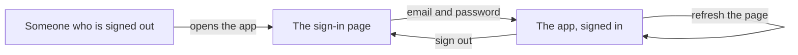

# Sign in with an email and a password

## What you'll have at the end

A front door on the app you put online: someone signs in with an email address and a password, stays signed in when the page reloads, and can sign out — each of those checked by you in the running app. Until now everyone who opens the link is the same anonymous nobody, and a profile or a post means nothing until the app knows who is standing in front of it.

> **Following along:** Build this lesson's chunk in the app you picked in Module 0. The asks are written out for you; your agent's exact words and plan will differ from any this lesson describes, and that is normal.

> **Last verified:** 2026-08-17. Seeing your agent behave differently from what this lesson shows? On the course site, open the lesson chat ("Ask about this lesson") and tell it what you see versus what the lesson says — it can help you reconcile the difference against this exact lesson. For the full record of changes, see [`WHAT-CHANGED.md`](../../WHAT-CHANGED.md).

## What this adds

People create an account and sign in with an email address and a password, stay signed in when they refresh the page, and sign out. Module 1's picture: you show who you are once at the door, they stamp your hand, and you come and go without being asked for ID again — until you sign out. The thing to spot is the stamp that does not stick: you get in, you refresh, and you are asked for ID again.

## Before you ask

One switch on a screen your agent cannot reach. Open your **Supabase** (a one-line definition: the service that holds your app's accounts and database — you open its dashboard when a lesson says to, [→ GLOSSARY](../../GLOSSARY.md#supabase)) dashboard, go to Authentication → Sign In / Providers, turn **Confirm email** off, and press **Save changes**.

With it off, the first time someone signs in with an address nobody has used before, their account is created and they are let straight in — no waiting on an email. Your dashboard may not look identical (Supabase moves things around), but the switch is named the same.

One honest thing about that switch. It is a setting on your database, which the copy on your computer and the public copy share. So from the save that carries this chunk, anybody who has your public address can create an account there. A long address nobody has been told is not a lock — links get forwarded. That is fine for now because everything in this app until Lesson 8 is made-up addresses and made-up posts. Keep it that way: test accounts only, nothing you would mind a stranger reading, and no handing the link around until Lesson 8 has checked it live.

## The ask

Start a fresh conversation with your project folder selected. If your agent does not open by saying where you are in the plan, say: *"Read the plan and the house rules, and tell me where we are."* Then:

> I want people to sign in with an email address and a password. If someone has never signed up before, signing in should create their account and let them straight in — no confirmation email. They stay signed in if they refresh the page, and there's a sign-out button. Plan this out before you write any code, and tell me what I need to set up. Before you say "done", run these checks and show me the results in plain words — if you can't run one, say so instead of guessing: a brand-new email address can sign in and lands inside the app; refreshing the page keeps that person signed in; sign-out works, and a refresh afterwards leaves them signed out; a signed-out visitor cannot reach a page that needs an account.

Check the plan against what you asked for — an email and a password, an account created on first sign-in, still signed in after a refresh, a way to sign out. If it has reached ahead into profiles or posts, say so in one sentence and have it cut back. Then:

> That matches what I want. Go ahead and build it.

<!-- Grounded in the real thread-project build run, 2026-07 (archived evidence m4-c1); presented in the desktop app's framing. -->

Approve the steps as the app asks — more of them than the empty page needed. If your agent says it needs to install something first, that is the house rule from Lesson 0 at work; approve it and let it confirm the tool works.

<!-- CODEX VERIFICATION SLOT: verify wording and UI behavior against a real Codex run — user-assisted evidence pass -->

## Check it

Open the running app — if nothing is open, or the tab says it cannot connect: *"Start the app on my computer and open it in my browser."* Go through it in order: land on the sign-in page while signed out; sign in with a made-up address and a password; refresh and stay signed in; sign out and land back at sign-in.

> **TRY THIS:** sign in, then refresh the page. Then sign out and refresh again.
>
> **EXPECT:** still signed in after the first refresh; still signed out after the second.
>
> **IF NOT:** say which half failed — *"I get signed out the moment I refresh the page. Staying signed in across a reload is part of what sign-in means. Find out why and fix it."*

> **TRY THIS:** in a private window that has never signed in, open a page that needs an account.
>
> **EXPECT:** you land on sign-in, or it refuses.
>
> **IF YOU GET STRAIGHT IN:** *"Signed out, I can still open ⟨page⟩. That should need an account. Fix that."*

<!-- Grounded in the real thread-project build run, 2026-07 (archived evidence m4-c1). -->

When this chunk was really built, opening the app while signed out bounced to a page headed **Sign in**, with "New here? Signing in creates your account." under it, two boxes, and a **Sign in** button. Signing in as `alice@example.com` landed on a page reading **thread project — online**, with "Signed in as alice@example.com" and a **Sign out** button. Refreshing kept it signed in; signing out went back to the sign-in page; the right address with the wrong password put one red line under the form. That address is a throwaway no inbox receives — which is what lets you sign in later as a second pretend person.

## If something is wrong

Name what you saw on screen and hand it back:

- *"I signed in fine, but the moment I refresh the page it signs me back out — that's not what I want. Find out why and fix it."*
- *"I get an error page when I press the sign-in button instead of being signed in. Find out why and fix it."*
- **A repair looks like it did nothing:** *"Nothing changed on my screen. Can you stop the app and start it again, then tell me what you see?"* — before you report the same problem twice.
- **Your agent keeps circling:** start a fresh conversation and begin this chunk again from your last saved version.

<!-- Grounded in the real thread-project build run, 2026-07 (archived evidence m4-c1). -->

The error-page steer is not hypothetical: when this chunk was really built, the first press of the sign-in button produced a red error page, and again after a reload. Nobody on the learner side worked out why; saying what happened and where was the whole move, and the agent found the cause and fixed it. The same error kept showing after the fix went in — the running app had not picked it up yet, which is where the stop-and-start sentence came from.

## Save it

Once you have signed in, refreshed, and signed out with your own hands: *"Save this as a working version."* Then ask it to confirm all three — saved on this computer, the copy went up, and the live copy rebuilt successfully. From this save on, the live link has a front door too.

## What "done" means

You wrote these into the ask. Before you accept "done", your agent shows you the results in plain words. If it could not run one, that check is yours to run or ask about — never to count as passed.

1. A brand-new email address can sign in and lands inside the app.
2. Refreshing the page keeps that person signed in.
3. Sign-out works, and a refresh afterwards leaves them signed out.
4. A signed-out visitor cannot reach a page that needs an account.

If your agent says "done" without showing these, say: "Run the checks we agreed on and show me the results first."

You're done when you can sign in with an invented address, stay signed in across a refresh, sign out, and be bounced from a private window — and you have a saved version. Next: a profile, because right now your app knows who someone is and nothing else about them.

## Navigation

[← Previous: Put your app online](./01-hello-world-deploy.md)
[Next: The profile page: name, bio, and photo →](./03-profile.md)
