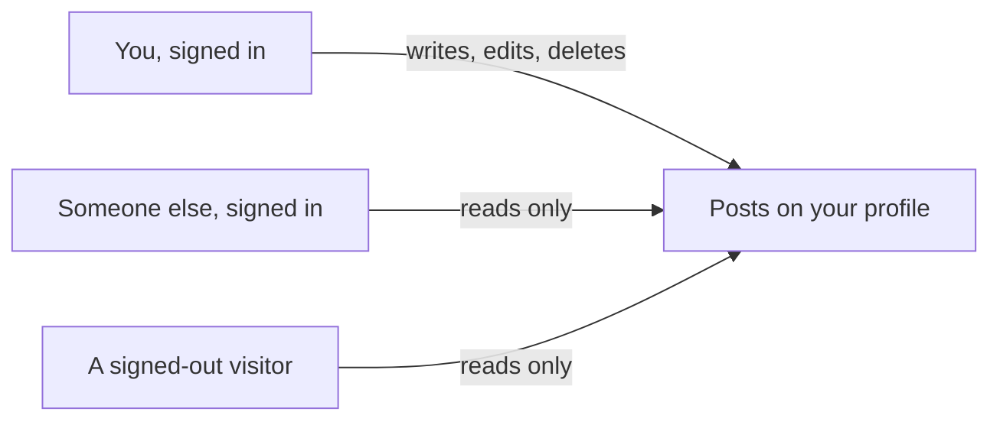

# Posts: write, edit, and delete your own

## Learning objective

By the end of this lesson, you will be able to direct your agent to give every signed-in person posts they can write, edit, and delete — with an optional picture — that anyone can read without signing in, run the database step a second time yourself, and check the one thing that stops a post from being edited into somebody else's name.

## Why this matters

The profile you built has a name, a face, a couple of lines about you, and an area underneath reading "Nothing here yet." A nameplate on a door with nobody behind it. Posts are the first thing in this app that other people come to the app to read — and the first thing where "who wrote this" is a claim the app has to keep true even when someone tries to bend it.

## Core read

> **Deviation note:** This read runs longer than most in the course. One part of this chunk happens in your Supabase dashboard rather than in the conversation with your agent, and the check that carries this chunk needs a worked example to be usable, so both are walked through here.

You are not writing this app. Your agent is. The split does not move: the agent owns the code and the rules; you own saying what you want, watching the running app, running a short check, and saving the version that works. What changes in this chunk is that a thing in your app now carries a name on it — every post says who wrote it — and a name on a thing is only worth as much as whatever stops somebody changing it.

**What this adds:** a signed-in person writes a short post, attaches one picture if they want, and it appears on their profile where the empty area was. They can edit or delete their own posts and nobody else's. Anyone can read posts on a profile, signed in or not.

Module 1's filing cabinet gets a second drawer. The first drawer holds one index card per person — the profile you built last chunk. The new drawer holds one card per post, and every card in it has a name written in the corner: whose post this is. The cabinet stands in a lobby anyone can walk into and read from, which is the part that makes posts worth writing at all. Writing on a card is the other half, and that is where the door staff and their list come back in.

Here is the thing worth slowing down on, because it is the failure this chunk teaches you to spot. When you hand a card back to be re-filed, the staff have two separate questions to ask, not one. First: is this card yours to take out of the drawer? Second: does the card still have *your* name in the corner now that you have written on it? Staff who ask only the first question are doing something that looks completely correct — nobody is touching anyone else's card — while leaving the door open to the strangest kind of theft. You take your own card, rub out your name, write mine in the corner, and hand it back. It was yours to edit. It is now a card in the drawer that says I wrote something I never wrote.

Both roles as screens:



> **Note:** None of the rule-writing is taught here. How a post is stored, how the app decides who may change one, how the picture gets attached — that is the agent's job, and you are never asked to write or repair it. Your job is to say what you want, to notice, to check, and to save.

### One thing the agent will raise

When this chunk was really built, the agent read the project first and then made a point of saying something nobody had asked about: display names are not unique. Two people can both call themselves Alice. A post is tied to the account that wrote it, not to the name shown on it, so the app never mixes up who the author is — but a reader looking at two profiles cannot tell two Alices apart by name alone. Unique handles, or a verified badge, would fix that. It offered to build them and said it was a product decision, not a bug.

The answer given was "leave handles for another time." That is a fine answer, and the shape of the exchange is what to notice: the agent surfaced a limitation of what you asked for, in plain terms, before building it. Say yes or say later. What you should not do is skip past it — a thing the agent tells you about your own product is worth ten minutes now and a rebuild later.

### The step that is yours, again

Same as last chunk: the agent writes a file of instructions for your database — the posts themselves, and the rules about who may read them, write them, change them, and delete them — and it cannot run that file for you. Only you can, from your **Supabase** (a one-line definition: a SYMPTOM-only name for the service that gives your app an account system, a database, and file storage in one — you see it in the agent's changes, you do not learn its internals, [→ GLOSSARY](../../GLOSSARY.md#supabase)) dashboard.

Two differences from last time. This file opens with a note saying to run the profile file first if you have not, because the posts it creates point at accounts that need to already exist — so run these in the order the lessons give you. And in the SQL Editor you are opening a *new* query alongside the one still sitting there from last chunk, not typing over it.

![The Supabase dashboard, on the SQL Editor page. A numbered marker ① points to the small "+" button at the top of the editor, beside the tab of the query left over from the last chunk — pressing it opens a new, empty query alongside the old one. Marker ② points to the large query area in the middle, holding the whole file the agent wrote, scrolled to its last lines — the rule about deleting your own post pictures is the part visible. Marker ③ points to the green Run button at the top right, which you press once the file is in.](../../screenshots/m4/03-posts/run-posts-migration.png)

Pressing Run raises the same "Potential issue detected" dialog you met in the last chunk, for the same reason. Read the file's opening note first. If the note does not account for the warning, do not press Run query yet: ask the agent what in this file is destructive, and wait for an answer you are happy with. When it does, press Run query. The Results pane comes back with "Success. No rows returned" — nothing came back because nothing was asked for; things were made.

Your own dashboard may not look identical — Supabase moves things around — but the SQL Editor is named the same, and the file you paste is the one your agent points you at.

### The checks you run

A **smell-test** (a one-line definition: one thing to look for and one question to ask when it is not there, [→ GLOSSARY](../../GLOSSARY.md#smell-test)) is a look, not a decode. This chunk has the two most valuable ones in the module, and they are the two halves of what you asked for: nobody else may write your posts, and everybody may read them.

**The safety latch on every edit rule.**

- LOOK FOR: ask the agent to show you every rule it wrote for editing or updating a post, and look for the words **`WITH CHECK`** (a one-line definition: a SYMPTOM-only label for the safety latch on a rule that lets someone change something — you scan for the words next to every edit rule in the agent's changes, you do not learn what the rule says or how it is written, [→ GLOSSARY](../../GLOSSARY.md#with-check)) sitting next to each one.
- IF PRESENT: continue — it is there.
- IF ABSENT: say — "The edit rule doesn't have `WITH CHECK` on it — what stops someone from editing a post so it shows a different person's name as the author?"

**The rule that lets anyone read.**

- LOOK FOR: a rule that lets anyone read posts, signed in or not, so a signed-out visitor opening a profile can see what is on it.
- IF PRESENT: continue — it is there.
- IF ABSENT: say — "Is there a rule that lets signed-out visitors read posts on a profile? I didn't see one — can you check?"

When this chunk was really built, both went out in one message — sent while the file was being run in the dashboard, and before anything had been saved:

> "While I do that, show me two things from your changes: every edit or update rule you wrote for posts - I want to see the words WITH CHECK next to each one - and the rule that lets signed-out visitors read posts."

Two edit rules came back — one for posts, one for the pictures attached to them — and both carried the words. The agent added three things nobody had asked for, and all three are worth having. The same words also sit on the two rules for *creating* a post and uploading a picture, because a post with somebody else's name on it has to be refused at the moment it is written, not only when it is edited. The two rules for deleting carry no such words, because a deleted card has no "after" to inspect. And those were all of them: two edit rules in the whole change, both latched.

For the second check it pointed at three lines and named them in plain English:

```
create policy "Posts are readable by everyone"
  on public.posts for select
  using (true);
```

You are not reading that for grammar, and nothing in this course explains it. The rule is named in a sentence you can read, and the sentence says what you asked for. That is the whole check. If the wording is different from this, that is still a question for the agent — ask what its version means in one line.

One more, carried over from last chunk: the box you type a post into is something you type into and press a button on, so the same `'use client'` look from Lesson 2 still applies to whatever file holds it.

### What the check is actually for

Rub out the name, write mine, hand the card back. **risk-blindness** (a one-line definition: the agent proposing something with real consequences in the same calm tone it uses for fixing a typo, [→ GLOSSARY](../../GLOSSARY.md#risk-blindness)) is the failure mode Module 2 named, and this is its sharpest shape in the whole build: an app where every screen looks right, every person edits only their own posts, and one of them can put your name on their words. Nothing on the screen tells you. The words `WITH CHECK` next to the edit rule are the whole of what you have to see.

Here it did not bite. When this chunk was really built, the agent went at the finished build from the outside before anyone had clicked anything — it asked the live database to store a post with a hand-picked author on it, with nobody signed in at all, and the database refused:

```
401  new row violates row-level security policy for table "posts"
```

You are not decoding that sentence. The database wrote it, not you, and the only part you need is that the attempt came back refused instead of stored. The same pass confirmed the other half: with nobody signed in, asking for the posts returned an empty list rather than an error, which is what a rule letting anyone read looks like before any post exists.

> **Heads up — you'll meet this again.** An edit rule with no safety latch is the first of the three "watch the AI fail" walkthroughs Module 5 puts you in front of. You already have the smell-test for it — it is the one above. Module 5 is where you watch what it looks like when nobody runs it.

### Checking it yourself

Open the running app and go through it in order. Each step is one thing to see.

- Write a post and save it. It should appear on your own profile where the empty area was, with its date.
- Write a second post with a picture attached. The picture should show in the post.
- Edit the first post. The text changes — and the name on it is still yours.
- Delete a post. It should be gone after the page reloads.
- Sign out and open your own profile address. The posts are still readable, the picture still loads, and there is nothing on the page to write, edit, or delete with.
- Sign in as your second person and open the first person's post-editing address directly, by typing it into the address bar. You should not get an editing page.

When this chunk was really built, all six held. Alice's first post appeared with its date and an Edit link; a second post with a file attached rendered the picture; editing the first one changed the text, left the author alone, and put a small "· edited ·" marker next to the date; deleting the picture post removed the post and its picture file both. Signed out, the same profile showed the remaining post with no box to write one in and no Edit link anywhere on it. The edit page pre-filled the existing text, showed the current picture under "Leave the file empty to keep this picture." with a "Remove the picture from this post" checkbox, and kept its Delete button below a divider reading "This cannot be undone."

The last one is the one worth doing properly. Signed in as Bob, opening Alice's editing address directly returned a 404 — a page-not-found. The agent's own note on that is worth keeping: "the page 404s if the post isn't yours, but that's only tidiness — the lock is in the database." The page being missing is a courtesy. The refusal you saw above is the lock.

### When it goes sideways

Three steers to keep ready. The first two are the same move you know — name what you saw and hand it back:

> "I edited my post and the author name changed to someone else — that should never be possible. Find out why and fix it so a post always keeps its real author."

> "I signed out, opened a profile, and the posts were gone or it made me sign in. Anyone should be able to read posts. Find out why and fix it."

The third is not a steer. If the profile pages complain that something does not exist — "table not found", or wording close to it — the file never made it into your database. Go back to the dashboard step above, paste it, run it, reload.

And the familiar one: if the agent keeps circling — reworking the same thing, losing the thread of what you asked — do not keep arguing with it. Type `/clear` to reset the conversation and start this chunk again from your last saved version.

### Saving it

Look first, save second. When this chunk was really built the saving was held back on purpose until the app had been clicked through, and then the whole chunk went into **git** (a one-line definition: the tool from Module 2 that keeps every version of your project so you can go back to one, [→ GLOSSARY](../../GLOSSARY.md#git)) as one saved version carrying four things: the file for the database, the code behind writing and editing and deleting, the edit page, and the profile page that now lists posts.

That first item is the one to watch. This chunk changed your database, so the file that changed it belongs in the saved version alongside the rest — otherwise the saved version cannot rebuild the app it describes. If the agent lists what it saved and the database file is not among them, ask where it went.

## Exercise

Give the profile you built last chunk something to hold. The deliverable is a running app where you can write, edit, and delete your own posts with an optional picture, where a signed-out visitor can read them and change nothing — plus a saved version.

1. Open a fresh conversation with your agent — `/clear` first if you are picking up in a session that is already open — and ask for the plan:

   > "I want signed-in people to write a short text post, with an optional picture, that appears on their profile. They should be able to edit or delete their own posts, but nobody else's. And anyone, even signed-out visitors, should be able to read posts on a profile. Plan this out before you write any code, and tell me how you'll make sure one person can't edit a post to make it look like someone else wrote it."

2. Read what comes back. You are checking that the plan matches what you asked for — write, edit, delete, your own only, an optional picture, readable by anyone — and that it answered the last part with something specific rather than a reassurance. If it raises a limitation of what you asked for, decide and say so; "leave that for another time" is a fine answer.

3. When the plan matches, tell it to go:

   > "That matches what I want. Go ahead and build it."

4. When the agent tells you it has written a file for your database, do the step that is yours: Supabase dashboard → SQL Editor → **+** for a new query → paste the whole file → Run → Run query on the dialog. Wait for "Success. No rows returned" before you go on. If you have not run the profile file from the last chunk, run that one first.

5. Run the two smell-tests. Ask to see every edit or update rule for posts and look for `WITH CHECK` next to each one; ask for the rule that lets signed-out visitors read posts. If either is off, use the matching question and let the agent fix it before you go on.

6. Ask for the proof from outside the app — the one you cannot get by clicking:

   > "With nobody signed in at all, try storing a post with someone else's name on it as the author, and show me exactly what came back."

   You are looking for one thing: that it came back refused rather than stored. You are not reading the wording of the refusal. If it came back stored, stop here and use the first steer below.

7. Open the running app and go through all six checks: write a post; write one with a picture; edit and watch the name stay yours; delete and reload; sign out and read your own profile with nothing to press; sign in as your second person and type the first person's post-editing address into the address bar.

8. If anything is off, use the matching steer — say what you saw and hand it back. If the pages complain that something does not exist, go back to step 4.

9. Save the working version: "Save this as a working version." Check that the file for the database is in what it saved.

## Checkpoint

You've got this if you can do both:

1. Sign out, open your own profile address, read a post you wrote and find nothing on the page that would change it — then sign in, edit that post, and watch the text change while the name on it stays yours.
2. Say what you would ask the agent in order to see every edit rule for posts, and what you would look for in the answer — in one sentence each.

## Going deeper

Optional, only if you're curious:

- Re-read [Module 1 — Where data lives](../01-mental-models/02-where-data-lives.md), now that the cabinet has a second drawer and you have watched a card get refused.
- Take the agent up on what it offered and declined: ask what unique handles would change about your app, and what it would cost to add them later rather than now. You do not have to build them. The answer is worth having before Lesson 4 puts people in front of each other.

## Loop check

> **Loop check — ask.** This lesson reinforces **ask**: the request you sent did not stop at what to build. It ended with "tell me how you'll make sure one person can't edit a post to make it look like someone else wrote it" — a clause that turns a plan into something you can hold an answer against. You did not need to grade the answer's mechanics. You needed the answer to exist, and you needed to look for it.

## What you just did

You gave people something to say: posts they write, edit, and delete on their own profile, with a picture if they want one, readable by anyone who opens the address. You did not write it — you asked in a way that forced the author question into the open, ran the database step nobody can do for you, scanned the agent's rules for the safety latch and the read rule, clicked through the app as two people and as nobody, and saved the version that worked. What you cannot do yet is find anybody: every profile in this app is an island with posts on it. Lesson 4 connects them, by letting one person follow another.

## Navigation

> **Deviation note:** Lesson 4 (`04-follow.md`) is not published yet, so "Next" points at the Module 4 overview instead of the next lesson. It will point to Lesson 4 once that lesson ships.

[← Previous: The profile page: name, bio, and photo](./02-profile.md)
[Next: Module 4 overview — Lesson 4 (Follow and followers) is next →](./README.md)
