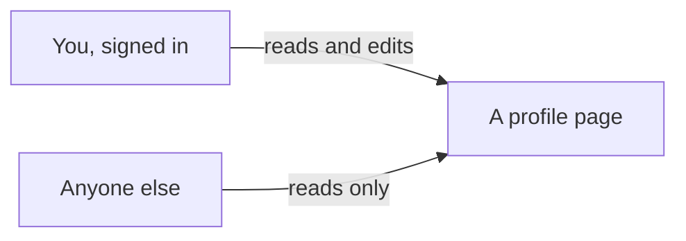

# The profile page: name, bio, and photo

## Learning objective

By the end of this lesson, you will be able to direct your agent to build the third feature on your plan — a profile for every signed-in person, with a display name, a short bio, and a photo they upload, that anyone can read and only its owner can change — and to run the one dashboard step nobody can do for you, with the question that comes before it.

## Why this matters

Your app knows exactly one thing about the person who just signed in: the email address they typed. Not their name, not what they look like, nothing they would want anyone else to see. A profile is the first thing in this app that belongs to somebody — and the first place where two people's belongings sit side by side, which is where "anyone can look, only the owner can change" stops being obvious and turns into something you have to check.

> **Following along:** Build this lesson's chunk in the app you picked in Module 0. The asks are written out for you; your agent's exact words and plan will differ from any this lesson describes, and that is normal.

> **Last verified:** 2026-08-17. Seeing your agent behave differently from what this lesson shows? On the course site, open the lesson chat ("Ask about this lesson") and tell it what you see versus what the lesson says — it can help you reconcile the difference against this exact lesson. For the full record of changes, see [`WHAT-CHANGED.md`](../../WHAT-CHANGED.md).

## Core read

> **Deviation note:** This read runs longer than most in the course. One part of this chunk happens on your Supabase dashboard rather than in the conversation with your agent, so it is walked through here with screenshots; the rest is the usual length.

You are not writing this app. Your agent is. The split does not move: your agent owns the code and the rules; you own saying what you want, watching the running app, running the chunk's checks, and saying when to save. What changes in this chunk is that the app starts holding things people put into it — words they typed and a file they uploaded — so for the first time it matters who is allowed to touch what.

**What this adds:** every signed-in person gets a profile page with a display name, a short bio, and a photo they upload from their computer. Anyone can look at anyone's profile; only its owner can change it. The page also leaves an empty area where that person's posts will show up later.

Module 1 gave you both halves of this picture. A profile is an index card in the filing cabinet: one card per person, holding a name and a few lines about them, and anyone who walks up to the cabinet may read it. Who gets to *write* on a card is the other half — the door staff and the list they hold. Signing in got you through the door; the list is what says which card is yours to write on. The photo is the same rule in a different drawer: there is a drawer with your name on it, everything you upload goes into your drawer, and the clerk will not file your photo into somebody else's.

That last part is the failure this chunk teaches you to spot: a clerk who files anything anywhere. Your photo lands in a stranger's drawer, or a stranger's lands in yours, and nothing on the screen looks any different.

Here is what the two roles look like as screens:

> **Note:** None of the rule-writing is taught here. How the profile is stored, how the app decides who may change it, where the photo file goes — that is your agent's job, and you are never asked to write or repair it. Your job is to say what you want, to notice, to check, and to say when to save.

### Pointing your agent at the third feature

Open your agent and point it at the third feature in your plan:

> I want signed-in people to create a profile with a display name, a short bio, and a photo they upload from their computer. Anyone can view any profile, but a person can only edit their own. The profile page should leave an empty area where that person's posts will appear later. Plan this out before you write any code, and tell me where the uploaded photos get stored.

Read what comes back and check that it matches what you asked for — a name, a bio, an uploaded photo, anyone can view, only the owner can edit, an empty space left for posts — and that it answered the last part and told you where the photos will live.

When the plan matches, give it the go-ahead:

> That matches what I want. Go ahead and build it.

<!-- Grounded in the real thread-project build run, 2026-07 (archived evidence m4-c2); presented in the desktop app's framing. -->

**In Claude Code desktop:** the same approval pauses as the last two chunks — the app shows you what it wants to do next, and nothing on your machine changes until you accept. This chunk is bigger than sign-in was, so there are more of them, and one step in the middle is not an approval at all: your agent stops and hands you something to do on your dashboard, which is the section below.

<!-- CODEX VERIFICATION SLOT: verify wording and UI behavior against a real Codex run — user-assisted evidence pass -->

**In the ChatGPT app (Codex):** the same shape, with the app's own approval prompt before anything in your folder changes — and the same stop in the middle, where the work waits on the step that is yours.

### One question your agent may ask first

<!-- Grounded in the real thread-project build run, 2026-07 (archived evidence m4-c2); presented in the desktop app's framing. -->

When this chunk was really built, the agent read the project before planning anything and then asked exactly one question: what should a profile's web address look like — the person's own account id, which it marked recommended because it needs nothing new and can never be taken, or a username people choose? The recommended one was picked, so every profile in the finished app sits at an address like `/profile/8f3a1c2e-4b7d-49a1-9e02-6c5d8b1f0a33`. A long run of letters and numbers in the address bar is what that choice looks like from the outside; it is expected, not a mistake.

That is the right shape for a question an agent asks you: about what you want, not about how anything gets built. Answer that kind. To the other kind, "you choose" is a fine answer.

### The one step that is yours

Your agent will write a file of instructions for your database — the profile itself, and the rules about who may read it, change it, and upload a photo. It cannot run that file for you. Only you can, from your **Supabase** (a one-line definition: the service that gives your app an account system, a database, and file storage in one — you say its name to your agent and operate its dashboard, and never learn its internals, [→ GLOSSARY](../../GLOSSARY.md#supabase)) dashboard.

<!-- Grounded in the real thread-project build run, 2026-07 (archived evidence m4-c2); presented in the desktop app's framing. -->

When this chunk was really built the agent said so plainly, before writing a line: "You'll paste this into the Supabase SQL editor yourself — I can write the file but I can't run it against your project." It also said what skipping it would look like: everything after it fails with "table not found".

One thing comes before the paste, and it comes before every paste like this from now on. The file is full of code, and none of it is for you to read — it is cargo, moved whole from one screen to another. What is yours is one question, asked before the file touches the dashboard. It is a **pre-flight question** (a one-line definition: before a step you cannot take back, you ask your agent a named question about what it changes, and wait for the answer, [→ GLOSSARY](../../GLOSSARY.md#pre-flight-question)) — one of the two shapes a **smell-test** (a one-line definition: a check you can run without reading a line of code — you try something and watch what the app does, [→ GLOSSARY](../../GLOSSARY.md#smell-test)) takes, and the one you already used before copying a key off the dashboard two chunks ago. This is the first paste of the whole project.

> **BEFORE YOU PASTE:** *"Does this remove or overwrite anything that is already in my database? List exactly what changes for data that exists today."*
>
> **THEN THE ADJUDICATION RULE:** if the dashboard's own warning dialog is accounted for by that answer, press Run; if the dialog names something the answer did not predict — or you never asked — press nothing and hand the dialog's words back to the agent.

Wait for the answer. On this chunk the honest answer is close to "nothing — your database has nothing in it yet"; the point of asking anyway is that the habit has to exist before the day it matters, and the answer is about to help you read a scary dialog.

So: open your Supabase dashboard, find the SQL Editor in the strip of icons down the left edge, start a new query, paste in the whole file your agent tells you to open, and press Run.

Pressing Run raises a dialog first.

<!-- Grounded in the real thread-project build run, 2026-07 (archived evidence m4-c2); presented in the desktop app's framing. -->

The wording is alarming and the file is not. What trips that warning is the handful of lines that clear out an earlier copy of the file's *own* rules before writing them again — which is exactly what makes the file safe to run twice. This is what your question was for: your agent already told you whether anything that exists gets removed or overwritten, and the button on this dialog is labelled **Run query**. If the warning is accounted for by the answer you got, press it. If it names something the answer did not predict, press nothing and hand the dialog's own words back — *"The dialog says the query may permanently change or remove data. You told me nothing existing would change. Which is it?"* — and wait for an answer you are happy with. When it runs, the Results pane comes back with "Success. No rows returned" — nothing came back because nothing was asked for; things were made.

Your own dashboard may not look identical — Supabase moves things around — but the SQL Editor is named the same, and the file you paste is the one your agent points you at.

### The check you run in the app

The other named check for this chunk is a **refusal check** (a one-line definition: in the running app you try the thing that should NOT be allowed and confirm it is refused — and if it goes through, you tell your agent what you did and what should have stopped it, [→ GLOSSARY](../../GLOSSARY.md#refusal-check)), and it pushes on the fence this whole chunk is built around: a profile everyone can read that only its owner can change.

> **TRY THIS:** sign out — or use a private window — and open your profile's address directly. Read everything. Then look for any way to change the name, the bio, or the photo.
>
> **EXPECT:** name, bio, and photo all visible; no edit link, no form, no upload control.
>
> **IF YOU CAN EDIT:** report it in one sentence — *"Signed out, I could change a profile. Anyone can view a profile, but only its signed-in owner should be able to change it. Fix that."*

That is the shape every chunk from here repeats: a signed-out visitor reads, and never acts.

### The fence you cannot reach from a browser

One fence neither the app nor your dashboard will let you push on is the photo storage itself — whether one person could get a file into another person's folder by going around the app entirely. You cannot try that from a browser, and you are not asked to. It is your agent's to build, and Module 5's multi-account walkthroughs re-test everything this module ships. What is yours today is the intent, in plain words: *"Who is allowed to upload a photo, and where does each person's photo go?"* — and holding the answer against what you asked for.

<!-- Grounded in the real thread-project build run, 2026-07 (archived evidence m4-c2); presented in the desktop app's framing. -->

When this chunk was really built, that question went out, and something in the reply is worth keeping. The agent explained its fences — every upload landing in the uploader's own folder, and nobody else's — and then volunteered something nobody had asked about: the size cap on a photo, and the check that an uploaded file is really an image, lived only in the app's own code, so someone with a real login who went around the app could push a 50 MB file into their own folder. Still their own folder, still fenced, but not checked for size or type. It said it had left that out to keep the first version simple, and offered to close it later.

That is what a good answer to an intent question looks like: it says what was built, and it says what was traded away.

> **Heads up — you'll meet this again.** Your agent will describe something with a real consequence in exactly the calm, even tone it uses for fixing a spelling mistake — not out of carelessness, but because weighing what a gap costs is not something it does unprompted. Here it raised the gap itself. It will not always, and nothing in how it sounds will tell you which day this is. Module 5's watch-it-fail walkthroughs show that playing out on an app with real information in it; for now, the habit is the one you just practised — ask who is allowed to do what, and hold the answer against what you asked for.

### Checking it yourself

Open the running app and go through it in order. Each step is one thing to see.

- Open your own profile — signed in, from the link on the home page. Before you have set anything, it should tell you the profile is not set up yet, offer a way to set it up, and already show a posts area with nothing in it.
- Set a display name and a bio, choose a photo file, and save. You should land back on your profile page with the photo, the name, and the bio on it. Refresh the page: all three still there.
- Sign out and open that same profile address directly — the refusal check above.
- Sign in as a second person, with a second made-up address, and open the first person's profile. You should get the same read-only page a signed-out visitor got.
- Edit again, changing only the bio, and leave the photo box empty. The photo should survive.

<!-- Grounded in the real thread-project build run, 2026-07 (archived evidence m4-c2); presented in the desktop app's framing. -->

When this chunk was really built, all five held. The fresh profile read "You haven't set up your profile yet." with a "Set up your profile" link and a Posts section reading "Nothing here yet." After saving a name, a two-line bio, and a photo, the page came back carrying all three plus the Posts section, and a refresh kept them. Signed out, the same address showed everything and offered nothing to press — and a second account, created the way the last chunk left it by signing in with a new address, saw exactly the same page. The edit form pre-filled the current values and showed the current photo under the caption "Leave the file empty to keep this photo."

### When it goes sideways

Three things to keep ready. The first two are the move you already know — name what you saw and hand it back:

> "When I open someone else's profile I see an edit form on it — I should only be able to edit my own. Find out why and fix it."

> "I edited just my bio and my photo disappeared. Leaving the file box empty should keep the photo that's already there. Find out why and fix it."

<!-- Grounded in the real thread-project build run, 2026-07 (archived evidence m4-c2); presented in the desktop app's framing. -->

The third is not a steer at all. If the profile pages complain that something does not exist — "table not found", or wording close to it — the file never made it into your database. Go back to the dashboard step above, paste it, run it, reload. Your agent flagged this one in advance when this chunk was really built, and it is the likeliest reason a working build looks broken today.

And the familiar one: if your agent keeps circling — reworking the same thing, losing the thread of what you asked — do not keep arguing with it. Start a fresh conversation and begin this chunk again from your last saved version.

### Before it is allowed to say done

This chunk's **definition of done** (a one-line definition: the checks your agent must run and show you, in plain words, before it is allowed to say a piece of work is finished, [→ GLOSSARY](../../GLOSSARY.md#definition-of-done)) is at the end of this lesson, and it is longer than the last one's because there is more that can quietly not work. Your agent runs those checks and reports what happened. Your side stays one sentence: *"Run the checks we agreed on and show me the results first."*

### Saving it

<!-- Grounded in the real thread-project build run, 2026-07 (archived evidence m4-c2); presented in the desktop app's framing. -->

This chunk is bigger than the last one. When it was really built the agent had written seven files and deliberately saved none of them, then asked whether to make the saves it had planned or wait until each piece had been checked against a real database. They waited. Once the app had been clicked through, the work went into **git** (a one-line definition: the tool from Module 2 that keeps every version of your project so you can go back to one, [→ GLOSSARY](../../GLOSSARY.md#git)) as four saved versions in order: the file for the database, the profile page anyone can read, the edit form with the photo upload, and the link to it from the home page.

Look first, say the sentence second — the habit worth keeping on any chunk that changes the database or accepts a file. When you have clicked through it and it holds: *"Save this as a working version."*

## Exercise

Build the third feature on your plan: a profile page for the people who can now sign in. The deliverable is a running app where you can set a name, a bio, and a photo, where a signed-out visitor can read them and cannot change them — plus a saved version.

1. **Start a fresh conversation and give it the ask.** The one from this lesson, word for word or in your own words with the same limits in it: name, bio, uploaded photo, anyone views, only the owner edits, an empty area left for posts, and the plan before any code.
2. **Check the plan against your ask**, including the part about where the photos will live. If it asks you a question first, answer the ones about what you want; "you choose" is a fine answer to the rest.
3. **Give the go-ahead** and approve the steps as the app asks you to.
4. **When your agent tells you it has written a file for your database, run the pre-flight first:** *"Does this remove or overwrite anything that is already in my database? List exactly what changes for data that exists today."* Wait for the answer. Then do the step that is yours: Supabase dashboard → SQL Editor → new query → paste the whole file → Run → **Run query** on the dialog, if its warning is accounted for by the answer you just got. Wait for "Success. No rows returned" before you go on. Nothing on the profile pages works until this is done.
5. **Go through the running app in order:** the empty profile with its posts area; saving a name, a bio, and a photo and refreshing; a second account opening your profile and getting a read-only page; and an edit that leaves the photo box empty without losing the photo.
6. **Run the refusal check.** Signed out, open your profile's address directly and *try* to change something. You should be able to read everything and change nothing.
7. **Ask the intent question once:** *"Who is allowed to upload a photo, and where does each person's photo go?"* Hold the answer against what you asked for, and say so if it does not match.
8. **If anything is off, use the matching steer** — say what you did and what you saw, and hand it back. If the pages complain that something does not exist, go back to step 4.
9. **Save it.** *"Save this as a working version."*

## Definition of done

Before you accept "done", your agent shows you the results of these checks, in plain words:

1. A signed-in person can set a name, a bio, and a photo, and all three are still there after a refresh.
2. Anyone can view any profile, signed in or not.
3. Only the owner of a profile sees anything that would change it.
4. The photo survives signing out and signing back in.

If your agent says "done" without showing these, say: "Run the checks we agreed on and show me the results first."

## Checkpoint

You've got this if you can do both:

1. Open your own profile address in a browser where you are signed out, see your name, bio, and photo, and find nothing on the page that would let you change them — then sign in and change them.
2. Say the question you ask before pasting a file into your dashboard, and what you do when the dashboard's warning names something the answer did not predict — in one sentence each.

## Going deeper

Optional, only if you're curious:

- Re-read [Module 1 — Who can do what](../01-mental-models/03-who-can-do-what.md), now that "anyone may read it, only the owner may change it" is a thing you have watched work in your own app.
- Ask your agent to close the gap it named — the size and file-type limits — once everything else is working and saved. It offered; taking it up is a small, separate ask, and the app works without it.

## Loop check

> **Loop check — evaluate.** This lesson reinforces **evaluate**: you said what you wanted, let your agent build it, and then went pushing. Every check in it is the same shape — try the thing that should not be allowed, or ask the question that has to be answered before a step you cannot take back, and say so when what happens does not match what you asked for.

## What you just did

You gave everyone who signs in a profile: a name, a bio, and a photo they upload, readable by anyone and changeable only by them. You did not write it — you said what you wanted, asked one question before the one irreversible step and then ran that step yourself, tried the forbidden thing from a signed-out window, asked in plain words who is allowed to upload what, and said when to save. The empty area sitting on that profile page is the point: the next chunk fills it, by giving people posts to write.

## Navigation

> **Deviation note:** Lesson 4 (`04-posts.md`) is not published yet, so "Next" points at the Module 4 overview instead of the next lesson. It will point to Lesson 4 once that lesson ships.

[← Previous: Sign in with an email and a password](./02-sign-in.md)
[Next: Module 4 overview — Lesson 4 (Posts) is next →](./README.md)
