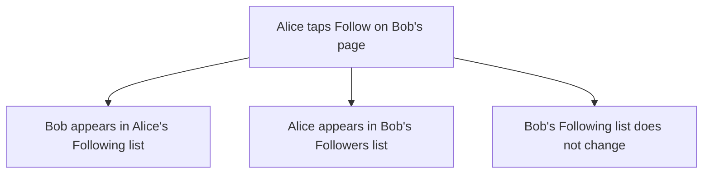

# Follow and followers: two lists that only go one way

## Learning objective

By the end of this lesson, you will be able to direct your agent to let people follow and unfollow each other and see both lists on a profile, run the database step yourself a third time, scan the agent's changes for the two things your checks name — and hold the agent to them when what comes back is the right rule under a different word.

## Why this matters

Your app has profiles with posts on them and no way to get from one profile to another. Every account is an island. Following is the first thing you build that connects two of them — and the first thing that can do the exact opposite of what you asked while looking completely correct from where you are standing. A follow that quietly runs both ways and a follow that runs one way look identical on your own screen. The only person who can see the difference is the other one.

## Core read

> **Deviation note:** This read runs longer than most in the course. One part of this chunk happens in your Supabase dashboard rather than in the conversation with your agent, and the check that carries this chunk fired for real when it was built — the worked example is walked through here.

You are not writing this app. Your agent is. The split does not move: the agent owns the code and the rules; you own saying what you want, watching the running app, running a short check, and saving the version that works. What changes in this chunk is that the app starts holding a relationship between two people rather than a thing belonging to one — and a relationship has a direction, which is the part that can silently come out wrong.

**What this adds:** on somebody else's profile there is a button reading Follow. Tap it and it reads Unfollow. Your own page grows two lists: the people you follow, and the people who follow you. Following someone does not make them follow you back, and nobody can follow themselves.

Module 1's filing cabinet gets a third drawer. The first holds one card per person, the second one card per post. The new drawer holds one card per follow, and every card in it names two people in a fixed order: who did the following, and who got followed. Both of your lists come out of that one drawer, read two different ways. Pull every card with your name in the first corner and you have the people you follow. Pull every card with your name in the second corner and you have the people who follow you. Reading a card backwards does not turn it into a second card.

That last sentence is the failure this chunk teaches you to spot. Picture staff who, every time a card is handed in, quietly write a second one with the two names swapped and file that too. Stand at your own drawer and everything is right: you followed one person, they are in your Following list, nobody is in your Followers list yet. Nothing on your screen is wrong. The mistake is sitting in somebody else's drawer, and the only way you will ever see it is to go and be that somebody else.



> **Note:** None of the rule-writing is taught here. How a follow is stored, how the app decides who may create or remove one, how the two lists get read out of the same place — that is the agent's job, and you are never asked to write or repair it. Your job is to say what you want, to notice, to check, and to save.

### What the agent raised before it built anything

The plan that came back listed ten things that could go wrong. Two of them are worth carrying with you.

The first is the one above. The agent called it the mirror bug, and it named the test that catches it in one sentence: "two accounts, A follows B, then check B's page shows A under Followers and *nothing* under Following." That is the check you will run at the end of this lesson, handed to you by the thing you are checking.

The second is about following yourself. The agent's position was that hiding the button is not protection, and that it had put the rule in three separate places — "Three layers, and only the constraint is load-bearing." In plain words: two of those three are tidiness, and the one that counts is the one in the database, because it is the only one still standing when somebody goes around the app entirely. You do not need to know which of the three is which. You need to know that "we don't show the button" is not an answer to "what stops it".

Two smaller ones, a line each. Two fast taps on Follow used to be a good way to break something; here the second tap is treated as success rather than an error, because the state you were asking for — you follow them — is the state you end up in. And the agent listed what it was deliberately leaving out: blocking, muting, private accounts, follow requests, notifications. A list of what was not built is worth having. It is the difference between a gap and a surprise.

### The step that is yours, a third time

Same as the last two chunks: the agent writes a file of instructions for your database — the follows themselves, and the rules about who may create one and remove one — and it cannot run that file for you. Only you can, from your **Supabase** (a one-line definition: a SYMPTOM-only name for the service that gives your app an account system, a database, and file storage in one — you see it in the agent's changes, you do not learn its internals, [→ GLOSSARY](../../GLOSSARY.md#supabase)) dashboard.

By now there are two query tabs sitting in the SQL Editor from the last two chunks. You are opening a third one beside them, not typing over either. As before, the code in the box is cargo, not reading material — move it whole, press Run, and leave the reading to the agent.

![The Supabase dashboard, on the SQL Editor page, with a third query open beside the two left over from earlier chunks. A numbered marker ① points to the small "+" button in the row of query tabs at the top — pressing it opens a new, empty query beside the old ones. Marker ② points to the large query area filling the middle of the screen, holding the whole follows file the agent wrote, scrolled to its last lines: the rule for undoing your own follows, and under it a note saying there is deliberately no rule for changing one. Marker ③ points to the green Run button at the top right, which you press once the file is in.](../../screenshots/m4/04-follow/run-follows-migration.png)

There is one sentence in that box worth reading, and the picture happens to be scrolled to it. The agent left a note at the end explaining that it wrote no rule at all for *changing* a follow, on purpose — "the safest rule is the one you never have to write" — and that unfollowing and following again is how a person changes their mind. That is the shape of a decision being handed to you rather than buried. Nothing else in the box is for you.

Pressing Run raises the same "Potential issue detected" dialog you met in the last two chunks, for the same reason. Read the file's opening note first. If the note does not account for the warning, do not press Run query yet: ask the agent what in this file is destructive, and wait for an answer you are happy with. When it does, press Run query. The Results pane comes back with "Success. No rows returned" — nothing came back because nothing was asked for; things were made.

Your own dashboard may have moved things around — Supabase does that — but the SQL Editor is named the same, and the file you paste is the one your agent points you at.

### The checks you run

A **smell-test** (a one-line definition: one thing to look for and one question to ask when it is not there, [→ GLOSSARY](../../GLOSSARY.md#smell-test)) is a look, not a decode. This chunk has two of them, and both are scans of the agent's changes rather than clicks in the app.

**The rule that stops a person following themselves.**

- LOOK FOR: in the agent's changes, the literal line `check (follower_id <> following_id)`.
- IF PRESENT: continue.
- IF ABSENT: say — "You said you added a rule that stops a person following themselves. I don't see it — where is it?"

**Both lists set up to load quickly.**

- LOOK FOR: the words `follows_follower_idx` and `follows_following_idx` — both of them.
- IF PRESENT: continue — both lists will load fast.
- IF ABSENT: say — "Are both follow lists set up to load quickly? Show me where."

You are matching words here, not reading them. Nothing in this course explains what those lines say, and you will not need it.

Run both of these **before** you go to the dashboard, not after. That ordering is free the first time and expensive later: while nothing has run against your database yet, names are still cheap to change.

### When the check fired

This is the first time in the whole course that a smell-test comes back empty, so it is worth walking through exactly as it happened.

When this chunk was really built, the agent finished, said it had written the rule stopping self-follows, and asked whether to save. Both scans came back with nothing. The reply held the save and asked both questions at once:

> "Hold the commit. Two things before I run the migration. You said you added a rule that stops a person following themselves - I was told to look for the literal line check (follower_id <> following_id) and I don't see it. Where is it? And are both follow lists set up to load quickly? I was told to look for follows_follower_idx and follows_following_idx, both of them, and I don't see those either. Since nothing has run against the database yet, rename things so what I scan for matches what my course card says […] Then show me the lines."

What came back is the thing to learn from. The rule was there — it had been written using a different word for one of the two people, so the line existed and did not match what the card said to look for. The agent's own summary: "Same rule, different word." Both lists were already set up to load quickly too, but neither carried the name the card named — one of the two was covered by something that had a different job as well, and the other was under a name nobody had told the learner to look for.

So the answer to "where is it?" was, in both cases, *right there, under other words*. Nothing was missing. Nothing was broken. And there was no way to know that from the outside without asking.

The agent renamed everything, ran its own build to confirm nothing else referred to the old words, and showed the three lines the card asks for:

```
47: constraint follows_no_self check (follower_id <> following_id)
58: create index if not exists follows_follower_idx
59:   on public.follows (follower_id, created_at desc);
61: create index if not exists follows_following_idx
62:   on public.follows (following_id, created_at desc);
```

Then it did something better than the rename, and this is the line to keep:

> "the literal check (follower_id <> following_id) is there, with a name in front of it. […] If your card wants the bare check (...) with nothing before it, say so and I'll strip the name."

It found the one place where its answer and the check still did not quite agree — the words are on the line, but there is something in front of them — and put the decision in front of the person whose check it was. The ruling took one sentence:

> "Keep the name - the words I scan for are all on line 47, that is what matters."

Read that exchange again with one thing in mind: nobody in it understood a line of what was being renamed. The check was "are these words present". The answer was "the same thing is here under different words". The steer was "make the words match, and here is what I will accept". At no point did anyone need to know what the lines did — and the file that went into the database afterwards is one you can scan in five seconds for the rest of the project.

### What the check is actually for

Those two scans exist because of **risk-blindness** (a one-line definition: the agent proposing something with real consequences in the same calm tone it uses for fixing a typo, [→ GLOSSARY](../../GLOSSARY.md#risk-blindness)) — the failure mode Module 2 named. The version of it that this chunk is exposed to is an agent that says it added the rule stopping self-follows, in the same even voice it uses for everything else, having not added it. There is nothing on any screen that would tell you. A person following themselves is not a crash; it is one strange row in a drawer and a profile that lists itself.

Here it did not bite. What the check caught was a naming mismatch, not a missing rule — and from where you sit, those two look exactly the same until you ask. That is the whole argument for running the scan even when you are fairly sure the agent did the work. The cost of asking is one message. The cost of not asking is that you never find out which of the two you had.

The other half of what you asked for cannot be scanned at all — it has to be watched, from a second account, which is the next section.

### Checking it yourself

Open the running app and go through it in order. The last two need a second person, and that is not optional here: the mirror bug is invisible from your own account.

- Open a second person's profile while signed in as yourself. The button reads Follow.
- Tap it. It flips to Unfollow right away. Tap again — back to Follow. Tap once more and leave it following.
- Open your own page. The person you just followed is under Following. Your Followers list is empty.
- Sign in as that second person, in another browser. You are under their Followers. Their Following list is empty.
- On either of your own profiles, there is no Follow button anywhere.

When this chunk was really built, all five held. Alice opened Bob's profile, tapped Follow, watched it read Unfollow, tapped back to Follow, and tapped once more to leave it following. Her own page listed Bob under Following — shown as "Unnamed", because Bob had never set up a profile and that is the app's fallback — and her Followers list read "Nobody is following you yet." Signed in as Bob in a second browser, Alice was under his Followers and his Following list read "You aren't following anyone yet." One direction, confirmed from both ends. Neither account saw a Follow button on its own page.

One wrinkle worth naming because it will happen to you: the app had been left alone between chunks and the thing running it locally had stopped, so the first page opened after the dashboard step showed an error. Saying "the app page shows an error" was the entire fix — the agent worked out that its own check for whether the app was running had been fooled, and started it again.

### When it goes sideways

Three steers. The first two are the move you know — name what you saw and hand it back:

> "I tapped Follow and the button still says Follow — it didn't change to Unfollow. Find out why and fix it."

> "I was able to follow my own profile. I should never be able to do that. Fix it, then show me that I can't anymore."

And the one this chunk is really about, for when the two-account check comes back wrong:

> "I followed the second account from the first one, then signed in as the second account. It shows the first account under Following as well as Followers — following someone should never make them follow me back. Find out why and fix it."

If the profile pages complain that something does not exist — "table not found", or wording close to it — the file never made it into your database. Go back to the dashboard step above, paste it, run it, reload.

And the familiar one: if the agent keeps circling — reworking the same thing, losing the thread of what you asked — do not keep arguing with it. Type `/clear` to reset the conversation and start this chunk again from your last saved version.

### Saving it

Look first, save second. When this chunk was really built, the save was held back through the whole exchange above — the rename, the dashboard step, and both accounts — and then went into **git** (a one-line definition: the tool from Module 2 that keeps every version of your project so you can go back to one, [→ GLOSSARY](../../GLOSSARY.md#git)) as one saved version carrying three things: the file for the database, the code behind following and unfollowing, and the profile page that now shows a button and two lists. The note on it read "Chunk 4 — follow and unfollow, one direction only".

Same watch as last chunk: this chunk changed your database, so the file that changed it belongs in the saved version. If the agent lists what it saved and that file is not among them, ask where it went.

The agent also offered two things for later, neither of them a fault in what you just checked: a follower count on every profile, and some way to *find* people. Right now the only route to another person's profile is knowing its address and typing it in. That is worth sitting with for a moment — you have just built following, and there is still nobody to follow unless you go and fetch an address by hand. Lesson 5 is where the app starts bringing things to you instead.

## Exercise

Connect the islands. The deliverable is a running app where you can follow and unfollow a second person from their profile, where both lists show on a profile and only run one way — plus a saved version.

1. Open a fresh conversation with your agent — `/clear` first if you are picking up in a session that is already open — and ask for the plan:

   > "I want people to follow each other. On someone else's profile, a button says Follow; once I tap it, it changes to Unfollow. My own page shows two lists: who I follow, and who follows me. Me following someone should NOT make them follow me, and I should never be able to follow myself. Plan this before you write any code, and tell me what could go wrong."

2. Read what comes back. You are checking that the plan matches what you asked for — a button that flips, two lists, one direction, no following yourself — and that the last part came back as a list of specific things rather than a reassurance. If it names something it is deliberately leaving out, that is fine and worth noting.

3. When the plan matches, tell it to go:

   > "That matches what I want. Go ahead and build it."

4. Before you touch the dashboard, run both smell-tests. Ask to see the rule that stops a person following themselves, and look for `check (follower_id <> following_id)`. Ask about both lists loading quickly, and look for `follows_follower_idx` and `follows_following_idx`. If either scan comes back empty, ask the matching question — and if the answer is "it's there under a different name", say what you want it renamed to, while nothing has run against your database yet:

   > "Since nothing has run against the database yet, rename things so what I scan for matches what my course card says. Then show me the lines."

5. Do the step that is yours: Supabase dashboard → SQL Editor → **+** for a new query beside the two already there → paste the whole file → Run → Run query on the dialog. Wait for "Success. No rows returned" before you go on.

6. Open the running app and go through the first three checks: the Follow button on a second person's profile, the flip to Unfollow and back, and your own page showing that person under Following with your Followers list empty.

7. Now do the two that need the second account. Sign in as your second person in another browser. You should be under their Followers, and their Following list should be empty. Check that neither account shows a Follow button on its own page.

8. If anything is off, use the matching steer — say what you saw and hand it back. If a page complains that something does not exist, go back to step 5. If the app will not load at all, say so; it may only need starting again.

9. Save the working version: "Save this as a working version." Check that the file for the database is in what it saved.

## Checkpoint

You've got this if you can do both:

1. Follow a second account, then sign in as that second account in another browser and show that you are in their Followers list and not in their Following list.
2. Say what you would do if a smell-test came back empty and the agent answered "that rule is there, I just called it something else" — in one sentence.

## Going deeper

Optional, only if you're curious:

- Re-read [Module 1 — Who can do what](../01-mental-models/03-who-can-do-what.md), now that you have watched a rule hold from the database side while the button was doing its own separate job on the screen.
- Take the agent up on the second thing it offered: ask what it would take to make people findable — a link from a post to its author's profile, or a list of people to follow. You do not have to build it. Lesson 5 solves half of this problem and not the other half, and knowing which half is which is worth the five minutes.

## Loop check

> **Loop check — steer.** This lesson reinforces **steer**: the scan came back empty, the agent's answer was "the same rule, under a different word", and neither of those settled it. What settled it was saying what you would accept — make the words match, keep the name in front, these are the words I scan for. You did not have to understand the lines to set the terms they had to meet.

## What you just did

You connected the accounts in your app: a button that flips between Follow and Unfollow, two lists on a profile, and a direction that holds when you go and check from the other side. You did not write it — you asked, you scanned the agent's changes for two sets of words, you held it to them when the words did not match, you ran the database step nobody can do for you, and you signed in as somebody else to see the half you could not see from your own screen. What you still cannot do is find anything: posts are scattered across profiles you have to reach by address. Lesson 5 gathers them into one feed — the people you follow, plus you, newest first.

## Navigation

[← Previous: Posts: write, edit, and delete your own](./03-posts.md)
[Next: The feed: the people you follow, plus you →](./05-feed.md)
