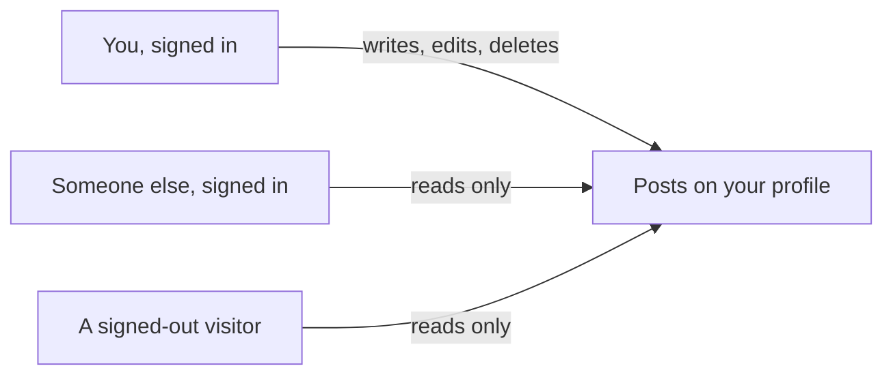

# Posts: write, edit, and delete your own

## Learning objective

By the end of this lesson, you will be able to direct your agent to build the fourth feature on your plan — posts a signed-in person writes, edits, and deletes on their own profile, with an optional picture, that anyone can read without signing in — run the one dashboard step a second time with the question that goes before it, and prove by attempt rather than by reading that a post cannot end up under somebody else's name.

## Why this matters

The profile you built has a name, a face, a couple of lines about you, and an area underneath reading "Nothing here yet." A nameplate on a door with nobody behind it. Posts are the first thing in this app that other people come to the app to read — and the first thing carrying a claim the app has to keep true even when somebody leans on it: who wrote this.

> **Following along:** Build this lesson's chunk in the app you picked in Module 0. The asks are written out for you; your agent's exact words and plan will differ from any this lesson describes, and that is normal.

> **Last verified:** 2026-08-17. Seeing your agent behave differently from what this lesson shows? On the course site, open the lesson chat ("Ask about this lesson") and tell it what you see versus what the lesson says — it can help you reconcile the difference against this exact lesson. For the full record of changes, see [`WHAT-CHANGED.md`](../../WHAT-CHANGED.md).

## Core read

> **Deviation note:** This read runs longer than most in the course. One part of this chunk happens on your Supabase dashboard rather than in the conversation with your agent, and the check that carries this chunk needs a worked example before it is usable, so both are walked through here; the rest is the usual length.

You are not writing this app. Your agent is. The split does not move: your agent owns the code and the rules; you own saying what you want, watching the running app, running the chunk's checks, and saying when to save. What changes in this chunk is that a thing in your app now carries a name on it — every post says who wrote it — and a name on a thing is only worth as much as whatever keeps it true.

**What this adds:** a signed-in person writes a short post, attaches one picture if they want, and it appears on their profile where the empty area was. They can edit or delete their own posts and nobody else's. Anyone can read posts on a profile, signed in or not.

Module 1's filing cabinet gets a second drawer. The first drawer holds one index card per person — the profile you built last chunk. The new drawer holds one card per post, and every card in it has a name written in the corner: whose post this is. The cabinet stands in a lobby anyone can walk in off the street and read from, which is the part that makes posts worth writing at all. Writing on a card is the other half, and that is where the door staff and their list come back in.

Here is the failure this chunk teaches you to spot, and it is quieter than it sounds. Every card in that drawer has to keep the right name in its corner — not only on the day it is filed, but after anybody has written on it. There are two ways a card ends up lying. Somebody writes on a card that was never theirs. Or somebody takes their own card, rubs out the name in the corner, writes yours, and hands it back. Either way the drawer now holds a card saying you wrote something you never wrote. And this is the part worth slowing down on: nothing about the cabinet looks any different from the outside. A drawer whose staff are strict and a drawer whose staff are asleep are the same drawer to look at. The only way to tell them apart is to walk up and try something.

Here is what the three roles look like as screens:



> **Note:** None of the rule-writing is taught here. How a post is stored, how the app decides who may change one, how the picture gets attached — that is your agent's job, and you are never asked to write or repair it. Your job is to say what you want, to notice, to check, and to say when to save.

### Pointing your agent at the fourth feature

Open your agent and point it at the fourth feature in your plan:

> I want signed-in people to write a short text post, with an optional picture, that appears on their profile. They should be able to edit or delete their own posts, but nobody else's. And anyone, even signed-out visitors, should be able to read posts on a profile. Plan this out before you write any code, and tell me how you'll make sure one person can't edit a post to make it look like someone else wrote it.

Read what comes back. You are checking that the plan matches what you asked for — write, edit, delete, your own only, an optional picture, readable by anyone — and that it answered the last part with something specific rather than a reassurance. You are not grading how it intends to do any of it. You needed the answer to exist, and you needed to look for it.

When the plan matches, give it the go-ahead:

> That matches what I want. Go ahead and build it.

<!-- Grounded in the real thread-project build run, 2026-07 (archived evidence m4-c3); presented in the desktop app's framing. -->

**In Claude Code desktop:** the same approval pauses as the last three chunks — the app shows you what it wants to do next and offers Accept or Reject, and nothing on your machine changes until you accept. This chunk is about the size of the profile one, and it has the same stop in the middle: your agent reaches a point it cannot get past on its own and hands you something to do on your dashboard, which is the section below.

<!-- CODEX VERIFICATION SLOT: verify wording and UI behavior against a real Codex run — user-assisted evidence pass -->

**In the ChatGPT app (Codex):** the same shape, with the app's own approval prompt before anything in your folder changes — and the same stop in the middle, where the work waits on the step that is yours.

### One thing your agent may raise

<!-- Grounded in the real thread-project build run, 2026-07 (archived evidence m4-c3); presented in the desktop app's framing. -->

When this chunk was really built, the agent read the project first and then made a point of saying something nobody had asked about: display names are not unique. Two people can both call themselves Alice. A post is tied to the account that wrote it, not to the name shown on it, so the app never loses track of who the author is — but a reader looking at two profiles cannot tell two Alices apart by name alone. Chosen handles, or a verified badge, would fix that. It offered to build them, and said it was a decision about the product rather than a fault in the build.

The answer given was "leave handles for another time." That is a fine answer, and the shape of the exchange is the part to notice: your agent surfaced a limit of what you asked for, in plain terms, before building it. Say yes, or say later. What you should not do is skip past it — a thing your agent tells you about your own product is worth ten minutes now and a rebuild later.

### The step that is yours, again

Same as last chunk. Your agent writes a file of instructions for your database — the posts themselves, and the rules about who may read them, write them, change them, and delete them — and it cannot run that file for you. Only you can, from your **Supabase** (a one-line definition: the service that gives your app an account system, a database, and file storage in one — you say its name to your agent and operate its dashboard, and never learn its internals, [→ GLOSSARY](../../GLOSSARY.md#supabase)) dashboard.

Two differences from last time. The file opens with a note saying to run the profile file first if you have not, because the posts it makes room for point at accounts that need to exist already — so run these in the order the lessons give you. And in the SQL Editor you are opening a *new* query alongside the one still sitting there from last chunk, rather than typing over it.

The file is full of code, and none of it is for you to read — it is cargo, moved whole from one screen to another. What is yours is the same **pre-flight question** (a one-line definition: before a step you cannot take back, you ask your agent a named question about what it changes, and wait for the answer, [→ GLOSSARY](../../GLOSSARY.md#pre-flight-question)) you asked last chunk, one of the two shapes a **smell-test** (a one-line definition: a check you can run without reading a line of code — you try something and watch what the app does, [→ GLOSSARY](../../GLOSSARY.md#smell-test)) takes.

> **BEFORE YOU PASTE:** *"Does this remove or overwrite anything that is already in my database? List exactly what changes for data that exists today."*
>
> **THEN THE ADJUDICATION RULE:** if the dashboard's own warning dialog is accounted for by that answer, press Run; if the dialog names something the answer did not predict — or you never asked — press nothing and hand the dialog's words back to the agent.

Wait for the answer. Last chunk the honest answer was close to "nothing — your database has nothing in it yet." That is no longer true: the profile you made last chunk lives in there, so this is the first time the question is asked of a database with something in it to lose. This is where the habit starts earning its keep.

So: open your Supabase dashboard, find the SQL Editor, start a new query alongside the old one, paste in the whole file your agent tells you to open, and press Run.


Pressing Run raises the same "Potential issue detected" dialog you met in the last chunk, for the same reason, and the button on it is labelled **Run query**. If its warning is accounted for by the answer you just got, press it. If it names something the answer did not predict — or you skipped the question — press nothing: hand the dialog's own words back to your agent — *"The dialog says the query may permanently change or remove data. You told me nothing existing would change. Which is it?"* — and wait for an answer you are happy with. When it runs, the Results pane comes back with "Success. No rows returned" — nothing came back because nothing was asked for; things were made.

Your own dashboard may not look identical — Supabase moves things around — but the SQL Editor is named the same, and the file you paste is the one your agent points you at.

### The checks you run

Three things get checked when it comes back, and they are not all the same kind of thing. One is plain watching: you do the allowed thing and see whether the app kept its word. The other two are both the same move — a **refusal check** (a one-line definition: in the running app you try the thing that should NOT be allowed and confirm it is refused — and if it goes through, you tell your agent what you did and what should have stopped it, [→ GLOSSARY](../../GLOSSARY.md#refusal-check)) — and they are the two halves of what you asked for: everybody may read, nobody else may touch. None of the three asks you to look at anything your agent wrote.

**Your own edit never changes whose post it is.** This is the plain one — you are allowed to do it, and you are watching what it changes.

> **TRY THIS:** edit one of your own posts and save it.
>
> **EXPECT:** the edit lands, and the post still shows you as its author.
>
> **IF THE AUTHOR LINE CHANGES, OR THE EDIT SILENTLY VANISHES:** steer with what you saw — *"I edited my post and ⟨what you saw⟩. An edit should change the words, never whose post it is. Find out why and fix it."*

**Signed out, posts read; nothing writes.** The first refusal check, and the one this whole chunk is built around on the reading side.

> **TRY THIS:** open a private window that has never signed in, and open a profile with posts on it. Read them. Then look for any way to write, edit, or delete one.
>
> **EXPECT:** every post readable, pictures loading — and no box to write in, no Edit link, no Delete anywhere.
>
> **IF IT WORKS:** *"While signed out I could ⟨what you did⟩. A signed-out visitor should only be able to read. Fix that."*

**Nothing of someone else's is yours to change.** The second refusal check, and it is new today — from this chunk on, every chunk has one, because from this chunk on there is content with somebody's name on it.

> **TRY THIS:** sign in as your second account, find a post the first account wrote, and try to edit or delete it — including by typing that post's editing address straight into the address bar.
>
> **EXPECT:** no controls, or refusal — and after a refresh the post is unchanged.
>
> **IF IT WORKS:** *"As ⟨account B⟩ I could ⟨edit/delete⟩ ⟨account A⟩'s post. Only its owner should be able to. Fix that."*

There is a third push nobody can make by clicking, because the running app gives you no way to even attempt it: storing a post that carries somebody else's name as its author, from outside the app entirely. That one is your agent's to attempt, and yours to ask for — the exercise below has the exact request. What you need back is one thing in plain words: the attempt was refused, or it was stored. You are not reading the attempt's output; your agent reads that and tells you which of the two happened.

### What the checks are actually for

Rub out the name, write yours, hand the card back. Rules looser than you asked for do not look like anything: an app can render every screen correctly while its fences are down, and nothing you can see from the outside will say so. That is why every check in this chunk is a push on a fence instead of a look at anything. Pushing is the only instrument that measures the thing that matters — and it is the reason your ask ended with a question about the author instead of stopping at what to build.

<!-- Grounded in the real thread-project build run, 2026-07 (archived evidence m4-c3); presented in the desktop app's framing. -->

When this chunk was really built, the answer that came back to that question was three separate things, each one enough on its own — and then the agent went at the finished build from the outside before anyone had clicked anything. With nobody signed in at all, it asked the live database to store a post with a hand-picked author on it, and the database refused:

```
401  new row violates row-level security policy for table "posts"
```

You are not decoding that sentence. The database wrote it, not you, and the only part that reaches you is that the attempt came back refused instead of stored. The same pass confirmed the other half: with nobody signed in, asking for the posts came back with an empty list rather than an error, which is what "anyone may read" looks like on a profile that has nothing on it yet.

> **Heads up — you'll meet this again.** An edit rule looser than you asked for — one that lets a signed-in person change something that is not theirs — is the first of the three "watch the AI fail" walkthroughs Module 5 puts you in front of. Your agent will describe the fences it built in the same calm, even tone it uses for fixing a spelling mistake, and nothing in how it sounds will tell you whether they hold. You already have the move that settles it, and you just ran it twice: try to touch what is not yours, and expect refusal. Module 5 is where you watch what it looks like when that push goes through instead.

### Checking it yourself

Open the running app and go through it in order. Each step is one thing to see.

- Write a post and save it. It should appear on your own profile where the empty area was, with its date on it.
- Write a second post with a picture attached. The picture should show in the post.
- Edit the first post — the plain check above. The text changes, and the name on it is still yours.
- Delete a post. It should be gone after the page reloads.
- Sign out and open your own profile address — the first refusal check. The posts are still readable, the picture still loads, and there is nothing on the page to write, edit, or delete with.
- Sign in as your second person and go after the first person's post — the second refusal check, including typing its editing address straight into the address bar.

<!-- Grounded in the real thread-project build run, 2026-07 (archived evidence m4-c3); presented in the desktop app's framing. -->

When this chunk was really built, all six held. Alice's first post appeared with its date and an Edit link; a second post with a file attached rendered the picture; editing the first one changed the text, left the author alone, and put a small "· edited ·" marker next to the date; deleting the picture post removed the post and its picture both. Signed out, the same profile showed the remaining post with no box to write one in and no Edit link anywhere on it. The edit form pre-filled the existing text, showed the current picture under "Leave the file empty to keep this picture." with a "Remove the picture from this post" checkbox, and kept its Delete button below a divider reading "This cannot be undone."

The last one is the one worth doing properly. Signed in as Bob, opening Alice's editing address directly landed on a page-not-found. Your agent's own note on that is worth keeping — this is what it said when it planned the page: *"the page 404s if the post isn't yours, but that's only tidiness — the lock is in the database."* The missing page is a courtesy. The refusal you read about above is the lock, and the courtesy is the only half of it you can see.

### When it goes sideways

Three things to keep ready. The first two are the move you already know — name what you saw and hand it back:

> "I edited my post and the author name changed to someone else — that should never be possible. Find out why and fix it so a post always keeps its real author."

> "I signed out, opened a profile, and the posts were gone or it made me sign in. Anyone should be able to read posts. Find out why and fix it."

The third is not a steer at all. If the profile pages complain that something does not exist — "table not found", or wording close to it — the file never made it into your database. Go back to the dashboard step above, paste it, run it, reload.

And the familiar one: if your agent keeps circling — reworking the same thing, losing the thread of what you asked — do not keep arguing with it. Start a fresh conversation and begin this chunk again from your last saved version.

### Before it is allowed to say done

Underneath your three checks sits the layer that is your agent's job. This chunk's **definition of done** (a one-line definition: the checks your agent must run and show you, in plain words, before it is allowed to say a piece of work is finished, [→ GLOSSARY](../../GLOSSARY.md#definition-of-done)) is at the end of this lesson, and one of its four items is the outside-the-app attempt — the push you cannot make yourself. Your agent runs the checks and reports what happened; your side stays one sentence: *"Run the checks we agreed on and show me the results first."*

### Saving it

<!-- Grounded in the real thread-project build run, 2026-07 (archived evidence m4-c3); presented in the desktop app's framing. -->

Look first, say the sentence second. When this chunk was really built the saving was held back on purpose until the app had been clicked through, and then the whole chunk went into **git** (a one-line definition: the tool from Module 2 that keeps every version of your project so you can go back to one, [→ GLOSSARY](../../GLOSSARY.md#git)) as one saved version carrying four things: the file for the database, the code behind writing and editing and deleting, the edit page, and the profile page that now lists posts.

That first item is the one to watch. This chunk changed your database, so the file that changed it belongs in the saved version alongside the rest — otherwise the saved version cannot rebuild the app it describes. Once you have clicked through it and it holds: *"Save this as a working version."*

## Exercise

Build the fourth feature on your plan: give the profile you built last chunk something to hold. The deliverable is a running app where you can write, edit, and delete your own posts with an optional picture, where a signed-out visitor can read them and change nothing — plus a saved version.

1. **Start a fresh conversation and give it the ask.** The one from this lesson, word for word or in your own words with the same limits in it: a short text post with an optional picture, on your own profile, edit and delete your own only, readable by anyone signed out, the plan before any code — and the question about how one person can't edit a post to make it look like someone else wrote it.
2. **Check the plan against your ask**, including that last part. You want a specific answer there, not a reassurance. If it raises a limit of what you asked for, decide and say so; "leave that for another time" is a fine answer.
3. **Give the go-ahead** and approve the steps as the app asks you to.
4. **When your agent tells you it has written a file for your database, run the pre-flight first:** *"Does this remove or overwrite anything that is already in my database? List exactly what changes for data that exists today."* Wait for the answer — your database has your profile in it now, so this one is not a formality. Then do the step that is yours: Supabase dashboard → SQL Editor → **+** for a new query alongside the old one → paste the whole file → Run → **Run query** on the dialog, if its warning is accounted for by the answer you just got. Wait for "Success. No rows returned" before you go on. If you never ran the profile file from last chunk, run that one first.
5. **Ask for the push you cannot make by clicking:**

   > With nobody signed in at all, try storing a post with someone else's name on it as the author, and show me exactly what came back.

   You want one thing back, in plain words: that it was refused rather than stored. You are not reading the output — your agent read it and tells you which happened. If it came back stored, stop here and use the first steer below.
6. **Go through the running app in order:** write a post; write one with a picture; edit the first and watch the name stay yours; delete one and reload. Then run the first refusal check — sign out, open your own profile address, read the posts, and find nothing on the page to write, edit, or delete with.
7. **Run the second refusal check.** Sign in as your second person, find the first person's post, and *try* to edit or delete it — including by typing its editing address straight into the address bar. Refresh afterwards and confirm the post is unchanged.
8. **If anything is off, use the matching steer** — say what you did and what you saw, and hand it back. If the pages complain that something does not exist, go back to step 4.
9. **Save it.** *"Save this as a working version."*

## Definition of done

Before you accept "done", your agent shows you the results of these checks, in plain words:

1. A signed-in person can write, edit, and delete their own post, with an optional picture.
2. The post still shows the right author after an edit.
3. A signed-out visitor can read posts and has no way to write, edit, or delete one.
4. The signed-out attempt to store a post under somebody else's name was refused — reported in plain words, not as output for you to read.

If your agent says "done" without showing these, say: "Run the checks we agreed on and show me the results first."

## Checkpoint

You've got this if you can do both:

1. Sign out, open your own profile address, read a post you wrote and find nothing on the page that would change it — then sign in, edit that post, and watch the text change while the name on it stays yours.
2. Say the push that proves nobody can put their words under your name — the one you ask your agent to make from outside the app, and what has to come back — and what you would tell it if the attempt came back stored, in one sentence each.

## Going deeper

Optional, only if you're curious:

- Re-read [Module 1 — Where data lives](../01-mental-models/02-where-data-lives.md), now that the cabinet has a second drawer and you have watched a card get refused.
- Take your agent up on what it offered and you declined: ask what chosen handles would change about your app, and what it would cost to add them later rather than now. You do not have to build them. The answer is worth having before the next chunk puts people in front of each other.

## Loop check

> **Loop check — ask.** This lesson reinforces **ask**: the request you sent did not stop at what to build. It ended with "tell me how you'll make sure one person can't edit a post to make it look like someone else wrote it" — a clause that turns a plan into something you can hold an answer against. You did not have to grade the answer's mechanics. You needed the answer to exist, you needed to look for it, and then you needed to push on the thing it promised.

## What you just did

You gave people something to say: posts they write, edit, and delete on their own profile, with a picture if they want one, readable by anyone who opens the address. You did not write it — you asked in a way that forced the author question into the open, asked one question before the one irreversible step and then ran that step yourself, tried the forbidden thing twice with your own hands, asked your agent to make the attempt you could not, and said when to save. What you cannot do yet is find anybody: every profile in this app is an island with posts on it. The next chunk connects them, by letting one person follow another.

## Navigation

[← Previous: The profile page: name, bio, and photo](./03-profile.md)
[Next: Follow and followers: two lists that only go one way →](./05-follow.md)
