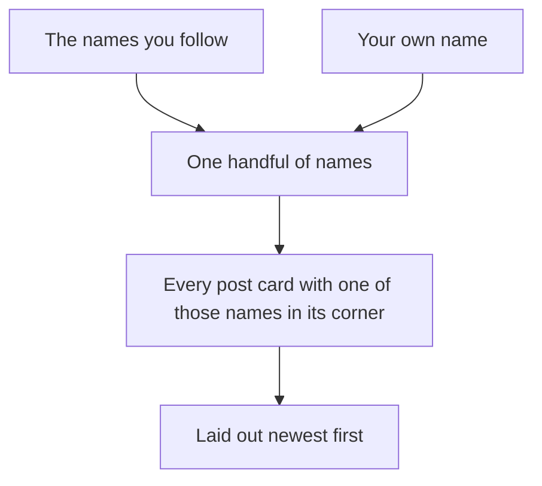

# The feed: the people you follow, plus you

## Learning objective

By the end of this lesson, you will be able to direct your agent to build one home feed carrying your own posts and the posts of everyone you follow, newest first — and to handle the case where the words your check told you to look for are not in the agent's changes at all, by asking one question and letting the running app settle it.

## Why this matters

You can follow people now and you have nothing to show for it. Posts sit on profiles you can only reach by typing an address, and following someone changes nothing you can see. The feed is the first thing in this app that brings something to you instead of waiting to be found — and the first feature whose most likely failure is a thing that is *not* there. Your own posts, quietly missing from your own feed, on a page that otherwise looks completely correct.

## Core read

> **Deviation note:** This read runs longer than most in the course. The check that carries this chunk came back empty when the chunk was really built — and that turned out to be fine, for a reason worth walking through slowly, because it is the first time in the course that the right answer to a failed check is "nothing is wrong."

You are not writing this app. Your agent is. The split does not move: the agent owns the code and the rules; you own saying what you want, watching the running app, running a short check, and saving the version that works. What changes in this chunk is the direction things travel. Everything you have built so far sits where you left it and waits to be visited. A feed goes and gets.

**What this adds:** the home page — which has been a placeholder since you built sign-in — becomes a feed. It carries every post by someone you follow, plus your own, newest at the top. One stream, not two lists side by side. Each post shows who wrote it, with their name and photo linking to their profile, and an Edit link on the ones you wrote.

Module 1's filing cabinet does not grow a drawer this time. It gets read differently. You already have a drawer of follow cards and a drawer of post cards, and a feed is what happens when you use the first to decide what to pull out of the second: take the names you follow, add your own name to that same handful of names, then pull every post card with one of those names in its corner and lay them out newest first.

That "add your own name to the same handful" is the whole lesson. It is one line of the picture, it is the thing that goes wrong, and it is the thing you will be checking for.

Take your name out of that handful and nothing breaks. No error, no blank page, no warning. You get a feed — it just quietly has a hole in it exactly the size of everything you have ever written. And if you happen to follow a few chatty people, you may not notice the hole for days.

> **Note:** None of the gathering is taught here. How the two drawers get read together, how the ordering is done, how the page is built before it reaches your browser — that is the agent's job, and you are never asked to write or repair it. Your job is to say what you want, to notice, to check, and to save.

### What the agent asked before it planned anything

When this chunk was really built, the agent read the project first and then asked two questions before it wrote a plan at all. Both are worth seeing, because a question before a plan is cheaper than a rewrite after one.

The first:

> "The feed and the profile page render the same post shape (body, picture, date, "edited", Edit link). Should I extract that into one shared component?"

In plain words: the feed and the profile are both about to show posts the same way — should that be written once and used in both places, or written twice? It recommended once. That was the answer given, and it is why this chunk touches the profile page as well as the home page.

The second was not about the app at all:

> "AGENTS.md says to read node_modules/next/dist/docs/ before writing code, but .claude/settings.json denies reading node_modules. How should I handle that?"

In plain words: one note in your project tells the agent to go and read some reference material, and a setting in the same project forbids it from opening the folder that material is in. The agent found the contradiction and handed it back rather than picking one silently. The answer given was to follow the patterns already proven in this project instead. You do not need to know what either file says to answer a question shaped like that — the shape is "two of your own instructions disagree, which one wins", and only you can answer it.

### A plan that says how you will know

The plan that came back had a section listing how the agent expected the finished thing to be checked. Not "it will work" — a list of things to look at:

> "Own posts appear on `/` even when following nobody."

> "Follow a second account → their posts appear, interleaved with yours in one newest-first order (check a post of theirs older than yours sorts below it, not into a separate block)."

> "Post something → tap Home → it's at the top. Unfollow → tap Home → their posts are gone."

> "A followed account with no saved profile renders as "Unnamed", not a gap."

Read those again as what they are: your checks, written for you, by the thing you are checking. That is the mark of a plan worth approving — it does not just say what will be built, it says what you will be able to see afterwards, in behaviors you can produce by clicking. A plan that ends in reassurance gives you nothing to hold it to. This one names the exact case that is about to matter most: own posts, following nobody.

Approval that run went through the prompt the tool put up — the plan was opened, read, closed unchanged, and approved there, rather than by typing a go-ahead sentence. Either way is the same decision.

### The check you run

A **smell-test** (a one-line definition: one thing to look for and one question to ask when it is not there, [→ GLOSSARY](../../GLOSSARY.md#smell-test)) is a look, not a decode. This chunk has one, and it is a scan of the agent's changes:

**Your own posts are in the feed.**

- LOOK FOR: in the part of the agent's changes that builds the feed, the text `OR author_id = auth.uid()`.
- IF PRESENT: good — leave it as is.
- IF ABSENT: say — "I don't see anything in the feed code that includes my own posts — only the people I follow. What makes sure my own posts show up too?"

You are matching words here, not reading them. Nothing in this course explains what those words say, and you will not need it.

There is also a check you cannot run by scanning, and in this chunk it outranks the scan: open the feed as an account that follows nobody and see whether your own post is on it. Hold on to that, because the next section is about the day the scan and the app disagree.

### When the words were not there at all

This is the second time in this module that a check comes back empty, and it is a different kind of empty from the last one, so it is worth the walk-through.

Last chunk, the words were missing and the rule was there under a different name. Same rule, different word. This time the words were missing and could not have been there — and the app was right anyway.

When this chunk was really built, the agent finished, and the scan for `OR author_id = auth.uid()` came back with nothing anywhere in the changes. The question that went back was the card's question, with one addition — a demand to be shown the part of the changes that does the job instead:

> "Before I open the app: I was told to look in the part of your changes that builds the feed for the literal text OR author_id = auth.uid(), and I don't see it anywhere. What makes sure my own posts show up in my feed, and not just posts from the people I follow? Show me that exact part of the changes."

What came back did three things, and only the last one settles anything.

It did not argue with the check. It showed the part of the changes where the same guarantee is made — the part it had written, at a line it named — and said the words on the card were not missing so much as impossible: those particular words belong to the files you pasted into your dashboard in earlier chunks, and the feed is not written the same way at all. You are not grading that claim, and nothing in this course will teach you to.

Then it gave the one fact that matters, and gave it in a form you could go and check: your own name is always in the handful of names the feed asks for. Follow nobody, and that handful is just you — so the feed comes back as exactly your own posts, and nothing else.

That last sentence is the only part you needed, and its shape is why. It is not an explanation. It is a prediction about what you will see if you go and look, which makes it something you can prove wrong in about ninety seconds.

So that is what happened next. Signed in as the second test account, following nobody, with nothing written yet: the feed showed an empty state in plain words — "Your feed is empty. Follow someone, or write your first post on your profile." A post written from that account's profile, then Home: the post was there, on a feed belonging to somebody who follows no one at all. The prediction held.

**The ruling to take from this:** an empty scan means ASK, not panic. Then the answer decides which of two things you have. A concrete answer — one that names where the job is done and, better, tells you what you will see if you go and look — plus a check in the running app that comes back the way the answer said it would, is a pass. Leave it alone. A vague answer — "yes, your own posts are included, don't worry about it" — or an answer that sounds fine while the app disagrees with it, is not a pass, and the steer at the bottom of this lesson is what you send.

Three shapes, then, for any check in this course from here on: the words are there; the words are somewhere else under another name; the words could not be there and something else does the job. Only the app can tell you which one you are in.

### What the check is actually for

The agent can be confidently wrong. Not evasive, not hedging, not visibly guessing — wrong in the same steady voice it uses when it is right, about a thing it has no particular reason to doubt. A feed is the ideal place for it, because a feed that is missing something looks exactly like a feed. There is no error to read. Your profile still lists your posts, so nothing is lost. The page just quietly under-reports, and the only person in the world positioned to notice is the person whose posts are absent.

That is why the check is a scan plus a click, and why the click wins. The scan is cheap and you should run it. But this chunk is the one that shows you what to do when the scan cannot decide — and the answer is always the same: go and be the user in the case you are worried about. Follow nobody. Post. Look.

> **Heads up — you'll meet this again.** A feed that confidently leaves your own posts out is the second of the three "watch the AI fail" walkthroughs Module 5 puts you in front of. You already have the smell-test for it — the scan above, and the behavioral check that outranks it. Module 5 is where you watch what it looks like when nobody runs either one.

### Nothing for you to run this time

The last three chunks each ended with a step only you could do: a file of instructions for your database that the agent writes and cannot run, pasted into your **Supabase** (a one-line definition: a SYMPTOM-only name for the service that gives your app an account system, a database, and file storage in one — you see it in the agent's changes, you do not learn its internals, [→ GLOSSARY](../../GLOSSARY.md#supabase)) dashboard by hand.

Not this one. This chunk changed nothing about how your data is stored or who may read it — it reads what is already there, using rules you already ran. The agent's own line on it:

> "Nothing to paste into the Supabase SQL editor."

Do not go looking for the step. If your agent hands you a file for the database during this chunk, that is worth a question — ask what it needs to change and why the feed needs it, before you paste anything.

### Checking it yourself

Open the running app and go through it in order. Most of this needs both accounts, and the first two are the ones that matter most.

- Sign in as the account that follows nobody. The feed says, in plain words, that it is empty.
- Write a post from that account's profile, then go Home. Your own post is in the feed — with zero people followed.
- Sign in as the other account, in another browser, the one that followed the first in Lesson 4. Its feed carries the followed account's post *and* its own older one, one under the other in a single stream — not the followed account's posts in one block and yours in another.
- Write a new post from that account, then go Home. It is at the top. The order reads newest to oldest as you go down.
- Look at the Edit links. They appear on your own posts and on nobody else's, in both accounts' feeds.

When this chunk was really built, all five held. Bob — following nobody, nothing written — got "Your feed is empty. Follow someone, or write your first post on your profile." He posted, tapped Home, and there it was, with an Edit link on it. Alice, who had followed Bob last chunk, saw Bob's newer post at the top with no Edit link on it, and her own post from two days earlier under it, carrying its "edited" marker and its Edit link. She posted again: her new one went to the top, Bob's under that, her older one third.

One detail from those screens is worth a line of its own. Bob's byline read "Unnamed" — he had never set up a profile, and rather than leaving a blank where a name goes, the app puts a word there. That is the app's fallback doing its job, not a bug, and you saw the same word in his Following list last chunk.

### What was left out on purpose

The agent listed what it had deliberately not built, and none of it is a fault: no box for writing a post on the feed itself — posting stays on your profile; no way to page past the newest fifty posts; no page for a single post on its own. That last one is Lesson 6's job.

It also flagged one thing for later, in plain terms: the way the feed asks for the posts of everyone you follow sends one name per person, so that is the first line to revisit if the feed ever feels slow. You are not fixing that today. You are filing it, so that if the feed does slow down in six months you know where somebody already told you to look.

### When it goes sideways

Two steers, both the move you know — name what you saw and hand it back:

> "I posted something and then opened my feed, and it's completely empty even though I can see the post on my profile. Find out why my own posts aren't in my feed and fix it."

> "I see posts from people I follow, but never my own. I want both in the feed. Find out why and fix it."

Those are also the exact steers for the case above where the answer to your question sounded fine and the app disagreed. You do not have to argue with the explanation. Say what you saw.

And the familiar one: if the agent keeps circling — reworking the same thing, losing the thread of what you asked — do not keep arguing with it. Type `/clear` to reset the conversation and start this chunk again from your last saved version.

### Saving it

Look first, save second. When this chunk was really built, the checks were reported and the save was asked for in the same message, which is a decent habit:

> "All my checks passed: Bob follows nobody and still sees his own post in his feed, my feed has my newest post on top, Bob's under it, my older post under that, and Edit only shows on my own posts. Save this as a working version."

It went into **git** (a one-line definition: the tool from Module 2 that keeps every version of your project so you can go back to one, [→ GLOSSARY](../../GLOSSARY.md#git)) as one saved version covering six files — two new ones and four changed, including the profile page, which now shows posts using the same shared piece the feed does. The note on it read "Chunk 5 — a home feed of the people you follow, and yourself".

The thing to watch this time is different from the last three chunks. There is no database file to look for in the saved version, because there is no database file. What you are watching for instead is the profile page: it was changed in this chunk too, so it belongs in the same saved version as the feed. If the agent lists what it saved and the profile page is not there, ask about it — and then open a profile and check that posts still look the way they did before.

## Exercise

Give following a payoff. The deliverable is a running app with one home feed carrying your own posts and the posts of everyone you follow, newest first — plus a saved version.

1. Open a fresh conversation with your agent — `/clear` first if you are picking up in a session that is already open — and ask for the plan:

   > "Build me a home feed. When I'm signed in, it should show the newest posts from the people I follow, and it should also include my own posts, all mixed together with the newest first. Plan how you'll do this before writing any code."

2. Answer whatever it asks before it plans. If it offers to write the post display once and use it in both the feed and the profile, say yes. If it tells you two instructions in your own project contradict each other, pick one — following the patterns already working in the project is a fine answer.

3. Read the plan. You are checking two things: that it says your own posts are included, and that it names how you will be able to tell — in things you can see by clicking, not in reassurance. If it does not name the "following nobody" case, ask for it before you approve:

   > "Before you build: how will I be able to tell my own posts are in the feed if I follow nobody at all?"

4. When the plan matches, tell it to go:

   > "That's exactly what I want — my own posts included, newest first. Go ahead."

5. When it finishes, run the smell-test: look through the part of the changes that builds the feed for the text `OR author_id = auth.uid()`.

6. If those words are not there — and there is a good chance they will not be — do not panic and do not skip it. Ask:

   > "I was told to look in the part of your changes that builds the feed for the literal text OR author_id = auth.uid(), and I don't see it anywhere. What makes sure my own posts show up in my feed, and not just posts from the people I follow? Show me that exact part of the changes."

   You are grading the answer on one thing only: does it point at something specific and tell you what you will see if you go and look? If yes, go and look — step 7 is the test. If the answer is a reassurance with nothing in it you can check, say so and ask again.

7. Do the test that decides it. Sign in as the account that follows nobody, write a post from its profile, and go Home. Your own post should be on your feed. If it is not, use the first steer.

8. Sign in as the other account in another browser and check the rest: both people's posts in one stream rather than two blocks, newest at the top after you post again, and Edit links on your own posts only.

9. If anything is off, use the matching steer — say what you saw and hand it back.

10. Save the working version: "Save this as a working version." Check that the profile page is among what it saved, then open a profile and confirm posts still look right there.

## Checkpoint

You've got this if you can do both:

1. Sign in as an account that follows nobody, write a post, open the feed, and find that post on it.
2. Say what you do when the words a smell-test tells you to look for are nowhere in the agent's changes — in one sentence, including what decides whether the answer you get back is good enough.

## Going deeper

Optional, only if you're curious:

- Re-read [Module 3 — Reading plans and recognizing wrong](../03-the-loop/03-reading-plans-recognizing-wrong.md), now that you have been handed an explanation you had no way to grade and settled it by clicking instead.
- Take the agent up on the thing it flagged: ask what would change about the feed if you followed five hundred people. It already named the line it would look at first. You do not have to build anything — the answer is worth having before the app has more in it than you put there by hand.

## Loop check

> **Loop check — evaluate.** This lesson reinforces **evaluate**: the scan you were handed came back empty, the explanation you got back was in words nobody has taught you, and neither of those could settle whether the feed was right. What settled it was the app — one account, following nobody, one post, one look. Evaluate is not "did the answer sound good." It is "what would I see if this were true, and is that what I see?"

## What you just did

You turned following into something you can watch: one page carrying your own posts and everybody's you follow, newest first, in a single stream. You did not write it — you asked, you answered the questions it raised before it planned, you scanned for words that were not there, you asked the question anyway, and then you went and proved the answer with two accounts and one post. What the app still cannot do is hold a conversation: a post is something people read and then walk away from. Lesson 6 gives every post a page of its own and lets people reply on it.

## Navigation

> **Deviation note:** Lesson 6 (`06-comments.md`) is not published yet, so "Next" points at the Module 4 overview instead of the next lesson. It will point to Lesson 6 once that lesson ships.

[← Previous: Follow and followers: two lists that only go one way](./04-follow.md)
[Next: Module 4 overview — Lesson 6 (Comments) is next →](./README.md)
