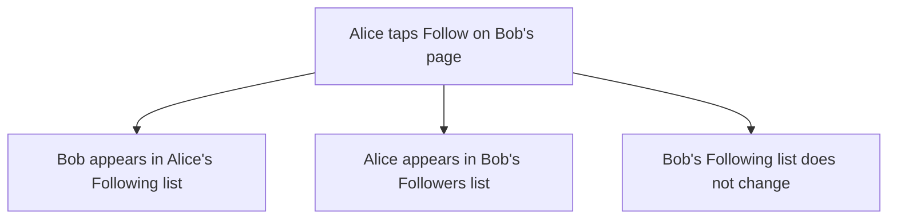

# Follow and followers: two lists that only go one way

## Learning objective

By the end of this lesson, you will be able to direct your agent to build the fifth feature on your plan — people following and unfollowing each other, with both lists on a profile — run the one dashboard step a third time with the question that goes before it, and prove the two things that matter, that nobody can follow themselves and that a follow never runs both ways, by trying them from both sides of the app.

## Why this matters

Every profile in your app is an island with posts on it. There is no way to get from one to another, and nothing you write reaches anybody who has not typed your address in by hand. Following is the first thing you build that connects two accounts — and the first thing that can do the exact opposite of what you asked while looking completely correct from where you are standing. A follow that quietly runs both ways and a follow that runs one way are the same picture on your own screen. The only person who can see the difference is the other one.

> **Following along:** Build this lesson's chunk in the app you picked in Module 0. The asks are written out for you; your agent's exact words and plan will differ from any this lesson describes, and that is normal.

> **Last verified:** 2026-08-17. Seeing your agent behave differently from what this lesson shows? On the course site, open the lesson chat ("Ask about this lesson") and tell it what you see versus what the lesson says — it can help you reconcile the difference against this exact lesson. For the full record of changes, see [`WHAT-CHANGED.md`](../../WHAT-CHANGED.md).

## Core read

> **Deviation note:** This read runs longer than most in the course. One part of this chunk happens on your Supabase dashboard rather than in the conversation with your agent, and the check that carries this chunk cannot be run from your own account at all, so both are walked through here; the rest is the usual length.

You are not writing this app. Your agent is. The split does not move: your agent owns the code and the rules; you own saying what you want, watching the running app, running the chunk's checks, and saying when to save. What changes in this chunk is that your app starts holding a relationship between two people rather than a thing belonging to one — and a relationship has a direction, which is the part that can silently come out backwards.

**What this adds:** on somebody else's profile there is a button reading Follow. Tap it and it reads Unfollow. Your own page grows two lists: the people you follow, and the people who follow you. Following someone does not make them follow you back, and nobody can follow themselves.

Module 1's filing cabinet gets a third drawer. The first holds one card per person, the second one card per post. The new drawer holds one card per follow, and every card in it names two people in a fixed order: who did the following, and who got followed. Both of your lists come out of that one drawer, read two different ways. Pull every card with your name in the first corner and you have the people you follow. Pull every card with your name in the second corner and you have the people who follow you. Reading a card backwards does not turn it into a second card.

That last sentence is the failure this chunk teaches you to spot. Picture staff who, every time a card is handed in, quietly write a second one with the two names swapped and file that one too. Stand at your own drawer and everything is right: you followed one person, they are in your Following list, nobody is in your Followers list yet. Nothing on your screen is wrong. The mistake is sitting in somebody else's drawer, and the only way you will ever see it is to go and be that somebody else.

> **Note:** None of the rule-writing is taught here. How a follow is stored, how the app decides who may create or remove one, how the two lists get read out of the same place — that is your agent's job, and you are never asked to write or repair it. Your job is to say what you want, to notice, to check, and to say when to save.

### Pointing your agent at the fifth feature

Open your agent and point it at the fifth feature in your plan:

> I want people to follow each other. On someone else's profile, a button says Follow; once I tap it, it changes to Unfollow. My own page shows two lists: who I follow, and who follows me. Me following someone should NOT make them follow me, and I should never be able to follow myself. Plan this before you write any code, and tell me what could go wrong.

Read what comes back. You are checking that the plan matches what you asked for — a button that flips, two lists, one direction, no following yourself — and that the last part came back as a list of specific things rather than a reassurance. If it names something it is deliberately leaving out, that is fine and worth noting; a list of what is not being built is the difference between a gap and a surprise.

When the plan matches, give it the go-ahead:

> That matches what I want. Go ahead and build it.

<!-- Grounded in the real thread-project build run, 2026-07 (archived evidence m4-c4); presented in the desktop app's framing. -->

**In Claude Code desktop:** the same approval pauses as every chunk before this one — the app shows you what it wants to do next and offers Accept or Reject, and nothing on your machine changes until you accept. This chunk is about the size of the posts one, and it has the same stop in the middle: your agent reaches a point it cannot get past on its own and hands you something to do on your dashboard, which is the section below.

<!-- CODEX VERIFICATION SLOT: verify wording and UI behavior against a real Codex run — user-assisted evidence pass -->

**In the ChatGPT app (Codex):** the same shape, with the app's own approval prompt before anything in your folder changes — and the same stop in the middle, where the work waits on the step that is yours.

### What your agent raised before it built anything

<!-- Grounded in the real thread-project build run, 2026-07 (archived evidence m4-c4); presented in the desktop app's framing. -->

When this chunk was really built, the plan came back with ten things that could go wrong. Two of them are worth carrying with you.

The first is the one above. The agent called it the mirror bug, and it handed over the test that catches it in one sentence: two accounts, A follows B, then check B's page shows A under Followers and *nothing* under Following. That is the check you will run at the end of this lesson, written for you by the thing you are checking.

The second is about following yourself. The agent's position was that hiding the button is not protection — it said it had put the rule in three separate places, and that only one of the three was doing real work. You do not need to know which of the three that is. What you need is the ruling underneath it: "we don't show the button" is not an answer to the question "what stops it." A button that is not on the screen is a courtesy. Something has to refuse the thing itself, and the only way you find out whether anything does is to go and try.

Two smaller ones, a line each. Two fast taps on Follow used to be a good way to break something; here the second tap is treated as success rather than an error, because the state you were asking for — you follow them — is the state you end up in either way. And the agent listed what it was deliberately leaving out: blocking, muting, private accounts, follow requests, notifications. None of that is a fault in what you asked for. It is a map of the edges.

### The step that is yours, a third time

Same as the last two chunks. Your agent writes a file of instructions for your database — the follows themselves, and the rules about who may create one and remove one — and it cannot run that file for you. Only you can, from your **Supabase** (a one-line definition: the service that gives your app an account system, a database, and file storage in one — you say its name to your agent and operate its dashboard, and never learn its internals, [→ GLOSSARY](../../GLOSSARY.md#supabase)) dashboard.

One difference from last time, and it is only arithmetic: there are now two query tabs sitting in the SQL Editor from the profile and posts chunks, so you are opening a third one beside them rather than typing over either. The file is full of code, and none of it is for you to read — it is cargo, moved whole from one screen to another. What is yours is the same **pre-flight question** (a one-line definition: before a step you cannot take back, you ask your agent a named question about what it changes, and wait for the answer, [→ GLOSSARY](../../GLOSSARY.md#pre-flight-question)) you asked the last two times, one of the two shapes a **smell-test** (a one-line definition: a check you can run without reading a line of code — you try something and watch what the app does, [→ GLOSSARY](../../GLOSSARY.md#smell-test)) takes.

> **BEFORE YOU PASTE:** *"Does this remove or overwrite anything that is already in my database? List exactly what changes for data that exists today."*
>
> **THEN THE ADJUDICATION RULE:** if the dashboard's own warning dialog is accounted for by that answer, press Run; if the dialog names something the answer did not predict — or you never asked — press nothing and hand the dialog's words back to your agent.

Wait for the answer. There is more in your database each time you ask this: last chunk it held a profile, and now it holds your posts and their pictures as well. The question costs you thirty seconds and it is the only thing standing between you and a step nobody can undo.

So: open your Supabase dashboard, find the SQL Editor, start a third query alongside the two already there, paste in the whole file your agent tells you to open, and press Run.

![The Supabase dashboard, on the SQL Editor page, with a third query tab open beside the two left over from the profile and posts chunks. A numbered marker ① points to the small "+" button at the end of the row of query tabs — pressing it opens a new, empty query beside the old ones. Marker ② points to the large query area filling the middle of the screen, holding the whole file your agent wrote, scrolled to its last lines, with the Results pane below it still reading "Click Run to execute your query". Marker ③ points to the green Run button at the top right, which you press once the file is in.](../../screenshots/m4/05-follow/run-follows-migration.png)

Pressing Run raises the same "Potential issue detected" dialog you met in the last two chunks, for the same reason, and the button on it is labelled **Run query**. If its warning is accounted for by the answer you just got, press it. If it names something the answer did not predict — or you skipped the question — press nothing: hand the dialog's own words back to your agent — *"The dialog says the query may permanently change or remove data. You told me nothing existing would change. Which is it?"* — and wait for an answer you are happy with. When it runs, the Results pane comes back with "Success. No rows returned" — nothing came back because nothing was asked for; things were made.

Your own dashboard may not look identical — Supabase moves things around — but the SQL Editor is named the same, and the file you paste is the one your agent points you at.

### The checks you run

Four things get checked when it comes back, and two of them cannot be run from your own account at all. None of the four asks you to look at anything your agent wrote.

**Following goes one way.** The plain one — you are allowed to do it, and you are watching what it does on the other person's screen.

> **TRY THIS:** as your first account, follow the second. Then, in the other browser, sign in as the second account and open its two lists.
>
> **EXPECT:** you are in their Followers, and their Following list is unchanged — nothing you did put them in it.
>
> **IF BOTH MOVED:** *"Following ⟨B⟩ made them follow me back. Following should be one-way. Fix that."*

**You cannot follow yourself.** A **refusal check** (a one-line definition: in the running app you try the thing that should NOT be allowed and confirm it is refused — and if it goes through, you tell your agent what you did and what should have stopped it, [→ GLOSSARY](../../GLOSSARY.md#refusal-check)), and the one this chunk's plan spent the most words promising.

> **TRY THIS:** open your own profile and look for a way to follow yourself. If a Follow button is there, press it.
>
> **EXPECT:** no Follow button on your own page — or, if one shows, pressing it refuses.
>
> **IF IT WORKS:** *"I just followed myself. That shouldn't be possible. Fix that."*

**Signed out, the lists read; nothing follows.** The second refusal check, and the one you have now run on every chunk since sign-in.

> **TRY THIS:** open a private window that has never signed in, open a profile that has followers on it, and read both lists. Then look for any way to follow, unfollow, or change either list.
>
> **EXPECT:** both lists readable — and no Follow button, no Unfollow, no way to move anybody into or out of either one.
>
> **IF IT WORKS:** *"While signed out I could ⟨what you did⟩. A signed-out visitor should only be able to read. Fix that."*

**Nothing of someone else's is yours to change.** The third refusal check, and the one this chunk gives a new shape. A follow belongs to the person who made it, the same way a post belongs to whoever wrote it — so the person on the receiving end of one does not get to undo it.

> **TRY THIS:** signed in as your second account, open its own page, find the first account sitting in its Followers list, and try to remove it from there — or to change the first account's Following list from your side.
>
> **EXPECT:** no control that does either — you can unfollow people *you* followed, and nothing else — and after a refresh both lists are unchanged.
>
> **IF IT WORKS:** *"As ⟨account B⟩ I could ⟨what you did⟩ to ⟨account A⟩'s follow. Only its owner should be able to. Fix that."*

### What the checks are actually for

Your agent will tell you what it built in a calm, even voice — the same one it uses for fixing a spelling mistake — whether or not the thing it describes is standing. It has no sense of which of its sentences is load-bearing and which is decoration, so a rule it forgot and a rule it wrote sound exactly alike coming back to you. That is not dishonesty. It is the absence of a stake.

And the two failures in this chunk are the quiet kind. A missing self-follow rule looks like nothing at all until somebody pushes on it. A follow that runs both ways looks like a correct app from the only screen you normally look at. Neither one announces itself, which is why every check above is a push on a fence rather than a look at anything, and why two of them send you to a different browser to be somebody else.

> **Heads up — you'll meet this again.** An agent that proposes something with real consequences in the same flat tone it uses for the trivial thing is one of the three "watch the AI fail" walkthroughs Module 5 puts you in front of. You already have both moves that catch it, and you just ran them both: the question before the step you cannot take back, and the push on the fence afterwards. Module 5 is where you watch what it looks like when nobody runs either.

### Checking it yourself

Open the running app and go through it in order. Three of these need the second account, and that is not optional here — the mirror bug is invisible from your own screen.

- Open a second person's profile while signed in as yourself. The button reads Follow.
- Tap it. It flips to Unfollow right away. Tap again — back to Follow. Tap once more and leave it following.
- Open your own page. The person you just followed is under Following. Your Followers list is empty.
- Sign in as that second person, in another browser. You are under their Followers, and their Following list is empty — the plain check above.
- Still signed in as that second person, look for a way to take you back out of their Followers, or to change your Following list from their side — the third refusal check. There should be none.
- On either of your own profiles, there is no Follow button anywhere — the first refusal check.
- Sign out entirely and open a profile again. Both lists still read, and there is nothing on the page to follow anybody with — the second refusal check.

<!-- Grounded in the real thread-project build run, 2026-07 (archived evidence m4-c4); presented in the desktop app's framing. -->

When this chunk was really built, the flip, both lists, and the self-follow fence all held. Alice opened Bob's profile, tapped Follow, watched it read Unfollow, tapped back to Follow, and tapped once more to leave it following. Her own page listed Bob under Following — shown as "Unnamed", because Bob had never set up a profile and that is the app's fallback for a person with no name yet — and her Followers list read "Nobody is following you yet." Signed in as Bob in a second browser, Alice was under his Followers and his Following list read "You aren't following anyone yet." One direction, confirmed from both ends. Neither account saw a Follow button on its own page.

One wrinkle worth naming because it may happen to you. The app had been left alone between chunks and had stopped running, so the first page opened after the dashboard step showed an error instead. Saying "the app page shows an error" was the entire fix — the agent worked out that its own way of checking whether the app was running had fooled it, and started the app again. You did not diagnose that. You reported a screen.

### When it goes sideways

Three things to keep ready. The first two are the move you already know — name what you saw and hand it back:

> "I tapped Follow and the button still says Follow — it didn't change to Unfollow. Find out why and fix it."

> "I was able to follow my own profile. I should never be able to do that. Fix it, then show me that I can't anymore."

And the one this chunk is really about, for when the two-account check comes back wrong:

> "I followed the second account from the first one, then signed in as the second account. It shows the first account under Following as well as Followers — following someone should never make them follow me back. Find out why and fix it."

If the profile pages complain that something does not exist — "table not found", or wording close to it — the file never made it into your database. Go back to the dashboard step above, paste it, run it, reload.

And the familiar one: if your agent keeps circling — reworking the same thing, losing the thread of what you asked — do not keep arguing with it. Start a fresh conversation and begin this chunk again from your last saved version.

### Before it is allowed to say done

Underneath your four checks sits the layer that is your agent's job. This chunk's **definition of done** (a one-line definition: the checks your agent must run and show you, in plain words, before it is allowed to say a piece of work is finished, [→ GLOSSARY](../../GLOSSARY.md#definition-of-done)) is at the end of this lesson. Your agent runs those checks and reports what happened in plain words; your side stays one sentence: *"Run the checks we agreed on and show me the results first."*

### Saving it

<!-- Grounded in the real thread-project build run, 2026-07 (archived evidence m4-c4); presented in the desktop app's framing. -->

Look first, say the sentence second. When this chunk was really built the saving was held back on purpose through the whole exchange above — the dashboard step and both accounts — and then the chunk went into **git** (a one-line definition: the tool from Module 2 that keeps every version of your project so you can go back to one, [→ GLOSSARY](../../GLOSSARY.md#git)) as one saved version carrying three things: the file for the database, the code behind following and unfollowing, and the profile page that now shows a button and two lists. The note on it read "Chunk 4 — follow and unfollow, one direction only".

That first item is the same one to watch as last chunk. This chunk changed your database, so the file that changed it belongs in the saved version alongside the rest — otherwise the saved version cannot rebuild the app it describes. Once you have clicked through it and it holds: *"Save this as a working version."*

Your agent may also offer two things for later, neither of them a fault in what you just checked: a follower count on every profile, and some way to *find* people. Right now the only route to another person's profile is knowing its address and typing it in. That is worth sitting with for a moment — you have just built following, and there is still nobody to follow unless you go and fetch an address by hand. The next chunk is where the app starts bringing things to you instead.

## Exercise

Build the fifth feature on your plan: connect the islands. The deliverable is a running app where you can follow and unfollow a second person from their profile, where both lists show on a profile and only run one way — plus a saved version.

1. **Start a fresh conversation and give it the ask.** The one from this lesson, word for word or in your own words with the same limits in it: a button that flips between Follow and Unfollow on somebody else's profile, two lists on your own page, following someone must not make them follow you back, no following yourself, the plan before any code — and "tell me what could go wrong."
2. **Check the plan against your ask.** You want the last part answered as a list of specific things rather than a reassurance. If it names what it is deliberately leaving out, note it and move on.
3. **Give the go-ahead** and approve the steps as the app asks you to.
4. **When your agent tells you it has written a file for your database, run the pre-flight first:** *"Does this remove or overwrite anything that is already in my database? List exactly what changes for data that exists today."* Wait for the answer — your profile and your posts are in there now. Then do the step that is yours: Supabase dashboard → SQL Editor → **+** for a new query alongside the old ones → paste the whole file → Run → **Run query** on the dialog, if its warning is accounted for by the answer you just got. Wait for "Success. No rows returned" before you go on.
5. **Go through the running app in order:** open a second person's profile, tap Follow, watch it flip to Unfollow and back, and leave it following. Then open your own page and find that person under Following with your Followers list empty.
6. **Run the plain check from the other side.** Sign in as the second person in another browser. You should be under their Followers, and their Following list should be empty.
7. **Run all three refusal checks.** Still signed in as that second person, try to take the first account back out of their Followers, or to change its Following list from their side — there should be no control that does either, and a refresh should leave both lists alone. Then, on either of your own profiles, look for a Follow button and press it if it is there. Then open a private window that has never signed in, open a profile with followers on it, read both lists, and find nothing on the page that would follow, unfollow, or change either one.
8. **If anything is off, use the matching steer** — say what you did and what you saw, and hand it back. If the pages complain that something does not exist, go back to step 4. If the app will not load at all, say so; it may only need starting again.
9. **Save it.** *"Save this as a working version."*

## Definition of done

Before you accept "done", your agent shows you the results of these checks, in plain words:

1. Follow flips to Unfollow and back on somebody else's profile.
2. The two lists update on both profiles — the follower on one, the followed on the other.
3. Following is one-way: following somebody never puts you in their Following list.
4. Following yourself is impossible, and not only because the button is hidden.

If your agent says "done" without showing these, say: "Run the checks we agreed on and show me the results first."

## Checkpoint

You've got this if you can do both:

1. Follow a second account, then sign in as that second account in another browser and show that you are in their Followers list and not in their Following list.
2. Say the two pushes that prove following behaves — the self-follow try on your own page, and the both-lists check from the other account — and what you would tell your agent if either failed, in one sentence each.

## Going deeper

Optional, only if you're curious:

- Re-read [Module 1 — Who can do what](../01-mental-models/03-who-can-do-what.md), now that you have watched a rule hold from the far side of the app while the button on the screen was doing its own separate job.
- Take your agent up on the second thing it offered: ask what it would take to make people findable — a link from a post to its author's profile, or a list of people to follow. You do not have to build it. The next chunk solves half of this problem and not the other half, and knowing which half is which is worth the five minutes.

## Loop check

> **Loop check — steer.** This lesson reinforces **steer**: every check in it ends in a sentence you say when the app does something you did not ask for — I followed myself, the follow went both ways, the signed-out page let me change a list. You did not have to understand a line of what was built to set the terms it had to meet. You tried the forbidden things, and you named exactly what you saw when one of them went through.

## What you just did

You connected the accounts in your app: a button that flips between Follow and Unfollow, two lists on a profile, and a direction that holds when you go and check it from the other side. You did not write it — you asked, you ran the one step nobody can do for you with a question in front of it, you pushed on the fences the app let you reach, and you signed in as somebody else to see the half you could not see from your own screen. What you still cannot do is find anything: posts are scattered across profiles you have to reach by address. The next chunk gathers them into one feed — the people you follow, plus you, newest first.

## Navigation

[← Previous: Posts: write, edit, and delete your own](./04-posts.md)
[Next: The feed: the people you follow, plus you →](./06-feed.md)
