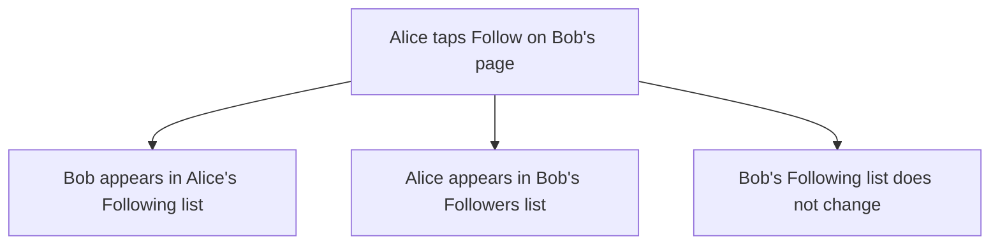

# Follow and followers: two lists that only go one way

## What you'll have at the end

People following and unfollowing each other, with both lists on a profile — and proof, from both sides of the app, that nobody can follow themselves and a follow never runs both ways. Following is the first thing that connects two accounts, and the first thing that can do the exact opposite of what you asked while looking correct from where you are standing: a follow that runs both ways and one that runs one way are the same picture on your own screen.

> **Following along:** Build this lesson's chunk in the app you picked in Module 0. The asks are written out for you; your agent's exact words and plan will differ from any this lesson describes, and that is normal.

> **Last verified:** 2026-08-17. Seeing your agent behave differently from what this lesson shows? On the course site, open the lesson chat ("Ask about this lesson") and tell it what you see versus what the lesson says — it can help you reconcile the difference against this exact lesson. For the full record of changes, see [`WHAT-CHANGED.md`](../../WHAT-CHANGED.md).

## What this adds

On somebody else's profile there is a button reading Follow. Tap it and it reads Unfollow. Your own page grows two lists: the people you follow, and the people who follow you. Following someone does not make them follow you back, and nobody can follow themselves. The thing to spot lives in the other person's lists, so two of this lesson's checks send you to another browser to be somebody else.



## The ask

Start a fresh conversation with your project folder selected. If your agent does not open by saying where you are in the plan, say:

```prompt
Read the plan and the house rules, and tell me where we are.
```

Then:

```prompt
I want people to follow each other. On someone else's profile, a button says Follow; once I tap it, it changes to Unfollow. My own page shows two lists: who I follow, and who follows me. Me following someone should NOT make them follow me, and I should never be able to follow myself. Plan this before you write any code, and tell me what could go wrong. Before you say "done", run these checks and show me the results in plain words — if you can't run one, say so instead of guessing: Follow flips to Unfollow and back on somebody else's profile; the two lists update on both profiles — the follower on one, the followed on the other; following is one-way, so following somebody never puts me in their Following list; following myself is impossible, and not only because the button is hidden.
```

Check the plan against what you asked for — a button that flips, two lists, one direction, no following yourself — and that "what could go wrong" came back as a list of specific things. If it names what it is deliberately leaving out, note it and move on. Then:

```prompt
That matches what I want. Go ahead and build it.
```

<!-- Grounded in the real thread-project build run, 2026-07 (archived evidence m4-c4); presented in the desktop app's framing. -->

When this chunk was really built, the plan listed ten things that could go wrong. Two are worth carrying. It called the first the mirror bug and handed over the test that catches it: two accounts, A follows B, then check B's page shows A under Followers and *nothing* under Following. The second: hiding the Follow button on your own page is not protection — something has to refuse the thing itself, and the only way to know is to try. It also listed what it was leaving out — blocking, muting, private accounts, follow requests, notifications — which is a map of the edges, not a fault. Approve the steps as the app asks.

<!-- CODEX / OPENCODE VERIFICATION SLOT: verify wording and app behavior against a real run in each app — user-assisted evidence pass -->

## Before anything touches your database

Your profile, your posts and their pictures are in there now. Before you approve the change that gives follows somewhere to live:

```prompt
Does this remove or overwrite anything that is already in my database? List exactly what changes for data that exists today.
```

If your agent hands you something to paste instead of making the change itself, do it the way [Lesson 3](./03-profile.md) showed, and hold the dashboard's warning against the answer you got.

## Check it

Open the running app — if nothing is open:

```prompt
Start the app on my computer and open it in my browser.
```

Open a second person's profile, tap Follow, watch it flip to Unfollow and back, and leave it following. Open your own page: that person is under Following, your Followers list is empty. Then the four checks — two need the second account in another browser.

> **TRY THIS:** as your first account, follow the second. Then, in another browser, sign in as the second account and open its two lists.
>
> **EXPECT:** you are in their Followers, and their Following list is unchanged.
>
> **IF BOTH MOVED:**

```prompt
Following ⟨B⟩ made them follow me back. Following should be one-way. Fix that.
```

> **TRY THIS:** open your own profile and look for a way to follow yourself. If a Follow button is there, press it.
>
> **EXPECT:** no Follow button on your own page — or, if one shows, pressing it refuses.
>
> **IF IT WORKS:**

```prompt
I just followed myself. That shouldn't be possible. Fix that.
```

> **TRY THIS:** open a private window that has never signed in, open a profile that has followers on it, and read both lists. Then look for any way to follow, unfollow, or change either list.
>
> **EXPECT:** both lists readable — and no Follow button, no Unfollow, no way to move anybody into or out of either one.
>
> **IF IT WORKS:**

```prompt
While signed out I could ⟨what you did⟩. A signed-out visitor should only be able to read. Fix that.
```

> **TRY THIS:** signed in as your second account, open its own page, find the first account in its Followers list, and try to remove it from there — or to change the first account's Following list from your side.
>
> **EXPECT:** no control that does either — you can unfollow people *you* followed, and nothing else — and after a refresh both lists are unchanged.
>
> **IF IT WORKS:**

```prompt
As ⟨account B⟩ I could ⟨what you did⟩ to ⟨account A⟩'s follow. Only its owner should be able to. Fix that.
```

<!-- Grounded in the real thread-project build run, 2026-07 (archived evidence m4-c4). -->

When this chunk was really built, Alice tapped Follow on Bob's profile, watched it read Unfollow, tapped back, and left it following. Her page listed Bob under Following — shown as "Unnamed", the app's fallback for a person who never set up a profile — and her Followers list read "Nobody is following you yet." Signed in as Bob in a second browser, Alice was under his Followers and his Following list read "You aren't following anyone yet." Neither account saw a Follow button on its own page. One wrinkle that may happen to you: the app had stopped running between chunks, so the first page after the database step showed an error; saying "the app page shows an error" was the entire fix.

Your agent will describe a rule it forgot and a rule it wrote in exactly the same voice; Module 5 shows what the question before an irreversible step is worth on the day the answer comes back bad. You already have both moves: the question before the change, and the push on the fence afterwards.

## If something is wrong

```prompt
I tapped Follow and the button still says Follow — it didn't change to Unfollow. Find out why and fix it.
```

```prompt
I was able to follow my own profile. I should never be able to do that. Fix it, then show me that I can't anymore.
```

```prompt
I followed the second account from the first one, then signed in as the second account. It shows the first account under Following as well as Followers — following someone should never make them follow me back. Find out why and fix it.
```

- **A page says something does not exist** — "table not found" or wording close to it: the database change never went in. Say so, and your agent goes back to that step.
- **The app will not load at all:**

  ```prompt
  Start the app on my computer and open it in my browser.
  ```

- **Your agent keeps circling:** start a fresh conversation and begin this chunk again from your last saved version.

## Save it

Look first, say the sentence second. Once you have clicked through it from both accounts and it holds:

```prompt
Save this as a working version.
```

```prompt
Confirm all three: saved on this computer, the copy went up, and the live copy rebuilt successfully.
```

## What "done" means

You wrote these into the ask. Before you accept "done", your agent shows you the results in plain words. If it could not run one, that check is yours to run or ask about — never to count as passed.

1. Follow flips to Unfollow and back on somebody else's profile.
2. The two lists update on both profiles — the follower on one, the followed on the other.
3. Following is one-way: following somebody never puts you in their Following list.
4. Following yourself is impossible, and not only because the button is hidden.

If your agent says "done" without showing these:

```prompt
Run the checks we agreed on and show me the results first.
```

You're done when the second account, in another browser, shows you under Followers and not under Following, and you have a saved version. Your agent may offer a follower count and a way to find people; neither is a fault. Right now the only route to another profile is knowing its address — the next chunk brings posts to you instead.

## Navigation

[← Previous: Posts: write, edit, and delete your own](./04-posts.md)
[Next: The feed: the people you follow, plus you →](./06-feed.md)
