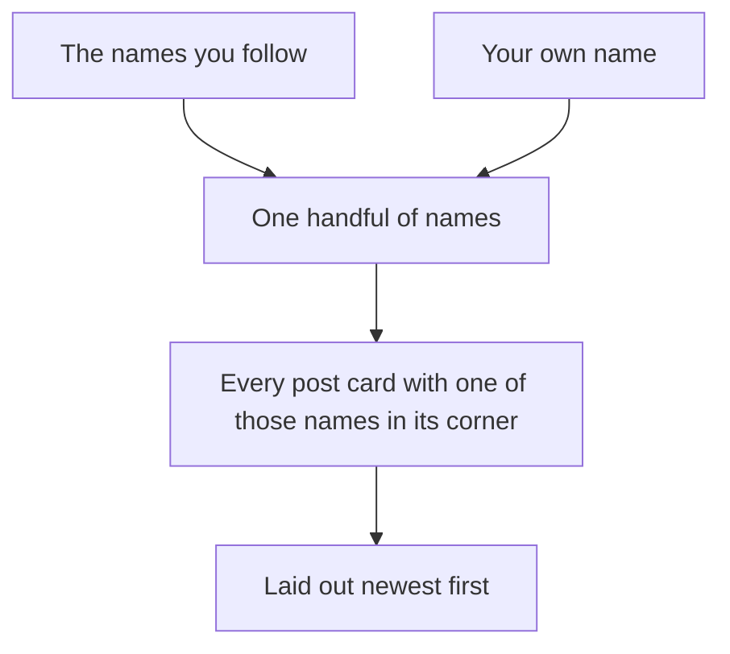

# The feed: the people you follow, plus you

## Learning objective

By the end of this lesson, you will be able to direct your agent to build the sixth feature on your plan — one home feed carrying your own posts and the posts of everyone you follow, newest first — and to catch the failure no screen announces, a feed that quietly leaves your own posts out, with a ninety-second try in the running app that no explanation can substitute for.

## Why this matters

You can follow people now and you have nothing to show for it. Posts still sit on profiles you reach by typing an address, and following somebody changes nothing you can see from one day to the next. The feed is the first thing in this app that brings something to you instead of waiting to be found — and the first feature whose most likely failure is a thing that is *not* there. Your own posts, quietly missing from your own feed, on a page that otherwise looks completely correct.

> **Following along:** Build this lesson's chunk in the app you picked in Module 0. The asks are written out for you; your agent's exact words and plan will differ from any this lesson describes, and that is normal.

> **Last verified:** 2026-08-17. Seeing your agent behave differently from what this lesson shows? On the course site, open the lesson chat ("Ask about this lesson") and tell it what you see versus what the lesson says — it can help you reconcile the difference against this exact lesson. For the full record of changes, see [`WHAT-CHANGED.md`](../../WHAT-CHANGED.md).

## Core read

> **Deviation note:** This read runs longer than most in the course. The question that carries this chunk came back with a fluent answer nobody could grade when the chunk was really built, and what happened next is the point of the lesson, so it is walked through slowly; the rest is the usual length.

You are not writing this app. Your agent is. The split does not move: your agent owns the code and the rules; you own saying what you want, watching the running app, running the chunk's checks, and saying when to save. What changes in this chunk is the direction things travel. Everything you have built so far sits where you left it and waits to be visited. A feed goes and gets.

**What this adds:** the home page — a placeholder since you built sign-in — becomes a feed. It carries every post by someone you follow, plus your own, newest at the top. One stream, not two lists side by side. Each post shows who wrote it, with their name and photo linking to their profile, and an Edit link on the ones you wrote.

Module 1's filing cabinet does not grow a drawer this time. It gets read differently. You already have a drawer of follow cards and a drawer of post cards, and a feed is what happens when you use the first to decide what to pull out of the second: take the names you follow, add your own name to that same handful of names, then pull every post card with one of those names in its corner and lay them out newest first.

That "add your own name to the same handful" is the whole lesson. It is one line of the picture, it is the thing that goes wrong, and it is the thing you will be checking for.

Take your name out of that handful and nothing breaks. No error, no blank page, no warning. You get a feed — it has a hole in it exactly the size of everything you have ever written. And if you happen to follow a few talkative people, you may not notice the hole for days.

> **Note:** None of the gathering is taught here. How the two drawers get read together, how the ordering is done, how the page is built before it reaches your browser — that is your agent's job, and you are never asked to write or repair it. Your job is to say what you want, to notice, to check, and to say when to save.

### Pointing your agent at the sixth feature

Open your agent and point it at the sixth feature in your plan:

> Build me a home feed. When I'm signed in, it should show the newest posts from the people I follow, and it should also include my own posts, all mixed together with the newest first. Plan how you'll do this before writing any code. Before you say "done", run these checks and show me the results in plain words — if you can't run one, say so instead of guessing: the feed shows the newest posts from the people I follow and my own posts, newest first, in one stream; a person who follows nobody at all still sees their own posts on their feed; a new post from a followed account appears in the feed after a refresh.

Read the plan when it comes back. You are checking two things: that it says your own posts are included, and that it names how you will be able to tell — in things you can see by clicking, not in reassurance. If it does not name the case where you follow nobody at all, ask for it before you approve anything:

> Before you build: how will I be able to tell my own posts are in the feed if I follow nobody at all?

That question is doing more work than it looks like. It takes the thing most likely to go wrong and turns it into something the plan has to answer for out loud, in advance, in terms you can check with your own hands. When the answer names a case you can produce by clicking, give it the go-ahead:

> That's exactly what I want — my own posts included, newest first. Go ahead.

<!-- Grounded in the real thread-project build run, 2026-07 (archived evidence m4-c5); presented in the desktop app's framing. -->

**In Claude Code desktop:** this chunk is shorter than the last three and it has no stop in the middle — there is nothing on a dashboard for you to do this time. What you get is the usual run of approval pauses, each one showing you what it wants to do next before anything on your machine changes. On the run this lesson is written from, the go-ahead was given by approving the plan in the app's own prompt rather than by typing the sentence above. Either way is the same decision, and the sentence is there for when you want to say it in your own words.

<!-- CODEX VERIFICATION SLOT: verify wording and UI behavior against a real Codex run — user-assisted evidence pass -->

**In the ChatGPT app (Codex):** the same shape, with the app's own approval prompt wherever it is set to ask before your folder changes, and the same absence of a dashboard step.

### What your agent asked before it planned anything

<!-- Grounded in the real thread-project build run, 2026-07 (archived evidence m4-c5); presented in the desktop app's framing. -->

When this chunk was really built, the agent read the project first and then asked two questions before it wrote a plan at all. Both are worth seeing, because a question before a plan is cheaper than a rewrite after one.

The first: the feed and the profile page are both about to show posts the same way — should that be written once and used in both places, or written twice? It recommended once. That was the answer given, and it is why this chunk touches the profile page as well as the home page.

The second was not about the app at all. Two of the project's own instructions contradicted each other: one told the agent to go and read some reference material before writing code, and another forbade it from opening the place that material is kept. It found the collision and handed it back rather than picking a side quietly. The answer given was to follow the patterns already working in this project instead. You do not need to know what either instruction says to answer a question shaped like that — the shape is "two of your own rules disagree, which one wins", and only you can settle it.

### A plan that says how you will know

<!-- Grounded in the real thread-project build run, 2026-07 (archived evidence m4-c5); presented in the desktop app's framing. -->

The plan that came back had a section listing how the agent expected the finished thing to be checked. Not "it will work" — a list of things to go and look at. Your own posts show up on the home page even when you follow nobody. Follow a second account and their posts appear mixed into yours in one newest-first stream, rather than sitting in a block of their own. Post something, tap Home, and it is at the top; unfollow somebody and their posts are gone. A followed account that never set up a profile shows as "Unnamed" rather than as a gap.

Read those again as what they are: your checks, written for you, by the thing you are checking. That is the mark of a plan worth approving. It does not only say what will be built, it says what you will be able to see afterwards, in behaviors you can produce by clicking. A plan that ends in reassurance gives you nothing to hold it to. This one named the exact case that was about to matter most — your own posts, following nobody — because the question above had made it name that case.

### The checks you run

Three things get checked when it comes back, and the first is the one this whole chunk stands or falls on. None of the three asks you to look at anything your agent wrote.

**Your own posts are in the feed.** The plain one, and it runs entirely in the app on one account.

> **TRY THIS:** sign in as your second account — the one that follows nobody — write a post from its profile, and open its feed. Then sign in as your first account, the one that followed the second last chunk, post something of your own, and open its feed too.
>
> **EXPECT:** on the second account, the post is there on a feed belonging to somebody who follows no one at all. On the first account, your newest post is at or near the top with the followed account's posts mixed in around it, newest to oldest — one stream, not two blocks.
>
> **IF YOUR OWN POSTS ARE MISSING:** *"My own posts aren't in my feed — the feed is the people I follow PLUS me. Fix that."*

Ninety seconds, one account, one post, one look. There is nothing to open and nothing to match — the feed either carries your post or it does not.

**Signed out, there is no feed to walk into.** A **refusal check** (a one-line definition: in the running app you try the thing that should NOT be allowed and confirm it is refused — and if it goes through, you tell your agent what you did and what should have stopped it, [→ GLOSSARY](../../GLOSSARY.md#refusal-check)) — one of the two shapes a **smell-test** (a one-line definition: a check you can run without reading a line of code — you try something and watch what the app does, [→ GLOSSARY](../../GLOSSARY.md#smell-test)) takes, and the one you have now run on every chunk since sign-in.

> **TRY THIS:** in a private window that has never signed in, open the home page. Then open a profile address directly and read the posts on it.
>
> **EXPECT:** the home page lands you on sign-in or refuses — a feed belongs to somebody — while the profile still reads fine, posts and all.
>
> **IF YOU GET STRAIGHT IN:** *"Signed out, I can still open the feed. That should need an account. Fix that."*

**Nothing of someone else's is yours to change.** The second refusal check, now that the feed puts two people's posts on one page.

> **TRY THIS:** signed in as the account that does the following, find a post in its feed that the other account wrote, and try to edit or delete it from there.
>
> **EXPECT:** Edit shows on your own posts and on nobody else's — and after a refresh their post is unchanged.
>
> **IF IT WORKS:** *"As ⟨account B⟩ I could ⟨edit/delete⟩ ⟨account A⟩'s post from the feed. Only its owner should be able to. Fix that."*

### Why the first check is a try and not a question

<!-- Grounded in the real thread-project build run, 2026-07 (archived evidence m4-c5); presented in the desktop app's framing. -->

When this chunk was really built, the question version was tried first: the agent was asked what makes your own posts show up in the feed. The answer was fluent and specific, and it explained itself in words nobody has taught you and nothing in this course will teach you to grade. If the exchange had stopped there, all anybody would have had was a claim that sounded right.

It did not stop there, because the answer happened to end in something better than an explanation: a prediction. Follow nobody, it said, and the feed comes back as exactly your own posts and nothing else. A prediction about the running app is a thing you can prove wrong in ninety seconds — so that is what happened next. Signed in as the second account, following nobody, with nothing written yet, the feed showed an empty state in plain words: "Your feed is empty. Follow someone, or write your first post on your profile." A post written from that account's profile, then Home: the post was there, on a feed belonging to somebody who follows no one at all. The prediction held.

**The ruling to take from this:** an answer, however concrete, is a claim. What settles it is the app doing the thing the claim predicts. So when you are unsure about the feed — or anything — do not go collecting a better explanation. Ask if you like; then go and be the user in the case you are worried about, and let what you see decide. An answer that sounds fine while the app disagrees with it is not a pass, and the steer at the bottom of this lesson is what you send.

### What the checks are actually for

Your agent can be wrong in the same steady voice it uses when it is right. Not evasive, not hedging, not visibly guessing — wrong about a thing it has no particular reason to doubt, described as calmly as everything else it tells you. A feed is the ideal place for that, because a feed that is missing something looks exactly like a feed. There is no error to read. Your profile still lists your posts, so nothing is lost. The page quietly under-reports, and the only person in the world positioned to notice is the person whose posts are absent.

That is why this chunk's first check is a try in the app and nothing else. Go and be the user in the case you are worried about: follow nobody, post, look.

> **Heads up — you'll meet this again.** A feed that confidently leaves your own posts out is the second of the three "watch the AI fail" walkthroughs Module 5 puts you in front of. You already have the check for it — the first one above, ninety seconds on one account. Module 5 is where you watch what it looks like when nobody runs it.

### Nothing for you to run this time

The last three chunks each ended with a step only you could do: a file of instructions for your database that your agent writes and cannot run, pasted into your **Supabase** (a one-line definition: the service that gives your app an account system, a database, and file storage in one — you say its name to your agent and operate its dashboard, and never learn its internals, [→ GLOSSARY](../../GLOSSARY.md#supabase)) dashboard by hand.

Not this one. This chunk changed nothing about how your information is stored or who may read it — it reads what is already there, under rules you already ran. On the build this lesson is written from, the agent's own line on it was that there was nothing to paste into the Supabase SQL editor at all.

Do not go looking for the step. And if your agent does hand you a file for your database during this chunk, that is worth a **pre-flight question** (a one-line definition: before a step you cannot take back, you ask your agent a named question about what it changes, and wait for the answer, [→ GLOSSARY](../../GLOSSARY.md#pre-flight-question)) before anything else: ask what it needs to change and why the feed needs it — *and* the usual one, *"Does this remove or overwrite anything that is already in my database? List exactly what changes for data that exists today."* Wait for both answers before you paste anything.

### Checking it yourself

Open the running app — the copy on your own computer, started with the sentence from Lesson 1 if nothing is open — and go through it in order. Most of this needs both accounts, and the first two are the ones that matter most.

- Sign in as the account that follows nobody. The feed says, in plain words, that it is empty.
- Write a post from that account's profile, then go Home. Your own post is in the feed — with zero people followed. That is the first check.
- Sign in as the other account in another browser — the one that did the following last chunk. Its feed carries the followed account's post *and* its own older one, one under the other in a single stream — not the followed account's posts in one block and yours in another.
- Write a new post from that account, then go Home. It is at the top, and the order reads newest to oldest as you go down.
- Look at the Edit links. They appear on your own posts and on nobody else's, in this account's feed — the second refusal check, from the inside.
- Sign out entirely and open the home page — the first refusal check. You should land on sign-in rather than on somebody's feed.

<!-- Grounded in the real thread-project build run, 2026-07 (archived evidence m4-c5); presented in the desktop app's framing. -->

When this chunk was really built, all of them held. Bob — following nobody, nothing written — got "Your feed is empty. Follow someone, or write your first post on your profile." He posted, tapped Home, and there it was, with an Edit link on it. Alice, who had followed Bob last chunk, saw Bob's newer post at the top with no Edit link on it, and her own post from two days earlier under it, carrying its "edited" marker and its Edit link. She posted again: her new one went to the top, Bob's under that, her older one third.

One detail from those screens is worth a line of its own. Bob's byline read "Unnamed" — he had never set up a profile, and rather than leaving a blank where a name goes, the app puts a word there. That is the app's fallback doing its job, not a fault, and you saw the same word standing in for him in Alice's Following list last chunk.

### What was left out on purpose

<!-- Grounded in the real thread-project build run, 2026-07 (archived evidence m4-c5); presented in the desktop app's framing. -->

The agent listed what it had deliberately not built, and none of it is a fault: no box for writing a post on the feed itself — posting stays on your profile; no way to page past the newest fifty posts; no page for a single post on its own. That last one is the next chunk's job.

It also flagged one thing for later, in plain terms: the way the feed asks for the posts of everyone you follow does not scale to very large following lists, so that is the first place to look if the feed ever feels slow. You are not fixing that today. You are filing it, so that if the feed does slow down in six months you already know where somebody told you to look.

### When it goes sideways

Two steers, both the move you know — name what you saw and hand it back:

> "I posted something and then opened my feed, and it's completely empty even though I can see the post on my profile. Find out why my own posts aren't in my feed and fix it."

> "I see posts from people I follow, but never my own. I want both in the feed. Find out why and fix it."

Those are also the exact steers for the case above, where the answer to your question sounded fine and the app disagreed with it. You do not have to argue with the explanation. Say what you saw.

And the familiar one: if your agent keeps circling — reworking the same thing, losing the thread of what you asked — do not keep arguing with it. Start a fresh conversation and begin this chunk again from your last saved version.

### Before it is allowed to say done

Underneath your three checks sits the layer that is your agent's job. This chunk's **definition of done** (a one-line definition: the checks your agent must run and show you, in plain words, before it is allowed to say a piece of work is finished, [→ GLOSSARY](../../GLOSSARY.md#definition-of-done)) is the list you wrote into your ask — the reference copy is at the end of this lesson — and its middle item is the one this chunk exists for: a person who follows nobody still sees their own posts. Your agent runs the checks and reports what happened, naming any it could not run; your side stays one sentence: *"Run the checks we agreed on and show me the results first."*

### Saving it

<!-- Grounded in the real thread-project build run, 2026-07 (archived evidence m4-c5); presented in the desktop app's framing. -->

Look first, say the sentence second. When this chunk was really built, the checks were reported and the save was asked for in the same message, which is a decent habit:

> "All my checks passed: Bob follows nobody and still sees his own post in his feed, my feed has my newest post on top, Bob's under it, my older post under that, and Edit only shows on my own posts. Save this as a working version."

It went into **git** (a one-line definition: the tool from Module 2 that keeps every version of your project so you can go back to one, [→ GLOSSARY](../../GLOSSARY.md#git)) as one saved version covering six files — two new ones and four changed, including the profile page, which now shows posts using the same piece the feed does. The note on it read "a home feed of the people you follow, and yourself".

What to watch this time is different from the last three chunks. There is no database file in this saved version, because this chunk did not touch your database. What matters instead is that the profile page changed in this chunk too, so it belongs in the same saved version as the feed — a version that saved half of a change cannot rebuild the app it describes. Once you have clicked through the feed and it holds, open a profile and confirm posts still look the way they did before. Then: *"Save this as a working version."* Then ask it to confirm all three: saved on this computer, the copy went up, and the live copy rebuilt successfully.

## Exercise

Build the sixth feature on your plan: give following a payoff. The deliverable is a running app with one home feed carrying your own posts and the posts of everyone you follow, newest first — plus a saved version.

1. **Start a fresh conversation and give it the ask.** With your project folder selected — if the app asks which folder, or your agent does not open by saying where you are in the plan, point it at the folder again and say: *"Read the plan and the house rules, and tell me where we are."* Then the ask from this lesson, word for word or in your own words with the same limits in it: one home feed for a signed-in person, the newest posts from the people they follow, their own posts mixed in, newest first, the plan before any code — and the checks from the definition of done at the end of this lesson, written into the ask before you send it.
2. **Answer whatever it asks before it plans.** If it offers to write the post display once and use it in both the feed and the profile, say yes. If it tells you two instructions in your own project contradict each other, pick one — following the patterns already working in the project is a fine answer.
3. **Read the plan, and if it does not name the case that matters, ask for it:**

   > Before you build: how will I be able to tell my own posts are in the feed if I follow nobody at all?

   You want an answer in things you can see by clicking, not a reassurance.
4. **Give the go-ahead** and approve the steps as the app asks you to:

   > That's exactly what I want — my own posts included, newest first. Go ahead.
5. **Run the check that decides this chunk.** If nothing is open, or the tab says it cannot connect, say: *"Start the app on my computer and open it in my browser."* Sign in as your second account — the one that follows nobody — write a post from its profile, and go Home. Your own post should be on your feed, on an account that follows no one at all. If it is not, use the first steer below.
6. **Check the rest from your first account** — the one that followed the second last chunk — in another browser: both people's posts in one stream rather than two blocks, and newest at the top after you post again.
7. **Run both refusal checks.** Still signed in as the account that does the following, find a post in its feed that the other account wrote and try to edit or delete it from there — Edit should be on your own posts and nowhere else, and after a refresh their post is unchanged. Then, in a private window that has never signed in, open the home page — you should land on sign-in rather than on somebody's feed — and open a profile address directly to confirm the posts on it still read.
8. **If anything is off, use the matching steer** — say what you saw and hand it back.
9. **Save it.** Open a profile first and confirm posts still look right there, then: *"Save this as a working version."* Then ask it to confirm all three: saved on this computer, the copy went up, and the live copy rebuilt successfully.

## Definition of done

You wrote these into the ask; this is the reference copy. Before you accept "done", your agent shows you the results of these checks, in plain words:

1. The feed shows the newest posts from the people the signed-in person follows and their own posts, newest first, in one stream.
2. A person who follows nobody at all still sees their own posts on their feed.
3. A new post from a followed account appears in the feed after a refresh.

If your agent says "done" without showing these, say: "Run the checks we agreed on and show me the results first."

## Checkpoint

You've got this if you can do both:

1. Sign in as an account that follows nobody, write a post, open the feed, and find that post on it.
2. Say the ninety-second try that proves your own posts belong to your feed — which account, what you do, what you expect to see — and what you would tell your agent if the post were missing, in one sentence each.

## Going deeper

Optional, only if you're curious:

- Re-read [Module 3 — Reading plans and recognizing wrong](../03-the-loop/03-reading-plans-recognizing-wrong.md), now that you have been handed an explanation you had no way to grade and settled the question by clicking instead.
- Take your agent up on the thing it flagged: ask what would change about the feed if you followed five hundred people. It already named the first place it would look. You do not have to build anything — the answer is worth having before the app has more in it than you put there by hand.

## Loop check

> **Loop check — evaluate.** This lesson reinforces **evaluate**: an explanation of the feed, however fluent, could not settle whether the feed was right. What settled it was the app — one account, following nobody, one post, one look. Evaluate is not "did the answer sound good." It is "what would I see if this were true, and is that what I see?"

## What you just did

You turned following into something you can watch: one page carrying your own posts and everybody's you follow, newest first, in a single stream. You did not write it — you asked, you sent one question that forced the riskiest case into the plan before a line of code existed, you answered the questions it raised, and then you proved the thing that mattered with one account and one post. What the app still cannot do is hold a conversation: a post is something people read and then walk away from. The next chunk gives every post a page of its own and lets people reply on it.

## Navigation

[← Previous: Follow and followers: two lists that only go one way](./05-follow.md)
[Next: Comments: a page for every post, and a thread under it →](./07-comments.md)
