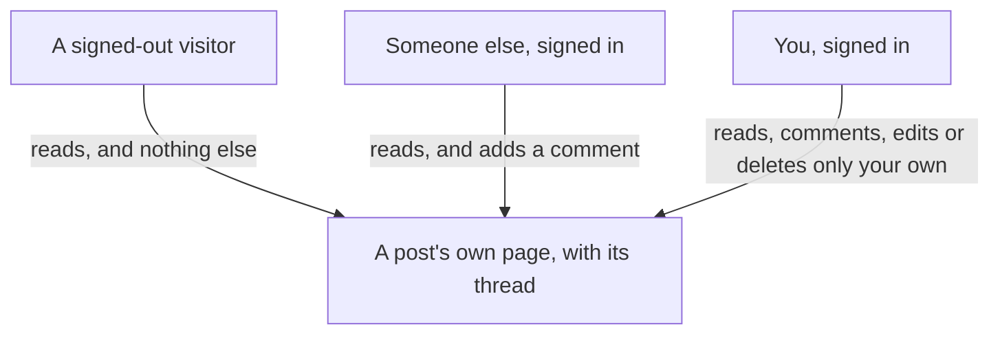

# Comments: a page for every post, and a thread under it

## Learning objective

By the end of this lesson, you will be able to direct your agent to build the seventh feature on your plan — a page for every post that anyone can open and read, with a comment thread under it that only signed-in people can write into — run the one dashboard step a fourth time with the question that goes before it, and settle who-may-change-what by trying the forbidden things yourself, having watched a careful, well-organized, reason-giving answer about those same rules turn out to be backwards.

## Why this matters

Your feed finally brings you other people's writing, and it leaves you nothing to say back. A post is a thing you read and walk away from, and there is not even an address you could send somebody so they could look at one on its own. Comments fix both — and they move your app across a line it has not crossed before. Until now, everything anybody typed landed somewhere belonging to them: their profile, their posts, their own list of follows. A comment thread is the first place where two people write into the same spot, which turns "who may change what" from a tidy idea into a question with something at stake. This chunk is where you find out how that question actually gets settled, and it is not by reading an answer.

> **Following along:** Build this lesson's chunk in the app you picked in Module 0. The asks are written out for you; your agent's exact words and plan will differ from any this lesson describes, and that is normal.

> **Last verified:** 2026-08-17. Seeing your agent behave differently from what this lesson shows? On the course site, open the lesson chat ("Ask about this lesson") and tell it what you see versus what the lesson says — it can help you reconcile the difference against this exact lesson. For the full record of changes, see [`WHAT-CHANGED.md`](../../WHAT-CHANGED.md).

## Core read

> **Deviation note:** This read runs longer than most in the course. One part of this chunk happens on your Supabase dashboard rather than in the conversation with your agent, and something happened when this chunk was really built that this course would be dishonest to leave out — both are walked through slowly; the rest is the usual length.

You are not writing this app. Your agent is. The split does not move: your agent owns the code and the rules; you own saying what you want, watching the running app, running the chunk's checks, and saying when to save. What changes here is who the app is for. Every page so far has belonged to somebody. A post's page belongs to whoever opens it.

**What this adds:** every post gets its own address, and that page opens for anyone — signed in, signed out, or somebody who has never heard of your app. Under the post is its comment thread, oldest first. Signed in, you can leave a comment. On your own comments you get Edit and Delete. On everybody else's, you get neither.

Module 1's filing cabinet gets a fourth drawer. One card per comment, and each card has two things written in its corner: which post card it belongs under, and who wrote it. The drawer is new in one way that matters. The first three drawers held cards each belonging to one person. This one stacks cards from different hands under the same post, in a cabinet standing in a lobby anyone can walk into and read from. Reading is open to the street. Writing is not, and the distance between those two is the whole question this chunk asks.

> **Note:** None of the rule-writing is taught here. How a comment is stored, how the app decides who may write one or change one, how a post gets an address of its own — that is your agent's job, and you are never asked to write, read, or repair any of it. Your job is to say what you want, to try the things that should be refused, and to say when to save.

### Pointing your agent at the seventh feature

Open your agent and point it at the seventh feature in your plan:

> Give each post its own page that anyone can open and read, including all of its comments — works even when I'm signed out. If I'm signed in, I can leave a comment. People can only edit or delete the comments they wrote themselves, never anyone else's. Plan this before you write any code, and tell me how you'll stop a signed-out visitor from posting.

Read the plan when it comes back. You are checking that it matches what you asked for — a page anyone can open, a thread under it, comments only their own author can touch — and that the last part of your ask came back as something specific rather than a reassurance. When the plan matches, give it the go-ahead:

> That matches what I want. Go ahead.

<!-- Grounded in the real thread-project build run, 2026-07 (archived evidence m4-c6); presented in the desktop app's framing. -->

**In Claude Code desktop:** the same approval pauses as every chunk before this one — the app shows you what it wants to do next and offers Accept or Reject, and nothing on your machine changes until you accept. This chunk is about the size of the posts one, and it has the same stop in the middle: your agent reaches a point it cannot get past on its own and hands you something to do on your dashboard, which is the section below.

<!-- CODEX VERIFICATION SLOT: verify wording and UI behavior against a real Codex run — user-assisted evidence pass -->

**In the ChatGPT app (Codex):** the same shape, with the app's own approval prompt before anything in your folder changes — and the same stop in the middle, where the work waits on the step that is yours.

### Two questions before a single line of the plan

<!-- Grounded in the real thread-project build run, 2026-07 (archived evidence m4-c6); presented in the desktop app's framing. -->

When this chunk was really built, the agent read the project first and then came back with two forks it wanted settled before it wrote a plan at all. Each one arrived as two options with a recommendation, and each is worth seeing.

The first was about editing your own comment: should the Edit link turn that one comment into a small form right there on the post's page, or should it open a page of its own? It recommended the first, because it adds nothing new to the app — the page you are already looking at just shows one thing differently for a moment.

The second was about how anybody reaches a post's page in the first place: should the date already printed on every post card become the link, or should each card carry a "3 comments" link instead? It recommended the date, because nothing new appears on screen and the feed does not have to go and count anything extra before it can draw itself.

Both went to the recommended option. Look at what you are actually weighing in a question like that, because it is not the code. When your own agent puts two options in front of you, half of each one will be words nobody has taught you and nothing in this course will. The other half is a plain-English price: *nothing new added*, *one more page*, *nothing extra to count*, *something extra to count every time the feed loads*. That is a comparison you can make today, and it is the right one to make — the option that drags less machinery into your app has less in it to go wrong later. The second question is a real trade, and you are allowed to buy the friendlier one. You are choosing to pay for it with a slower feed.

### A plan that answered the question it was asked

<!-- Grounded in the real thread-project build run, 2026-07 (archived evidence m4-c6); presented in the desktop app's framing. -->

Your ask ended with a clause: tell me how you'll stop a signed-out visitor from posting. The plan led with the answer, and it ranked itself: three walls, it said, and only the third one is load-bearing.

The first wall is that the comment box is not drawn at all for somebody who is not signed in — a courtesy, in its own words. The second is that the app checks again when a comment is actually sent, and sends a signed-out person to sign in. The third is that your database refuses to store the comment at all, and it keeps refusing whether or not the other two are still there tomorrow.

Three defenses, and your agent volunteered which two of them are decorative. That ranking is the part to notice. You met the same shape two chunks ago, when the rule stopping a person from following themselves also came in three layers with only one doing real work — and it is worth meeting twice, because "we don't show the box" is the answer you get from an agent that has not thought about it, and it sounds identical to a real answer until somebody ranks the layers for you.

Notice also what kind of proof a ranking like that sets up. "Your database refuses it" is not something you take the plan's word for. It is something you go and attempt, signed out, later in this lesson — and the refusal either happens to you or it does not.

### The go-ahead that arrived as two letters

<!-- Grounded in the real thread-project build run, 2026-07 (archived evidence m4-c6); presented in the desktop app's framing. -->

The go-ahead that day reached the agent as two characters: `Th`. It did not guess what the rest of the message said. It answered that the message looked cut off, that it had only received "Th", that the plan was approved so it could start whenever the word came — and that if a change was on its way, it would hold.

Then the go-ahead went again in full, and the build started.

Nothing dramatic happened there, which is the point. Messages arrive short constantly: a key lands wrong, a paste does not take, a send goes while the app is still catching up. The good behavior is being *told* the message was short. The version you want to be able to spot is the other one, where the gap gets filled in with the most likely sentence and the building starts against it — and you find out an hour later, from what got built. If your agent ever answers something you did not quite say, the cheapest move available is to ask it what it thinks you asked for.

### What it checked, and where it stopped

<!-- Grounded in the real thread-project build run, 2026-07 (archived evidence m4-c6); presented in the desktop app's framing. -->

When the build finished, the agent reported what it had proved with the app actually running, and then said plainly where its own testing ran out.

What it had proved, in plain words: it opened a made-up post address with nobody signed in and got a page-not-found, while the home page with nobody signed in still bounced to the sign-in screen. Two different behaviors from the same signed-out visitor is the proof that a post's page is not behind the door at all — it is not that the address was rejected, it is that there was nothing at that address to show.

What it could not do: exercise the comment flow itself, because the comments did not exist in your database yet. Your agent had written the file that puts them there and could not run it. That file is the next section.

An agent that tells you where its own checking stopped has handed you the list of things only you can do.

### The step that is yours, a fourth time

Same as the last three database chunks. Your agent writes a file of instructions for your database — the comments themselves, and the rules about who may read, write, change, and remove one — and it cannot run that file for you. Only you can, from your **Supabase** (a one-line definition: the service that gives your app an account system, a database, and file storage in one — you say its name to your agent and operate its dashboard, and never learn its internals, [→ GLOSSARY](../../GLOSSARY.md#supabase)) dashboard.

One difference from last time, and it is only arithmetic: there are three query tabs sitting in the SQL Editor by now, from the profile, posts, and follow chunks, so you are opening a fourth beside them rather than typing over any of them. The file is full of code, and none of it is for you to read — it is cargo, moved whole from one screen to another. What is yours is the same **pre-flight question** (a one-line definition: before a step you cannot take back, you ask your agent a named question about what it changes, and wait for the answer, [→ GLOSSARY](../../GLOSSARY.md#pre-flight-question)) you asked the last three times, one of the two shapes a **smell-test** (a one-line definition: a check you can run without reading a line of code — you try something and watch what the app does, [→ GLOSSARY](../../GLOSSARY.md#smell-test)) takes.

> **BEFORE YOU PASTE:** *"Does this remove or overwrite anything that is already in my database? List exactly what changes for data that exists today."*
>
> **THEN THE ADJUDICATION RULE:** if the dashboard's own warning dialog is accounted for by that answer, press Run; if the dialog names something the answer did not predict — or you never asked — press nothing and hand the dialog's words back to your agent.

Wait for the answer, and hold it to a plain standard: it should say what the file adds, and it should say in so many words whether anything already in there — your profiles, your posts, your follows — is removed or overwritten. From a file whose whole job is to add comments, the answer to expect is that nothing existing is touched and running it twice is harmless. Keep whatever answer you get in mind. The dashboard is about to appear to disagree with it, and that answer is how you read the disagreement.

So: open your Supabase dashboard, find the SQL Editor, start a fourth query alongside the three already there, paste in the whole file your agent tells you to open, and press Run.

![The Supabase dashboard, on the SQL Editor page, with a fourth query open beside the three left over from earlier chunks. A numbered marker ① points to the small "+" button at the end of the row of query tabs along the top — pressing it opens a new, empty query beside the old ones. Marker ② points to the large query area filling the middle of the screen, holding the whole file your agent wrote, with the Results pane below it still reading "Click Run to execute your query". Marker ③ points to the green Run button at the top right, which you press once the file is in.](../../screenshots/m4/07-comments/run-comments-migration.png)

Your own dashboard may not look identical — Supabase moves things around — but the SQL Editor is named the same, and the file you paste is the one your agent points you at.

### The dialog that says it may remove data

Pressing Run raises a dialog you have now met four times, and this is the chunk that owes you the fuller explanation instead of the instruction.

<!-- Grounded in the real thread-project build run, 2026-07 (archived evidence m4-c6); presented in the desktop app's framing. -->

It looks alarming and the wording is not softened: *may permanently change or remove data*. Here is why a file whose entire job is to add comments to an app that has none says that. The file is written so that running it twice does no harm, and the way that is done is that each of its rules is stated from scratch every time — and stating a rule from scratch means clearing away any earlier copy of it before writing the new one. The dashboard sees the clearing-away half, matches it against wording it treats as destructive, and warns. It is not weighing what the file adds against what it removes. It saw the words.

This is exactly what the pre-flight question was for. If the answer you got said nothing existing is touched — the answer to expect from a file whose whole job is to add — then the dialog's warning is accounted for, and **Run query** is the way through. It is what was pressed the day that picture was taken, on a database holding nothing but two test accounts and a handful of posts. The Results pane came back with "Success. No rows returned" — nothing came back because nothing was asked for; things were made.

The day the dialog names something your answer did not predict — or you never asked the question — **Run query** is not the answer. Press nothing, and hand the disagreement back:

> "The dashboard says this query includes destructive operations, and that's not what you told me before I pasted it. What in this file removes anything, and what happens to what is already in my database if I run it?"

Wait for an answer you are happy with before you press anything.

### The checks you run

Two things get checked when it comes back, and the second one cannot be run from your own account at all. Neither asks you to look at anything your agent wrote.

**Signed out, the thread reads; nothing writes.** A **refusal check** (a one-line definition: in the running app you try the thing that should NOT be allowed and confirm it is refused — and if it goes through, you tell your agent what you did and what should have stopped it, [→ GLOSSARY](../../GLOSSARY.md#refusal-check)), and the one you have now run on every chunk since sign-in — pointed this time at the wall the plan called load-bearing.

> **TRY THIS:** in a private window that has never signed in, open a post's page. Read the post and every comment under it. Then look for any way to leave one of your own.
>
> **EXPECT:** the whole thread readable — and no comment box, or one that refuses; where you would type there is a way to sign in instead.
>
> **IF IT WORKS:** *"While signed out I could ⟨what you did⟩. A signed-out visitor should only be able to read. Fix that."*

**A comment that isn't yours won't take your edit.** The second refusal check, and the one this chunk exists to prove. It needs your second account in another browser.

> **TRY THIS:** signed in as your second account, open a comment your first account wrote, and try to change it. Then try to remove it. If Edit or Delete controls show on it at all, use them.
>
> **EXPECT:** no way to do either, or the attempt refuses — and after a refresh the comment is still there, reading exactly as it did.
>
> **IF IT WORKS:** *"As ⟨account B⟩ I could ⟨edit/delete⟩ ⟨account A⟩'s comment. Only its owner should be able to. Fix that."*

<!-- Grounded in the real thread-project build run, 2026-07 (archived evidence m4-c6); presented in the desktop app's framing. -->

One habit carries both of them, and it matters more here than anywhere so far: **"no error" is not the same as "refused."** When you try a forbidden thing, do not only watch for a complaint. Refresh the page and look at whether the thing actually changed. A forbidden delete that quietly does nothing is the fence holding; a forbidden delete that quietly works is the fence down — and only the refresh tells you which one you got. This is not hypothetical. When this chunk's fences were tested for real, the cross-account delete came back with no error at all and no change either: the comment was still sitting there after a refresh. That is what a refusal can look like.

### The confident answer, and what actually settled it

<!-- Grounded in the real thread-project build run, 2026-07 (archived evidence m4-c6); presented in the desktop app's framing. -->

Now the part this course would be dishonest to leave out.

When this chunk was really built, a question about the comment rules went to the agent mid-build — what protects a comment from ending up under a different person's name. The answer that came back was, by every standard this course had taught so far, a model answer. It went piece by piece instead of answering in general. It gave a reason for every part instead of a verdict. It pointed out something the question had not even mentioned and explained what that extra piece was there to stop. It named which job each part of the protection did. It read like the work of something that had thought carefully about the question.

One of its central claims was wrong. Not vaguely wrong — precisely backwards. The job it attributed to one part of the protection belonged to another; the thing it said would go wrong without a certain piece could not in fact go wrong, because a different piece it had waved past was already stopping it.

Nobody caught that by reading it. It was caught later, and here is the part to keep: it was caught by **trying the forbidden things**, directly against the real database, and watching what happened. Three attempts, three results:

- A signed-out attempt to write a comment was refused outright.
- A signed-in account editing its own comment could **not** hand that comment to the other person's name. The rewrite the confident answer had reasoned about simply did not go through — the fence it mis-described was holding the whole time.
- An attempt to delete somebody else's comment produced no error, and changed nothing. The comment was still sitting there after a refresh.

Sit with what that sequence means. Every mark of quality you have been taught to look for in an answer — structure, reasons, going piece by piece, admitting what a question missed — that answer had all of them, and it was still wrong. Those marks are worth checking for, and this course stands by them: an answer without them is not worth your trust. But they measure the *form* of an answer, and form cannot certify truth. A fluent explanation of who can edit what settles nothing. Trying to edit the thing — that settles it.

That is why the checks in this lesson are shaped the way they are. Not "ask your agent to confirm the rules are right" — you now know exactly how far that goes. You push on the fence yourself, from the running app, and it holds or it does not, in front of you, with nothing to read and nothing to take on trust.

> **Heads up — you'll meet this again.** An answer that is confident, well-organized, and wrong is one of the named ways these tools fail, and Module 5 is where this course puts you in front of it deliberately. In its first "watch the AI fail" walkthrough you meet a build where the fence is genuinely down — where the try-to-edit-someone-else's-comment check you just learned *goes through* instead of refusing — and you practice the recovery. For now, carry the rule: behavior settles what wording cannot.

### What the checks are actually for

Your agent will propose something with real consequences in the same calm voice it uses for fixing a spelling mistake, and comments are where that has the most room to hurt. This is the first thing in your app that other people write into. If the rules around it are looser than you asked for, somebody can change words they did not write, on a page anyone can open, under a post carrying your name — and every screen in the app will look correct while it happens. Loose rules do not look like anything. That is why you push on the fence instead of looking at it: the two checks above are the only instrument you have that measures the thing that matters.

<!-- Grounded in the real thread-project build run, 2026-07 (archived evidence m4-c6); presented in the desktop app's framing. -->

Here, the fences held. When this chunk was really built, all three of the attempts you just read about came back refused, or changed nothing at all. The reason to run your own pushes anyway, every chunk, is that the one time a fence is not real, nothing else you can see will tell you.

### Checking it yourself

Open the running app and go through it in order. The last two need your second account in another browser.

- Open a post's page while signed out — the date on any post card is the link. The post is there and every comment under it is there.
- Still signed out, look for somewhere to type. There isn't one. In its place is a way to sign in — the first refusal check.
- Sign in and leave a comment. It appears in the thread, under the older ones — the thread reads oldest first.
- Click Edit on your own comment. The address in your browser's bar gains something like `?edit=` and that one comment turns into a small form in place, with the rest of the page unchanged. Save it: the words change, the date line gains `· edited`, and the comment is still yours, still under your name, still carrying its Edit and Delete.
- Sign in as your second person in another browser and open the same post. Their own comment carries Edit and Delete. Yours carries neither — and trying anyway is the second refusal check.

<!-- Grounded in the real thread-project build run, 2026-07 (archived evidence m4-c6); presented in the desktop app's framing. -->

When this chunk was really built, all of those held. One of them held differently from how it had been written down in advance, and that difference is worth a line. The course's own outline for this chunk, written before the chunk existed, predicted a comment box that would be visible to a signed-out visitor and would refuse to post. What got built has no box at all — a signed-out visitor gets a way to sign in where the box would be. Both satisfy what was asked for, and what got built is the better of the two. The reminder is the general one: what you are checking is the app in front of you, not a prediction written down in advance. When the two differ, describe what you actually see, and decide whether *that* is what you wanted.

### When it goes sideways

Two steers, both the move you know — name what you did, name what you saw, and hand it back:

> "I signed out and was still able to post a comment — that shouldn't be allowed. Find out why and fix it so signed-out visitors can read but not post."

> "Signed in as a second person, I could edit a comment I didn't write. Only the comment's own author should be able to edit or delete it. Fix that."

If a post's page complains that something does not exist — "table not found", or wording close to it — the file never made it into your database. Go back to the dashboard step above, paste it, run it, reload. You do not read the complaint past recognizing it; say what the page showed and where, and let your agent read the rest.

And the familiar one: if your agent keeps circling — reworking the same thing, losing the thread of what you asked — do not keep arguing with it. Start a fresh conversation and begin this chunk again from your last saved version.

### Before it is allowed to say done

Underneath your two checks sits the layer that is your agent's job. This chunk's **definition of done** (a one-line definition: the checks your agent must run and show you, in plain words, before it is allowed to say a piece of work is finished, [→ GLOSSARY](../../GLOSSARY.md#definition-of-done)) is at the end of this lesson, and its third item is the one this chunk exists for: only a comment's author can edit or delete it. Your agent runs the checks and reports what happened in plain words; your side stays one sentence: *"Run the checks we agreed on and show me the results first."*

And after the section you just read, one thing about that report is worth saying out loud. A gate report is still words. It is a much better class of words — outcomes your agent went and produced rather than reasons it thought up — but the two pushes above are yours, and you run them whatever the report says.

### Saving it

<!-- Grounded in the real thread-project build run, 2026-07 (archived evidence m4-c6); presented in the desktop app's framing. -->

Look first, say the sentence second. When this chunk was really built, the save was held back through the whole of it — the dashboard step and the two-account walkthrough both — and then went into **git** (a one-line definition: the tool from Module 2 that keeps every version of your project so you can go back to one, [→ GLOSSARY](../../GLOSSARY.md#git)) as one saved version covering nine files. The note on it read "a page for every post, with its comments".

Same watch as the other database chunks: this one changed your database, so the file that changed it belongs in the same saved version as the page and the commenting — a version that saved half a change cannot rebuild the app it describes. Once you have clicked through the thread from both accounts and it holds: *"Save this as a working version."*

## Exercise

Build the seventh feature on your plan: give a post somewhere to be answered. The deliverable is a running app where every post has a page anyone can open and read, signed-in people can comment, and only a comment's author can change or remove it — plus a saved version.

1. **Start a fresh conversation and give it the ask.** The one from this lesson, word for word or in your own words with the same limits in it: a page per post that anyone can open and read including its comments, commenting for signed-in people only, editing and deleting only your own, the plan before any code — and "tell me how you'll stop a signed-out visitor from posting."
2. **Answer whatever it asks before it plans.** If it offers you options, compare them on what each one drags into your app — one more page, something extra to count every time the feed loads — and take the cheaper one unless you want what the other is selling.
3. **Read the plan against your ask.** You want the last part answered as something specific rather than a reassurance. If it lists more than one defense, you want it to say which one still stands when the others are gone.
4. **Give the go-ahead** and approve the steps as the app asks you to:

   > That matches what I want. Go ahead.
5. **When your agent tells you it has written a file for your database, run the pre-flight first:** *"Does this remove or overwrite anything that is already in my database? List exactly what changes for data that exists today."* Wait for the answer — your profiles, posts, and follows are all in there now. Then do the step that is yours: Supabase dashboard → SQL Editor → **+** for a fourth query alongside the three already there → paste the whole file → Run → **Run query** on the "Potential issue detected" dialog, if its warning is accounted for by the answer you just got. If the dialog names anything the answer did not predict, press nothing — hand the disagreement back and wait. Wait for "Success. No rows returned" before you go on.
6. **Walk the happy path.** Open a post's page from the date on a post card, sign in, leave a comment, then edit your own comment and watch the words change and `· edited` land on the date line.
7. **Run both refusal checks.** In a private window that has never signed in, open a post's page, read the whole thread, and look for any way to leave a comment — there should be none, or the attempt should refuse. Then, signed in as your second account in another browser, try to change *and* to remove a comment your first account wrote — and refresh afterwards to confirm the comment is still there, unchanged.
8. **If either push goes through, use the matching steer** — say what you did and what you saw, and hand it back. If a page complains that something does not exist, go back to step 5.
9. **Save it.** *"Save this as a working version."*

## Definition of done

Before you accept "done", your agent shows you the results of these checks, in plain words:

1. Every post has a page a signed-out visitor can open and read, comments included.
2. A signed-in person can leave a comment and it appears in the thread.
3. Only a comment's author can edit or delete it.
4. A signed-out visitor has no way to comment.

If your agent says "done" without showing these, say: "Run the checks we agreed on and show me the results first."

## Checkpoint

You've got this if you can do both:

1. Open a post's page signed out, read the whole thread, and find nothing on the page you could write with — then sign in, comment, edit your own comment, and, as your second account, try to change and to remove somebody else's comment and watch both attempts refuse.
2. Say in one or two sentences why a confident, well-organized answer about who-can-edit-what is not by itself a pass — and name the thing that does settle it.

## Going deeper

Optional, only if you're curious:

- Run the signed-out check from a different direction: open a post's address on your phone, on your own data connection, and confirm the same two things hold there — the thread reads, and there is nowhere to write.
- Ask what it would take to show a comment count on each post card in the feed — the option that was offered and declined in this chunk. It already named the price. Knowing what that price buys is worth five minutes before the next chunk adds another number to every post.

## Loop check

> **Loop check — evaluate.** This lesson reinforces **evaluate**, and it moves the goalposts on purpose. Until now, evaluating meant reading a plan or an answer and judging whether it held together. This chunk showed you the ceiling of that skill: an answer can hold together perfectly and still be backwards. From here on, evaluating an access question means pushing on the fence in the running app — the answer you trust is the refusal you watched happen.

## What you just did

You gave every post an address and a thread under it: open to anyone with the link, writable by anyone signed in, and changeable only by the person whose words they are. You did not write it — you compared two options on what each would cost your app, read a plan that ranked its own defenses, asked one question before the step nobody can run for you, and then proved the fences yourself, from both accounts, by pushing on them and watching them refuse. Along the way you saw why this course keeps insisting on that: a careful, reason-giving answer about those same fences turned out to be backwards, and only the pushing found it. What the app still cannot express is the smallest reaction there is — reading something and wanting to say nothing more than *yes*. The next chunk adds likes, and then puts the whole thing online for two real accounts to use.

## Navigation

[← Previous: The feed: the people you follow, plus you](./06-feed.md)
[Next: Likes, then live: a count that moves the instant you click →](./08-likes-and-go-live.md)
