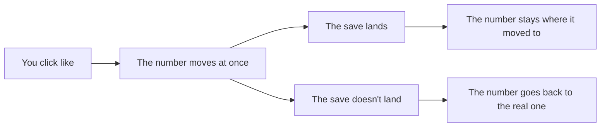

# Likes, then live: a count that moves the instant you click

## What you'll have at the end

The last feature on your plan — a like button whose count moves the moment you click it and corrects itself if the save never landed — and then the finished app proved on its public address with two accounts in two different browsers. Two things change here. Every change from now on lands on top of profiles, posts, follows and comments that took real minutes to make, so the question you ask before a database change stops being a rehearsal. And the public address that has been there since your first chunk finally gets used the way a stranger would use it.

> **Following along:** Build this lesson's chunk in the app you picked in Module 0. The asks are written out for you; your agent's exact words and plan will differ from any this lesson describes, and that is normal.

> **Last verified:** 2026-08-17. Seeing your agent behave differently from what this lesson shows? On the course site, open the lesson chat ("Ask about this lesson") and tell it what you see versus what the lesson says — it can help you reconcile the difference against this exact lesson. For the full record of changes, see [`WHAT-CHANGED.md`](../../WHAT-CHANGED.md).

## What this adds

A like button on every post, a total anybody can see, and likes reserved for people who are signed in. Click it and the number moves at once; if the save behind that click never lands, the number goes back to the truth on its own. Then the whole app goes properly live. The two behaviors have opposite failure shapes: a number that does not move fast enough, you notice immediately; a number that moves fast and then keeps a total that was never true looks exactly like a number that worked. That is why the check has a refresh in it.



## The ask

Start a fresh conversation with your project folder selected. If your agent does not open by saying where you are in the plan, say:

```prompt
Read the plan and the house rules, and tell me where we are.
```

Then:

```prompt
Add a like button to each post. Only signed-in people can like, and anyone can see the total count. When I click like, the number should change right away — I don't want to wait — but if the save fails, it should fix itself back to the real number. Plan it before you write any code. Then I want to put the whole app online and test it with two accounts. Before you say "done", run these checks and show me the results in plain words — if you can't run one, say so instead of guessing: the like count moves the instant its button is clicked and matches the real number after a refresh; only signed-in people can like; the live site passes the two-browser, two-account walkthrough end to end — and for that last one, tell me which parts you checked yourself and which you are leaving to me.
```

That ask carries two jobs, and the plan should carry both: likes for signed-in people only, a total anybody can see, a number that moves at once and corrects itself, and the going-live half. When it matches:

```prompt
That matches what I want. Build the likes, then walk me through putting it online.
```

<!-- Grounded in the locked build-script asks and the memo-verified app facts; no archived chunk-7 build evidence exists — presented in the desktop app's framing. -->

This is the longest chunk in the module, so expect more pauses than usual. If your agent app is on a free plan or a free model, it may ask you to wait at some point; that is the allowance, not a failure — sit it out and pick the chunk back up.

<!-- CODEX / OPENCODE VERIFICATION SLOT: verify wording and app behavior against a real run in each app — user-assisted evidence pass -->

## The question, now that your app is not empty

You have asked one question before every database change in this module, and every time the honest answer to "what would I lose if this went wrong" was *almost nothing*. That is over: your database holds two profiles with photos, posts, follows, and a comment thread with two people's words in it. So the question is now due before **anything** that touches your database — the change that gives likes somewhere to live, a fix your agent proposes for something that went wrong, a change to how something is stored, a clean-up it offers while it is in there:

```prompt
Does this remove or overwrite anything that is already in my database? List exactly what changes for data that exists today.
```

Read the answer for whether it names what already exists — your profiles, your posts, your follows, your comments — and says what happens to each. An answer that describes only what is being added has not answered; ask again rather than interpret. When the answer says something *is* removed or replaced, that is not automatically a stop; it is the start of the second question:

```prompt
Is there a way to make this change that keeps what's already there?
```

Your agent will not raise this for you. It describes a change that cannot be undone in the same even voice it uses for renaming a button. Module 5's third walkthrough shows this on an app with real information in it, where the question gets asked in time and you watch what that saves.

If your agent hands you something to paste instead of making the change itself, do it the way [Lesson 3](./03-profile.md) showed, and hold the dashboard's warning against the answer you got — from a change whose whole job is to add somewhere for likes to go, expect: nothing existing is touched.

## Check it at home

Open the running app — if nothing is open:

```prompt
Start the app on my computer and open it in my browser.
```

> **TRY THIS:** click like, watch the number, then refresh.
>
> **EXPECT:** it moves the instant you click, and the number after refresh agrees. Clicking again takes it back down.
>
> **IF IT LIES:**

```prompt
The like count jumped and then came back different after a refresh. It should end up on the real number. Fix that.
```

> **TRY THIS:** in a private window that has never signed in, open a post that already has likes on it. Read the count. Then try to add one.
>
> **EXPECT:** the total is visible — and the like button is absent, or refuses, or sends you to sign in.
>
> **IF IT WORKS:**

```prompt
While signed out I could ⟨what you did⟩. A signed-out visitor should only be able to read. Fix that.
```

## Save it, before the live walkthrough

The live copy is built from what was saved, so the save that carries this chunk belongs in place *before* you go two-account testing on the live link. Once likes work at home and the count survives a refresh:

```prompt
Save this as a working version.
```

```prompt
Confirm all three: saved on this computer, the copy went up, and the live copy rebuilt successfully.
```

Do not start the walkthrough until the third answer is yes. A walkthrough against a live copy that never rebuilt is a walkthrough of the previous chunk.

## Check it live

Your app has had a public address since the first chunk, and the hosting service has been rebuilding the live copy from each save that went up. What is new is that anybody looks at it properly. Seven chunks of checking happened on the machine that built the thing — the one place where every connection setting is already sitting there because your agent put it there. The live copy can carry every line of your code and still miss a setting, and the symptom is precise: everything works at home and one thing goes dead on the live link. Likes are a good tripwire because clicking like is the first thing anybody does.

> **TRY THIS:** open the live link in two different browsers — not two tabs, which share a sign-in; a private window counts as the second browser. As the first account: sign in, write a post, like the second account's post. As the second account: sign in, follow the first, open your feed, comment on their post, like it. Back on the first: refresh and find the follower in the list, the comment under the post, and the like counts on both. Signed out in a third window: read a profile, read a post's page and its thread, see the counts — and find nothing anywhere you could press.
>
> **EXPECT:** the same behavior as at home, all the way through.
>
> **IF IT DIFFERS,** say exactly which thing works at home and not live, and let your agent find the setting:

```prompt
Likes work when I run it on my own machine, but on the live link clicking like does nothing. Everything else behaves the same in both places. Find out whether the live site is missing a setting the copy on my computer has, and fix it so it works on the live link too.
```

Whatever the live site knows about is your agent's to read and compare; you name the symptom and where it happens.

The two people in that walkthrough are still your two made-up accounts, and that is the point: the moment it passes is the moment the link stops being a test thing, and accounts made after it may belong to real people. Going public does not clear the test accounts and made-up posts — they stay until somebody removes them. Whether they stay or go is your call, and it is a change to a database with things in it, so it goes through the question above first.

## If something is wrong

```prompt
When I click like, the number jumps to the wrong total and stays stuck there even after the page settles. That's not right — find out why and fix it.
```

- **A page says something does not exist:** the database change never went in. Say so, and your agent goes back to that step.
- **Your agent keeps circling** — reworking the same thing, or answering the feature half when you are asking about the live half: start a fresh conversation and begin this chunk again from your last saved version.
- **The walkthrough turned something up:** fix it, then save again and ask for the same three confirmations. The last save of this module is the one that has been through two browsers.

## What "done" means

You wrote these into the ask. Before you accept "done", your agent shows you the results in plain words. If it could not run one, that check is yours to run or ask about — never to count as passed; the two-browser walkthrough is the one it is most likely to name, honestly, as yours.

1. The like count moves the instant its button is clicked, and matches the real number after a refresh.
2. Only signed-in people can like.
3. The live site passes the two-browser, two-account walkthrough end to end.

If your agent says "done" without showing these:

```prompt
Run the checks we agreed on and show me the results first.
```

You're done when two accounts in two browsers behave correctly toward each other on the live link, a signed-out third window can read everything and press nothing, and the version that has been through two browsers is saved. That live link is a real product now, and it is yours. If you can, hand it to somebody who has never seen it and watch them use it without saying anything — the only check in this module you cannot run yourself. Module 5 is about operating it: what to do the day something breaks, and what these tools look like when they fail on an app that has something to lose.

## Navigation

[← Previous: Comments: a page for every post, and a thread under it](./07-comments.md)
[Next: Module 5 — Operating the build →](../05-operating/README.md)
