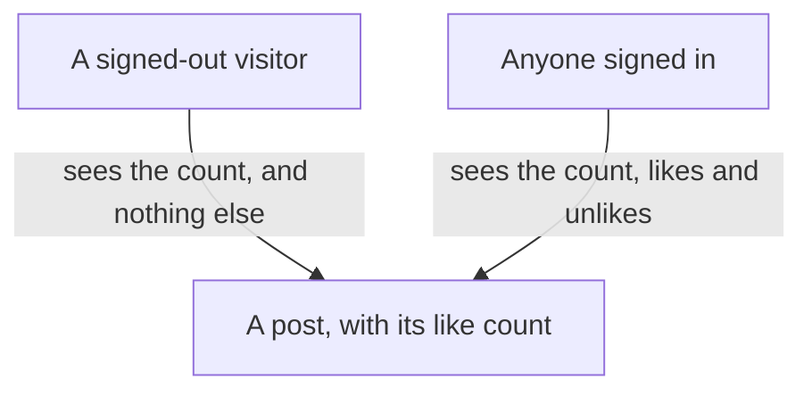
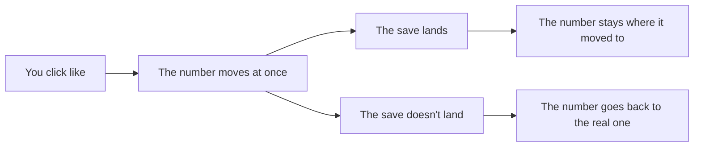

# Likes, then live: a count that moves the instant you click

## Learning objective

By the end of this lesson, you will be able to direct your agent to build the last feature on your plan — a like button whose count moves the moment you click it and quietly corrects itself if the save never landed — ask the one question that goes before any change to a database that now holds things you would be sorry to lose, and prove the finished app on its public address with two accounts open in two different browsers.

## Why this matters

Your app can carry a whole conversation now, and it still has no way to say the smallest thing there is: *yes, this one*. That is the gap this chunk closes, and it closes it with the one kind of button people press without thinking — which means the number under it has to move before they have finished pressing. But the bigger change is not the button. Everything you have built so far, you have built on an app that was effectively empty; from here on, every change lands on top of profiles, posts, follows and comments that took real minutes to make. And the public address that has been sitting there since your very first chunk has never once been used the way a stranger would use it. This lesson does both: the last feature, and then the whole thing checked as a real product by two real people.

> **Following along:** Build this lesson's chunk in the app you picked in Module 0. The asks are written out for you; your agent's exact words and plan will differ from any this lesson describes, and that is normal.

> **Last verified:** 2026-08-17. Seeing your agent behave differently from what this lesson shows? On the course site, open the lesson chat ("Ask about this lesson") and tell it what you see versus what the lesson says — it can help you reconcile the difference against this exact lesson. For the full record of changes, see [`WHAT-CHANGED.md`](../../WHAT-CHANGED.md).

## Core read

> **Deviation note:** This read runs longer than most in the course. It carries two things at once — the last feature and the go-live — and the question that goes before a change to a database with real information in it gets walked through slowly, because this is the chunk where that question stops being a rehearsal. The rest is the usual length.

You are not writing this app. Your agent is. The split does not move: your agent owns the code and the rules; you own saying what you want, watching the running app, running the chunk's checks, and saying when to save. What changes here is the ground underneath. Every chunk so far ran against a database you would not have minded losing. This one does not.

**What this adds:** a like button on every post, a total anybody can see, and likes reserved for people who are signed in. Click it and the number moves at once — not after a pause, not after the page settles. If the save behind that click never actually lands, the number goes back to the truth on its own instead of sitting there lying to you. Then the whole app goes properly live: the public address catches up with everything you have built, and you use it the way a stranger would.

Module 1's filing cabinet gets a fifth drawer, and it is the thinnest one in the cabinet. Each card records nothing more than two facts — which post, and which person — and its whole purpose is to be counted. The interesting part is not the drawer. It is that the clerk is now being asked to answer before he has finished walking to the cabinet.

> **Note:** None of how that is built is taught here. How a like is stored, how the number reaches the screen before the save comes back, how the app decides who may press the button — that is your agent's job, and you are never asked to write, read, or repair any of it. Your job is to say what you want, to try the things that should be refused, and to say when to save.

### Pointing your agent at the eighth feature

Open your agent and point it at the eighth and last feature in your plan:

> Add a like button to each post. Only signed-in people can like, and anyone can see the total count. When I click like, the number should change right away — I don't want to wait — but if the save fails, it should fix itself back to the real number. Plan it before you write any code. Then I want to put the whole app online and test it with two accounts.

That ask carries two jobs on purpose, and the plan that comes back should carry both. Read it against what you asked for: likes for signed-in people only, a total anybody can see, a number that moves at once and corrects itself when it has to, and then the going-live half. When the plan matches, give it the go-ahead:

> That matches what I want. Build the likes, then walk me through putting it online.

<!-- Grounded in the locked build-script asks and the memo-verified app facts; no archived chunk-7 build evidence exists — presented in the desktop app's framing. -->

**In Claude Code desktop:** the same approval pauses as every chunk before this one — the app shows you what it wants to do next and offers Accept or Reject, and nothing on your machine changes until you accept. This is the longest chunk in the module, because it is two pieces of work in one conversation, and there will be more of those pauses than usual. If your agent app is on a free plan, it may ask you to wait at some point along the way; that is the allowance, not a failure. Sitting it out and picking the chunk back up is fine.

<!-- CODEX VERIFICATION SLOT: verify wording and UI behavior against a real Codex run — user-assisted evidence pass -->

**In the ChatGPT app (Codex):** the same shape, with the app's own approval prompt before anything in your folder changes, and the same two-part run — the feature first, then the going-live half.

### What "right away, then correct itself" is asking for

Half of your ask is a promise about time, and it is worth being clear with yourself about what you asked for, because it is the one thing in this chunk you can misjudge by looking at it.

You asked for two behaviors. The first is that the number moves the instant your finger goes down — before anything has been saved anywhere, before any answer has come back. The second is what happens when that save does not land: the number goes back to the real one, by itself, without you refreshing and without anybody telling you. Your agent has a standard way of doing that, and the name of it is none of your business — this is squarely its side of the line.

What is your business is that those two behaviors have opposite failure shapes, and only one of them is visible at a glance. A number that does not move fast enough, you notice immediately and it annoys you. A number that moves fast and then keeps a total that was never true is invisible — it looks exactly like a number that worked. That is why the check for this one has a refresh in it. The click tells you about the first half. Only the refresh tells you about the second.

### The question that changes when your app stops being empty

Here is the part of this chunk that matters more than the button.

You have asked one question before every dashboard step in this module: *does this remove or overwrite anything that is already in my database?* Four times now. And every one of those times, the honest answer to "what would I lose if this went wrong" was *almost nothing* — a test account, a few posts you typed to have something to look at.

That is over. Right now your database is holding two real profiles with photos on them, posts you wrote, follows in both directions, and a comment thread with two people's words in it. None of it is precious in the way a real product's data is precious, but it is the first time in this course that a bad step costs you an afternoon instead of a shrug. And that is the moment worth building a habit in — not the moment after it costs you something.

So the question stops being a dashboard ritual and becomes a rule with a wider edge. It is due before **anything** that touches your database now that there is real information in it: a file to paste, a fix your agent proposes for something that went wrong, a change to how something is stored, a clean-up it offers to do while it is in there.

> **BEFORE YOU APPROVE ANYTHING THAT TOUCHES THE DATABASE:** *"Does this remove or overwrite anything that is already in my database? List exactly what changes for data that exists today."*
>
> **THEN THE ADJUDICATION RULE:** if a dashboard warning appears that the answer did not predict, stop and hand the warning's words back.

Two things about how to hold the answer. Read it for whether it names what already exists — your profiles, your posts, your follows, your comments — and says what happens to each. An answer that describes what is being added and says nothing about what is already there has not answered the question, and the fix is to ask again rather than to interpret. And when the answer says something *is* removed or replaced, that is not automatically a stop; it is the beginning of the second question, which is *"is there a way to make this change that keeps what's already there?"*

Now the part to be honest about. Your agent will not raise this for you. It will describe a change that cannot be undone in exactly the same even voice it uses for renaming a button, and there is no tone to listen for — weighing what a step costs when it goes wrong is not something it does unprompted, and it is not carelessness on its part. The question exists because nothing else in the conversation is going to ask it.

> **Heads up — you'll meet this again.** An agent that proposes a change that cannot be taken back without ever mentioning that it cannot be taken back is one of the named ways these tools fail, and it is the third of the "watch the AI fail" walkthroughs Module 5 puts you in front of — on an app with real information in it, where the question does not get asked and you watch what that costs. You already have the whole defence, and it is the one you just read: the question comes before the approval, every time, and the dashboard's own warning gets adjudicated against the answer rather than clicked past.

### The step that is yours, a fifth time

Likes need somewhere to live, which means the same shape as the profile, posts, follow and comment chunks: your agent writes a file of instructions for your database and cannot run it, and only you can, from your **Supabase** (a one-line definition: the service that gives your app an account system, a database, and file storage in one — you say its name to your agent and operate its dashboard, and never learn its internals, [→ GLOSSARY](../../GLOSSARY.md#supabase)) dashboard.

The mechanics are the ones you know. Open the dashboard, find the SQL Editor, open a fifth query beside the four already sitting there from the earlier chunks, paste in the whole file your agent points you at, and press Run. The file is cargo — moved whole from one screen to another, and none of it is for you to read. What is yours is the **pre-flight question** (a one-line definition: before a step you cannot take back, you ask your agent a named question about what it changes, and wait for the answer, [→ GLOSSARY](../../GLOSSARY.md#pre-flight-question)) above, which is one of the two shapes a **smell-test** (a one-line definition: a check you can run without reading a line of code — you try something and watch what the app does, [→ GLOSSARY](../../GLOSSARY.md#smell-test)) takes.

Ask it before you paste, the same as the last four times — and this time read the answer against a database that has something in it. From a file whose whole job is to add somewhere for likes to go, the answer to expect is that nothing existing is touched.

If pressing Run raises the "Potential issue detected" dialog you have now met four times, the rule has not changed: an answer that accounted for it means **Run query** is the way through, and a dialog naming something the answer did not predict means you press nothing and hand its words back.

> "The dashboard says this query includes destructive operations, and that's not what you told me before I pasted it. What in this file removes anything, and what happens to what is already in my database if I run it?"

Wait for an answer you are happy with before you press anything. Your own dashboard may not look identical to the earlier chunks' — Supabase moves things around — but the SQL Editor is named the same, and the file you paste is the one your agent points you at.

### Where the live site is allowed to differ

<!-- VERCEL VERIFICATION SLOT: verify wording and UI behavior against a real deploy — user-assisted evidence pass -->

Before the checks, one thing about the other half of your ask. Putting the whole app online is not a step your agent takes at the end, and knowing why makes the last of the three checks make sense.

Your app has had a public address since the very first chunk, and **Vercel** (a one-line definition: the service that runs your code on the public internet and serves it at a web address, [→ GLOSSARY](../../GLOSSARY.md#vercel)) has been watching your project's home page online ever since, rebuilding the live copy each time you said *save this as a working version*. So the live app is not new. What is new is that anybody has looked at it. Seven chunks of checking happened on the machine that built the thing, which is the one place on earth where every connection setting is already sitting there because your agent put it there while it worked.

That is what the third check is for. The **deploy** (a one-line definition: moving an app off your own machine to a public address anyone on the internet can reach, [→ GLOSSARY](../../GLOSSARY.md#deployment)) can carry every line of your code and still not carry every setting your code needs, and the symptom is precise and confusing: everything works at home and one thing goes dead on the live link. Likes are a good tripwire for it because clicking like is the first thing anybody does.

That is also where the promise made in the first chunk of this module comes due. Vercel has a settings screen that lists what the live site knows about, one **environment variable** (a one-line definition: a named setting the live app reads while it runs, kept out of the project's saved history because it is usually a secret — this screen is where you see them listed, [→ GLOSSARY](../../GLOSSARY.md#environment-variable)) per row. You have never had to open it. You open it now, once, and you read exactly one of those rows: **`NEXT_PUBLIC_SUPABASE_URL`** (a one-line definition: the row holding the address of your Supabase project — the one value on that screen that is not a secret, which is why it is the one you read and compare yourself, [→ GLOSSARY](../../GLOSSARY.md#environment-variable)). What that row should hold is the address of your own Supabase project — the same address your Supabase dashboard shows for it, on the project you have been opening since the first chunk. So both halves of the comparison are things you can see for yourself: the row on the Vercel screen, and your project's address on the Supabase one.

You are not auditing that screen and you are not judging the rest of it. One row, one comparison, one sentence back to your agent about whether it matches. Everything else on that page stays what it has always been: your agent's.

### The checks you run

Three, and the third one needs the live address rather than your machine. None of them asks you to look at anything your agent wrote.

**Signed out, the count reads; nothing clicks.** A **refusal check** (a one-line definition: in the running app you try the thing that should NOT be allowed and confirm it is refused — and if it goes through, you tell your agent what you did and what should have stopped it, [→ GLOSSARY](../../GLOSSARY.md#refusal-check)), the shared one you have run since sign-in, pointed at the new button.

> **TRY THIS:** in a private window that has never signed in, open a post that already has likes on it. Read the count. Then try to add one.
>
> **EXPECT:** the total is visible — and the like button is absent, or refuses, or sends you to sign in.
>
> **IF IT WORKS:** *"While signed out I could ⟨what you did⟩. A signed-out visitor should only be able to read. Fix that."*

**The count moves instantly, and never lies for long.** Not a refusal check — nothing here is forbidden. It is the check for the half of your ask that looks fine when it is broken.

> **TRY THIS:** click like, watch the number, then refresh.
>
> **EXPECT:** it moves the instant you click, and the number after refresh agrees.
>
> **IF IT LIES:** *"The like count jumped and then came back different after a refresh. It should end up on the real number. Fix that."*

**The live site matches your machine.** The last check in the module, and the only one that cannot be run at home at all.

> **TRY THIS:** run the two-account follow scenario on the LIVE link, in two different browsers.
>
> **EXPECT:** same behavior as at home.
>
> **IF IT DIFFERS:** open the Vercel settings screen and read the one setting you can read yourself — `NEXT_PUBLIC_SUPABASE_URL` — and tell your agent whether it matches what the lesson said to expect.

### The walkthrough this whole module has been for

Then the closing ritual, and it is the module's finish line rather than this chunk's.

Open the live link in two different browsers, sign in as two different people, and watch the two accounts behave correctly toward each other — one follows the other and shows up in the right list, each feed carries the right posts, each person can edit only their own words, and a signed-out visitor can read the public parts without being able to change anything.

Two different browsers, not two tabs — two tabs share a sign-in and you will end up testing one account twice. A private window counts as the second browser. Work through it in order, and give each half of it to a different person on screen:

- As the first account: sign in, write a post, like the second account's post.
- As the second account: sign in, follow the first, open your feed, comment on their post, like it.
- Back on the first: refresh and find the follower in the list, the comment under the post, and the like counts on both.
- Signed out in a third window: read a profile, read a post's page and its thread, see the counts — and find nothing anywhere you could press.

If any of that behaves differently from how it behaved at home, you have the live-parity check above, and the one row on the settings screen to read before you hand it back.

### What the checks are actually for

The like button is the smallest feature in this module and the one most people would skip checking. That is exactly why it is the one that goes live in front of two accounts. A count that is wrong is not a broken app — nothing crashes, nothing errors, no page goes blank. It is an app that tells everybody a small lie every time they look at it, and it looks completely healthy while it does. The refresh is the only instrument that separates a number that worked from a number that moved.

And the go-live half is the whole module's argument in one action. Everything you have checked for seven chunks, you checked from the seat of the person who built it. A stranger does not have your machine, your sign-in, your settings, or your patience. The last thing this module asks you to do is stop being that person for twenty minutes.

### Checking it yourself

Open the running app and go through it in order. The first three are at home; the rest are on the live link with your second account in another browser.

- Click like on a post — the count jumps the moment you click, before anything finishes loading.
- Refresh — the number is still the one you saw, and clicking again takes it back down.
- Sign out and look at the same post — the count is still there, and the button is gone or refuses. That is the refusal check.
- Open the live link in two different browsers, sign in as two different people, and walk the follow-post-comment-like scenario end to end.
- Signed out on the live link, read a profile and a post's page — everything readable, nothing pressable.

### When it goes sideways

Two steers, both the move you know — name what you did, name what you saw, hand it back:

> "When I click like, the number jumps to the wrong total and stays stuck there even after the page settles. That's not right — find out why and fix it."

> "Likes work when I run it on my own machine, but on the live link clicking like does nothing. Fix it so it works on the live link too."

If a post page complains that something does not exist, the file never made it into your database — go back to the dashboard step, run it, reload. You do not read the complaint past recognizing it; say what the page showed and where, and let your agent read the rest.

And the familiar one, which matters more in a chunk this long: if your agent starts circling — reworking the same thing, losing the thread of what you asked, answering the feature half when you are asking about the live half — do not keep arguing with it. Start a fresh conversation and begin this chunk again from your last saved version.

### Before it is allowed to say done

Underneath your three checks sits the layer that is your agent's job. This chunk's **definition of done** (a one-line definition: the checks your agent must run and show you, in plain words, before it is allowed to say a piece of work is finished, [→ GLOSSARY](../../GLOSSARY.md#definition-of-done)) is at the end of this lesson, and its third item is the module's own finish line rather than the feature's. Your agent runs the checks and reports what happened in plain words; your side stays one sentence: *"Run the checks we agreed on and show me the results first."*

Take that report seriously and run your three anyway. This is the last chunk, so it is worth saying plainly what eight of them have been teaching: the report is the best class of words available — outcomes your agent went and produced — and it is still words. The two-browser walkthrough is yours.

### Saving it

Look first, say the sentence second — with one order to keep. This chunk changed your database, so the save that carries the change belongs in place *before* you go two-account testing on the live link: a version that saved half a change cannot rebuild the app it describes, and the live copy is built from what was saved.

So: once likes work at home and the count survives a refresh, say it — *"Save this as a working version."* Your agent does every part of what that involves through **git** (a one-line definition: the tool from Module 2 that keeps every version of your project so you can go back to one, [→ GLOSSARY](../../GLOSSARY.md#git)) and the project's home page online. Then let the live copy catch up, and run the walkthrough against it. If the walkthrough turns something up, fix it and save again. The last save of this module is the one that has been through two browsers.

## Exercise

Build the eighth and last feature on your plan, then prove the whole app live. The deliverable is a public link where two accounts in two different browsers behave correctly toward each other, plus a saved version.

1. **Start a fresh conversation and give it the ask.** The one from this lesson, word for word or in your own words with the same limits in it: likes for signed-in people only, a total anybody can see, a number that moves right away and fixes itself back if the save fails, the plan before any code — and the second half, putting the whole app online and testing it with two accounts.
2. **Read the plan against your ask**, and confirm it answers both halves rather than only the button.
3. **Give the go-ahead** and approve the steps as the app asks you to:

   > That matches what I want. Build the likes, then walk me through putting it online.
4. **Before you approve anything that touches your database, ask the question** — *"Does this remove or overwrite anything that is already in my database? List exactly what changes for data that exists today."* — and wait for the answer. Your profiles, posts, follows and comments are all in there now. That question is due before the dashboard paste and before any fix your agent proposes that goes near the same place.
5. **Do the step that is yours:** Supabase dashboard → SQL Editor → a fifth query beside the four already there → paste the whole file → Run. If the "Potential issue detected" dialog appears and its warning is accounted for by the answer you got, press **Run query**. If it names anything the answer did not predict, press nothing — hand the disagreement back and wait.
6. **Run the two like checks at home.** Click like and watch the number move at once; refresh and confirm it agrees. Then, in a private window that has never signed in, open a post with likes on it — the count reads, and there is nothing to press.
7. **Save it.** *"Save this as a working version."* Do this before the live walkthrough, so the live copy is built from the finished chunk.
8. **Run the module's walkthrough on the live link.** Two different browsers, two different people: follow, post, comment, like, and a signed-out third window that can read everything and press nothing.
9. **If the live link behaves differently from home,** open the Vercel settings screen, read the `NEXT_PUBLIC_SUPABASE_URL` row, and tell your agent whether it holds your own Supabase project's address — the one your Supabase dashboard shows for that project — then use the mismatch steer and let it fix the live site.
10. **Save the version that has been through two browsers.**

## Definition of done

Before you accept "done", your agent shows you the results of these checks, in plain words:

1. The like count moves the instant its button is clicked, and matches the real number after a refresh.
2. Only signed-in people can like.
3. The live site passes the two-browser, two-account walkthrough end to end.

If your agent says "done" without showing these, say: "Run the checks we agreed on and show me the results first."

## Checkpoint

You've got this if you can do both:

1. Open your live link in two different browsers, sign in as two different people, and walk follow → post → comment → like end to end — then, signed out in a third window, read all of it and find nothing you can press.
2. Say in one or two sentences why the question about what a change removes is due before you approve anything now, and not only before a dashboard paste — and what you do when a warning says something the answer did not predict.

## Going deeper

Optional, only if you're curious:

- Hand the live link to somebody who has never seen it and watch them use it without saying anything. It is the only check in this module you cannot run yourself, and it finds things no list does.
- Module 5 is where the recovery drills live — the three "watch the AI fail" walkthroughs this module has been forward-referencing, run deliberately on an app that has something to lose. Nothing to do now; it is the next thing you do.

## Loop check

> **Loop check — evaluate.** This lesson closes the module on **evaluate**, and it moves the goalposts one last time. Evaluating started as reading a plan and judging whether it held together; the comments chunk showed you that a perfect-sounding answer can be backwards; this chunk moves the seat you evaluate from. What you have been calling "it works" meant "it works for the person who built it, on the machine that built it." From here, the app is evaluated from the outside — two browsers, two accounts, one address anybody can open.

## What you just did

You finished the app. You added the last feature on your plan — a count that moves the instant it is pressed and corrects itself when it has to — and then stopped checking your project from the only seat where everything already works. You did not write any of it: you gave an ask that carried two jobs, asked the question that goes before a change to a database with real things in it, ran one comparison on a settings screen you had never opened, and proved the whole product with two accounts in two different browsers. That live link is a real product now, and it is yours. Module 5 is about operating it — what to do the day something on it breaks, and what these tools look like when they fail on an app that has something to lose.

## Navigation

[← Previous: Comments: a page for every post, and a thread under it](./07-comments.md)

Module 5 — Operating the build — comes next. It starts from the live app you just finished.
